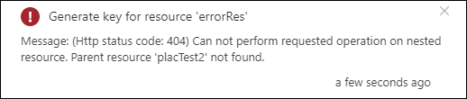
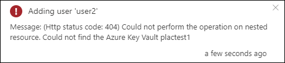
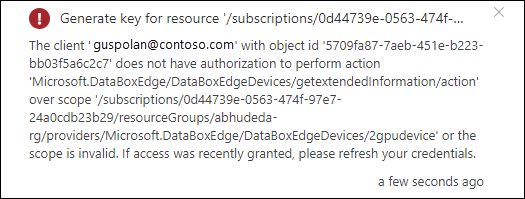

# Troubleshoot activation or secret deletion issues on Azure Key Vault for your Azure Stack Edge Pro GPU device 

[!INCLUDE [applies-to-GPU-and-pro-r-and-mini-r-skus](../../includes/azure-stack-edge-applies-to-gpu-pro-r-mini-r-sku.md)]

This article describes how to troubleshoot activation issues on your Azure Stack Edge Pro GPU device. 

## Activation errors

The following table summarizes the errors related to device activation and the corresponding recommended resolution.

| Error   message| Recommended   resolution |
|------------------------------------------------------|--------------------------------------|
| If the Azure Key Vault that's used for activation is deleted before the device is activated using the activation key, then you receive this error.     | If the key vault was deleted, you can restore the key vault if the vault is in purge-protection duration. Follow the steps in [Recover a key vault](azure-stack-edge-gpu-activation-key-vault.md#recover-key-vault).  If the purge-protection duration has elapsed, then you'll need to create a new key vault via the  [Recover a key vault](azure-stack-edge-gpu-activation-key-vault.md#recover-key-vault) blade. |
| If the Azure Key Vault is deleted after the device is activated, and you then try to perform any operation that involves encryption - for example, **Add User**, **Add Share**, or **Configure Compute** - then you receive this error.       | If the key vault was deleted, you can restore the key vault if the vault is in purge-protection duration. Follow the steps in [Recover a key vault](azure-stack-edge-gpu-activation-key-vault.md#recover-key-vault).  If the purge-protection duration has elapsed, then you'll need to create a new key vault as described in [Recover a key vault](azure-stack-edge-gpu-activation-key-vault.md#recover-key-vault). |
| If the activation key generation fails due to any error, then you receive this error. The notification includes more details.      | Ensure that the ports and URLs specified in [Access Azure Key Vault behind a firewall](../key-vault/general/access-behind-firewall.md) are open on your firewall to enable you to access the key vault. Wait a few minutes, and retry the operation. If the problem persists, contact Microsoft Support. |
| If the user has read-only permissions, then the user is not allowed to generate an activation key, and this error is presented.    | This could be because you don't have the right access or `Microsoft.KeyVault` is not registered.<li>Make sure that you have owner or contributor access at the resource group level used for your Azure Stack Edge resource.</li><li>Make sure that the `Microsoft.KeyVault` resource provider is registered. To register a resource provider, go to the subscription used for Azure Stack Edge resource. Go to **Resource providers**, search for *Microsoft.KeyVault* and select and **Register**. For more information, see [Register resource providers](azure-stack-edge-manage-access-power-connectivity-mode.md#register-resource-providers).</li> |

## Unregistered resource provider errors

| Error   message| Recommended   resolution |
|------------------------------------------------------|--------------------------------------|
| If the Key Vault resource provider is not registered, then you'll see an error when creating a key vault during the activation key generation.   <!----> | The activation key won't be generated.  Make sure that the `Microsoft.KeyVault` resource provider is registered. To register a resource provider, go to the subscription used for Azure Stack Edge resource. Go to **Resource providers**, search for *Microsoft.KeyVault* and select and **Register**.  For more information, see [Register resource providers](azure-stack-edge-manage-access-power-connectivity-mode.md#register-resource-providers).</li> |
| If the Storage resource provider is not registered, then you'll see an error when creating a storage account for audit logs. <!--  --> | This error is not a blocking error and the activation key will be generated.  The Storage resource provider is usually automatically registered but if it isn't, follow the steps in [Register a resource provider](azure-stack-edge-manage-access-power-connectivity-mode.md#register-resource-providers) to register `Microsoft.Storage` against your subscription.  |

## Key vault or secret deletion errors

| Error   message| Recommended   resolution |
|------------------------------------------------------|--------------------------------------|
| If the Channel Integrity Key in the Azure Key Vault was deleted, and you try to perform any operations that involve encryption - for example, **Add User**, **Add Share**, or **Configure Compute** - then you will receive this error.  |If the Channel Integrity Key in the key vault was deleted, but the key is still within the purge duration, follow the steps in [Undo Key vault key removal](/powershell/module/az.keyvault/undo-azkeyvaultkeyremoval).  If the purge protection duration has elapsed, and if you've backed up the key, you can restore the key from the backup. Otherwise, you can't recover the key. Contact Microsoft Support for next steps. |
<!--|Remove this after checking with Noopur - customer doesnt need to do anything - If the Channel Integrity Key in the Azure Key Vault was deleted before the activation of the device, and the activation key is regenerated, you'll receive this error.    | The Channel Integrity Key will be recreated, and the metadata is updated.
|-->

## Audit logging errors

| Error   message| Recommended   resolution |
|------------------------------------------------------|--------------------------------------|
| If the diagnostic setting creation fails for your key vault, you'll see this error. <!--  --> | This is not a blocking error and the activation key will be generated.  You can manually [Create a diagnostic setting to store your audit logs](../key-vault/general/howto-logging.md). |
| If the storage account creation fails, for example, because an account already exists for the name you specified, you'll see this error. <!--  --> | You can manually create a storage account and link it to the diagnostic setting on your key vault. This account is then used to store audit logs.   For more information, see [Create a storage account for your logs](../key-vault/general/howto-logging.md).  |
|If the system assigned managed identity for your Azure Stack Edge resource is deleted, you'll see this error. <!--  --> | You'll see an alert in the Security blade for your Azure Stack Edge resource. Select this alert to [Create a new managed identity through the Recover key vault blade](azure-stack-edge-gpu-activation-key-vault.md#recover-key-vault)  |
| If the managed identity doesn't have access to the key vault, you'll see this error. <!--  --> | You'll see an alert in the Security blade for your Azure Stack Edge resource. Select this alert to [Grant managed identity access to the key vault through the Recover key vault blade](azure-stack-edge-gpu-activation-key-vault.md#recover-key-vault).  |

## Resource move errors

| Error   message| Recommended   resolution |
|------------------------------------------------------|--------------------------------------|
| If the key vault resource is moved across resource groups or subscriptions, you'll see this error. <!--  --> | The key vault resource move is treated the same way as key vault deletion. You can restore the key vault if the vault is in purge-protection duration. If the purge-protection duration has elapsed, then you'll need to create a new key vault. For more information on either of the above cases, see [Recover a key vault](azure-stack-edge-gpu-activation-key-vault.md#recover-key-vault).    |
| If the subscription you are using, is moved across tenants, you'll see this error. <!--  --> | Reconfigure managed identity and create a new key vault. You can also move the key vault resource in which case only the managed identity will need to be reconfigured. In each of the above cases, see [Recover a key vault](azure-stack-edge-gpu-activation-key-vault.md#recover-key-vault).   |
| If the storage account resource that is used for audit logs, is moved across resource groups or subscriptions, you won't see an error.  | You can [Create a new storage account and configure it to store the audit logs](../key-vault/general/howto-logging.md). |

## Other errors

| Error   message| Recommended   resolution |
|------------------------------------------------------|--------------------------------------|
| If the network restrictions are configured for the key vault, you'll see this error. <!--  --> | The service can't differentiate between key vault deletion or key vault not accessible scenario due to network restrictions. In each case, you'll be directed to the [Recover a key vault](azure-stack-edge-gpu-activation-key-vault.md#recover-key-vault) blade.     |

## Next steps

- [Install Azure Stack Edge Pro with GPU](azure-stack-edge-gpu-deploy-install.md).
