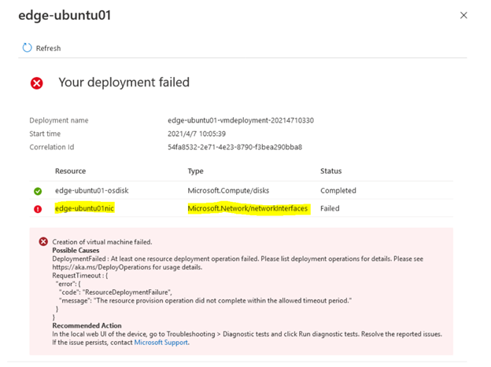
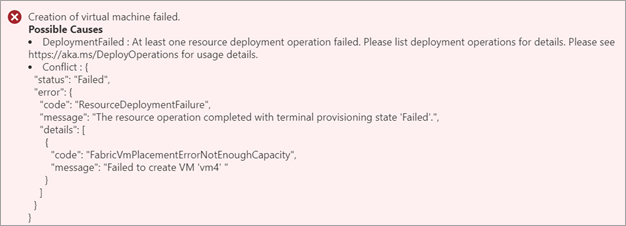
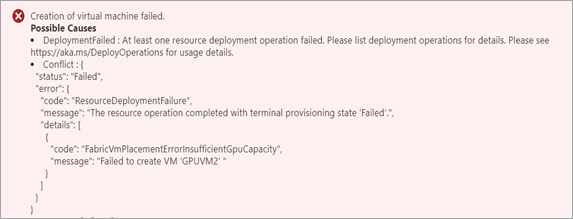

# Troubleshoot VM deployment in Azure Stack Edge Pro GPU

[!INCLUDE [applies-to-GPU-and-pro-r-and-mini-r-skus](../../includes/azure-stack-edge-applies-to-gpu-pro-r-mini-r-sku.md)]

This article describes how to troubleshoot common errors when deploying virtual machines on an Azure Stack Edge Pro GPU device. It explains how to collect guest logs for failed VMs, and provides guidance for investigating VM provisioning timeouts and issues with network interface creation, VM images, VM creation, and GPU VMs.  

<!--MOVING THIS TO BENEATH "COLLECT LOGS". - This article provides guidance for investigating three of the most common causes of provisioning failure:

* VM Provisioning timeouts
* Network Interface creation failure
* Image creation issues-->

## Collect guest logs for a failed VM

To diagnose any VM provisioning failure, you'll review guest logs on the failed virtual machine.

To collect the guest logs, you'll need to connect to the VM console on the virtual machine. You can connect to the console even if provisioning of the VM failed.<!--For more information, see [Connect to the virtual machine console on Azure Stack Edge Pro GPU device](azure-stack-edge-gpu-connect-virtual-machine-console.md). - To prevent confusion, I suggest removing this link. Step 1 links to a different set of procedures. Those procedures link to this target for a step.-->

To collect guest logs for failed virtual machines, do these steps:

1. [Connect to the PowerShell interface of your device](azure-stack-edge-gpu-connect-powershell-interface.md#connect-to-the-powershell-interface).

2. Collect in-guest logs for failed VMs, and include these logs in a support package, by running the following commands:

   ```powershell
   Get-VMInGuestLogs -FailedVM
   Get-HcsNodeSupportPackage -Path “\\<network path>” -Include InGuestVMLogFiles -Credential “domain_name\user”
   ```

   You'll find the logs in the `hcslogs\VmGuestLogs` folder.

3. To get VM provisioning history details, review the following logs:

   **Linux VMs:**
   /var/log/cloud-init-output.log
   /var/log/cloud-init.log
   /var/log/waagent.log

   **Windows VMs:**
   C:\Windows\Azure\Panther\WaSetup.xml<!--The Windows log is an outlier. Is it included in the support package?-->

## Troubleshoot VM deployment issues

The following sections provide common causes for the following issues:
 
* VM provisioning timeout
* Network interface creation issues
* VM image issues
* VM creation issues
* GPU extension failed to be deployed (GPU VMs)

## VM provisioning timeout

A common cause of a deployment failure is that VM provisioning does not complete within the timeout period. When VM provisioning times out, you see the following error:

 

This section provides troubleshooting guidance for some of the most common causes of aVM provisioning timeout:

* Static IP address assigned to the VM is already in use<!--Add section link-->
* VM image not prepared correctly
* Gateway and DNS server can't be reached from the VM<!--Bullets 3-5 are less common issues that were lumped together as "other issues." They are less common. >
* `cloud init` issues (Linux VMs)
* Provisioning flags set incorrectly (Linux VMs)
* Issues that require Support


### IP assigned to the VM is already in use

**Error description:**  If you assigned a static IP address during virtual machine creation, and the IP address is already in use, VM provisioning will fail.

To check for a duplicate IP address: 

1. Stop the VM from the Azure portal (if the VM is running).<!--1) What would cause the VM to run when provisioning has failed? Whys is stopping the VM needed in the context of a failure because of a duplicate IP?-->

1. Run the following `ping` and `tnc` (Test-NetConnection) commands:<!--Pinging from the device, not the VM.-->

   ```powershell
   ping <IP address>
   tnc <IP address>
   tnc <IP address> -CommonTCPPort “RDP”
   ```

   If you get a response to any of these commands, the IP address that you assigned the new VM is already in use.

**Suggested resolution:** Use a static IP address that is not in use, or use a dynamic IP address provided by the DHCP server.<!--For more information?-->


### VM image not prepared correctly

**Error description:** To prepare a VM image to use to deploy VMs on an Azure Stack Edge Pro GPU device, you must follow a specific workflow. You must create a virtual machine (VM) in Azure, customize the VM, and then generalize the VM. Then you'll download the VHD for that VM.<!--Final step is to upload the image to an Azure Storage account?-->

**Suggested resolution:** Complete the workflow for preparing a VM image for use on Azure Stack Edge Pro GPU. For instructions, see one of the following articles. The procedures will vary depending on the type of source VHD and whether you're creating a generalized image (to deploy new VMs) or a specialized image (to migrate or restore an existing VM).<!--Some bridge seemed needed, but final sentence gets long. Revisit this later.-->

* [Create custom VM images for your Azure Stack Edge Pro GPU device](azure-stack-edge-gpu-create-virtual-machine-image.md) (Workflow for creating a VM image)
* [Prepare generalized image from Windows VHD to deploy VMs on Azure Stack Edge Pro GPU](azure-stack-edge-gpu-prepare-windows-vhd-generalized-image.md)
* [Prepare generalized image from ISO to deploy VMs on Azure Stack Edge Pro GPU](azure-stack-edge-gpu-prepare-windows-generalized-image-iso.md)
* [Use a specialized image to deploy VMs](azure-stack-edge-gpu-deploy-virtual-machine-portal.md)<!--Article not yet available?-->

### Gateway, DNS server couldn't be reached from guest VM

**Error description:** If the default gateway and DNS server can't be reached during VM deployment, VM provisioning will time out, and the VM deployment will fail.

**Suggested resolution:** Verify that the default gateway and DNS server can be reached from the VM. Then repeat VM deployment.

To verify that the default gateway and DNS server can be reached:
1. Console-connect to the VM. <!--Are they starting a remote PowerShell session? Explicit instructions needed?-->
2. Run the following **ping** commands to verify that the default gateway and DNS server can be reached from the VM:

   ```powershell
   ping <default gateway IP address>
   ping <DNS server IP address>
   ```

### `cloud init` issues (Linux VMs)

**Error description:** The `cloud init` command did not run, or there were issues while `cloud init` was running during the provisioning of a Linux VM, and VM provisioning timed out.<!--Note to me: What does cloud init do?-->

**Suggested resolution:** To find the issues that occurred when `cloud init` was run:
1. Console connect to the VM.
1. Check for `cloud init` errors in the following log files:

   /var/log/cloud-init-output.log
   /var/log/cloud-init.log
   /var/log/waagent/log 

NO GUIDANCE ON FIXING THE ERRORS. WILL THE LOG ENTRIES TELL HOW TO FIX THE ERRORS?  

### Provisioning flags set incorrectly (Linux VMs)

**Error description:** XXX

**Suggested resolution:** Make sure the Provisioning flags in the `/etc/waagent.conf` file have the following values:

   | Capability                      | Required value                |
   |---------------------------------|-------------------------------|
   | Enable instance creation        | `Provisioning.Enabled=n`      |
   | Rely on cloud-init to provision | `Provisioning.UseCloudInit=y` |

### Contact Support for these log entries

If you see the following log entries, [contact Microsoft Support](azure-stack-edge-contact-microsoft-support.md) for help.<!--Please verify: The issue is the entry, not the existence of the log itself?-->

#### Windows VM
 
File: C:\Windows\Azure\Panther\WaSetup.xml

```output
<Event time="2021-03-26T20:08:54.648Z" category="INFO" source="WireServer"><HttpRequest verb="GET" url="http://168.63.129.16/?comp=Versions"/></Event>
<Event time="2021-03-26T20:08:54.898Z" category="WARN" source="WireServer"><SendRequest>Received retriable HTTP client error: 8000000A for GET to http://168.63.129.16/?comp=Versions - attempt(1)</SendRequest></Event>
<Event time="2021-03-26T20:08:54.929Z" category="ERROR" source="WireServer"><UnhandledError><Message>GetGoalState: RefreshGoalState failed with ErrNo -2147221503</Message><Number>-2147221503</Number><Description>Not initialized</Description><Source>WireServer.wsf</Source></UnhandledError></Event>
```

#### Linux VM

Files: 
* /var/log/cloud-init-output.log
* /var/log/cloud-init.log
* /var/log/waagent.log

```output
2021/04/02 20:55:00.899068 INFO Daemon Detect protocol endpoints
2021/04/02 20:55:01.043511 INFO Daemon Clean protocol
2021/04/02 20:55:01.094107 INFO Daemon WireServer endpoint is not found. Rerun dhcp handler
2021/04/02 20:55:01.188869 INFO Daemon Test for route to 168.63.129.16
2021/04/02 20:55:01.258709 INFO Daemon Route to 168.63.129.16 exists
2021/04/02 20:55:01.345640 INFO Daemon Wire server endpoint:168.63.129.16
2021/04/02 20:56:32.570904 INFO Daemon WireServer is not responding. Reset endpoint
2021/04/02 20:56:32.606973 INFO Daemon Protocol endpoint not found: WireProtocol, [ProtocolError] [Wireserver Exception] [HttpError] [HTTP Failed] GET http://168.63.129.16/?comp=versions -- IOError timed out -- 6 attempts made
```

##	Network interface creation issues

### NIC creation timeout

**Error description:** Creation of the network interface on the VM didn't complete within the allowed timeout period. This failure can be caused by DHCP server issues in your environment. 

To verify whether the network interface was created successfully, do these steps:

1. In the Azure portal, go to the Azure Stack Edge resource for your device (go to **Edge Services** > **Virtual machines**); then select **Deployments** and navigate to the VM deployment.<!--It would take two graphics to show this.--> 

1. If a network interface was not created successfully, you'll see the following error.

   

**Suggested resolution:** Create the VM again, and assign it a static IP address.

##	VM image issues

VMs deployed on an Azure Stack Edge Pro GPU device must be Generation 1 virtual machines. The VM image used to create the VM must be a fixed-size VHD. The image must be uploaded as a page blob to your Azure Storage account. If these conditions are not met, VM provisioning on your device will fail.

For guidance on resolving image creation issues, see [Troubleshoot virtual machine image uploads in Azure Stack Edge Pro GPU](azure-stack-edge-gpu- troubleshoot-virtual-machine-image-upload.md).

## VM creation issues

ADD SECTION INTRO.

### Not enough memory to create the VM

**Error description:** When VM creation fails because of insufficient memory, you'll see the following error.
 
<!--Box the area of the error message -->

**Suggested resolution:** Check the available memory on the device, and choose the VM size accordingly. For more information, see [Supported virtual machine sizes on Azure Stack Edge](azure-stack-edge-gpu-virtual-machine-sizes.md).

#### Calculate memory available for VMs

- **Memory available for compute:**

   - An Azure Stack Edge Pro GPU device has a total memory of 128 Gbs. 

     Total memory = 128 Gbs
     Memory available for compute = 85% of 128 = 108.8 Gbs

   - A Tactical Mobile Appliance SKU<!--???--> has total memory of 48 Gbs. 

     Total memory = 48 Gbs
     Memory available for compute = 75% of 48 = 36 Gbs

- **Compute memory includes Kubernetes + VMs.** If you have enabled Kubernetes, Kubernetes requires 25 percent of the memory<!--"the memory" refers to memory available for compute? Is the assumption that this is 25% of 108.8 GBs?--> for the master VM, plus 4 Gb of memory for each worker VM - which is also expandable.<!--What is expandable?-->

   Memory available for VMs = Memory available for compute – Memory used by K8s<!--Meaning of K8s?-->

- **Hyper-V has some overhead memory for each VM.** So you may see new VM creations fail with the above error if there is not enough memory to create that VM.

**Suggested solutions:**

- Configure the VM for a smaller memory size.
- Stop the VM which is not in use from the portal.<!--Translated: Stop any VMs that are not in use while you deploy the new VM?-->
- Delete unused VMs. 

### Insufficient number of GPUs to create GPU VM

Error displayed:

<!--Screenshot probably won't stay.-->

**Possible causes:**
If Kubernetes is enabled before the VM is created, Kubernetes will grab all the available GPUs and you won’t be able to create any GPU-sized VMs. You can create as many GPU-sized VMs as the number of GPUs (1 or 2 GPU SKU). 

**Suggested solution:** For more information, see [Overview and deployment of GPU VMs on your Azure Stack Edge Pro device](azure-stack-edge-gpu-deploy-gpu-virtual-machine.md).

## GPU extension failed to be deployed
Debugging steps:

### VM size is not GPU VM size

**Error description:** A GPU VM must use the Standard_NC4as_T4_v3 or Standard_NC8as_T4_v3 VM size. If these size requirements aren't met, attempting to attach the GPU extension will fail.

**Suggested solution:** Create a VM with the Standard_NC4as_T4_v3 or Standard_NC8as_T4_v3 VM size. For more information, see [Supported VM sizes for GPU VMs](azure-stack-edge-gpu-virtual-machine-sizes.md#ncast4_v3-series-preview).<!--Verify: They specify the configuration for the VmSize setting, and the associated sizes are configured on the VM?-->

### Image OS is not supported

**Error description:** The GPU extension doesn't support the operating system of the VM. 

**Suggested solution:** Prepare a new VM image that has an operating system that the GPU extension supports. 

* For a list of supported operating systems for GPU on Windows and Linux VMs, see [Supported OS and GPU drivers for GPU VMs](azure-stack-edge-gpu-deploy-gpu-virtual-machine.md#supported-os-and-gpu-drivers).

* For image preparation requirements for a GPU VM, see [Create GPU VMs](azure-stack-edge-gpu-deploy-gpu-virtual-machine.md#create-gpu-vms).


### Extension parameter is incorrect

**Error description:** Incorrect extension settings were used when deploying the GPU extension on a Linux VM.<!--Verify: This applies only to a Linux VM? Supporting materials apply only to a Linux VM.--> 

**Suggested solution:** Edit the parameters file before deploying the GPU extension. There are specific parameters files for the Ubuntu and Red Hat Enterprise Linux (RHEL) operating systems. For more information, see [GPU extension for Linux](azure-stack-edge-gpu-deploy-gpu-virtual-machine.md#gpu-extension-for-linux).


### VM extension installation failed in downloading package

**Error description:** Extension provisioning failed during extension installation or while in the Enable state.

1. Check the guest log for the actual error:

   On a Linux VM:
   * Look in `/var/log/waagent.log` or `/var/log/azure/nvidia-vmext-status`.

   On a Windows VM:
   * Find out the error status in `C:\Packages\Plugins\Microsoft.HpcCompute.NvidiaGpuDriverWindows\1.3.0.0\Status`.
   * Review the complete execution log: `C:\WindowsAzure\Logs\WaAppAgent.txt`.

1.	If the installation process failed while downloading the package, that indicates the VM couldn't access the public network to download the driver.

**Suggested solution:**

1.	Reassign the compute port on the VM to the public network (Port 2).<!--Where are the instructions for configuring the port used for compute?-->

2.	De-allocate the existing failed VM.<!--They delete the VM?-->
 
3.	Create a new VM.

### VM Extension failed with error `dpkg is used/yum lock is used`

**Error description:** GPU extension deployment on a Linux VM failed because another process was using `dpkg` or another process has a lock on `yum`. 

<!--ORIGINAL TEXT - This error only happens on Linux builds. Check \var\log\azure\nvidia-vmext-status and look for the error. If the error is like “dpkg is used by another process”/”Another app is holding yum lock”. The customer needs to wait for whatever process that is using the lock to finish or kill the process, before you try to deploy the extension deployment again.-->

**Suggested solution:** To resolve the issue with the lock, do these steps:

1.	Find out what process(es) are using the lock,<!--How? Where?--> and either wait for the processes to complete or end the processes.

1.	Retry setting the extension.<!--Is this a portal step? Is there a Retry option they select?-->

1.	If the extension retry fails again, try creating a new VM, and make sure the lock is not used before you deploy the GPU extension.


## Next steps

* Learn how to XXX
* Learn how to XXX
