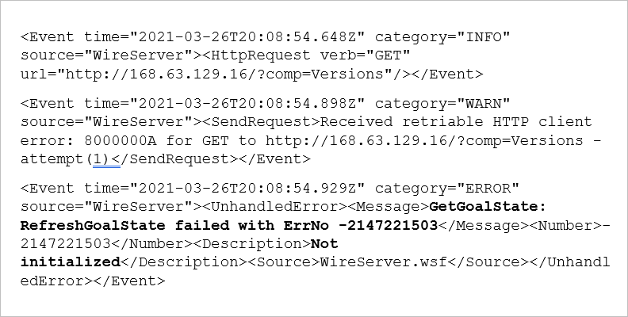
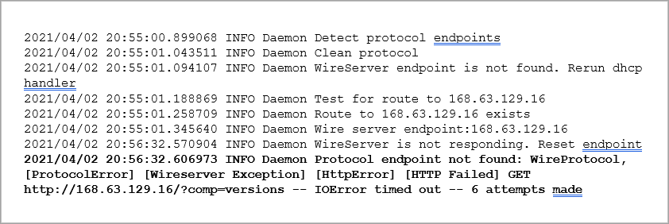

# Troubleshoot VM deployment in Azure Stack Edge Pro GPU

[!INCLUDE [applies-to-GPU-and-pro-r-and-mini-r-skus](../../includes/azure-stack-edge-applies-to-gpu-pro-r-mini-r-sku.md)]

This article describes how to troubleshoot common errors when deploying virtual machines on an Azure Stack Edge Pro GPU device. It explains how to collect guest logs for failed VMs, and provides guidance for investigating VM provisioning timeouts and issues with network interface creation, VM images, VM creation, and GPU VMs.  

## Collect guest logs for a failed VM

To diagnose any VM provisioning failure, you'll review guest logs on the failed virtual machine.

To collect the guest logs, you'll need to connect to the VM console on the virtual machine. You can connect to the console even if provisioning of the VM failed.

To collect guest logs for failed virtual machines, do these steps:

1. [Connect to the PowerShell interface of your device](azure-stack-edge-gpu-connect-powershell-interface.md#connect-to-the-powershell-interface).

2. Collect in-guest logs for failed VMs, and include these logs in a support package, by running the following commands:

   ```powershell
   Get-VMInGuestLogs -FailedVM
   Get-HcsNodeSupportPackage -Path “\\<network path>” -Include InGuestVMLogFiles -Credential “domain_name\user”
   ```

   You'll find the logs in the `hcslogs\VmGuestLogs` folder.

3. To get VM provisioning history details, review the following logs:

   **Linux VMs:**
   /var/log/cloud-init-output.log
   /var/log/cloud-init.log
   /var/log/waagent.log

   **Windows VMs:**
   C:\Windows\Azure\Panther\WaSetup.xml


## Troubleshoot VM deployment issues

The following sections provide common causes for the following issues, which occur during VM deployment on an Azure Stack Edge Pro GPU device:
 
* [VM provisioning timeout](#vm-provisioning-timeout)
* [Network interface creation issues](#network-interface-creation-issues)
* [VM image issues](#vm-image-issues)
* [VM creation issues](#vm-creation-issues)
* [GPU extension failed to be deployed (GPU VMs)](#gpu-extension-failed-to-be-deployed)

## VM provisioning timeout

When VM provisioning times out, you see the following error:

 

*Queries: 1) Is it intended that the customer will work through these issues in linear fashion, from the most common cause to the less common ones? If so, should troubleshooting be set up as a series of steps? 3) To come: To make the information easier to navigate, we probably will convert this discussion to a table.*

This section provides troubleshooting guidance for some of the most common causes of a VM provisioning timeout.


#### IP assigned to the VM is already in use

**Error description:**  The VM was assigned a static IP address that is already in use, and VM provisioning failed.  
*Queries: 1) Does this error apply to both portal and CLI procedures? Doesn't the portal check for duplicate IP addresses, and prevent them deploying if they have one? 2) Can issues other than an existing VM with an IP address produce this error? For example, address pool/subnet issue?*

**Suggested solution:** Use a static IP address that is not in use, or use a dynamic IP address provided by the DHCP server.

To check for a duplicate IP address: 

1. Stop the VM from the portal (if it is running).

   *Queries: 1) How can the VM be running if provisioning timed out? 2) Is there a reason why they are stopping the VM from the portal? Can they do this step, as well as the next, in PowerShell?*

1. Run the following `ping` and Test-NetConnection (`tnc`) commands: *Query: Ping from the device*

   ```powershell
   ping <IP address>
   tnc <IP address>
   tnc <IP address> -CommonTCPPort “RDP”
   ```

   If you get a response, the IP address that you assigned to the new VM is already in use.

#### VM image not prepared correctly

**Error description:** To prepare a VM image for use on an Azure Stack Edge Pro GPU device, you must follow a specific workflow. You must create a gen1 virtual machine in Azure, customize the VM, generalize the VHD, and then download the OS VHD for that virtual machine. The prepared image must be a gen1 VHD of Fixed size.

For an overview of requirements, see [Create custom VM images for an Azure Stack Edge Pro GPU device](azure-stack-edge-gpu-create-virtual-machine-image.md).  

**Suggested solution:** Complete the workflow for preparing your VM image. For instructions, see one of the following articles:

* [Create custom VM images for your Azure Stack Edge Pro GPU device](azure-stack-edge-gpu-create-virtual-machine-image.md) (Workflow for creating a VM images for Linux and Windows virtual machines)
* [Prepare generalized image from Windows VHD to deploy VMs on Azure Stack Edge Pro GPU](azure-stack-edge-gpu-prepare-windows-vhd-generalized-image.md)
* [Prepare generalized image from ISO to deploy VMs on Azure Stack Edge Pro GPU](azure-stack-edge-gpu-prepare-windows-generalized-image-iso.md)
* [Use a specialized image to deploy VMs](azure-stack-edge-gpu-deploy-virtual-machine-portal.md)<!--Article not yet available?-->

#### Gateway, DNS server couldn't be reached from guest VM

**Error description:** If the default gateway and DNS server can't be reached during VM deployment, VM provisioning will time out, and the VM deployment will fail.

**Suggested solution:** Verify that the default gateway and DNS server can be reached from the VM. Then repeat VM deployment.

To verify that the default gateway and DNS server can be reached, do the following steps:
1. [Connect to the VM](azure-stack-edge-gpu-deploy-virtual-machine-portal.md#connect-to-a-vm), and open PowerShell.
2. Run the following **ping** commands to verify that the default gateway and DNS server can be reached from the VM:

   ```powershell
   ping <default gateway IP address>
   ping <DNS server IP address>
   ```

#### `cloud init` issues (Linux VMs)

*Query: Linux VMs only? Has cloud init been tested on Windows VMs?*

**Error description:** `cloud init` did not run, or there were issues while `cloud init` was running. `cloud-init` is used to customize a Linux VM when the VM boots for the first time. For more information, see [cloud-init support for virtual machines in Azure](/azure/virtual-machines/linux/using-cloud-init).

**Suggested solution:** To find issues that occurred when `cloud init` was run:
1. [Connect to the VM](azure-stack-edge-gpu-deploy-virtual-machine-portal.md#connect-to-a-vm).
1. Check for `cloud init` errors in the following log files:

   /var/log/cloud-init-output.log
   /var/log/cloud-init.log
   /var/log/waagent/log 

For help resolving `cloud init` issues, see [Troubleshooting VM provisioning with cloud-init](/azure/virtual-machines/linux/cloud-init-troubleshooting).

#### Provisioning flags set incorrectly (Linux VMs)

**Error description:** To successfully deploy a Linux VM in Azure, instance creation must be disabled on the image, and provisioning using `cloud init' must be enabled. 

**Suggested solution:** Make sure the Provisioning flags in the `/etc/waagent.conf` file have the following values: 

*Query: Where is this file discussed in relationship to Azure VM provisioning?*

   | Capability                      | Required value                |
   |---------------------------------|-------------------------------|
   | Enable instance creation        | `Provisioning.Enabled=n`      |
   | Rely on cloud-init to provision | `Provisioning.UseCloudInit=y` |

#### Contact Support for these log entries

If you see one of the errors highlighted (in bold) in the following log entries, [contact Microsoft Support](azure-stack-edge-contact-microsoft-support.md) for help.

*Query: Please provide a brief explanation of the errors they are to contact Support for, so readers will know what the issue is. Thanks.*

**Windows VM**

Log file: C:\Windows\Azure\Panther\WaSetup.xml

Error entries:

<!--Resize to match the other PNG.-->

<!--FORMATTING ISSUES IN MARKUP. CONVERTING TO A PNG. - `<Event time="2021-03-26T20:08:54.648Z" category="INFO" source="WireServer"><HttpRequest verb="GET" url="http://168.63.129.16/?comp=Versions"/></Event>`

`<Event time="2021-03-26T20:08:54.898Z" category="WARN" source="WireServer"><SendRequest>Received retriable HTTP client error: 8000000A for GET to http://168.63.129.16/?comp=Versions - attempt(1)</SendRequest></Event>`

`<Event time="2021-03-26T20:08:54.929Z" category="ERROR" source="WireServer"><UnhandledError><Message>GetGoalState: RefreshGoalState failed with ErrNo -2147221503</Message><Number>-2147221503</Number><Description>Not initialized</Description><Source>WireServer.wsf</Source></UnhandledError></Event>`-->

**Linux VM**

Log files: 
* /var/log/cloud-init-output.log
* /var/log/cloud-init.log
* /var/log/waagent.log

Error entries:

 

<!--FORMATTING ISSUES IN MARKUP. CONVERTING TO A PNG. -2021/04/02 20:55:00.899068 INFO Daemon Detect protocol endpoints

2021/04/02 20:55:01.043511 INFO Daemon Clean protocol

2021/04/02 20:55:01.094107 INFO Daemon WireServer endpoint is not found. Rerun dhcp handler

2021/04/02 20:55:01.188869 INFO Daemon Test for route to 168.63.129.16

2021/04/02 20:55:01.258709 INFO Daemon Route to 168.63.129.16 exists

2021/04/02 20:55:01.345640 INFO Daemon Wire server endpoint:168.63.129.16

2021/04/02 20:56:32.570904 INFO Daemon WireServer is not responding. Reset endpoint

2021/04/02 20:56:32.606973 INFO Daemon Protocol endpoint not found: WireProtocol, [ProtocolError] [Wireserver
Exception] [HttpError] [HTTP Failed] GET http://168.63.129.16/?comp=versions -- IOError timed out -- 6 attempts made-->

##	Network interface creation issues

This section covers issues that creation of the network interface on a new VM to fail.

### NIC creation timeout

**Error description:** Creation of the network interface on the VM didn't complete within the allowed timeout period. This failure can be caused by DHCP server issues in your environment. 

To verify whether the network interface was created successfully, do these steps:

1. In the Azure portal, go to the Azure Stack Edge resource for your device (go to **Edge Services** > **Virtual machines**). Then select **Deployments**, and navigate to the VM deployment. 

1. If a network interface was not created successfully, you'll see the following error.

   

**Suggested solution:** Create the VM again, and assign it a static IP address.

##	VM image issues

To use a VM image used to provision virtual machines on an Azure Stack Edge Pro GPU device, the image must meet the following requirements:

* The VM image must be a fixed-size VHD for a Generation 1 VM. 
* The image must be uploaded as a page blob to your Azure Storage account. 

For guidance on resolving VM image issues, see [Troubleshoot virtual machine image uploads in Azure Stack Edge Pro GPU](azure-stack-edge-gpu-troubleshoot-virtual-machine-image-upload.md).

## VM creation issues

This section covers common issues that occur during VM creation.

### Not enough memory to create the VM

**Error description:** When VM creation fails because of insufficient memory, you'll see the following error.
 


**Suggested solution:** Check the available memory on the device, and choose the VM size accordingly. For more information, see [Supported virtual machine sizes on Azure Stack Edge](azure-stack-edge-gpu-virtual-machine-sizes.md).

#### Calculate memory available for VMs

*Recommendation: Introduce calculations in a planning article. No one will think to look for them there, and they should be available for VM deployment planning. If we keep the calculations here for now, we should move them as quickly as possible to a new "VM sizing best practices" article.*

- **Memory available for compute:**

   - An Azure Stack Edge Pro GPU device has a total memory of 128 Gbs.

     Total memory = 128 Gbs
     Memory available for compute = 85% of 128 = 108.8 Gbs 

     *Query: Device specs for Pro GPU state total usable memory as 102 Gbs. See https://docs.microsoft.com/en-us/azure/databox-online/azure-stack-edge-gpu-technical-specifications-compliance#compute-and-memory-specifications.*

   - An Azure Stack Edge Mini device has total memory of 48 Gbs.

     Total memory = 48 Gbs
     Memory available for compute = 75% of 48 = 36 Gbs 

     *Query: Device specs for Mini R state total usable memory as 32 Gbs. See https://docs.microsoft.com/en-us/azure/databox-online/azure-stack-edge-mini-r-technical-specifications-compliance#compute-memory.*

- **Compute memory includes Kubernetes + VMs.** If you have enabled Kubernetes, Kubernetes requires 25 percent of the memory for the master VM, plus 4 Gb of memory for each worker VM - which is also expandable. 

  *Queries: 1) What is expandable? 2) Is there a source where we can send customers for this calculation?*

   Memory available for VMs = Memory available for compute – Memory used by K8s 

   *Query: "K8s" is shortcut for what?*

- **Hyper-V has some overhead memory for each VM.** So you may see new VM creations fail with the above error if there is not enough memory to create that VM. 

  *Query: Can we be more specific than "some overhead"? How to work "too general" into VM memory usage calculations?*

**Suggested solutions:**

- Use a VM size that requires less memory.
- Stop any VMs that aren't in use from the portal before you deploy the new VM.
- Delete any VMs that are no longer in use.

### Insufficient number of GPUs to create GPU VM
*Note to reviewers: Section updated 05/26 a.m.*

If you try to deploy a VM on a GPU device that already has Kubernetes enabled, no GPUs will be available, and VM provisioning will fail with the following error:


**Possible causes:**
If Kubernetes is enabled before the VM is created, Kubernetes will use all the available GPUs, and you won’t be able to create any GPU-size VMs. You can create as many GPU-size VMs as the number of available GPUs. Your Azure Stack Edge device can be equipped with 1 or 2 GPUs.

**Suggested solution:** For VM deployment options on a 1-GPU or 2-GPU device with Kubernetes configured, see [GPU VMs and Kubernetes](/azure-stack-edge-gpu-deploy-gpu-virtual-machine?tabs=windows#gpu-vms-and-kubernetes).<!--REPLACES THIS REFERENCE - [Overview and deployment of GPU VMs on your Azure Stack Edge Pro device](azure-stack-edge-gpu-deploy-gpu-virtual-machine.md).-->

## GPU extension failed to be deployed
Debugging steps:
 
*Query: They should make these checks in sequence? Numbered steps? Will write the intro and revise issues accordingly.* 

### VM size is not GPU VM size

**Error description:** A GPU VM must be either Standard_NC4as_T4_v3 or Standard_NC8as_T4_v3 size. If any other VM size is used, the GPU extension will fail to be attached.

**Suggested solution:** Create a VM with the Standard_NC4as_T4_v3 or Standard_NC8as_T4_v3 VM size. For more information, see [Supported VM sizes for GPU VMs](azure-stack-edge-gpu-virtual-machine-sizes.md#ncast4_v3-series-preview).


### Image OS is not supported

**Error description:** The GPU extension doesn't support the operating system that's installed on the VM image. 

**Suggested solution:** Prepare a new VM image that has an operating system that the GPU extension supports. 

* For a list of supported operating systems, see [Supported OS and GPU drivers for GPU VMs](azure-stack-edge-gpu-deploy-gpu-virtual-machine.md#supported-os-and-gpu-drivers).

* For image preparation requirements for a GPU VM, see [Create GPU VMs](azure-stack-edge-gpu-deploy-gpu-virtual-machine.md#create-gpu-vms).


### Extension parameter is incorrect

**Error description:** Incorrect extension settings were used when deploying the GPU extension on a Linux VM. 

**Suggested solution:** Edit the parameters file before deploying the GPU extension. There are specific parameters files for the Ubuntu and Red Hat Enterprise Linux (RHEL) operating systems. For more information, see [Install GPU extension](azure-stack-edge-gpu-deploy-gpu-virtual-machine.md#install-gpu-extension).


### VM extension installation failed in downloading package

**Error description:** Extension provisioning failed during extension installation or while in the Enable state.

1. Check the guest log for the associated error:

   On a Linux VM:
   * Look in `/var/log/waagent.log` or `/var/log/azure/nvidia-vmext-status`.

   On a Windows VM:
   * Find out the error status in `C:\Packages\Plugins\Microsoft.HpcCompute.NvidiaGpuDriverWindows\1.3.0.0\Status`.
   * Review the complete execution log: `C:\WindowsAzure\Logs\WaAppAgent.txt`.

1.	If installation failed during the package download, that indicates the VM couldn't access the public network to download the driver.

**Suggested solution:**

1.	Enable compute on a port that's connected to the Internet. For guidance, see [Create GPU VMs](azure-stack-edge-gpu-deploy-gpu-virtual-machine.md#create-gpu-vms).

2.	De-allocate the VM by stopping the VM in the portal. To stop the VM, go to **Virtual machines** > **Overview**, and select the VM. Then, on the VM properties page, select **Stop**.<!--Follow-up (formatting): Create an include file for stopping a VM. Use it here and in prerequisites for "Use the Azure portal to manage network interfaces on the VMs" (https://docs.microsoft.com/en-us/azure/databox-online/azure-stack-edge-gpu-manage-virtual-machine-network-interfaces-portal#prerequisites).-->
 
3.	Create a new VM.

### VM Extension failed with error `dpkg is used/yum lock is used` (Linux VM)

**Error description:** GPU extension deployment on a Linux VM failed because another process was using `dpkg` or another process has created a `yum lock`. 

**Suggested solution:** To resolve the issue, do these steps:

1.	To find out what process is applying the lock, search the \var\log\azure\nvidia-vmext-status log for an error such as “dpkg is used by another process” or ”Another app is holding yum lock”.

1. Either wait for the process to finish, or end the process.

1.	[Install the GPU extension](azure-stack-edge-gpu-deploy-gpu-virtual-machine.md#install-gpu-extension) again.

1.	If extension deployment fails again, create a new VM and make sure the lock isn't present before you install the GPU extension.


## Next steps

* [Troubleshoot VM image uploads in Azure Stack Edge Pro GPU](azure-stack-edge-troubleshoot-virtual-machine-image-upload.md)
* [Troubleshoot issues with Azure Resource Manager](azure-stack-edge-gpu-troubleshoot.md#azure-resource-manager)
* [Collect a Support package](azure-stack-edge-gpu-troubleshoot.md#collect-support-package)
* [Contact Microsoft Support](azure-stack-edge-contact-microsoft-support.md)
