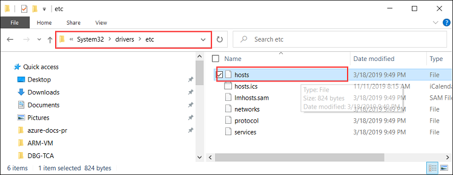

# Deploy VMs on your Azure Stack Edge Pro GPU device via Azure PowerShell script

<!--[!INCLUDE [applies-to-skus](../../includes/azure-stack-edge-applies-to-all-sku.md)]-->

This tutorial describes how to create and manage a VM on your Azure Stack Edge Pro device using an Azure PowerShell script.

## Prerequisites

Before you begin creating and managing a VM on your Azure Stack Edge Pro device using this script, you need to make sure you have completed the prerequisites listed in the following steps:

### For Azure Stack Edge Pro device via the local web UI

1. You completed the network settings on your Azure Stack Edge Pro device as described in [Step 1: Configure Azure Stack Edge Pro device](azure-stack-edge-j-series-connect-resource-manager.md#step-1-configure-azure-stack-edge-pro-device).

2. Enabled a network interface for compute. This network interface IP is used to create a virtual switch for the VM deployment. The following steps walk you through the process:

    1. Go to the **Compute settings**. Select the network interface that you will use to create a virtual switch.

        > [!IMPORTANT] 
        > You can only configure one port for compute.

    2. Enable compute on the network interface. Azure Stack Edge Pro creates and manages a virtual switch corresponding to that network interface.

3. You created and installed all the certificates on your Azure Stack Edge Pro device and in the trusted root store of your client. Follow the procedure described in [Step 2: Create and install certificates](azure-stack-edge-j-series-connect-resource-manager.md#step-2-create-and-install-certificates).

### For your Windows client

1. You defined the Azure consistent services virtual internet protocol (VIP) in your **Network** page in the local web UI of device. You need to add this VIP to:

    - The host file on the client, OR,
    - The DNS server configuration
    
    > [!IMPORTANT]
    > We recommend that you modify the DNS server configuration for endpoint name resolution.

    1. Start **Notepad** as an administrator (Administrator privileges is required to save the file), and then open the **hosts** file located at `C:\Windows\System32\Drivers\etc`.
    
        
    
    2. Add the following entries to your **hosts** file replacing with appropriate values for your device:
    
        ```
        <Azure consistent services VIP> login.<appliance name>.<DNS domain>
        <Azure consistent services VIP> management.<appliance name>.<DNS domain>
        <Azure consistent services VIP> <storage name>.blob.<appliance name>.<DNS domain>
        ```
        For the storage account, you can provide a name that you want the script to use later to create a new storage account. The script does not check if that storage account is existing.

    3. Use the following image for reference. Save the **hosts** file.

        

2. [Download the PowerShell script](https://aka.ms/ase-vm-powershell) used in this procedure.

3. Make sure that your Windows client is running PowerShell 5.0 or later.

4. Make sure that the `Azure.Storage Module version 4.5.0` is installed on your system. You can get this module from the [PowerShell Gallery](https://www.powershellgallery.com/packages/Azure.Storage/4.5.0). To install this module, type:

    `Install-Module -Name Azure.Storage -RequiredVersion 4.5.0`

    To verify the version of the installed module, type:

    `Get-InstalledModule -name Azure.Storage`

    To uninstall any other version modules, type:

    `Uninstall-Module -Name Azure.Storage`

5. [Download AzCopy 10](https://docs.microsoft.com/azure/storage/common/storage-use-azcopy-v10#download-azcopy) to your Windows client. Make a note of this location as you will pass it as a parameter while running the script.

6. Make sure that your Windows client is running TLS 1.2 or later.


## Create a VM

1. Run PowerShell as an administrator.
2. Go to the folder where you downloaded the script on your client.  
3. Use the following command to run the script:
 
    `.\ArmPowershellClient.ps1 -VNetAddressSpace <AddressSpace> -NicPrivateIp <Private IP> -VHDPath <Path> -VHDFile <VHD File, with extension> -StorageAccountName <Name> -OS <Windows/Linux> -VMSize <Supported VM Size> -VMUserName <UserName to be used to login into VM> -VMPassword <Password for the VM login> --AzCopy10Path <Absolute Path>`

    Here are the examples when the script is run to create a Windows VM and a Linux VM.

    **For a Windows VM:**

    `.\ArmPowershellClient.ps1 -VNetAddressSpace 5.5.0.0/16 -NicPrivateIp 5.5.168.73 -VHDPath \\intel01\d$\vm_vhds\AzureWindowsVMmode -VHDFile WindowsServer2016Datacenter.vhd -StorageAccountName teaaccount1 -OS Windows -VMSize Standard_D1_v2 -VMUserName Administrator -VMPassword Password1 -AzCopy10Path C:\azcopy10\azcopy.exe`

    **For a Linux VM:**

    `.\ArmPowershellClient.ps1 -VNetAddressSpace 5.5.0.0/16 -NicPrivateIp 5.5.168.83 -VHDPath \\intel01\d$\vm_vhds\AzurestackLinux -VHDFile ubuntu13.vhd -StorageAccountName sa2 -OS Linux -VMSize Standard_D1_v2 -VMUserName Administrator -VMPassword Password1 -AzCopy10Path C:\azcopy10\azcopy.exe`
    
4. To clean up the resources that the script created, use the following commands:
    
    ```powershell
    Get-AzureRmVM | Remove-AzureRmVM -Force
    Get-AzureRmNetworkInterface | Remove-AzureRmNetworkInterface -Force
    Get-AzureRmResource | Remove-AzureRmResource -f
    Get-AzureRmResourceGroup | Remove-AzureRmResourceGroup -f
    ```


## Next steps

[Deploy VMs using Azure PowerShell cmdlets](azure-stack-edge-j-series-deploy-virtual-machine-powershell.md)
