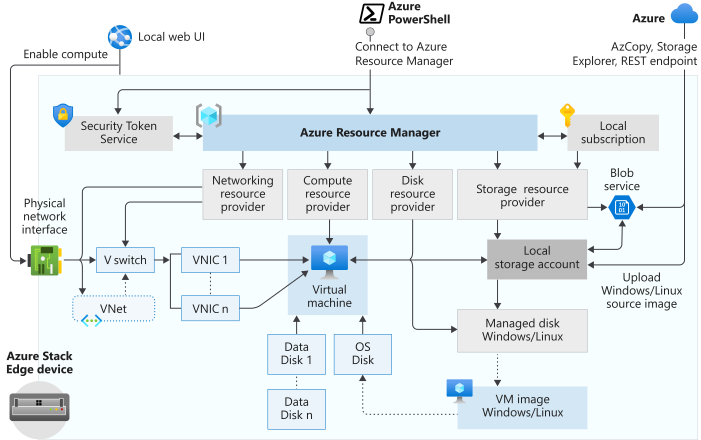

# Deploy VMs on your Azure Stack Edge Pro GPU device via Azure PowerShell

<!--[!INCLUDE [azure-stack-edge-gateway-deploy-vm-overview](../../includes/azure-stack-edge-gateway-deploy-virtual-machine-overview.md)]-->

This tutorial describes how to create and manage a VM on your Azure Stack Edge Pro device using Azure PowerShell.

## VM deployment workflow

The deployment workflow is illustrated in the following diagram.



## Prerequisites

[!INCLUDE [azure-stack-edge-gateway-deploy-vm-prerequisites](../../includes/azure-stack-edge-gateway-deploy-virtual-machine-prerequisites.md)]


## Query for built in subscription on the device

For Azure Resource Manager, only a single user-visible fixed subscription is supported. This subscription is unique per device and this subscription name or subscription ID cannot be changed.

This subscription contains all the resources that are created required for VM creation. 

> [!IMPORTANT]
> This subscription is not connected or related to your Azure subscription and lives locally on your device.

This subscription will be used to deploy the VMs.

1.  To list this subscription, type:

    ```powershell
    Get-AzureRmSubscription
    ```
    
    A sample output is shown below.

    ```powershell
    PS C:\windows\system32> Get-AzureRmSubscription
    
    Name                 Id                 TenantId          State
    ----                 --                --------           -----
    Default Provider Subscription A4257FDE-B946-4E01-ADE7-674760B8D1A3 c0257de7-538f-415c-993a-1b87a031879d Enabled
    
    PS C:\windows\system32>
    ```
        
3.  Get the list of the registered resource providers running on the device. This list typically includes Compute, Network, and Storage.

    ```powershell
    Get-AzureRMResourceProvider
    ```

    > [!NOTE]
    > The resource providers are pre-registered and cannot be modified or changed.
    
    A sample output is shown below:

    ```powershell
    Get-AzureRmResourceProvider
    ProviderNamespace : Microsoft.Compute
    RegistrationState : Registered
    ResourceTypes     : {virtualMachines, virtualMachines/extensions, locations, operations...}
    Locations         : {DBELocal}
    ZoneMappings      :
    
    ProviderNamespace : Microsoft.Network
    RegistrationState : Registered
    ResourceTypes     : {operations, locations, locations/operations, locations/usages...}
    Locations         : {DBELocal}
    ZoneMappings      :
    
    ProviderNamespace : Microsoft.Resources
    RegistrationState : Registered
    ResourceTypes     : {tenants, locations, providers, checkresourcename...}
    Locations         : {DBELocal}
    ZoneMappings      :
    
    ProviderNamespace : Microsoft.Storage
    RegistrationState : Registered
    ResourceTypes     : {storageaccounts, storageAccounts/blobServices, storageAccounts/tableServices,
                        storageAccounts/queueServices...}
    Locations         : {DBELocal}
    ZoneMappings      :
    ```
    
## Create a resource group

Create an Azure resource group with [New-AzureRmResourceGroup](https://docs.microsoft.com/powershell/module/az.resources/new-azresourcegroup). A resource group is a logical container into which the Azure resources such as storage account, disk, managed disk are deployed and managed.

> [!IMPORTANT]
> All the resources are created in the same location as that of the device and the location is set to **DBELocal**.

```powershell
New-AzureRmResourceGroup -Name <Resource group name> -Location DBELocal
```

A sample output is shown below.

```powershell
New-AzureRmResourceGroup -Name rg191113014333 -Location DBELocal 
Successfully created Resource Group:rg191113014333
```

## Create a storage account

Create a new storage account using the resource group created in the previous step. This is a **local storage account** that will be used to upload the virtual disk image for the VM.

```powershell
New-AzureRmStorageAccount -Name <Storage account name> -ResourceGroupName <Resource group name> -Location DBELocal -SkuName Standard_LRS
```

> [!NOTE]
> Only the local storage accounts such as Locally redundant storage (Standard_LRS or Premium_LRS) can be created via Azure Resource Manager. To create tiered storage accounts, see the steps in [Add, connect to storage accounts on your Azure Stack Edge Pro](azure-stack-edge-j-series-deploy-add-storage-accounts.md).

A sample output is shown below.

```powershell
New-AzureRmStorageAccount -Name sa191113014333  -ResourceGroupName rg191113014333 -SkuName Standard_LRS -Location DBELocal

ResourceGroupName      : rg191113014333
StorageAccountName     : sa191113014333
Id                     : /subscriptions/a4257fde-b946-4e01-ade7-674760b8d1a3/resourceGroups/rg191113014333/providers/Microsoft.Storage/storageaccounts/sa191113014333
Location               : DBELocal
Sku                    : Microsoft.Azure.Management.Storage.Models.Sku
Kind                   : Storage
Encryption             : Microsoft.Azure.Management.Storage.Models.Encryption
AccessTier             :
CreationTime           : 11/13/2019 9:43:49 PM
CustomDomain           :
Identity               :
LastGeoFailoverTime    :
PrimaryEndpoints       : Microsoft.Azure.Management.Storage.Models.Endpoints
PrimaryLocation        : DBELocal
ProvisioningState      : Succeeded
SecondaryEndpoints     :
SecondaryLocation      :
StatusOfPrimary        : Available
StatusOfSecondary      :
Tags                   :
EnableHttpsTrafficOnly : False
NetworkRuleSet         :
Context                : Microsoft.WindowsAzure.Commands.Common.Storage.LazyAzureStorageContext
ExtendedProperties     : {}
```

To get the storage account key, run the `Get-AzureRmStorageAccountKey` command. A sample output of this command is shown here.

```powershell
PS C:\Users\Administrator> Get-AzureRmStorageAccountKey

cmdlet Get-AzureRmStorageAccountKey at command pipeline position 1
Supply values for the following parameters:
(Type !? for Help.)
ResourceGroupName: my-resource-ase
Name:myasestoracct

KeyName Value
------- -----
key1 /IjVJN+sSf7FMKiiPLlDm8mc9P4wtcmhhbnCa7...
key2 gd34TcaDzDgsY9JtDNMUgLDOItUU0Qur3CBo6Q...
```

## Add blob URI to hosts file

You already added the blob URI in hosts file for the client that you are using to connect to Blob storage in the section [Modify host file for endpoint name resolution](azure-stack-edge-j-series-connect-resource-manager.md#step-5-modify-host-file-for-endpoint-name-resolution). This was the entry for the blob URI:

\<Azure consistent network services VIP \> \<storage name\>.blob.\<appliance name\>.\<dnsdomain\>


## Install certificates

If you are using *https*, then you need to install appropriate certificates on your device. In this case, install the blob endpoint certificate. For more information, see how to create and upload certificates in [Manage certificates](azure-stack-edge-j-series-manage-certificates.md).

## Upload a VHD

Copy any disk images to be used into page blobs in the local storage account that you created in the earlier steps. You can use a tool such as [AzCopy](../storage/common/storage-use-azcopy-v10.md) to upload the VHD to the storage account that you created in earlier steps. 

Before you use AzCopy, make sure that the [AzCopy is configured correctly](#configure-azcopy) for use with the blob storage REST API version that you are using with your Azure Stack Edge Pro device.

```powershell
AzCopy /Source:<sourceDirectoryForVHD> /Dest:<blobContainerUri> /DestKey:<storageAccountKey> /Y /S /V /NC:32  /BlobType:page /destType:blob 
```

> [!NOTE]
> Set `BlobType` to page for creating a managed disk out of VHD. Set `BlobType` to block when writing to tiered storage accounts using AzCopy.

You can download the disk images from the marketplace. For detailed steps, go to [Get the virtual disk image from Azure marketplace](azure-stack-edge-j-series-create-virtual-machine-image.md).

A sample output using AzCopy 7.3 is shown below. For more information on this command, go to [Upload VHD file to storage account using AzCopy](../devtest-labs/devtest-lab-upload-vhd-using-azcopy.md).


```powershell
AzCopy /Source:\\hcsfs\scratch\vm_vhds\linux\ /Dest:http://sa191113014333.blob.dbe-1dcmhq2.microsoftdatabox.com/vmimages /DestKey:gJKoyX2Amg0Zytd1ogA1kQ2xqudMHn7ljcDtkJRHwMZbMK== /Y /S /V /NC:32 /BlobType:page /destType:blob /z:2e7d7d27-c983-410c-b4aa-b0aa668af0c6
```


## Create managed disks from the VHD

Create a managed disk from the uploaded VHD.

```powershell
$DiskConfig = New-AzureRmDiskConfig -Location DBELocal -CreateOption Import -SourceUri "Source URL for your VHD"
```
A sample output is shown below: 
<code>
$DiskConfig = New-AzureRmDiskConfig -Location DBELocal -CreateOption Import –SourceUri http://</code><code>sa191113014333.blob.dbe-1dcmhq2.microsoftdatabox.com/vmimages/ubuntu13.vhd</code> 

```powershell
New-AzureRMDisk -ResourceGroupName <Resource group name> -DiskName <Disk name> -Disk $DiskConfig
```

A sample output is shown below. For more information on this cmdlet, go to [New-AzureRmDisk](https://docs.microsoft.com/powershell/module/azurerm.compute/new-azurermdisk?view=azurermps-6.13.0).

```powershell
Tags               :
New-AzureRmDisk -ResourceGroupName rg191113014333 -DiskName ld191113014333 -Disk $DiskConfig

ResourceGroupName  : rg191113014333
ManagedBy          :
Sku                : Microsoft.Azure.Management.Compute.Models.DiskSku
Zones              :
TimeCreated        : 11/13/2019 1:49:07 PM
OsType             :
CreationData       : Microsoft.Azure.Management.Compute.Models.CreationData
DiskSizeGB         : 30
EncryptionSettings :
ProvisioningState  : Succeeded
Id                 : /subscriptions/a4257fde-b946-4e01-ade7-674760b8d1a3/resourceGroups/rg191113014333/providers/Micros
                     oft.Compute/disks/ld191113014333
Name               : ld191113014333
Type               : Microsoft.Compute/disks
Location           : DBELocal
Tags               : {}
```

## Create a VM image from the image managed disk

Use the following command to create a VM image from the managed disk. Replace the values within \< \> with the names you choose.

```powershell
$imageConfig = New-AzureRmImageConfig -Location DBELocal
$ManagedDiskId = (Get-AzureRmDisk -Name <Disk name> -ResourceGroupName <Resource group name>).Id
Set-AzureRmImageOsDisk -Image $imageConfig -OsType '<OS type>' -OsState 'Generalized' -DiskSizeGB <Disk size> -ManagedDiskId $ManagedDiskId 

The supported OS types are Linux and Windows.

For OS Type=Linux, for example:
Set-AzureRmImageOsDisk -Image $imageConfig -OsType 'Linux' -OsState 'Generalized' -DiskSizeGB <Disk size> -ManagedDiskId $ManagedDiskId
New-AzureRmImage -Image $imageConfig -ImageName <Image name>  -ResourceGroupName <Resource group name>
```

A sample output is shown below. For more information on this cmdlet, go to [New-AzureRmImage](https://docs.microsoft.com/powershell/module/azurerm.compute/new-azurermimage?view=azurermps-6.13.0).

```powershell
New-AzureRmImage -Image Microsoft.Azure.Commands.Compute.Automation.Models.PSImage -ImageName ig191113014333  -ResourceGroupName rg191113014333
ResourceGroupName    : rg191113014333
SourceVirtualMachine :
StorageProfile       : Microsoft.Azure.Management.Compute.Models.ImageStorageProfile
ProvisioningState    : Succeeded
Id                   : /subscriptions/a4257fde-b946-4e01-ade7-674760b8d1a3/resourceGroups/rg191113014333/providers/Micr
                       osoft.Compute/images/ig191113014333
Name                 : ig191113014333
Type                 : Microsoft.Compute/images
Location             : dbelocal
Tags                 : {}
```

## Create VM with previously created resources

You must create one virtual network and associate a virtual network interface before you create and deploy the VM.

> [!IMPORTANT]
> While creating virtual network and virtual network interface, the following rules apply:
> - Only one Vnet can be created (even across resource groups) and it must match exactly with the logical network in terms of the address space.
> -   Only one subnet will be allowed in the Vnet. The subnet must be the exact same address space as the Vnet.
> -   Only static allocation method will be allowed during Vnic creation and user needs to provide a private IP address.

 
**Create a Vnet**

```powershell
$subNetId=New-AzureRmVirtualNetworkSubnetConfig -Name <Subnet name> -AddressPrefix <Address Prefix>
$aRmVN = New-AzureRmVirtualNetwork -ResourceGroupName <Resource group name> -Name <Vnet name> -Location DBELocal -AddressPrefix <Address prefix> -Subnet $subNetId
```

**Create a Vnic using the Vnet subnet ID**

```powershell
$ipConfig = New-AzureRmNetworkInterfaceIpConfig -Name <IP config Name> -SubnetId $aRmVN.Subnets[0].Id -PrivateIpAddress <Private IP>
$Nic = New-AzureRmNetworkInterface -Name <Nic name> -ResourceGroupName <Resource group name> -Location DBELocal -IpConfiguration $ipConfig
```

The sample output of these commands is shown below:

```powershell
PS C:\Users\Administrator> $subNetId=New-AzureRmVirtualNetworkSubnetConfig -Name my-ase-subnet -AddressPrefix "5.5.0.0/16"

PS C:\Users\Administrator> $aRmVN = New-AzureRmVirtualNetwork -ResourceGroupName Resource-my-ase -Name my-ase-virtualnetwork -Location DBELocal -AddressPrefix "5.5.0.0/16" -Subnet $subNetId
WARNING: The output object type of this cmdlet will be modified in a future release.
PS C:\Users\Administrator> $ipConfig = New-AzureRmNetworkInterfaceIpConfig -Name my-ase-ip -SubnetId $aRmVN.Subnets[0].Id
PS C:\Users\Administrator> $Nic = New-AzureRmNetworkInterface -Name my-ase-nic -ResourceGroupName Resource-my-ase -Location DBELocal -IpConfiguration $ipConfig
WARNING: The output object type of this cmdlet will be modified in a future release.

PS C:\Users\Administrator> $Nic

PS C:\Users\Administrator> (Get-AzureRmNetworkInterface)[0]

Name                        : nic200108020444
ResourceGroupName           : rg200108020444
Location                    : dbelocal
Id                          : /subscriptions/a4257fde-b946-4e01-ade7-674760b8d1a3/resourceGroups/rg200108020444/providers/Microsoft.Network/networ
                              kInterfaces/nic200108020444
Etag                        : W/"f9d1759d-4d49-42fa-8826-e218e0b1d355"
ResourceGuid                : 3851ae62-c13e-4416-9386-e21d9a2fef0f
ProvisioningState           : Succeeded
Tags                        :
VirtualMachine              : {
                                "Id": "/subscriptions/a4257fde-b946-4e01-ade7-674760b8d1a3/resourceGroups/rg200108020444/providers/Microsoft.Compu
                              te/virtualMachines/VM200108020444"
                              }
IpConfigurations            : [
                                {
                                  "Name": "ip200108020444",
                                  "Etag": "W/\"f9d1759d-4d49-42fa-8826-e218e0b1d355\"",
                                  "Id": "/subscriptions/a4257fde-b946-4e01-ade7-674760b8d1a3/resourceGroups/rg200108020444/providers/Microsoft.Net
                              work/networkInterfaces/nic200108020444/ipConfigurations/ip200108020444",
                                  "PrivateIpAddress": "5.5.166.65",
                                  "PrivateIpAllocationMethod": "Static",
                                  "Subnet": {
                                    "Id": "/subscriptions/a4257fde-b946-4e01-ade7-674760b8d1a3/resourceGroups/DbeSystemRG/providers/Microsoft.Netw
                              ork/virtualNetworks/vSwitch1/subnets/subnet123",
                                    "ResourceNavigationLinks": [],
                                    "ServiceEndpoints": []
                                  },
                                  "ProvisioningState": "Succeeded",
                                  "PrivateIpAddressVersion": "IPv4",
                                  "LoadBalancerBackendAddressPools": [],
                                  "LoadBalancerInboundNatRules": [],
                                  "Primary": true,
                                  "ApplicationGatewayBackendAddressPools": [],
                                  "ApplicationSecurityGroups": []
                                }
                              ]
DnsSettings                 : {
                                "DnsServers": [],
                                "AppliedDnsServers": []
                              }
EnableIPForwarding          : False
EnableAcceleratedNetworking : False
NetworkSecurityGroup        : null
Primary                     : True
MacAddress                  : 00155D18E432                :
```

Optionally, while creating a Vnic for a VM, you can pass the public IP. In this instance, the public IP will return the private IP. 

```powershell
New-AzureRmPublicIPAddress -Name <Public IP> -ResourceGroupName <ResourceGroupName> -AllocationMethod Static -Location DBELocal
$publicIP = (Get-AzureRmPublicIPAddress -Name <Public IP> -ResourceGroupName <Resource group name>).Id
$ipConfig = New-AzureRmNetworkInterfaceIpConfig -Name <ConfigName> -PublicIpAddressId $publicIP -SubnetId $subNetId
```


**Create a VM**

You can now use the VM image to create a VM and attach it to the virtual network that you created earlier.

```powershell
$pass = ConvertTo-SecureString "<Password>" -AsPlainText -Force;
$cred = New-Object System.Management.Automation.PSCredential("<Enter username>", $pass)

You will use this username, password to login to the VM, once it is created and powered up.

$VirtualMachine = New-AzureRmVMConfig -VMName <VM name> -VMSize "Standard_D1_v2"

$VirtualMachine = Set-AzureRmVMOperatingSystem -VM $VirtualMachine -<OS type> -ComputerName <Your computer Name> -Credential $cred

$VirtualMachine = Set-AzureRmVMOSDisk -VM $VirtualMachine -Name <OS Disk Name> -Caching "ReadWrite" -CreateOption "FromImage" -Linux -StorageAccountType StandardLRS

$nicID = (Get-AzureRmNetworkInterface -Name <nic name> -ResourceGroupName <Resource Group Name>).Id

$VirtualMachine = Add-AzureRmVMNetworkInterface -VM $VirtualMachine -Id $nicID

$image = (Get-AzureRmImage -ResourceGroupName <Resource Group Name> -ImageName $ImageName).Id

$VirtualMachine = Set-AzureRmVMSourceImage -VM $VirtualMachine -Id $image

New-AzureRmVM -ResourceGroupName <Resource Group Name> -Location DBELocal -VM $VirtualMachine -Verbose
```

## Connect to a VM

Depending on whether you created a Windows or a Linux VM, the steps to connect can be different.

### Connect to Linux VM

Follow these steps to connect to a Linux VM.

[!INCLUDE [azure-stack-edge-gateway-connect-vm](../../includes/azure-stack-edge-gateway-connect-virtual-machine-linux.md)]

### Connect to Windows VM

Follow these steps to connect to a Windows VM.

[!INCLUDE [azure-stack-edge-gateway-connect-vm](../../includes/azure-stack-edge-gateway-connect-virtual-machine-windows.md)]


<!--Connect to the VM using the private IP that you passed during the VM creation.

Open an SSH session to connect with the IP address.

`ssh -l <username> <ip address>`

When prompted, provide the password that you used when creating the VM.

If you need to provide the SSH key, use this command.

ssh -i c:/users/Administrator/.ssh/id_rsa Administrator@5.5.41.236

If you used a public IP address during VM creation, you can use that IP to connect to the VM. To get the public IP: 

```powershell
$publicIp = Get-AzureRmPublicIpAddress -Name <Public IP> -ResourceGroupName <Resource group name>
```
The public IP in this case will be the same as the private IP that you passed during virtual network interface creation.-->


## Manage VM

The following section describes some of the common operations around the VM that you will create on your Azure Stack Edge Pro device.

### List VMs running on the device

To return a list of all the VMs running on your Azure Stack Edge Pro device, run the following command.


`Get-AzureRmVM -ResourceGroupName <String> -Name <String>`
 

### Turn on the VM

Run the following cmdlet to turn on a virtual machine running on your device:


`Start-AzureRmVM [-Name] <String> [-ResourceGroupName] <String>`


For more information on this cmdlet, go to [Start-AzureRmVM](https://docs.microsoft.com/powershell/module/azurerm.compute/start-azurermvm?view=azurermps-6.13.0).

### Suspend or shut down the VM

Run the following cmdlet to stop or shut down a virtual machine running on your device:


```powershell
Stop-AzureRmVM [-Name] <String> [-StayProvisioned] [-ResourceGroupName] <String>
```


For more information on this cmdlet, go to [Stop-AzureRmVM cmdlet](https://docs.microsoft.com/powershell/module/azurerm.compute/stop-azurermvm?view=azurermps-6.13.0).

### Add a data disk

If the workload requirements on your VM increase, then you may need to add a data disk.

```powershell
Add-AzureRmVMDataDisk -VM $VirtualMachine -Name "disk1" -VhdUri "https://contoso.blob.core.windows.net/vhds/diskstandard03.vhd" -LUN 0 -Caching ReadOnly -DiskSizeinGB 1 -CreateOption Empty 
 
Update-AzureRmVM -ResourceGroupName "<Resource Group Name string>" -VM $VirtualMachine
```

### Delete the VM

Run the following cmdlet to remove a virtual machine from your device:

```powershell
Remove-AzureRmVM [-Name] <String> [-ResourceGroupName] <String>
```

For more information on this cmdlet, go to [Remove-AzureRmVm cmdlet](https://docs.microsoft.com/powershell/module/azurerm.compute/remove-azurermvm?view=azurermps-6.13.0).


## Supported VM sizes

The VM size determines the amount of compute resources like CPU, GPU, and memory that are made available to the VM. Virtual machines should be created using a VM size appropriate for the workload. Even though all machines will be running on the same hardware, machine sizes have different limits for disk access, which can help you manage overall disk access across your VMs. If a workload increases, an existing virtual machine can also be resized.

The following Standard Dv2 series VMs are supported for creation on Azure Stack Edge Pro device.

### Dv2-series
|Size     |vCPU     |Memory (GiB) | Temp storage (GiB)  | Max OS disk throughput (IOPS) | Max temp storage throughput (IOPS) | Max data disks / throughput (IOPS) | Max NICs |
|-------------------|----|----|-----|----|------|------------|---------|
|**Standard_D1_v2** |1   |3.5 |50   |500 |3000  |4 / 4x500   |2 |
|**Standard_D2_v2** |2   |7   |100  |500 |6000  |8 / 8x500   |2 |
|**Standard_D3_v2** |4   |14  |200  |500 |12000 |16 / 16x500 |4 |
|**Standard_D4_v2** |8   |28  |400  |500 |24000 |32 / 32x500 |8 |
|**Standard_D5_v2** |16  |56  |800  |500 |48000 |64 / 64x500 |8 |

### DSv2-series
|Size     |vCPU     |Memory (GiB) | Temp storage (GiB)  | Max OS disk throughput (IOPS) | Max temp storage throughput (IOPS) | Max data disks / throughput (IOPS) | Max NICs |
|--------------------|----|----|----|-----|------|-------------|---------|
|**Standard_DS1_v2** |1   |3.5 |7   |1000 |4000  |4 / 4x2300   |2 |
|**Standard_DS2_v2** |2   |7   |14  |1000 |8000  |8 / 8x2300   |2 |
|**Standard_DS3_v2** |4   |14  |28  |1000 |16000 |16 / 16x2300 |4 |
|**Standard_DS4_v2** |8   |28  |56  |1000 |32000 |32 / 32x2300 |8 |
|**Standard_DS5_v2** |16  |56  |112 |1000 |64000 |64 / 64x2300 |8 |

### Dv2-series
|Size     |vCPU     |Memory (GiB) | Temp storage (GiB)  | Max OS disk throughput (IOPS) | Max temp storage throughput (IOPS) | Max data disks / throughput (IOPS) | Max NICs |
|--------------------|----|----|-----|----|-------|-------------|---------|
|**Standard_D11_v2** |2   |14  |100  |500 |6000   |8 / 8x500    |2 |
|**Standard_D12_v2** |4   |28  |200  |500 |12000  |16 / 16x500  |4 |
|**Standard_D13_v2** |8   |56  |400  |500 |24000  |32 / 32x500  |8 |
|**Standard_D14_v2** |16  |112 |800  |500 |48000  |64 / 64x500  |8 |


### DSv2-series
|Size     |vCPU     |Memory (GiB) | Temp storage (GiB)  | Max OS disk throughput (IOPS) | Max temp storage throughput (IOPS) | Max data disks / throughput (IOPS) | Max NICs |
|---------------------|----|----|-----|-----|-------|--------------|---------|
|**Standard_DS11_v2** |2   |14  |28   |1000 |8000   |4 / 4x2300    |2 |
|**Standard_DS12_v2** |4   |28  |56   |1000 |16000  |8 / 8x2300    |4 |
|**Standard_DS13_v2** |8   |56  |112  |1000 |32000  |16 / 16x2300  |8 |
|**Standard_DS14_v2** |16  |112 |224  |1000 |64000  |32 / 32x2300  |8 |

For more information, go to [Dv2 series on General Purpose VM sizes](../virtual-machines/dv2-dsv2-series.md#dv2-series).

## Unsupported VM operations and cmdlets

Extension, scale sets, availability sets, snapshots are not supported.

## Configure AzCopy

When you install the latest version of AzCopy, you will need to configure AzCopy to ensure that it matches the blob storage REST API version of your Azure Stack Edge Pro device.

On the client used to access your Azure Stack Edge Pro device, set up a global variable to match the blob storage REST API version.

### On Windows client 

`$Env:AZCOPY_DEFAULT_SERVICE_API_VERSION = "2017-11-09"`

### On Linux client

`export AZCOPY_DEFAULT_SERVICE_API_VERSION=2017-11-09`

To verify if the environment variable for AzCopy was set correctly, take the following steps:

1. Run "azcopy env"
2. Find `AZCOPY_DEFAULT_SERVICE_API_VERSION` parameter. This should have the value you set in the preceding steps.


## Next steps

[Azure Resource Manager cmdlets](https://docs.microsoft.com/powershell/module/azurerm.resources/?view=azurermps-6.13.0)
