# Configure VPN on your Azure Stack Edge Mini R device via Azure PowerShell

<!--[!INCLUDE [applies-to-r-skus](../../includes/azure-stack-edge-applies-to-r-sku.md)]-->

The VPN option provides a second layer of encryption for the data-in-motion over *TLS* from your Azure Stack Edge Mini R or Azure Stack Edge Pro R device to Azure. You can configure VPN on your Azure Stack Edge Mini R device via the Azure portal or via the Azure PowerShell. 

This article describes the steps required to configure a Point-to-Site (P2S) VPN on your Azure Stack Edge Mini R device using an Azure PowerShell script to create the configuration in the cloud. The configuration on the Azure Stack Edge device is done via the local UI.

## About VPN setup

A P2S VPN gateway connection lets you create a secure connection to your virtual network from an individual client computer or your Azure Stack Edge Mini R device. You start the P2S connection from the client computer or the device. The P2S connection in this case uses IKEv2 VPN, a standards-based IPsec VPN solution.

The typical work flow includes the following steps:

1. Configure prerequisites.
2. Set up necessary resources on Azure.
    1. Create and configure a virtual network and required subnets. 
    2. Create and configure an Azure VPN gateway (virtual network gateway).
    3. Set up Azure Firewall and add network and app rules.
    4. Create Azure Routing Tables and add routes.
    5. Enable Point-to-site in VPN gateway.
        1. Add the client address pool.
        2. Configure tunnel type.
        3. Configure authentication type.
        4. Create certificate.
        5. Upload certificate.
    6. Download phone book.
3. Set up VPN in the local web UI of the device. 
    1. Provide phone book.
    2. Provide Service tags (json) file.


The detailed steps are provided in the following sections.

## Configure prerequisites

- You should have access to an Azure Stack Edge Mini R device that is installed as per the instructions in [Install your Azure Stack Edge Mini R device](azure-stack-edge-mini-r-deploy-install.md). This device will be establishing a P2S connection with Azure. 

- You should have access to a valid Azure Subscription that is enabled for Azure Stack Edge service in Azure. Use this subscription to create a corresponding resource in Azure to manage your Azure Stack Edge Mini R device.  

- You have access to a Windows client that you'll use to access your Azure Stack Edge Mini R device. You'll use this client to programmatically create the configuration in the cloud.

    1. To install the required version of PowerShell on your Windows client, run the following commands:

        ```azurepowershell
        Install-Module -Name Az -AllowClobber -Scope CurrentUser 
        Import-Module Az.Accounts
        ```
    2. To connect to your Azure account and subscription, run the following commands:

        ```azurepowershell
        Connect-AzAccount 
        Set-AzContext -Subscription "<Your subscription name>"
        ```
        Provide the Azure subscription name you are using with your Azure Stack Edge Mini R device to configure VPN.

    3. [Download the script](https://aka.ms/ase-vpn-deployment) required to create configuration in the cloud. The script will:
        
        - Create an Azure Virtual network and the following subnets: *GatewaySubnet*, and *AzureFirewallSubnet*.
        - Create and configure an Azure VPN gateway.
        - Create and configure an Azure local network gateway.
        - Create and configure an Azure VPN connection between the Azure VPN gateway and the local network gateway.
        - Create an Azure Firewall and add network rules, app rules.
        - Create an Azure Routing table and add routes to it.

    4. Create the resource group in the Azure portal under which you want the Azure resources to be created. Go to the list of services in Azure portal, select **Resource group** and then select **+ Add**. Provide the subscription information and the name for your resource group and then select **Create**. If you go to this resource group, it should not have any resources under it at this time.

        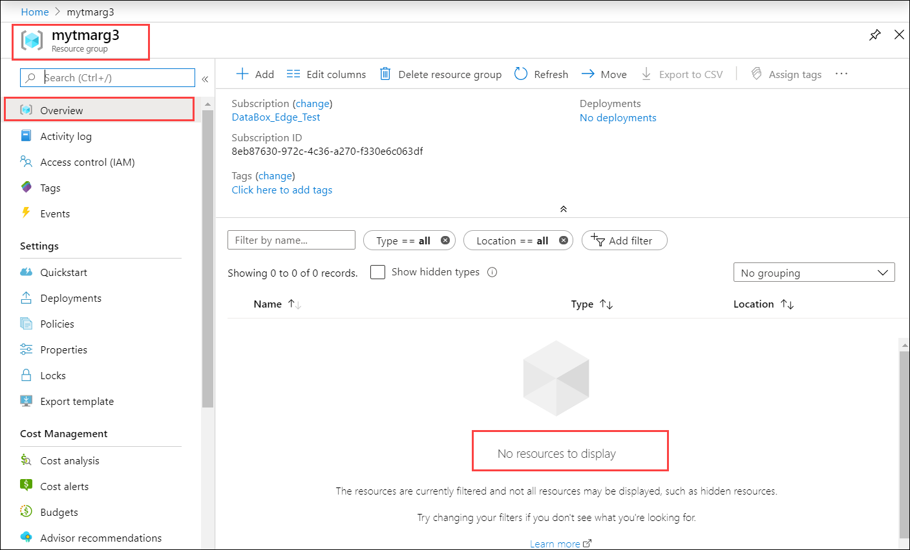
    
    5. You will need to have a Base 64 encoded certificate in `.cer` format for your Azure Stack Edge Mini R device. This certificate should be uploaded to your Azure Stack Edge device as `pfx` with a private key. This certificate also needs to be installed in the trusted root of the store on the client that is trying to establish the P2S connection.

## Use the script

First you modify the `parameters-p2s.json` file to input your parameters. Next, you run the script using the modified json file.

Each of these steps is discussed in the following sections.

### Download service tags file

You may already have a `ServiceTags.json` file in the folder where you downloaded the script. If not, you can download the service tags file.

[!INCLUDE [azure-stack-edge-gateway-download-service-tags](../../includes/azure-stack-edge-gateway-download-service-tags.md)]

### Modify parameters file

The first step would be to modify the `parameters-p2s.json` file and save the changes. 

For the Azure resources that you create, you'll provide the following names:

|Parameter name  |Description  |
|---------|---------|
|virtualNetworks_vnet_name    | Azure Virtual Network name        |
|azureFirewalls_firewall_name     | Azure Firewall name        |
|routeTables_routetable_name     | Azure Route table name        |
|publicIPAddresses_VNGW_public_ip_name     | Public IP address name for your Virtual network gateway       |
|virtualNetworkGateways_VNGW_name    | Azure VPN gateway (virtual network gateway) name        |
|publicIPAddresses_firewall_public_ip_name     | Public IP address name for your Azure Firewall         |
|location     |This is the region in which you want to create your virtual network. Select the same region as the one associated with your device.         |
|RouteTables_routetable_onprem_name| This is the name of the additional route table to help the firewall route packets back to Azure Stack Edge device. The script creates two additional routes and associates *default* and *FirewallSubnet* with this route table.|

Provide the following IP addresses and address spaces for the Azure resources that are created including the virtual network and associated subnets (*default*, *firewall*, *GatewaySubnet*).

|Parameter name  |Description  |
|---------|---------|
|VnetIPv4AddressSpace    | This is the address space associated with your virtual network. Provide Vnet IP range as private IP range (https://en.wikipedia.org/wiki/Private_network#Private_IPv4_addresses).     |
|DefaultSubnetIPv4AddressSpace    |This is the address space associated with the `Default` subnet for your virtual network.         |
|FirewallSubnetIPv4AddressSpace    |This is the address space associated with the `Firewall` subnet for your virtual network.          |
|GatewaySubnetIPv4AddressSpace    |This is the address space associated with the `GatewaySubnet` for your virtual network.          |
|GatewaySubnetIPv4bgpPeeringAddress    | This is the IP address that is reserved for BGP communication and is based off the address space associated with the `GatewaySubnet` for your virtual network.          |
|ClientAddressPool    | This IP address is used for the address pool in the P2S configuration in Azure portal.         |
|PublicCertData     | Public certificate data is used by the VPN Gateway to authenticate P2S clients connecting to it. To get the certificate data, install the root certificate. Make sure the certificate is Base-64 encoded with a .cer extension. Open this certificate and copy the text in the certificate between ==BEGIN CERTIFICATE== and ==END CERTIFICATE== in one continuous line.     |


### Run the script

Follow these steps to use the modified `parameters-p2s.json` and run the script to create Azure resources.

1. Run PowerShell. Switch to the directory where the script is located.

3. Run the script.

    `.\AzDeployVpn.ps1 -Location <Location> -AzureAppRuleFilePath "appRule.json" -AzureIPRangesFilePath "<Service tag json file>"  -ResourceGroupName "<Resource group name>" -AzureDeploymentName "<Deployment name>" -NetworkRuleCollectionName "<Name for collection of network rules>" -Priority 115 -AppRuleCollectionName "<Name for collection of app rules>"`

    > [!NOTE]
    > In this release, the script works in East US location only.

    You will need to input the following information when you run the script:

    
    |Parameter  |Description  |
    |---------|---------|
    |Location     |This is the region in which the Azure resources must be created.         |
    |AzureAppRuleFilePath     | This is the file path for `appRule.json`.       |
    |AzureIPRangesFilePath     |This is the Service Tag json file that you downloaded in the earlier step.         |
    |ResourceGroupName     | This is the name of the resource group under which all the Azure resources are created.        |
    |AzureDeploymentName    |This is the name for your Azure deployment.         |
    |NetworkRuleCollectionName            | This is the name for the collection of all the network rules that are created and add to your Azure Firewall.             |
    |Priority            | This is the priority assigned to all the network and application rules that are created.              |
    |AppRuleCollectionName            |This is the name for the collection of all the application rules that are created and added to your Azure Firewall.                |


    A sample output is shown below.
    
    ```powershell
    PS C:\Offline docs\AzureVpnConfigurationScripts> .\AzDeployVpn.ps1 -Location eastus -AzureAppRuleFilePath "appRule.json" -AzureIPRangesFilePath ".\ServiceTags_Public_20200203.json" -ResourceGroupName "mytmarg3" -AzureDeploymentName "tmap2stestdeploy1" -NetworkRuleCollectionName "testnrc1" -Priority 115 -AppRuleCollectionName "testarc2"
        validating vpn deployment parameters
        Starting vpn deployment
        C:\Offline docs\AzureVpnConfigurationScripts\parameters-p2s.json
        C:\Offline docs\AzureVpnConfigurationScripts\template-p2s.json
        vpn deployment: tmap2stestdeploy1 started and status: Running
        Waiting for vpn deployment completion....
        ==== CUT ==================== CUT ==============
        Adding route 191.236.0.0/18 for AzureCloud.eastus
        Adding route 191.237.0.0/17 for AzureCloud.eastus
        Adding route 191.238.0.0/18 for AzureCloud.eastus
        Total Routes:294, Existing Routes: 74, New Routes Added: 220
        Additional routes getting added
    ```    

    > [!IMPORTANT]
    > - The script takes approximately 90 minutes to run. Make sure to sign into your network right before the script starts.
    > - If for any reason there is a failed session with the script, make sure to delete the resource group to delete all the resources created under it.
  
    
    After the script is complete, a deployment log is generated in the same folder where the script resides.


## Verify the Azure resources

After you've successfully run the script, verify that all the resources were created in Azure. Go to the resource group that you created. You should see the following resources:

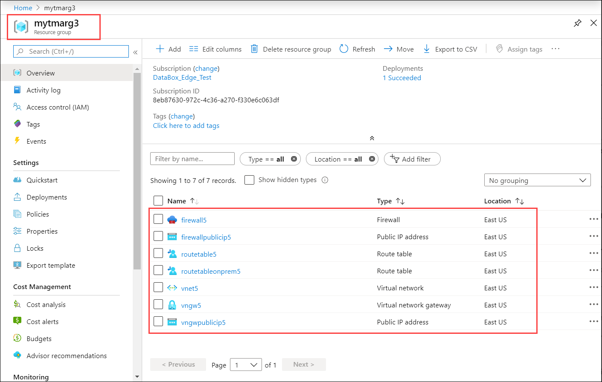


<!--## Enable point-to-site in VPN gateway

1. In the Azure portal, go to the resource group and then select the virtual network gateway that you created in the earlier step.

    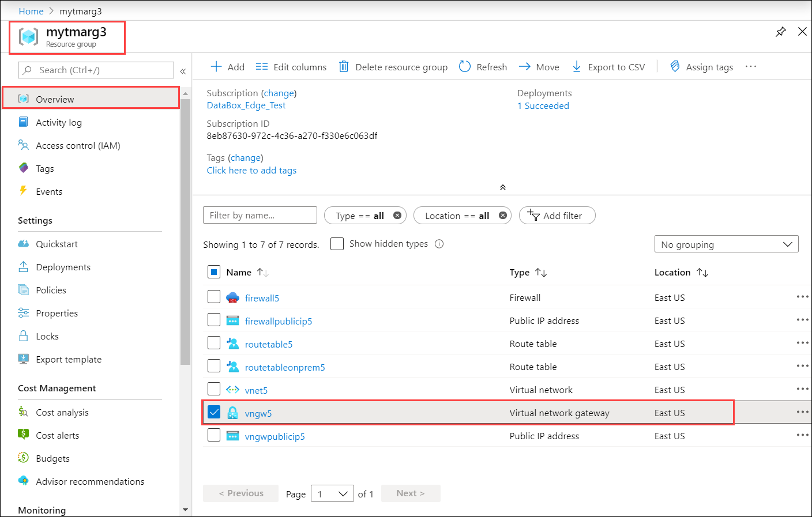

2. Go to **Settings > Point-to-site configuration**. Select **Configure now**.

    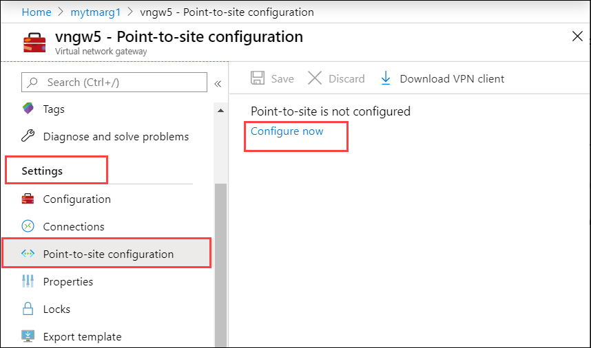


3.  On the **Point-to-site configuration** blade:

    1. You'll add the client address pool. This pool is a range of private IP addresses that you specify. The clients that connect over a P2S VPN dynamically receive an IP address from this range. Use a private IP address range that does not overlap with the on-premises location that you connect from, or the VNet that you want to connect to. 
    2. You can select the tunnel type. For the VPN tunnel, you will use the IKEv2 protocol. 
    3. You will now define the type of authentication. Before Azure accepts a P2S VPN connection, the user has to be authenticated first. In this case, you authenticate using the native Azure certificate authentication. Set **Authentication type** to **Azure certificate**.
    4. You will now create and upload the certificates to Azure and your client. You will need to install a root certificate on your VPN gateway. The VPN gateway validates the client certificates when the P2S connection is being established by the client. The root certificate is required for the validation and must be uploaded to Azure.
    
        The clients trying to establish the P2S connection will have a client certificate that authenticates the connecting user.  To create these certificates, follow the steps in [Generate and export certificates for Point-to-Site using PowerShell](../vpn-gateway/vpn-gateway-certificates-point-to-site.md). 

        To install the root certificate, make sure the certificate is Base-64 encoded with a .cer extension. Open this certificate and copy the text in the certificate between ==BEGIN CERTIFICATE== and ==END CERTIFICATE== in one continuous line in the public certificate data under Root certificates.

        To upload the root certificates, follow the detailed steps in [Upload the root certificate public certificate data](../vpn-gateway/vpn-gateway-howto-point-to-site-resource-manager-portal.md#uploadfile).
    
    5. Save the configuration.

        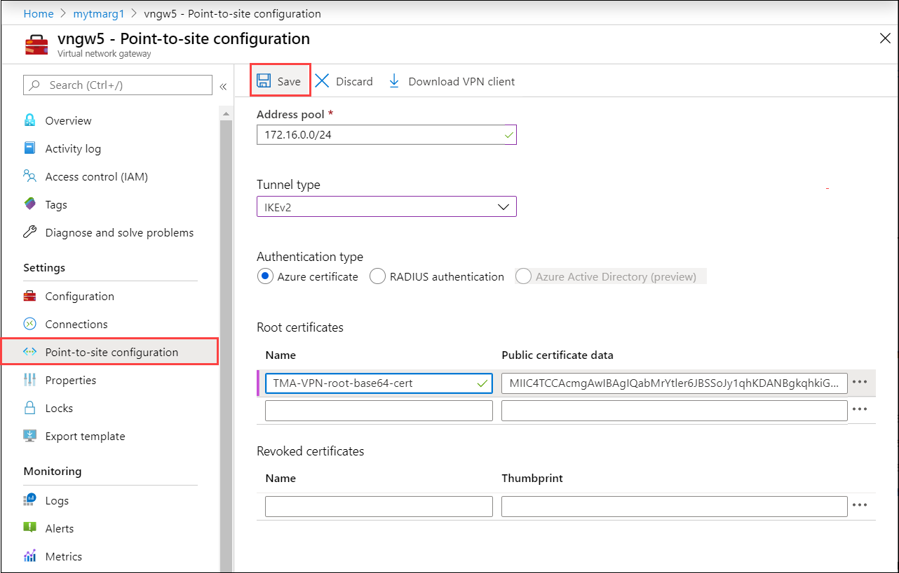-->

## Download phone book for VPN profile

In this step, you will download the VPN profile for your device.

1. In the Azure portal, go to the resource group and then select the virtual network gateway that you created in the earlier step.

    

2. Go to **Settings > Point-to-site configuration**. Select **Download VPN client**.

    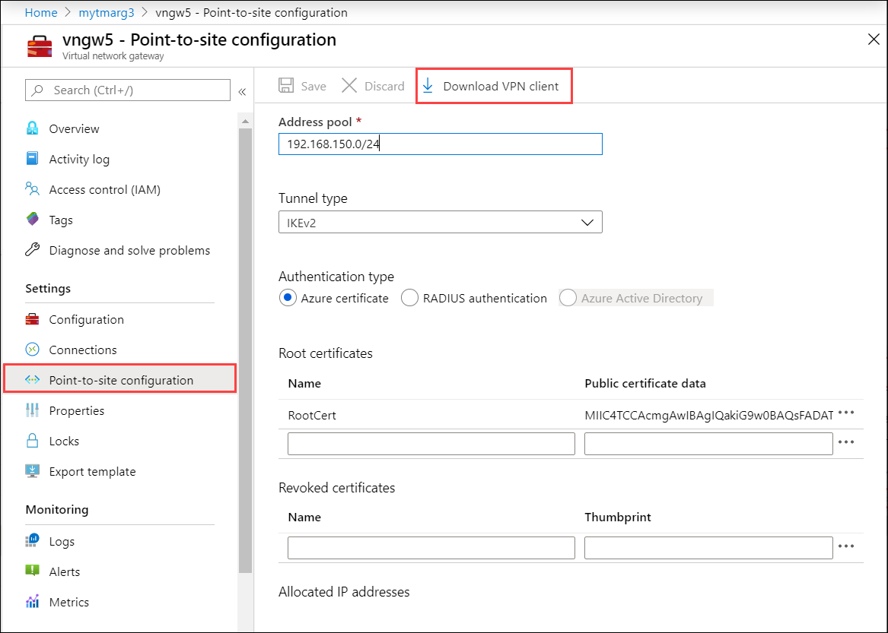

2. Save the zipped profile and extract on your Windows client.

    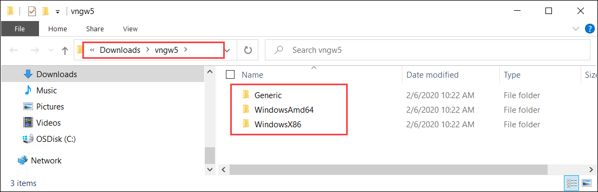

3. Go to *WindowsAmd64* folder and then extract the `.exe`: *VpnClientSetupAmd64.exe*.

    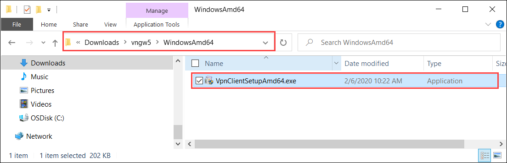

3. Create a temporary path. For example:

    `C:\NewTemp\vnet\tmp`

4. Run PowerShell and go to the directory where the `.exe` is located. To execute the `.exe`, type:

    `.\VpnClientSetupAmd64.exe /Q /C /T:"C:\NewTemp\vnet\tmp"`

5. The temporary path will have new files. Here is a sample output:

    ```powershell
    
    PS C:\windows\system32> cd "C:\Users\Ase\Downloads\vngw5\WindowsAmd64"
    PS C:\Users\Ase\Downloads\vngw5\WindowsAmd64> .\VpnClientSetupAmd64.exe /Q /C /T:"C:\NewTemp\vnet\tmp"
    PS C:\Users\Ase\Downloads\vngw5\WindowsAmd64> cd "C:\NewTemp\vnet"
    PS C:\NewTemp\vnet> ls .\tmp
    
        Directory: C:\NewTemp\vnet\tmp
    
    Mode                LastWriteTime         Length Name
    ----                -------------         ------ ----
    -a----         2/6/2020   6:18 PM            947 8c670077-470b-421a-8dd8-8cedb4f2f08a.cer
    -a----         2/6/2020   6:18 PM            155 8c670077-470b-421a-8dd8-8cedb4f2f08a.cmp
    -a----         2/6/2020   6:18 PM           3564 8c670077-470b-421a-8dd8-8cedb4f2f08a.cms
    -a----         2/6/2020   6:18 PM          11535 8c670077-470b-421a-8dd8-8cedb4f2f08a.inf
    -a----         2/6/2020   6:18 PM           2285 8c670077-470b-421a-8dd8-8cedb4f2f08a.pbk
    -a----         2/6/2020   6:18 PM           5430 azurebox16.ico
    -a----         2/6/2020   6:18 PM           4286 azurebox32.ico
    -a----         2/6/2020   6:18 PM         138934 azurevpnbanner.bmp
    -a----         2/6/2020   6:18 PM          46064 cmroute.dll
    -a----         2/6/2020   6:18 PM            196 routes.txt
    
    PS C:\NewTemp\vnet>
    ```

6. The *.pbk* file is the phone book for the VPN profile. You will use this in the local UI.


## VPN configuration on the device

Follow these steps on the local UI of your Azure Stack Edge device.

1. In the local UI, go to **VPN** page. Under VPN state, select **Configure**.

    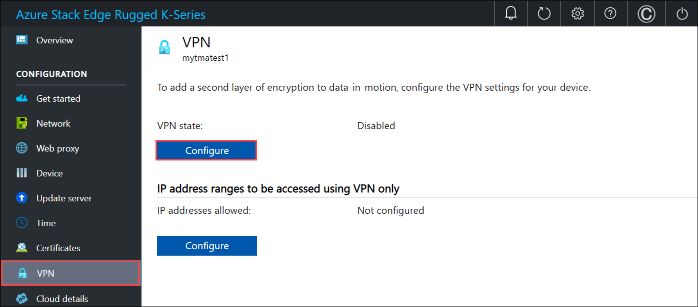

2. In the **Configure VPN** blade:
    
    1. In the Upload phone book file, point to the .pbk file that you created in the earlier step.
    2. In the Upload public IP list config file, provide Azure Data Center IP range JSON file as input. You downloaded this file in an earlier step from: [https://www.microsoft.com/download/details.aspx?id=56519](https://www.microsoft.com/download/details.aspx?id=56519).
    3. Select **eastus** as the region and select **Apply**.

    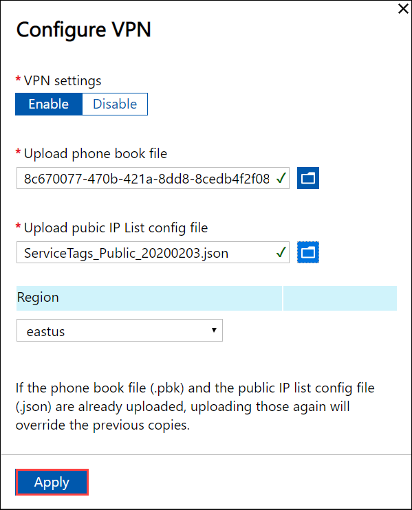

3. In the **IP address ranges to be accessed using VPN only** section, enter the Vnet IPv4 range that you had chosen for your Azure Virtual Network.

    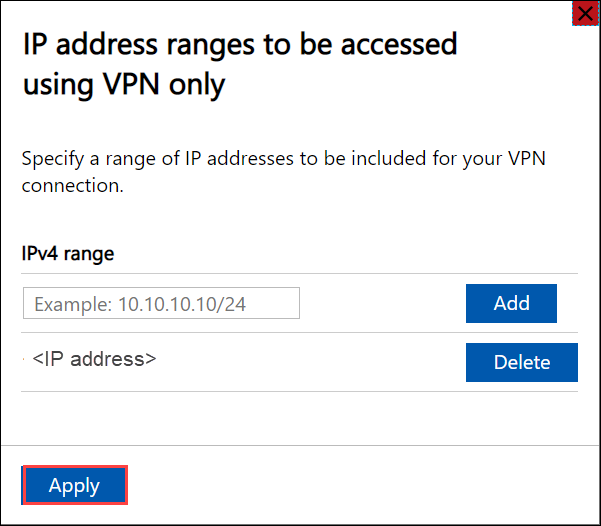

## Verify client connection

1. In the Azure portal, go to the VPN gateway.
2. Go to **Settings > Point-to-site configuration**. Under **Allocated IP addresses**, the IP address of your Azure Stack Edge device should show up.

## Validate data transfer through VPN

To confirm that VPN is working, copy data to an SMB share. Follow the steps in [Add a share](azure-stack-edge-gpu-manage-shares.md#add-a-share) on your Azure Stack Edge device. 

1. Copy a file, for example \data\pictures\waterfall.jpg to the SMB share that you mounted on your client system. 
2. To validate that the data is going through VPN, while the data is being copied:

    1. Go to the VPN gateway in the Azure portal. 

    2. Go to **Monitoring > Metrics**.

    3. In the right-pane, choose the **Scope** as your VPN gateway, **Metric** as Gateway P2S bandwidth, and **Aggregation** as Avg.

    4. As the data is being copied, you will see an increase in the bandwidth utilization and when the data copy is complete, the bandwidth utilization will drop.

        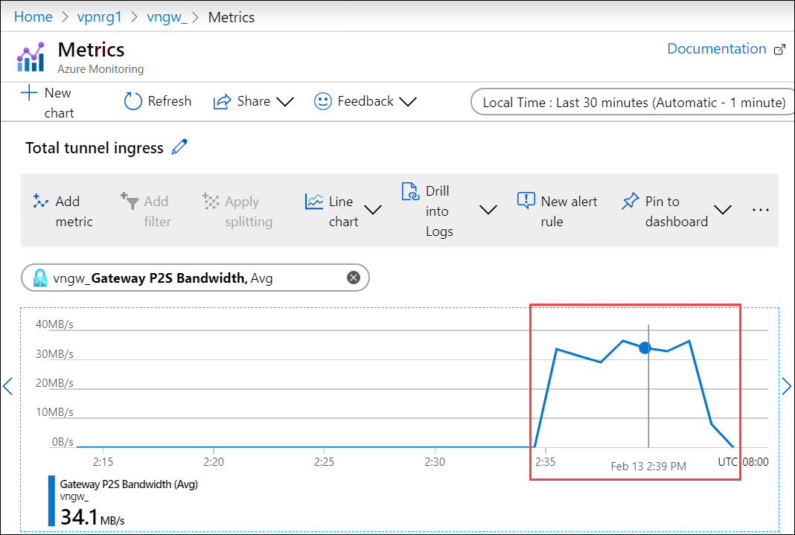

3. Verify that this file shows up in your storage account on the cloud.
 
## Debug issues

To debug any issues, use the following commands:

```
Get-AzResourceGroupDeployment -DeploymentName $deploymentName -ResourceGroupName $ResourceGroupName
```

The sample output is shown below:


```azurepowershell
PS C:\Projects\TZL\VPN\Azure-VpnDeployment> Get-AzResourceGroupDeployment -DeploymentName "tznvpnrg14_deployment" -ResourceGroupName "tznvpnrg14"


DeploymentName          : tznvpnrg14_deployment
ResourceGroupName       : tznvpnrg14
ProvisioningState       : Succeeded
Timestamp               : 1/21/2020 6:23:13 PM
Mode                    : Incremental
TemplateLink            :
Parameters              :
                          Name                                         Type                       Value
                          ===========================================  =========================  ==========
                          virtualNetworks_vnet_name                    String                     tznvpnrg14_vnet
                          azureFirewalls_firewall_name                 String                     tznvpnrg14_firewall
                          routeTables_routetable_name                  String                     tznvpnrg14_routetable
                          publicIPAddresses_VNGW_public_ip_name        String                     tznvpnrg14_vngwpublicip
                          virtualNetworkGateways_VNGW_name             String                     tznvpnrg14_vngw
                          publicIPAddresses_firewall_public_ip_name    String                     tznvpnrg14_fwpip
                          localNetworkGateways_LNGW_name               String                     tznvpnrg14_lngw
                          connections_vngw_lngw_name                   String                     tznvpnrg14_connection
                          location                                     String                     East US
                          vnetIPv4AddressSpace                         String                     172.24.0.0/16
                          defaultSubnetIPv4AddressSpace                String                     172.24.0.0/24
                          firewallSubnetIPv4AddressSpace               String                     172.24.1.0/24
                          gatewaySubnetIPv4AddressSpace                String                     172.24.2.0/24
                          gatewaySubnetIPv4bgpPeeringAddress           String                     172.24.2.254
                          customerNetworkAddressSpace                  String                     10.0.0.0/18
                          customerPublicNetworkAddressSpace            String                     207.68.128.0/24
                          dbeIOTNetworkAddressSpace                    String                     10.139.218.0/24
                          azureVPNsharedKey                            String                     1234567890
                          dbE-Gateway-ipaddress                        String                     207.68.128.113

Outputs                 :
                          Name                     Type                       Value
                          =======================  =========================  ==========
                          virtualNetwork           Object                     {
                            "provisioningState": "Succeeded",
                            "resourceGuid": "dcf673d3-5c73-4764-b077-77125eda1303",
                            "addressSpace": {
                              "addressPrefixes": [
                                "172.24.0.0/16"
                              ]
================= CUT ============================= CUT ===========================
```


```
Get-AzResourceGroupDeploymentOperation -ResourceGroupName $ResourceGroupName -DeploymentName $AzureDeploymentName
```

## Next steps

[Configure VPN via the local UI on your Azure Stack Edge device](azure-stack-edge-mini-r-deploy-configure-certificates-vpn-encryption.md#configure-vpn).
