# Tutorial: Configure certificates, VPN, encryption for your Azure Stack Edge Mini R

This tutorial describes how you can configure certificates, VPN, and encryption-at-rest for your Azure Stack Edge Mini R device by using the local web UI.

The time taken for this step can vary depending on the specific option you choose and how the certificate flow is established in your environment.

In this tutorial, you learn about:

> [!div class="checklist"]
>
> * Prerequisites
> * Configure certificates for the physical device
> * Configure VPN
> * Configure encryption at rest

## Prerequisites

Before you configure and set up your Azure Stack Edge Mini R device, make sure that:

* You've installed the physical device as detailed in [Install Azure Stack Edge Mini R](azure-stack-edge-mini-r-deploy-install.md).

* If you plan to bring your own certificates:
    - You should have your certificates ready in the appropriate format including the signing chain certificate. For details on certificate, go to [Manage certificates](azure-stack-edge-gpu-manage-certificates.md)

    - If your device is deployed in Azure Government or Azure Government Secret or Azure Government top secret cloud and not deployed in Azure public cloud, a signing chain certificate is required before you can activate your device. 
    For details on certificate, go to [Manage certificates](azure-stack-edge-gpu-manage-certificates.md).

## Configure certificates for device

1. In the **Certificates** page, you will configure your certificates. Depending on whether you changed the device name or the DNS domain in the **Device** page, you can choose one of the following options for your certificates.

    - If you have not changed the default device name or the default DNS domain in the earlier step and do not wish to bring your own certificates, then you can skip this step and proceed to the next step. The device has automatically generated self-signed certificates to begin with. 

       <!-- 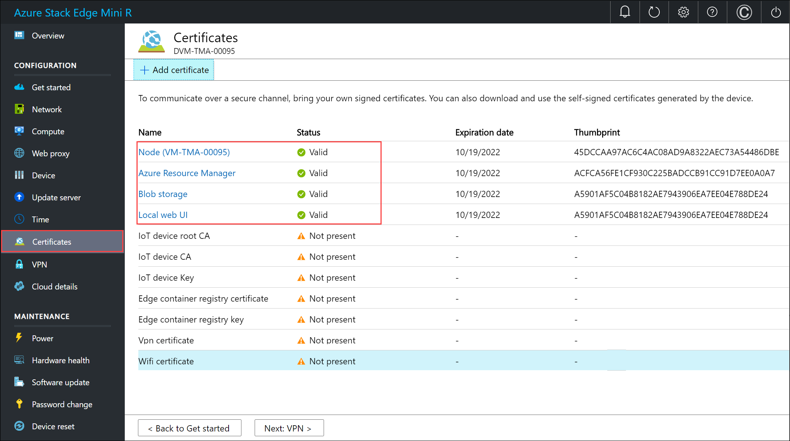-->

    - If you changed the device name or DNS domain, you will see that the status of certificates will show as **Not valid**. 

        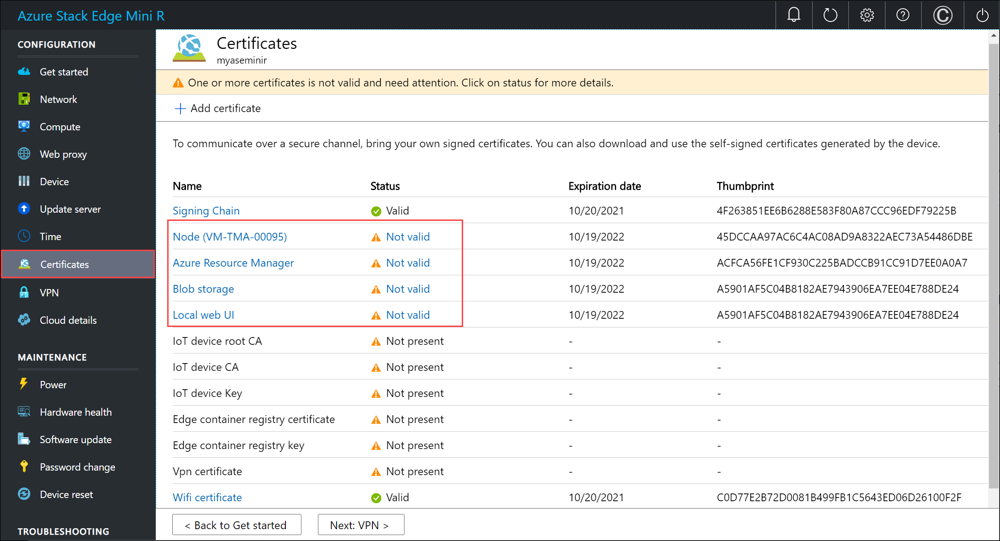    

        Select a certificate to view the details of the status.

        <!---->  

        The certificate status is **Not valid** because the certificates do not reflect the updated device name and DNS domain (that are used in subject name and subject alternative). To successfully activate your device, you can bring your own signed endpoint certificates and the corresponding signing chains. You first add the signing chain and then upload the endpoint certificates. For more information, go to [Bring your own certificates on your Azure Stack Edge Mini R device](#bring-your-own-certificates).

    - If you changed the device name or DNS domain, and you do not bring your own certificates, then the **activation will be blocked**.

#### Bring your own certificates

You already added the signing chain in an earlier step on this device. You can now upload the endpoint certificates, node certificate, local UI certificate and the VPN certificate. Follow these steps to add your own certificates.

1. To upload certificate, on the **Certificate** page, select **+ Add certificate**.

    

1. You can upload other certificates. For example, you can upload the Azure Resource Manager and Blob storage endpoint certificates.

    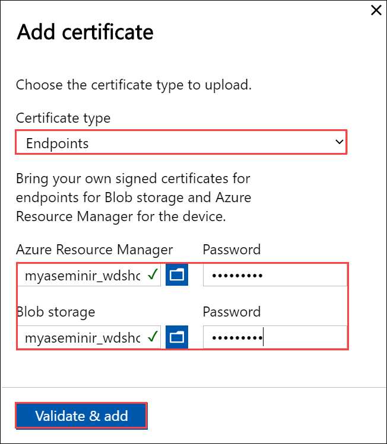

1. You can also upload the local web UI certificate. After you upload this certificate, you will be required to start your browser and clear the cache. You will then need to connect to the device local web UI.  

    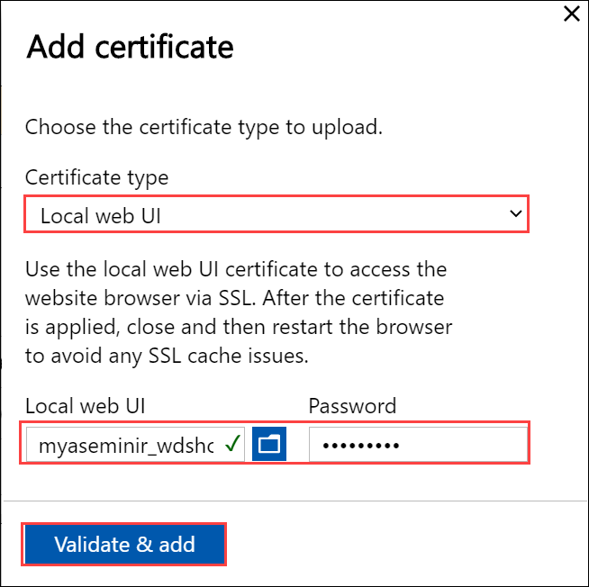

1. You can also upload the node certificate.

    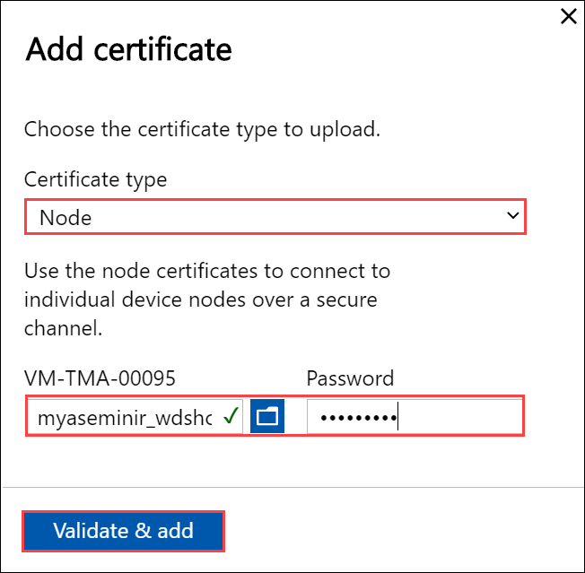

1. Finally, you can upload the VPN certificate.
        
    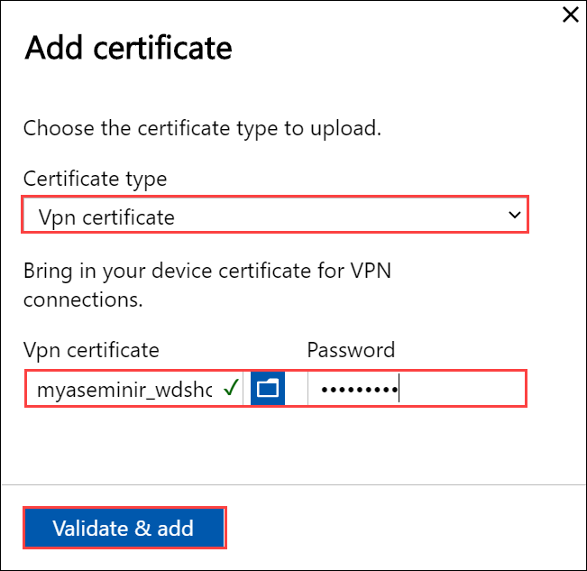

1. At any time, you can select a certificate and view the details to ensure that these match with the certificate that you uploaded.

    [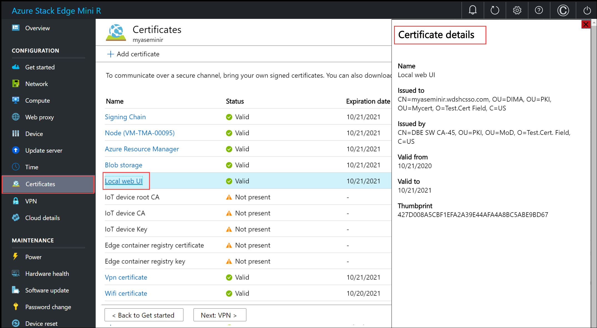](./media/azure-stack-edge-mini-r-deploy-configure-certificates-vpn-encryption/add-certificate-7.png#lightbox)

    The certificate page should update to reflect the newly added certificates.

    [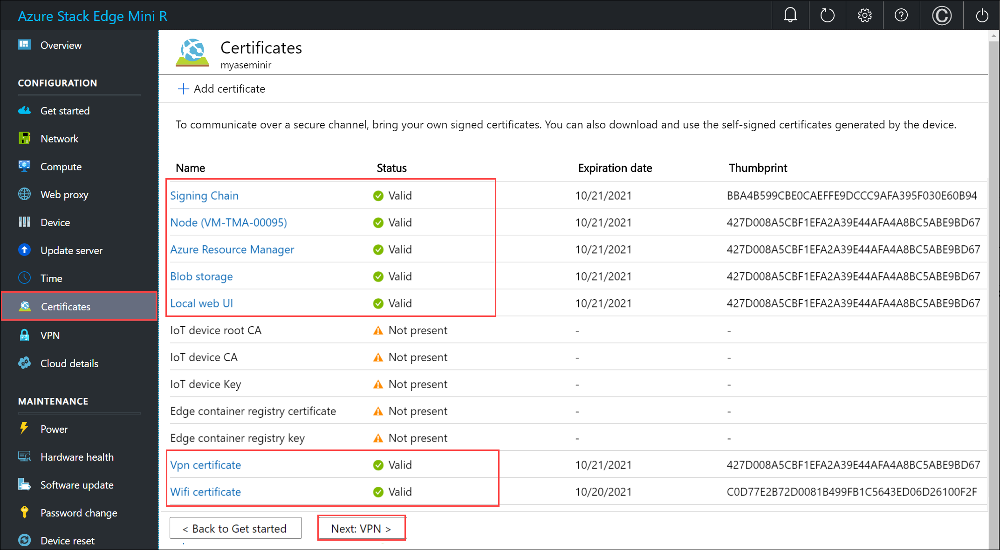](./media/azure-stack-edge-mini-r-deploy-configure-certificates-vpn-encryption/add-certificate-8.png#lightbox)  

    > [!NOTE]
    > Except for Azure public cloud, signing chain certificates are needed to be brought in before activation for all cloud configurations (Azure Government or Azure Stack Hub).

## Configure VPN

1. On the **Security** tile, select **Configure** for VPN. 

    To configure VPN, you'll first need to ensure that you have all the necessary configuration done in Azure. For details, see [Configure VPN via PowerShell for your Azure Stack Edge Mini R device](azure-stack-edge-placeholder.md). Once this is complete, you can do the configuration in the local UI.
    
    1. On the VPN page, select **Configure**.
        

    1. In the **Configure VPN** blade:

        1. Provide the phone book as input.
        2. Provide Azure Data Center IP range JSON file as input. Download this file from: [https://www.microsoft.com/download/details.aspx?id=56519](https://www.microsoft.com/download/details.aspx?id=56519).
        3. Select **eastus** as the region.
        4. Select **Apply**.

        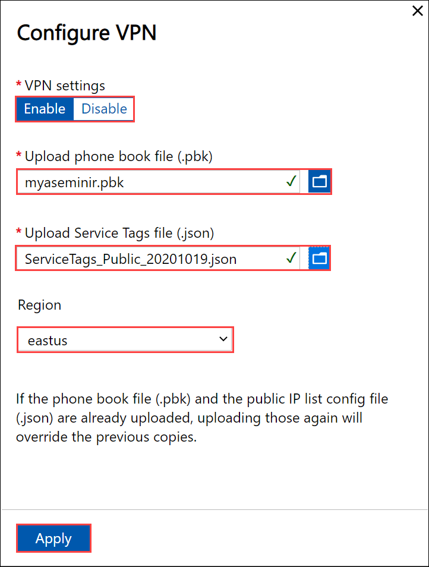
    
    1. Configure IP address ranges to be accessed using VPN only. 
    
        - Under **IP address ranges to be accessed using VPN only**, select **Configure**.
        - Enter the VNET IPv4 range that you had chosen for your Azure Virtual Network.
        - Select **Apply**.
    
        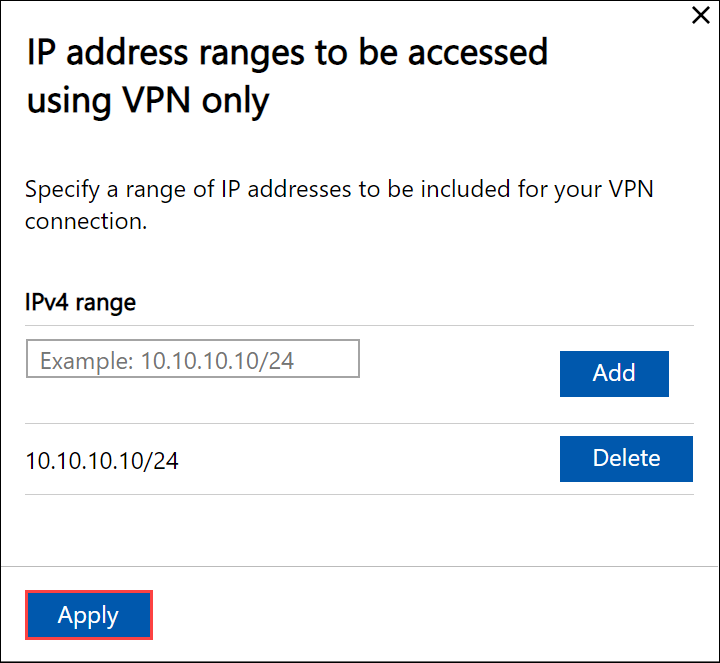

Your device is now ready to be encrypted. Configure encryption at rest.

## Enable encryption

1. On the **Security** tile, select **Configure** for encryption-at-rest. This is a required setting and until this is successfully configured, you can't activate the device. 

    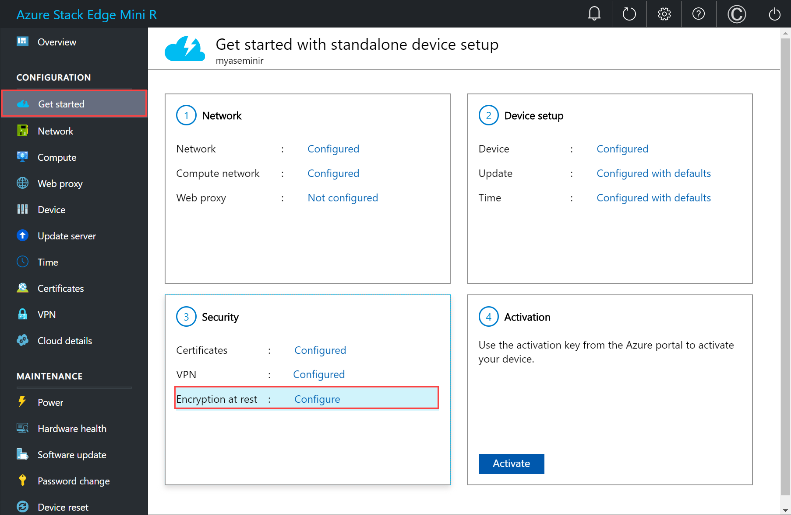

    At the factory, once the devices are imaged, the volume level BitLocker encryption is enabled. After you receive the device, you need to configure the encryption-at-rest. The storage pool and volumes are recreated and you can provide BitLocker keys to enable encryption-at-rest and thus create a second layer of encryption for your data-at-rest.

1. In the **Encryption-at-rest** pane, enter a 32 character long (AES-256 bit) Base-64 encoded key. This is a one-time configuration and this key is used to protect the actual encryption key. 

    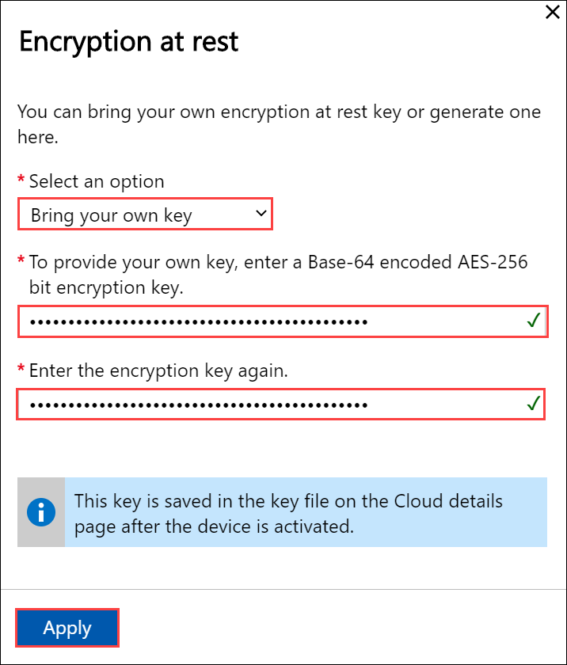

    You can choose to automatically generate this key as well.

    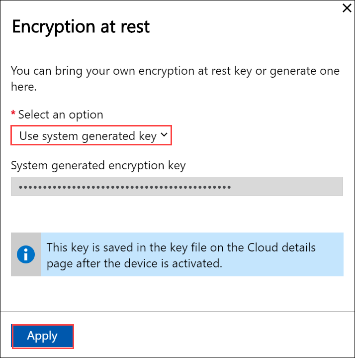

1. Select **Apply**. This operation takes several minutes and the status of operation is displayed on the **Security** tile.

    

1. After the status shows as **Completed**, go back to **Get started**.

Your device is now ready to be activated.

## Next steps

In this tutorial, you learn about:

> [!div class="checklist"]
>
> * Prerequisites
> * Configure certificates for the physical device
> * Configure VPN
> * Configure encryption at rest

To learn how to activate your Azure Stack Edge Mini R device, see:

> [!div class="nextstepaction"]
> [Activate Azure Stack Edge Mini R device](./azure-stack-edge-mini-r-deploy-activate.md)
