# Tutorial: Configure network for Azure Stack Edge Mini R

This tutorial describes how to configure network for your Azure Stack Edge Mini R device with an onboard GPU by using the local web UI.

The connection process can take around 20 minutes to complete.

In this tutorial, you learn about:

> [!div class="checklist"]
>
> * Prerequisites
> * Configure network
> * Enable compute network
> * Configure web proxy

## Prerequisites

Before you configure and set up your Azure Stack Edge Mini R device, make sure that:

* You've installed the physical device as detailed in [Install Azure Stack Edge Mini R](azure-stack-edge-gpu-deploy-install.md).
* You've connected to the local web UI of the device as detailed in [Connect to Azure Stack Edge Mini R](azure-stack-edge-mini-r-deploy-connect.md)

## Configure network

Your **Get started** page displays the various settings that are required to configure and register the physical device with the Azure Stack Edge service. 

Follow these steps to configure the network for your device.

1. In the local web UI of your device, go to the **Get started** page. 

2. If a zero day update is needed, you can do that here by configuring a data port with a wired connection. For more instructions on how to set up a wired connection for this device, see [Cable your device](azure-stack-edge-mini-r-deploy-install.md#cable-the-device). After the update is over, you can remove the wired connection.

3. Create certificates for Wi-Fi and signing chain. Both the signing chain and the Wi-Fi certificates must be DER format with a *.cer* file extension. For instructions, see [Create certificates](azure-stack-edge-gpu-manage-certificates.md). This step is optional if you're using a Wi-Fi profile instead of certificates for authentication.

   > [!NOTE] 
   > If you're using password-based authentication on your personal Wi-Fi network, you can skip the certificate steps. Just configure the Wi-Fi port and then upload your Wi-Fi profile.   
   > To find out about Wi-Fi profiles for a WPA2 - Personal network and learn how to export your Wi-Fi profile, see [Use Wi-Fi profiles](azure-stack-edge-mini-r-use-wifi-profiles.md).

4. Add the certificates to your device: 

   1. In the local web UI, go to **Get started**. On the **Security** tile, select **Certificates** and then select **Configure**. 

      

   1. Select **+ Add certificate**. 
    
      [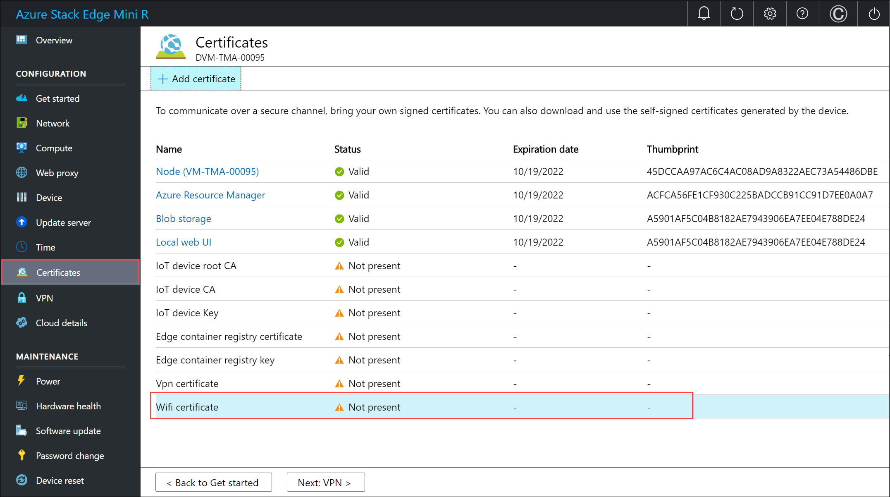](./media/azure-stack-edge-mini-r-deploy-configure-network-compute-web-proxy/add-wifi-cert-1.png#lightbox)

   2. Upload the signing chain and select **Apply**.

      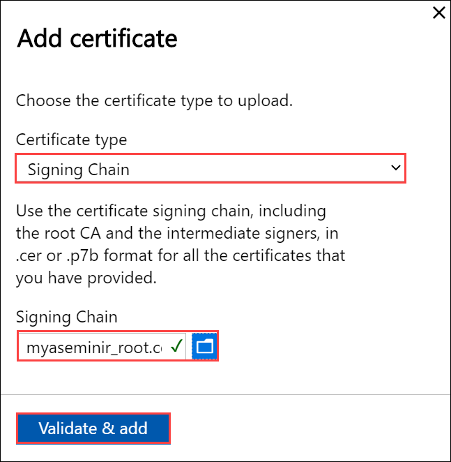

   3. Repeat the procedure with the Wi-Fi certificate. 

      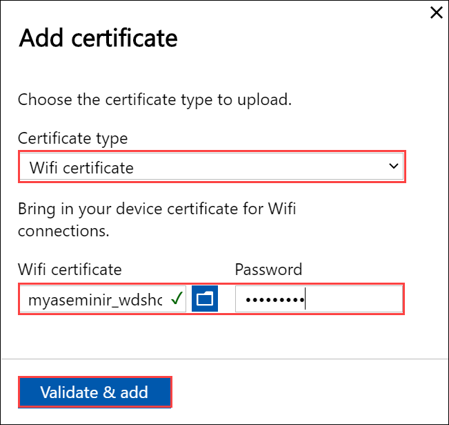

   4. The new certificates should be displayed on the **Certificates** page. 

      [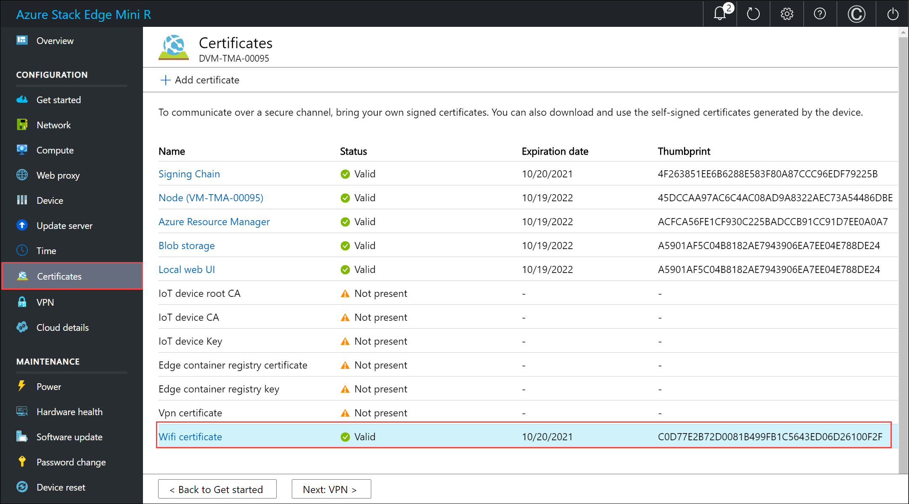](./media/azure-stack-edge-mini-r-deploy-configure-network-compute-web-proxy/add-wifi-cert-5.png#lightbox)

   5. Go back to **Get started**.

5. Configure the Wi-Fi port. On the **Network** tile, select **Configure**.  

   On your physical device, there are five network interfaces. PORT 1 and PORT 2 are 1-Gbps network interfaces. PORT 3 and PORT 4 are all 10-Gbps network interfaces. The fifth port is the Wi-Fi port. 

   [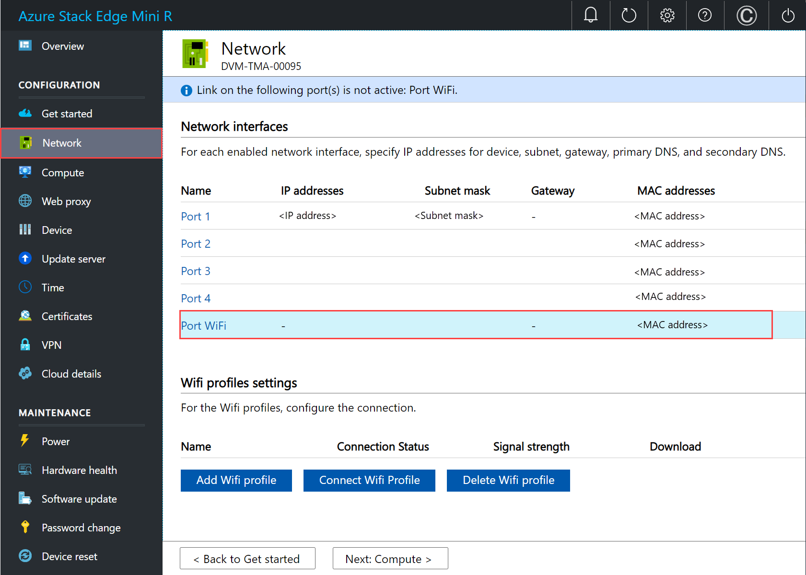](./media/azure-stack-edge-mini-r-deploy-configure-network-compute-web-proxy/configure-wifi-1.png#lightbox)    

   Select the Wi-Fi port and configure the port settings. 

   > [!IMPORTANT]
   > We strongly recommend that you configure a static IP address for the Wi-Fi port.  

   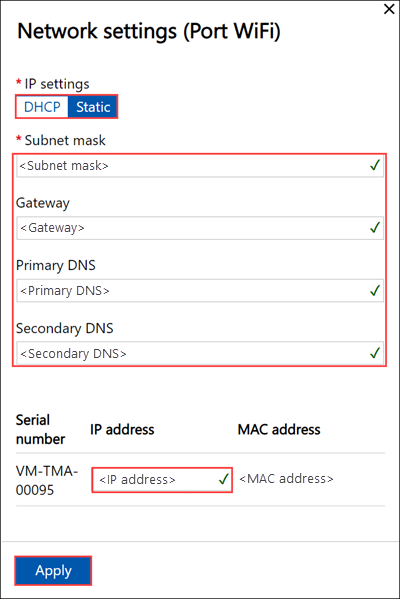

   The **Network** page updates after you apply the Wi-Fi port settings.

   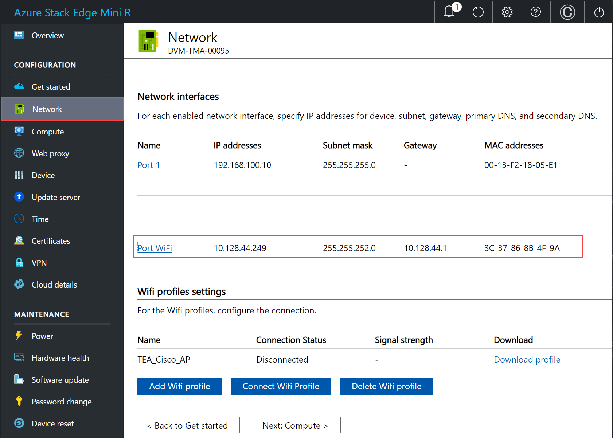

6. Select **Add Wi-Fi profile** and  upload your Wi-Fi profile. 

   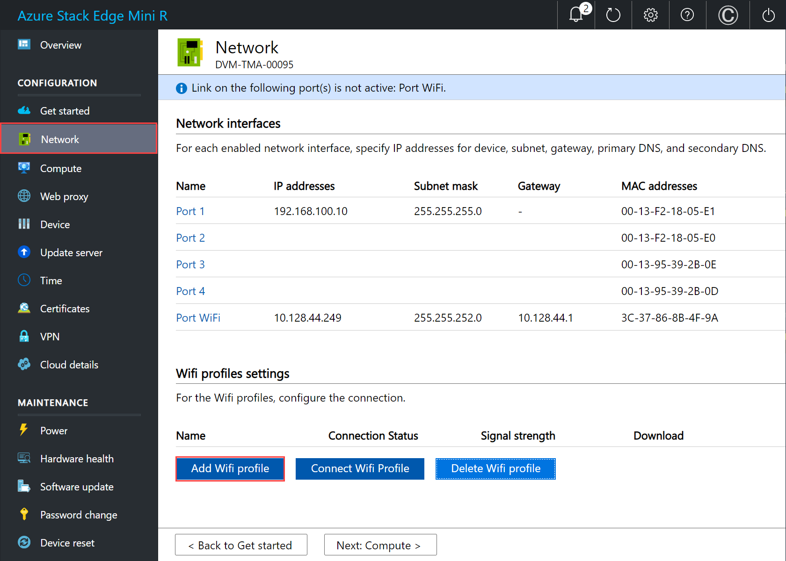

   A wireless network profile contains the SSID (network name), password key, and security information to be able to connect to a wireless network. You can get the Wi-Fi profile for your environment from your network administrator.

   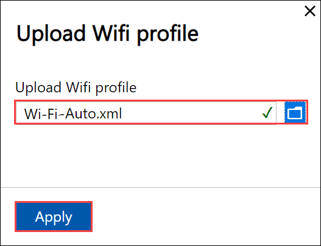

   After the profile is added, the list of Wi-Fi profiles updates to reflect the new profile. The profile should show the **Connection status** as **Disconnected**. 

   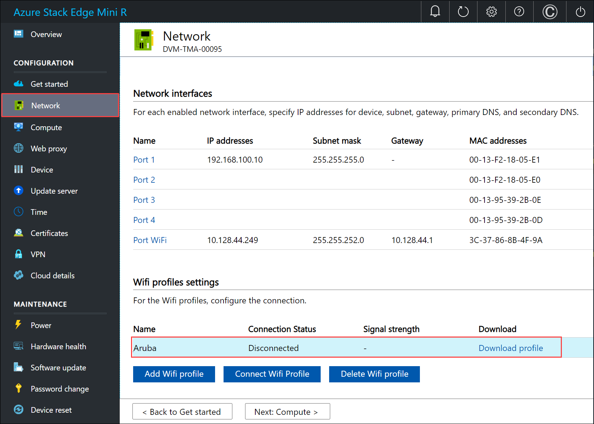

7. After the wireless network profile is successfully loaded, connect to this profile. Select **Connect to Wi-Fi profile**. 

   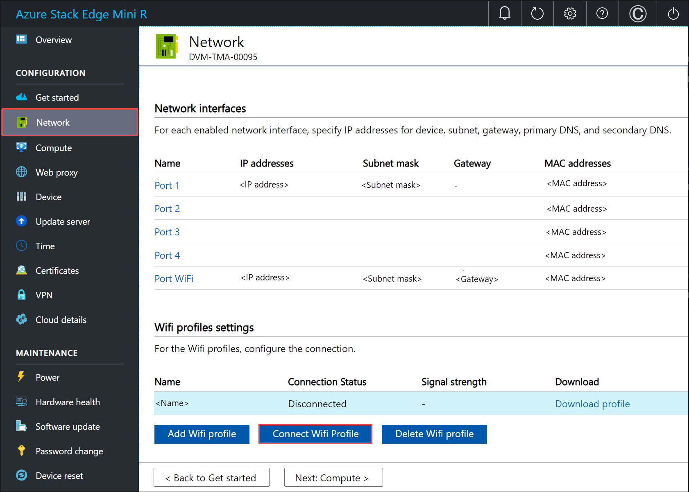

8. Select the Wi-Fi profile that you added in the previous step, and select **Apply**. 

   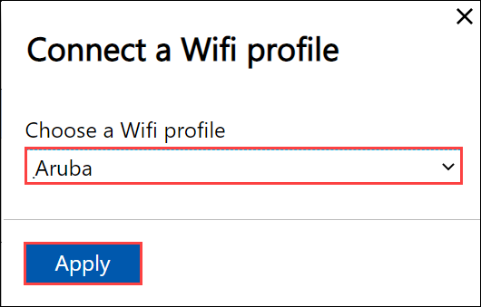

   The **Connection status** should update to **Connected**. The signal strength updates to indicate the quality of the signal. 

   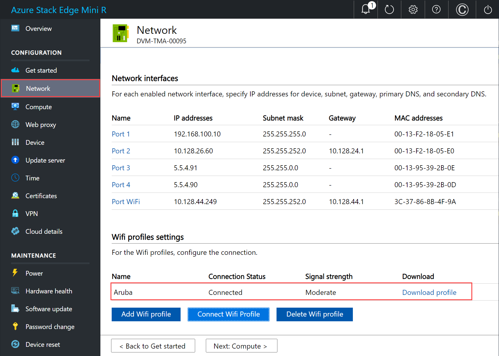

   > [!NOTE]
   > To transfer large amounts of data, we recommend that you use a wired connection instead of the wireless network. 

9. Disconnect PORT 1 on the device from the laptop. 

10. As you configure the network settings, keep in mind:

    - If DHCP is enabled in your environment, network interfaces are automatically configured. An IP address, subnet, gateway, and DNS are automatically assigned.
    - If DHCP isn't enabled, you can assign static IPs if needed.
    - You can configure your network interface as IPv4.
    - Network Interface Card (NIC) Teaming or link aggregation is not supported with Azure Stack Edge.
    - Serial number for any port corresponds to the node serial number. For a K-series device, only one serial number is displayed.

     > [!NOTE]
     > - We recommend that you do not switch the local IP address of the network interface from static to DCHP, unless you have another IP address to connect to the device. If using one network interface and you switch to DHCP, there would be no way to determine the DHCP address. If you want to change to a DHCP address, wait until after the device has registered with the service, and then change. You can then view the IPs of all the adapters in the **Device properties** in the Azure portal for your service.
     > - If you need to connect to your device from an outside network, see [Enable device access from outside network](azure-stack-edge-gpu-manage-access-power-connectivity-mode.md#enable-device-access-from-outside-network) for additional network settings.

After you have configured and applied the network settings, select **Next: Compute** to configure compute network.

## Enable compute network

Follow these steps to enable compute and configure compute network. 

1. In the **Compute** page, select a network interface that you want to enable for compute. 

   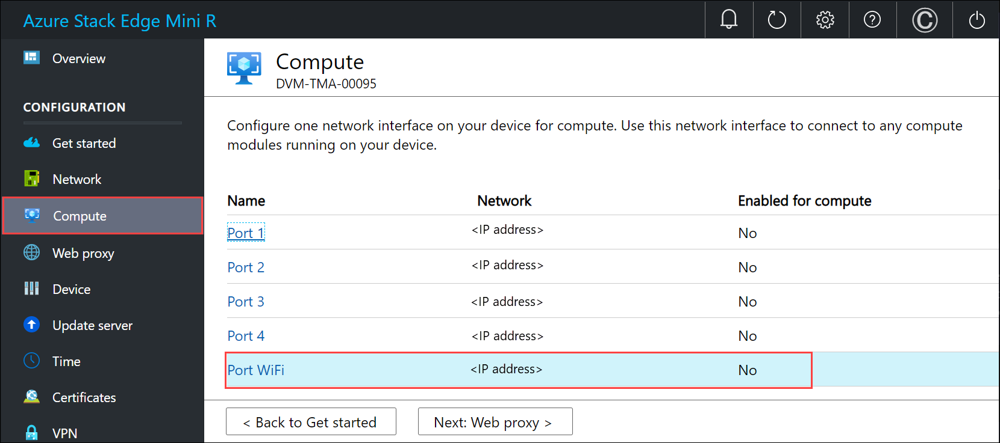

1. In the **Network settings** dialog, select **Enable**. When you enable compute, a virtual switch is created on your device on that network interface. The virtual switch is used for the compute infrastructure on the device. 
    
1. Assign **Kubernetes node IPs**. These static IP addresses are for the compute VM.  

   For an *n*-node device, a contiguous range of a minimum of *n+1* IPv4 addresses (or more) are provided for the compute VM using the start and end IP addresses. Given Azure Stack Edge is a 1-node device, a minimum of 2 contiguous IPv4 addresses are provided.

   > [!IMPORTANT]
   > Kubernetes on Azure Stack Edge uses 172.27.0.0/16 subnet for pod and 172.28.0.0/16 subnet for service. Make sure that these are not in use in your network. If these subnets are already in use in your network, you can change these subnets by running the `Set-HcsKubeClusterNetworkInfo` cmdlet from the PowerShell interface of the device. For more information, see [Change Kubernetes pod and service subnets](azure-stack-edge-gpu-connect-powershell-interface.md#change-kubernetes-pod-and-service-subnets).

1. Assign **Kubernetes external service IPs**. These are also the load-balancing IP addresses. These contiguous IP addresses are for services that you want to expose outside the Kubernetes cluster and you specify the static IP range depending on the number of services exposed. 
    
   > [!IMPORTANT]
   > We strongly recommend that you specify a minimum of 1 IP address for Azure Stack Edge Mini R Hub service to access compute modules. You can then optionally specify additional IP addresses for other services/IoT Edge modules (1 per service/module) that need to be accessed from outside the cluster. The service IP addresses can be updated later. 
    
1. Select **Apply**.

   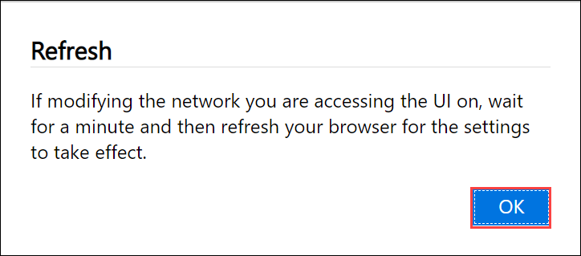

1. The configuration takes a couple minutes to apply and you may need to refresh the browser. You can see that the specified port is enabled for compute. 
 
   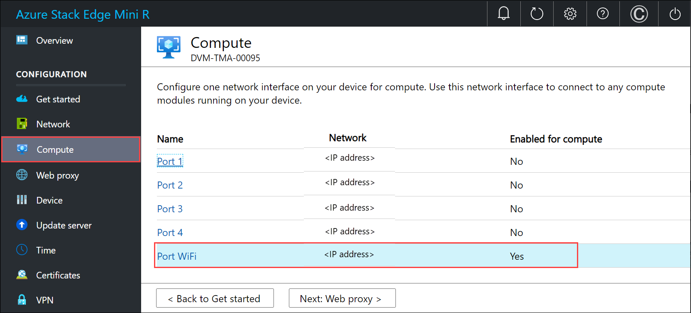

   Select **Next: Web proxy** to configure web proxy.  

  
## Configure web proxy

This is an optional configuration.

> [!IMPORTANT]
> Proxy-auto config (PAC) files are not supported. A PAC file defines how web browsers and other user agents can automatically choose the appropriate proxy server (access method) for fetching a given URL. Proxies that try to intercept and read all the traffic (then re-sign everything with their own certification) aren't compatible since the proxy's certificate is not trusted. Typically transparent proxies work well with Azure Stack Edge Mini R. Non-transparent web proxies are not supported.

1. On the **Web proxy settings** page, take the following steps:

   1. In the **Web proxy URL** box, enter the URL in this format: `http://host-IP address or FQDN:Port number`. HTTPS URLs are not supported.

   2. To validate and apply the configured web proxy settings, select **Apply**.

   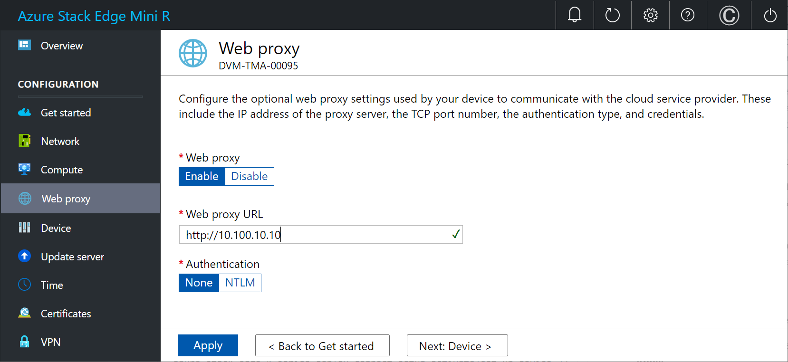<!--UI text update is needed to remove NTLM from instruction text.-->

2. After the settings are applied, select **Next: Device**.

## Next steps

In this tutorial, you learned about:

> [!div class="checklist"]
> * Prerequisites
> * Configure network
> * Enable compute network
> * Configure web proxy

To learn how to set up your Azure Stack Edge Mini R device, see:

> [!div class="nextstepaction"]
> [Configure device settings](./azure-stack-edge-mini-r-deploy-set-up-device-update-time.md)
