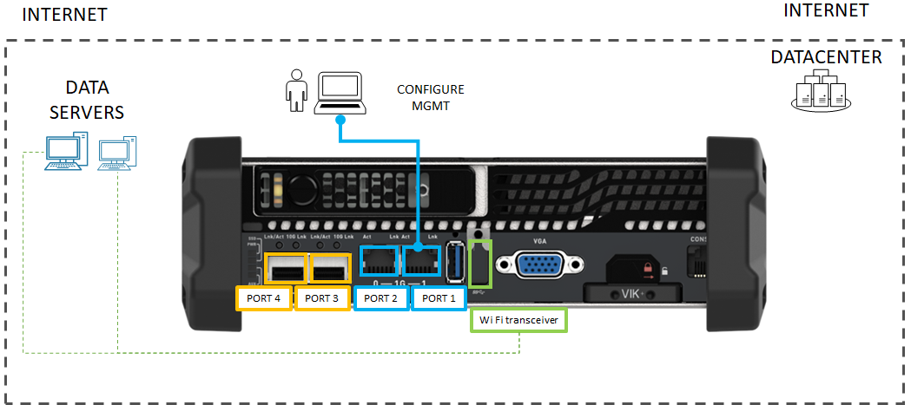

# Tutorial: Connect to Azure Stack Edge Mini R

This tutorial describes how you can connect to your Azure Stack Edge Mini R device by using the local web UI.

The connection process can take around 5 minutes to complete.

In this tutorial, you learn about:

> [!div class="checklist"]
>
> * Prerequisites
> * Connect to a physical device

## Prerequisites

Before you configure and set up your Azure Stack Edge device, make sure that:

* You've installed the physical device as detailed in [Install Azure Stack Edge](azure-stack-edge-mini-r-deploy-install.md).
* You've run the Azure Stack Network Readiness Checker tool to verify that your network meets Azure Stack Edge requirements. For instructions, see [Check network readiness for Azure Stack Edge devices](azure-stack-edge-deploy-check-network-readiness.md).

## Connect to the local web UI setup

1. Configure the Ethernet adapter on your computer to connect to the Azure Stack Edge Pro device with a static IP address of 192.168.100.5 and subnet 255.255.255.0.

2. Connect the computer to PORT 1 on your device. If connecting the computer to the device directly (without a switch), use an Ethernet crossover cable or a USB Ethernet adapter. Use the following illustration to identify PORT 1 on your device.

    

[!INCLUDE [azure-stack-edge-gateway-delpoy-connect](../../includes/azure-stack-edge-gateway-deploy-connect.md)]

## Next steps

In this tutorial, you learned about:

> [!div class="checklist"]
> * Prerequisites
> * Connect to a physical device

To learn how to configure network settings on your device, see:

> [!div class="nextstepaction"]
> [Configure network](./azure-stack-edge-mini-r-deploy-configure-network-compute-web-proxy.md)
