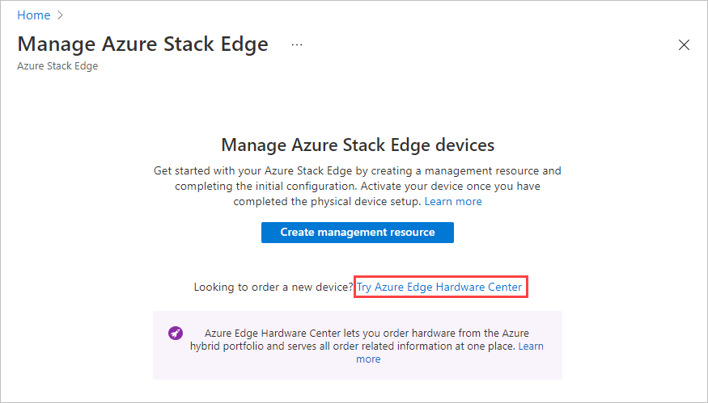
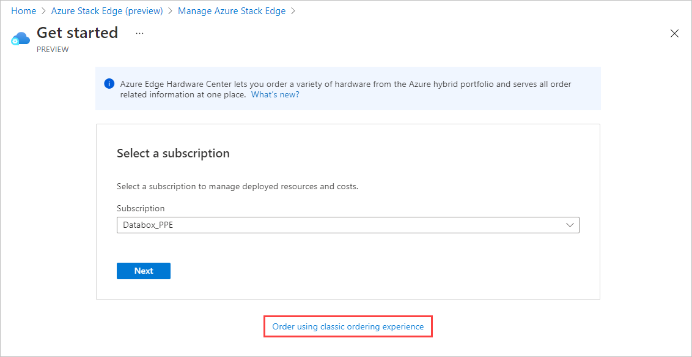
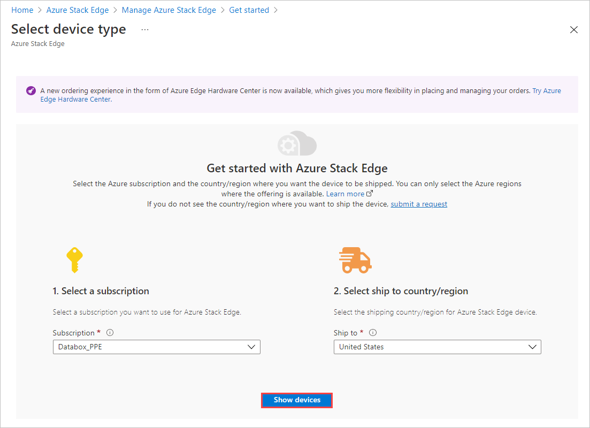
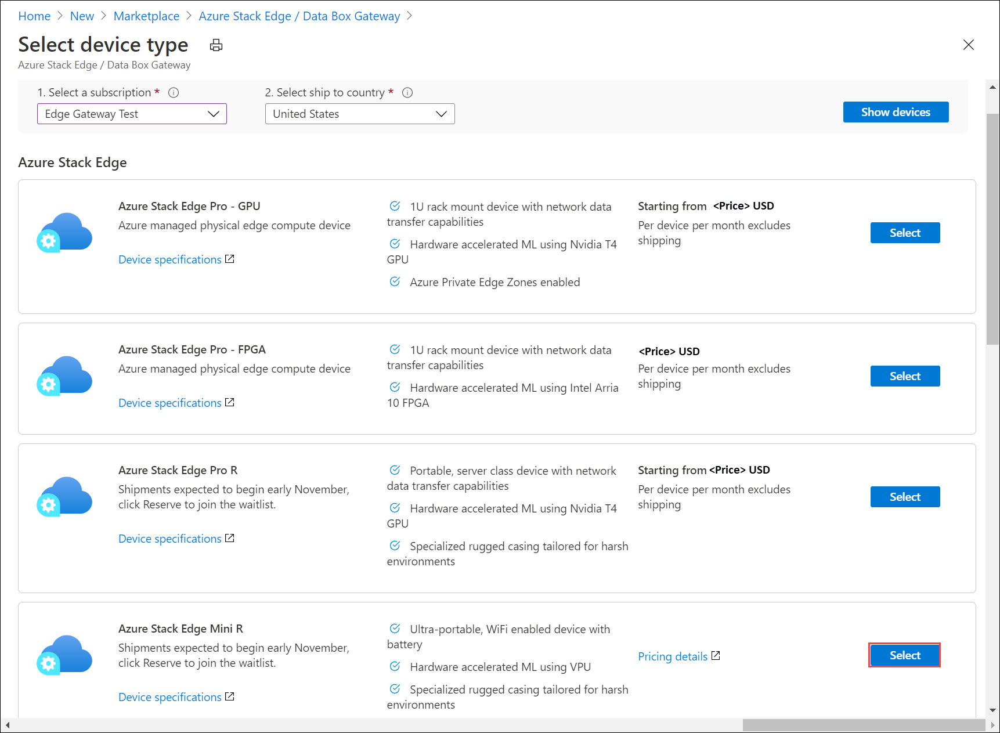
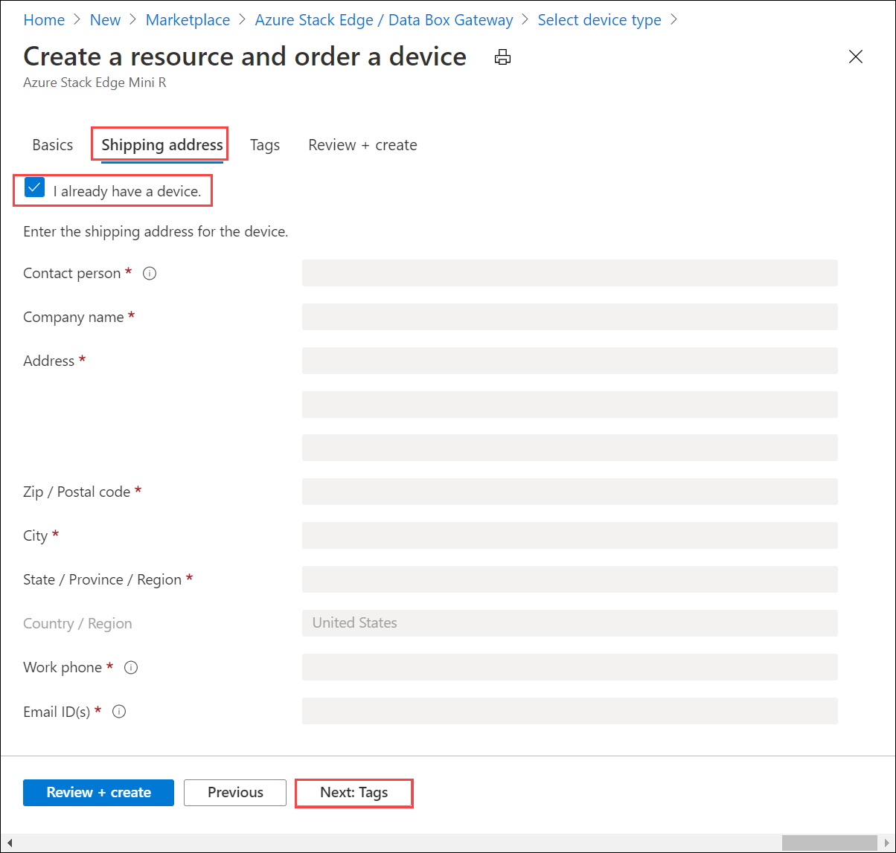
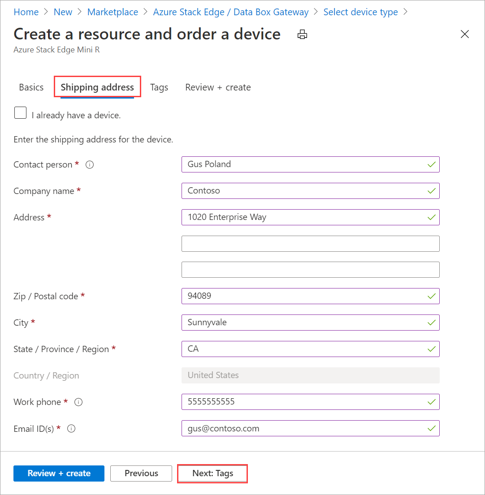
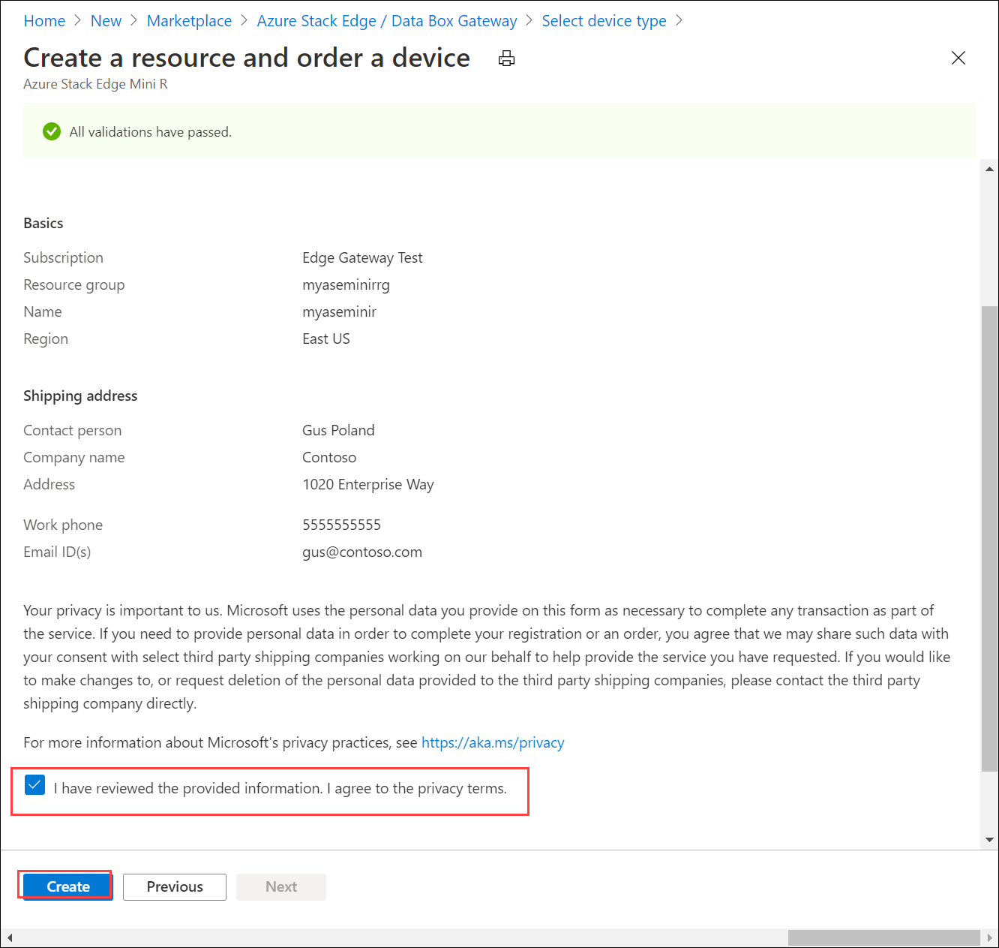
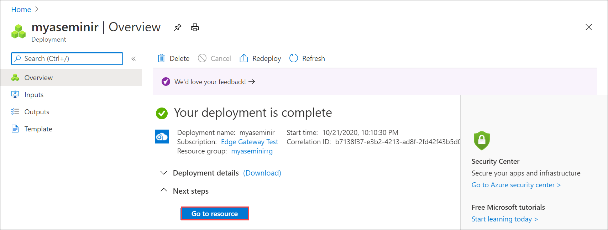

# Tutorial: Prepare to deploy Azure Stack Edge Mini R

This tutorial is the first in the series of deployment tutorials that are required to completely deploy an Azure Stack Edge Mini R device. This tutorial describes how to prepare the Azure portal to deploy an Azure Stack Edge resource.

You need administrator privileges to complete the setup and configuration process. The portal preparation takes less than 10 minutes.

In this tutorial, you learn how to:

> [!div class="checklist"]
> * Create a new resource
> * Get the activation key

### Get started

To deploy Azure Stack Edge Mini R, refer to the following tutorials in the prescribed sequence.

| Step | Description |
| --- | --- |
| **Preparation** |These steps must be completed in preparation for the upcoming deployment. |
| **[Deployment configuration checklist](#deployment-configuration-checklist)** |Use this checklist to gather and record information before and during the deployment. |
| **[Deployment prerequisites](#prerequisites)** |These prerequisites validate that the environment is ready for deployment. |
|  | |
|**Deployment tutorials** |These tutorials are required to deploy your Azure Stack Edge Mini R device in production. |
|**[1. Prepare the Azure portal for device](azure-stack-edge-mini-r-deploy-prep.md)** |Create and configure your Azure Stack Edge resource before you install the physical device. |
|**[2. Install the device](azure-stack-edge-mini-r-deploy-install.md)**|Inspect and cable your physical device.  |
|**[3. Connect to the device](azure-stack-edge-mini-r-deploy-connect.md)** |Once the device is installed, connect to device local web UI.  |
|**[4. Configure network settings](azure-stack-edge-mini-r-deploy-configure-network-compute-web-proxy.md)** |Configure network including the compute network and web proxy settings for your device.   |
|**[5. Configure device settings](azure-stack-edge-mini-r-deploy-set-up-device-update-time.md)** |Assign a device name and DNS domain, configure update server and device time. |
|**[6. Configure security settings](azure-stack-edge-mini-r-deploy-configure-certificates-vpn-encryption.md)** |Configure certificates using your own certificates, set up VPN, and configure encryption-at-rest for your device.   |
|**[7. Activate the device](azure-stack-edge-mini-r-deploy-activate.md)** |Use the activation key from service to activate the device. The device is ready to set up SMB or NFS shares or connect via REST. |
|**[8. Configure compute](azure-stack-edge-gpu-deploy-configure-compute.md)** |Configure the compute role on your device. A Kubernetes cluster is also created. |

You can now begin to set up the Azure portal.

## Deployment configuration checklist

Before you deploy your device, you need to collect information to configure the software on your Azure Stack Edge Mini R device. Preparing some of this information ahead of time helps streamline the process of deploying the device in your environment. Use the [Azure Stack Edge Mini R deployment configuration checklist](azure-stack-edge-mini-r-deploy-checklist.md) to note down the configuration details as you deploy your device.

## Prerequisites

Following are the configuration prerequisites for your Azure Stack Edge resource, your Azure Stack Edge device, and the datacenter network.

### For the Azure Stack Edge resource

[!INCLUDE [Azure Stack Edge resource prerequisites](../../includes/azure-stack-edge-gateway-resource-prerequisites.md)]

### For the Azure Stack Edge device

Before you deploy a physical device, make sure that:

- You've reviewed the safety information for this device at [Safety guidelines for your Azure Stack Edge device](azure-stack-edge-mini-r-safety.md).
[!INCLUDE [Azure Stack Edge device prerequisites](../../includes/azure-stack-edge-gateway-device-prerequisites.md)] 

### For the datacenter network

Before you begin, make sure that:

- The network in your datacenter is configured per the networking requirements for your Azure Stack Edge device. For more information, see [Azure Stack Edge Mini R system requirements](azure-stack-edge-mini-r-system-requirements.md).

- For normal operating conditions of your Azure Stack Edge, you have:

    - A minimum of 10-Mbps download bandwidth to ensure the device stays updated.
    - A minimum of 20-Mbps dedicated upload and download bandwidth to transfer files.

## Create a new resource

If you have an existing Azure Stack Edge resource to manage your physical device, skip this step and go to [Get the activation key](#get-the-activation-key).

---

### [Azure Edge Hardware Center (Preview)](#tab/azure-edge-hardware-center)

Azure Edge Hardware Center (Preview) is a new service that lets you explore and order a variety of hardware from the Azure hybrid portfolio including Azure Stack Edge Pro devices.

When you place an order through the Azure Edge Hardware Center, you can order multiple devices, to be shipped to more than one address, and you can reuse ship to addresses from other orders.

Ordering through Azure Edge Hardware Center will create an Azure resource that will contain all your order-related information. One resource each will be created for each of the units ordered. You will have to create an Azure Stack Edge resource after you receive the device to activate and manage it.

[!INCLUDE [Create order in Azure Edge Hardware Center](../../includes/azure-edge-hardware-center-new-order.md)]

#### Create a management resource for each device

To manage devices that are ordered through the Azure Edge Hardware Center, you'll create a management resource for each device in Azure Stack Edge. When the device is activated, the management resource is associated with an order item. You'll be able to open the order item from the management resource and open the management resource from the order item. 

After a device is delivered, a **Configure hardware** link is added to the order item detail, giving you a direct way to open a wizard for creating a management resource. You can also use the **Create management resource** option in Azure Stack Edge.

[!INCLUDE [Create management resource](../../includes/azure-edge-hardware-center-create-management-resource.md)]

### [Portal (classic)](#tab/azure-portal)

To create an Azure Stack Edge resource, take the following steps in the Azure portal.

1. Use your Microsoft Azure credentials to sign in to the Azure portal at this URL: [https://portal.azure.com](https://portal.azure.com).

2. In **Azure services**, search for and select **Azure Stack Edge**. Then select **+ Create**. 

3. In **Manage Azure Stack Edge devices**, select the **Try Azure Hardware Center** link.

    

    This opens the **Get started** screen for creating an order in the Azure Edge Hardware Center. 

4. If you don't want to order through the Hardware Center, on the **Get started** screen, select **Order using classic ordering experience**.

   

5. Pick the subscription that you want to use for the Azure Stack Edge Pro device. Select the country to where you want to ship this physical device. Select **Show devices**.

    


6. Select device type. Under **Azure Stack Edge**, choose **Azure Stack Edge Mini R** and then choose **Select**. If you see any issues or are unable to select the device type, go to [Troubleshoot order issues](azure-stack-edge-troubleshoot-ordering.md).

    [](media/azure-stack-edge-mini-r-deploy-prep/create-resource-2.png)


7. On the **Basics** tab, enter or select the following **Project details**.
    
    |Setting  |Value  |
    |---------|---------|
    |Subscription    |The subscription is automatically populated based on the earlier selection. Subscription is linked to your billing account. |
    |Resource group  |Select an existing group or create a new group.<br>Learn more about [Azure Resource Groups](../azure-resource-manager/management/overview.md).     |


8. Enter or select the following **Instance details**.

    |Setting  |Value  |
    |---------|---------|
    |Name   | A friendly name to identify the resource.<br>The name has from 2 to 50 characters including letters, numbers, and hyphens.<br> Name starts and ends with a letter or a number.        |
    |Region     |For a list of all the regions where the Azure Stack Edge resource is available, see [Azure products available by region](https://azure.microsoft.com/global-infrastructure/services/?products=databox&regions=all). If using Azure Government, all the government regions are available as shown in the [Azure regions](https://azure.microsoft.com/global-infrastructure/regions/).<br> Choose a location closest to the geographical region where you want to deploy your device.|

    


9. Select **Next: Shipping address**.

   - If you already have a device, select the combo box for **I already have a device**.

     

   - If this is the new device that you are ordering, enter the contact name, company, address to ship the device to, and contact information.

     

10. Select **Next: Tags**. Optionally provide tags to categorize resources and consolidate billing. Select **Next: Review + create**.

11. On the **Review + create** tab, review the **Pricing details**, **Terms of use**, and the details for your resource. Select the combo box for **I have reviewed the privacy terms**.

    

    You're also notified that during resource creation, a Managed Service Identity (MSI) is enabled that lets you authenticate to cloud services. This identity exists for as long as the resource exists.

12. Select **Create**.

    The resource creation takes a few minutes. An MSI is also created that lets the Azure Stack Edge device communicate with the resource provider in Azure.
    
    After the resource is successfully created and deployed, you're notified. Select **Go to resource**.
    
    
    
After the order is placed, Microsoft reviews the order and reaches out to you (via email) with shipping details.

> [!NOTE]
> If you want to create multiple orders at one time or clone an existing order, you can use the [scripts in Azure Samples](https://github.com/Azure-Samples/azure-stack-edge-order). For more information, see the README file.

If you run into any issues during the order process, see [Troubleshoot order issues](azure-stack-edge-troubleshoot-ordering.md).

### [Azure CLI](#tab/azure-cli)

If necessary, prepare your environment for Azure CLI.

[!INCLUDE [azure-cli-prepare-your-environment-no-header.md](../../includes/azure-cli-prepare-your-environment-no-header.md)]

To create an Azure Stack Edge resource, run the following commands in Azure CLI.

1. Create a resource group by using the [az group create](/cli/azure/group#az_group_create) command, or use an existing resource group:

   ```azurecli
   az group create --name myasepgpu1 --location eastus
   ```

1. To create a device, use the [az databoxedge device create](/cli/azure/databoxedge/device#az_databoxedge_device_create) command:

   ```azurecli
   az databoxedge device create --resource-group myasepgpu1 \
      --device-name myasegpu1 --location eastus --sku EdgeMR_Mini
   ```

   Choose a location closest to the geographical region where you want to deploy your device. The region stores only the metadata for device management. The actual data can be stored in any storage account.

   For a list of all the regions where the Azure Stack Edge resource is available, see [Azure products available by region](https://azure.microsoft.com/global-infrastructure/services/?products=databox&regions=all). If using Azure Government, all the government regions are available as shown in the [Azure regions](https://azure.microsoft.com/global-infrastructure/regions/).

1. To create an order, run the [az databoxedge order create](/cli/azure/databoxedge/order#az_databoxedge_order_create) command:

   ```azurecli
   az databoxedge order create --resource-group myasepgpu1 \
      --device-name myasegpu1 --company-name "Contoso" \
      --address-line1 "1020 Enterprise Way" --city "Sunnyvale" \
      --state "California" --country "United States" --postal-code 94089 \
      --contact-person "Gus Poland" --email-list gus@contoso.com --phone 4085555555
   ```

The resource creation takes a few minutes. Run the [az databoxedge order show](/cli/azure/databoxedge/order#az_databoxedge_order_show) command to see the order:

```azurecli
az databoxedge order show --resource-group myasepgpu1 --device-name myasegpu1 
```

After you place an order, Microsoft reviews the order and contacts you by email with shipping details.

---

## Get the activation key

After the Azure Stack Edge resource is up and running, you'll need to get the activation key. This key is used to activate and connect your Azure Stack Edge Mini R device with the resource. You can get this key now while you are in the Azure portal.

1. Select the resource you created, and select **Overview**.

   

2. On the **Activate** tile, provide a name for the Azure Key Vault, or accept the default name. The key vault name can be between 3 and 24 characters. 

    A key vault is created for each Azure Stack Edge resource that is activated with your device. The key vault lets you store and access secrets. For example, the Channel Integrity Key (CIK) for the service is stored in the key vault.

    Once you've specified a key vault name, select **Generate activation key** to create an activation key.

    [](media/azure-stack-edge-mini-r-deploy-prep/azure-stack-edge-resource-3.png#lightbox)

    Wait a few minutes while the key vault and activation key are created. Select the copy icon to copy the key and save it for later use.

> [!IMPORTANT]
> - The activation key expires three days after it is generated.
> - If the key has expired, generate a new key. The older key is not valid.

## Next steps

In this tutorial, you learned about Azure Stack Edge topics such as:

> [!div class="checklist"]
> * Create a new resource
> * Get the activation key

Advance to the next tutorial to learn how to install Azure Stack Edge.

> [!div class="nextstepaction"]
> [Install Azure Stack Edge](./azure-stack-edge-mini-r-deploy-install.md)
