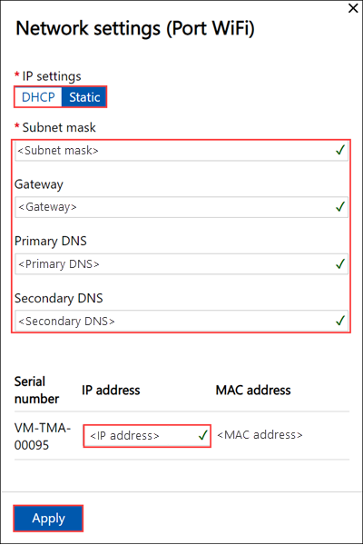

# Use the local web UI to manage wireless connectivity on your Azure Stack Edge Mini R

This article describes how to manage wireless network connectivity on your Azure Stack Edge Mini R device. You can use the local web UI on your Azure Stack Edge Mini R device via to add, connect to, and delete Wi-Fi profiles.

## About Wi-Fi

Your Azure Stack Edge Mini R device can operate both when wired to the network or via a wireless network. The device has a Wi-Fi port that must be enabled to allow the device to connect to a wireless network. 

Your device has five ports, PORT 1 through PORT 4 and a fifth Wi-Fi port. Here is a diagram of the back plane of a Mini R device when connected to a wireless network.


## Add, connect to Wi-Fi profile

Do the following steps in the local UI of your device to add and connect to a Wi-Fi profile.

1. Go to the **Get started** page in the local web UI of your device. On the **Network** tile, select **Configure**.  
    
    On your physical device, there are five network interfaces. PORT 1 and PORT 2 are 1-Gbps network interfaces. PORT 3 and PORT 4 are all 10-Gbps network interfaces. The fifth port is the Wi-Fi port. 

    [](./media/azure-stack-edge-mini-r-deploy-configure-network-compute-web-proxy/configure-wifi-1.png#lightbox)  
    
    Select the Wi-Fi port and configure the port settings. 
    
    > [!IMPORTANT]
    > We strongly recommend that you configure a static IP address for the Wi-Fi port.  

    

    The **Network** page updates after you apply the Wi-Fi port settings.

    

   
2. Select **Add Wi-Fi profile** and  upload your Wi-Fi profile. 

    
    
    A wireless network profile contains the SSID (network name), password key, and security information to be able to connect to a wireless network. You can get the Wi-Fi profile for your environment from your network administrator.

    For information about preparing your Wi-Fi profiles, see [Use Wi-Fi profiles with Azure Stack Edge Mini R devices](azure-stack-edge-mini-r-use-wifi-profiles.md).

    

    After the profile is added, the list of Wi-Fi profiles updates to reflect the new profile. The profile should show the **Connection status** as **Disconnected**. 

    
    
3. After the wireless network profile is successfully loaded, connect to this profile. Select **Connect to Wi-Fi profile**. 

    

4. Select the Wi-Fi profile that you added in the previous step and select **Apply**. 

    

    The **Connection status** should update to **Connected**. The signal strength updates to indicate the quality of the signal. 

    

    > [!NOTE]
    > To transfer large amounts of data, we recommend that you use a wired connection instead of the wireless network. 


## Download Wi-Fi profile

You can download a Wi-Fi profile that you are using for the wireless network connectivity.

1. In the local web UI of your device, go to **Configuration > Network**. 

2. Under Wi-Fi profile settings, select **Download profile**. This should download the Wi-Fi profile that you are currently using.


## Delete Wi-Fi profile

You can delete a Wi-Fi profile that you are using for the wireless network connectivity.


1. In the local web UI of your device, go to **Configuration > Network**. 

2. Under Wi-Fi profile settings, select **Delete Wi-Fi profile**.

3. In the **Delete Wi-Fi profile** blade, choose the profile you want to delete. Select **Apply**.


## Configure Cisco Wi-Fi profile

Here is some guidance for how to manage and configure a Cisco wireless controller and access point on your device. 

### DHCP Bridging Mode

To use a Cisco Wireless controller for your device, you must enable dynamic host configuration protocol (DHCP) bridging mode on the wireless LAN controller (WLC).

For more information, see [DHCP Bridging Mode](https://www.cisco.com/c/en/us/support/docs/wireless/4400-series-wireless-lan-controllers/110865-dhcp-wlc.html#anc9).

#### Bridging configuration example

To enable the DHCP bridging functionality on the controller, you must disable the DHCP proxy feature on the controller. To enable DHCP bridging using the command line:

```powershell
(Cisco Controller) > config dhcp proxy disable
(Cisco Controller) > show dhcp proxy
DHCP Proxy Behaviour: disabled
```

If the DHCP server does not exist on the same Layer 2 (L2) network as the client, then the broadcast should be forwarded to the DHCP server at the client gateway using an IP helper. This is a sample of this configuration:

```powershell
Switch#conf t
Switch(config)#interface vlan <client vlan #>
Switch(config-if)#ip helper-address <dhcp server IP>
```

The DHCP bridging feature is a global setting, so it affects all DHCP transactions within the controller. You need to add IP helper statements in the wired infrastructure for all necessary virtual local area networks (VLAN)s on the controller.

### Enable the passive client for WLAN

To enable the passive client feature for wireless local area network (WLAN) on a Cisco Wireless controller:

* The interface associated to the WLAN must have a VLAN tagging enabled.
* Multicast VLAN must be enabled for the WLAN.
* GARP forwarding must be enabled on the WLC.

For more information, see [Multicast VLAN Information About Multicast Optimization](https://www.cisco.com/c/en/us/td/docs/wireless/controller/8-5/config-guide/b_cg85/wlan_interfaces.html).

### Troubleshoot

If you encounter issues with IP address allocations on VMs running on an Azure Stack Edge Mini R device, the above configuration settings on your network environment should be validated.

## Next steps

- Learn how to [Deploy Azure Stack Edge Mini R device](azure-stack-edge-mini-r-deploy-prep.md).
