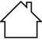

# Azure Stack Edge Mini R safety instructions

**READ SAFETY AND HEALTH INFORMATION**

Read all the safety information in this article before you use your Azure Stack Edge Mini R device, a composition of one battery pack, one AC/DC plugged power supply, one module power adapter, and one server module. Failure to follow instructions could result in fire, electric shock, injuries, or damage to your properties. Read all safety information below before using Azure Stack Edge Mini R.

## Safety icon conventions

The following signal words for hazard alerting signs are:

| Icon | Description |
|:--- |:--- |
| | **DANGER:** Indicates a hazardous situation that, if not avoided, will result in death or serious injury.   **WARNING:** Indicates a hazardous situation that, if not avoided, could result in death or serious injury.   **CAUTION:** Indicates a hazardous situation that, if not avoided, could result in minor or moderate injury.|
|

The following hazard icons are to be observed when setting up and running your Azure Stack Edge Mini R device:

| Icon | Description |
|:--- |:--- |
|  | Read All Instructions First |
|  | Hazard Symbol |
|  | Electric Shock Hazard |
|  | Indoor Use Only |
|  | No User Serviceable Parts. Do not access unless properly trained. |
|

## Handling precautions and site selection

The Azure Stack Edge Mini R device has the following handling precautions and site selection criteria:

 **CAUTION:**

* Inspect the *as-received* device for damages. If the device enclosure is damaged, [contact Microsoft Support](azure-stack-edge-placeholder.md) to obtain a replacement. Do not attempt to operate the device.
* If you suspect the device is malfunctioning, [contact Microsoft Support](azure-stack-edge-placeholder.md) to obtain a replacement. Do not attempt to service the device.
* The device contains no user-serviceable parts. Hazardous voltage, current, and energy levels are present inside. Do not open. Return the device to Microsoft for servicing.

 **CAUTION:**

It is recommended to operate the system:

* Away from sources of heat including direct sunlight and radiators.
* In locations not exposed to moisture or rain.
* Located in a space that minimizes vibration and physical shock.  The system is designed for shock and vibration according to MIL-STD-810G.
* Isolated from strong electromagnetic fields produced by electrical devices.
* Do not allow any liquid or any foreign object to enter the System. Do not place beverages or any other liquid containers on or near the system.

 **CAUTION:**

* This equipment contains a lithium battery. Do not attempt servicing the battery pack. Batteries in this equipment are not user serviceable. Risk of Explosion if battery is replaced by an incorrect type.

 **CAUTION:**

Only charge the battery pack when it is a part of the Azure Stack Edge Mini R device, do not charge as a separate device.

 **CAUTION:**

* The ON/OFF switch on the battery pack is for discharging the battery to the server module only. If the power adapter is plugged into the battery pack, power is passed to the server module even if the switch is in the OFF position.

 **CAUTION:**

* Do not burn or short circuit the battery pack. It must be recycled or disposed of properly.

 **CAUTION:**

* In lieu of using the provided AC/DC power supply, this system also has the option to use a field provided Type 2590 Battery. In this case, the end user shall verify that it meets all applicable safety, transportation, environmental, and any other national/local regulations.
* When operating the system with Type 2590 Battery, operate the battery within the conditions of use specified by the battery manufacturer.

 **CAUTION:**

This device has two SFP+ ports which may be used with optical transceivers. To avoid hazardous laser radiation, only use with Class 1 transceivers.

## Electrical precautions

The Azure Stack Edge Mini R device has the following electrical precautions:

  **WARNING:**

When used with the power supply adaptor:

* Provide a safe electrical earth connection to the power supply cord. The alternating current (AC) cord has a three-wire grounding plug (a plug that has a grounding pin). This plug fits only a grounded AC outlet. Do not defeat the purpose of the grounding pin.
* Given that the plug on the power supply cord is the main disconnect device, ensure that the socket outlets are located near the device and are easily accessible.
* Unplug the power cord(s) (by pulling the plug, not the cord) and disconnect all cables if any of the following conditions exist:

  * The power cord or plug becomes frayed or otherwise damaged.
  * The device is exposed to rain, excess moisture, or other liquids.
  * The device has been dropped and the device casing has been damaged.
  * You suspect the device needs service or repair.
* Permanently unplug the unit before you move it or if you think it has become damaged in any way.

* Provide a suitable power source with electrical overload protection to meet the following power specifications:

* Voltage: 100 - 240 Volts AC
* Current: 1.7 Amperes
* Frequency: 50 to 60 Hz

 **WARNING:**

* Do not attempt to modify or use AC power cord(s) other than the ones provided with the equipment.

 **WARNING:**

* Power supply labeled with this symbol are rated for indoor use only.

## Regulatory information

The following contains regulatory information for Azure Stack Edge Mini R device, regulatory model number: TMA01.

The Azure Stack Edge Mini R device is designed for use with NRTL Listed (UL, CSA, ETL, etc.), and IEC/EN 60950-1 or IEC/EN 62368-1 compliant (CE marked) Information Technology equipment.

In countries other than the USA and Canada, network cables (not provided with the equipment) shall not be installed with this equipment if their length is greater than 3 meters.

The equipment is designed to operate in the following environments:

| Environment | Specifications |
|:---  |:--- |
| System temperature specifications | <ul><li>Storage temperature: –20&deg;C–50&deg;C (–4&deg;F-122&deg;F)</li><li>Continuous operation: 0&deg;C–40&deg;C (32&deg;F–104&deg;F)</li></ul> |
| Relative humidity (RH) specifications | <ul><li>Storage: 5% to 95% relative humidity</li><li>Operating: 10% to 90% relative humidity</li></ul>|
| Maximum altitude specifications | <ul><li>Operating: 15,000 feet (4,572 meters)</li><li>Non-operating: 40,000 feet (12,192 meters)</li></ul>|

>  **NOTICE:** &nbsp;Changes or modifications made to the equipment not expressly approved by Microsoft may void the user's authority to operate the equipment.

CANADA and USA:

NOTICE: This equipment has been tested and found to comply with the limits for a Class A digital device, pursuant to part 15 of the FCC Rules. These limits are designed to provide reasonable protection against harmful interference when the equipment is operated in a commercial environment. This equipment generates, uses, and can radiate radio frequency energy and, if not installed and used in accordance with the instruction manual, may cause harmful interference to radio communications. Operation of this equipment in a residential area is likely to cause harmful interference in which case the user will be required to correct the interference at their own expense.

This device complies with part 15 of the FCC Rules and Industry Canada license-exempt RSS standard(s). Operation is subject to the following two conditions: (1) this device may not cause harmful interference, and (2) this device must accept any interference received, including interference that may cause undesired operation of the device.

CAN ICES-3(A)/NMB-3(A)
Microsoft Corporation, One Microsoft Way, Redmond, WA 98052, USA.
United States: (800) 426-9400
Canada: (800) 933-4750

EUROPEAN UNION:
Request a copy of the EU Declaration of Conformity.

> 
> This is a class A product. In a domestic environment, this product may cause radio interference in which case the user may be required to take adequate measures.

Disposal of waste batteries and electrical and electronic equipment:

This symbol on the product or its batteries or its packaging means that this product and any batteries it contains must not be disposed of with your household waste. Instead, it is your responsibility to hand this over to an applicable collection point for the recycling of batteries and electrical and electronic equipment. This separate collection and recycling will help to conserve natural resources and prevent potential negative consequences for human health and the environment due to the possible presence of hazardous substances in batteries and electrical and electronic equipment, which could be caused by inappropriate disposal. For more information about where to drop off your batteries and electrical and electronic waste, please contact your local city/municipality office, your household waste disposal service, or the shop where you purchased this product. Contact erecycle@microsoft.com for additional information on WEEE.

This product contains coin cell battery(ies).
Microsoft Ireland Sandyford Ind Est Dublin D18 KX32 IRL
Telephone number: +353 1 295 3826
Fax number: +353 1 706 4110

## Next steps

- [Prepare to deploy Azure Stack Edge Mini R](azure-stack-edge-placeholder.md)
