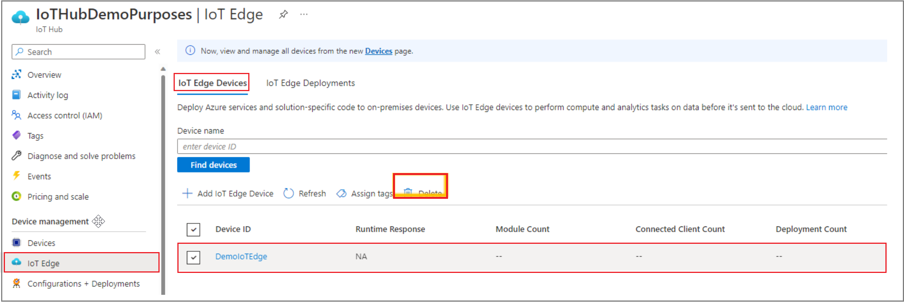

# Move workloads from managed IoT Edge on Azure Stack Edge to an IoT Edge solution on a Linux VM

[!INCLUDE [applies-to-GPU-and-pro-r-and-mini-r-skus](../../includes/azure-stack-edge-applies-to-gpu-pro-r-mini-r-sku.md)]

This article provides steps to move your managed IoT Edge workloads to IoT Edge running on a Linux VM on Azure Stack Edge. This article will use IoT Edge on an Ubuntu VM as an example. You can use other [supported Linux distributions](../iot-edge/support.md#linux-containers). 

> [!NOTE]
> We recommend that you deploy the latest IoT Edge version in a Linux VM to run IoT Edge workloads on Azure Stack Edge. For more information about earlier versions of IoT Edge, see [IoT Edge v1.1 EoL: What does that mean for me?](https://techcommunity.microsoft.com/t5/internet-of-things-blog/iot-edge-v1-1-eol-what-does-that-mean-for-me/ba-p/3662137). 

## Workflow to deploy onto an IoT Edge VM

The high-level workflow is as follows:

1. Deploy a Linux VM and install IoT Edge runtime on it using symmetric keys.

1. Connect the newly deployed IoT Edge runtime to the newly created IoT Edge device from the previous step.

1. From IoT Hub, redeploy IoT Edge modules onto the new IoT Edge device. 

1. Once your solution is running on IoT Edge on a Linux VM, you can remove the modules running on the native or managed IoT Edge on Azure Stack Edge. From IoT Hub, delete the IoT Edge device to remove the modules running on Azure Stack Edge. 

1. Optional: If you aren't using the Kubernetes cluster on Azure Stack Edge, you can delete the whole Kubernetes cluster.  

1. Optional: If you have leaf IoT devices communicating with IoT Edge on Kubernetes, this step documents how to make changes to communicate with the IoT Edge on a VM. 

## Step 1: Create an IoT Edge device on Linux using symmetric keys

Create and provision an IoT Edge device on Linux using symmetric keys. For detailed steps, see [Create and provision an IoT Edge device on Linux using symmetric keys](../iot-edge/how-to-provision-single-device-linux-symmetric.md).

## Step 2: Install and provision an IoT Edge on a Linux VM

Follow the steps at [Deploy IoT Edge on an Ubuntu VM on Azure Stack Edge](azure-stack-edge-gpu-deploy-iot-edge-linux-vm.md). For other supported Linux distributions, see [Linux containers](../iot-edge/support.md).

## Step 3: Deploy Azure IoT Edge modules from the Azure portal

Deploy Azure IoT modules to the new IoT Edge. For detailed steps, see [Deploy Azure IoT Edge modules from the Azure portal](../iot-edge/how-to-deploy-modules-portal.md). 

 With the latest IoT Edge version, you can deploy your IoT Edge modules at scale. For more information, see [Deploy IoT Edge modules at scale using the Azure portal](../iot-edge/how-to-deploy-at-scale.md). 

## Step 4: Remove Azure IoT Edge modules

Once your modules are successfully running on the new IoT Edge instance running on a VM, you can delete the whole IoT Edge device associated with that IoT Edge instance. From IoT Hub on the Azure portal, delete the IoT Edge device connected to the IoT Edge, as shown below.

## Step 5: Optional: Remove the IoT Edge service

If you aren't using the Kubernetes cluster on Azure Stack Edge, use the following steps to [remove the IoT Edge service](azure-stack-edge-gpu-manage-compute.md#remove-iot-edge-service). This action will remove modules running on the IoT Edge device, the IoT Edge runtime, and the Kubernetes cluster that hosts the IoT Edge runtime.

From the Azure Stack Edge resource on Azure portal, under the Azure IoT Edge service, there's a **Remove** button to remove the Kubernetes cluster.

> [!IMPORTANT]
> Once the Kubernetes cluster is removed, there is no way to recover information from the Kubernetes cluster, whether it's IoT Edge-related or not.   

## Step 6: Optional: Configure an IoT Edge device as a transparent gateway

If your IoT Edge device on Azure Stack Edge was configured as a gateway for downstream IoT devices, you must configure the IoT Edge running on the Linux VM as a transparent gateway. For more information, see [Configure and IoT Edge device as a transparent gateway](../iot-edge/how-to-create-transparent-gateway.md).

For more information about configuring downstream IoT devices to connect to a newly deployed IoT Edge running on a Linux VM, see [Connect a downstream device to an Azure IoT Edge gateway](../iot-edge/how-to-connect-downstream-device.md).

## Next steps

[Deploy IoT Edge on an Ubuntu VM on Azure Stack Edge](azure-stack-edge-gpu-deploy-iot-edge-linux-vm.md)
