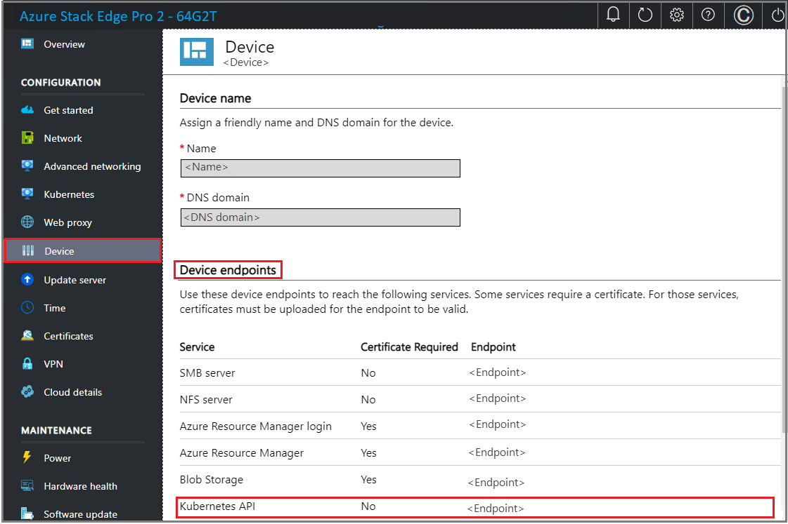
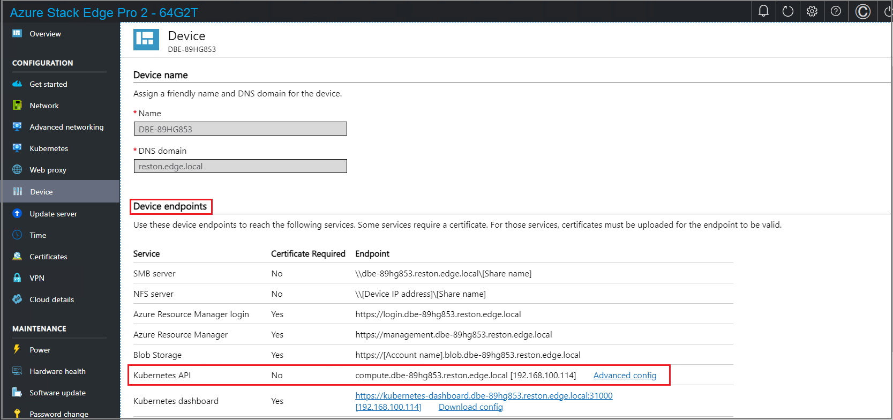
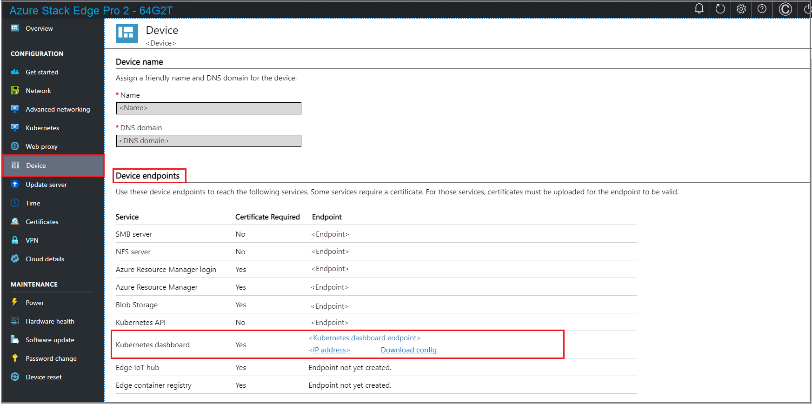

# Tutorial: Configure compute on Azure Stack Edge Pro 2

This tutorial describes how to configure a compute role and create a Kubernetes cluster on your Azure Stack Edge Pro 2 device. 

This procedure can take 20 to 30 minutes to complete.

[!INCLUDE [deprecation-notice-managed-iot-edge](../../includes/azure-stack-edge-deprecation-notice-managed-iot-edge.md)]

In this tutorial, you learn how to:

> [!div class="checklist"]
> * Configure compute
> * Get Kubernetes endpoints

[!INCLUDE [configure-compute](../../includes/azure-stack-edge-gateway-configure-compute.md)]

## Prerequisites

Before you set up a compute role on your Azure Stack Edge Pro device, make sure that:

- You've activated your Azure Stack Edge Pro 2 device as described in [Activate Azure Stack Edge Pro 2](azure-stack-edge-pro-2-deploy-activate.md).
- Make sure that you've followed the instructions in [Enable compute network](azure-stack-edge-gpu-deploy-configure-network-compute-web-proxy.md#configure-virtual-switches) and:
    - Enabled a network interface for compute.
    - Assigned Kubernetes node IPs and Kubernetes external service IPs.

    > [!NOTE]
    > If your datacenter firewall is restricting or filtering traffic based on source IPs or MAC addresses, make sure that the compute IPs (Kubernetes node IPs) and MAC addresses are on the allowed list. The MAC addresses can be specified by running the `Set-HcsMacAddressPool` cmdlet on the PowerShell interface of the device.

## Configure compute

[!INCLUDE [configure-compute](../../includes/azure-stack-edge-gateway-configure-compute.md)]

## Get Kubernetes endpoints

To configure a client to access Kubernetes cluster, you will need the Kubernetes endpoint. Follow these steps to get Kubernetes API endpoint from the local UI of your Azure Stack Edge device.

1. In the local web UI of your device, go to **Devices** page.
2. Under the **Device endpoints**, copy the **Kubernetes API service** endpoint. This endpoint is a string in the following format: `https://compute.<device-name>.<DNS-domain>[Kubernetes-cluster-IP-address]`. 

    

3. Save the endpoint string. You will use this endpoint string later when configuring a client to access the Kubernetes cluster via kubectl.

4. While you are in the local web UI, you can:

    - Go to Kubernetes API, select **advanced settings**, and download an advanced configuration file for Kubernetes. 

        

        If you have been provided a key from Microsoft (select users may have a key), then you can use this config file.

        

    - You can also go to **Kubernetes dashboard** endpoint and download an `aseuser` config file. 
    
        

        You can use this config file to sign into the Kubernetes dashboard or debug any issues in your Kubernetes cluster. For more information, see [Access Kubernetes dashboard](azure-stack-edge-gpu-monitor-kubernetes-dashboard.md#access-dashboard). 

## Next steps

In this tutorial, you learned how to:

> [!div class="checklist"]
> * Configure compute
> * Get Kubernetes endpoints

To learn how to administer your Azure Stack Edge Pro 2 device, see:

> [!div class="nextstepaction"]
> [Use local web UI to administer an Azure Stack Edge Pro 2](azure-stack-edge-manage-access-power-connectivity-mode.md)
