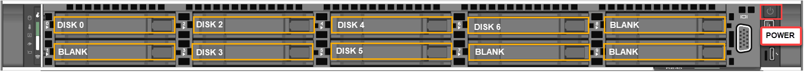

# Tutorial: Install Azure Stack Edge Pro 2

This tutorial describes how to install an Azure Stack Edge Pro 2 physical device. The installation procedure involves unpacking, rack mounting, and cabling the device. 

The installation can take around two hours to complete.

In this tutorial, you learn how to:

> [!div class="checklist"]
> * Unpack the device
> * Rack mount the device
> * Cable the device

## Prerequisites

The prerequisites for installing a physical device as follows:

### For the Azure Stack Edge resource

Before you begin, make sure that:

* You've completed all the steps in [Prepare to deploy Azure Stack Edge Pro 2](azure-stack-edge-pro-2-deploy-prep.md).
    * You've created an Azure Stack Edge resource to deploy your device.
    * You've generated the activation key to activate your device with the Azure Stack Edge resource.

 
### For the Azure Stack Edge Pro 2 physical device

Before you deploy a device:

- Make sure that the device rests safely on a flat, stable, and level work surface.
- Verify that the site where you intend to set up has:
    - Standard AC power from an independent source.

        -OR-
    - A power distribution unit (PDU) with an uninterruptible power supply (UPS).
    - An available 1U slot on the rack on which you intend to mount the device.

### For the network in the datacenter

Before you begin:

- Review the networking requirements for deploying Azure Stack Edge Pro, and configure the datacenter network per the requirements. For more information, see [Azure Stack Edge Pro 2 networking requirements](azure-stack-edge-system-requirements.md#networking-port-requirements).

- Make sure that the minimum Internet bandwidth is 20 Mbps for optimal functioning of the device.

## Unpack the device

This device is shipped in a single box. Complete the following steps to unpack your device. 

1. Place the box on a flat, level surface.
2. Inspect the box and the packaging foam for crushes, cuts, water damage, or any other obvious damage. If the box or packaging is severely damaged, don't open it. Contact Microsoft Support to help you assess whether the device is in good working order.
3. Unpack the box. After unpacking the box, make sure that you have:
    - One single enclosure Azure Stack Edge Pro 2 device
    - One power cord
    - One packaged bezel
    - One packaged mounting accessory which could be:
        - A 4-post rack slide rail, or
        - A 2-post rack slide, or 
        - A wall mount.
    - A safety, environmental, and regulatory information booklet

If you didn't receive all of the items listed here, [Contact Microsoft Support](azure-stack-edge-contact-microsoft-support.md). The next step is to rack mount your device.

## Rack mount the device

### Install the bezel

After the device is mounted on a rack, install the bezel on the device. Bezel serves as the protective face plate for the device.

1. Locate two fixed pins on the right side of the bezel, and two spring-loaded pins on the left side of the bezel. 
2. Insert the bezel in at an angle with fixed pins going into holes in right rack ear.
3. Push `[>` shaped latch to the right, move left side of bezel into place, then release the latch until the spring pins engage with holes in left rack ear. 

    

4. Lock the bezel in place using the provided security key. 

    

## Cable the device

Route the cables and then cable your device. The following procedures explain how to cable your Azure Stack Edge Pro 2 device for power and network.

Before you start cabling your device, you need the following things:

- Your Azure Stack Edge Pro 2 physical device, unpacked, and rack mounted.
- One power cable.
- At least one 1-GbE RJ-45 network cable to connect to the PORT 1. There are two 10-GbE network interfaces, one used for initial configuration and one for data, on the device. These network interfaces can also act as 10-GbE interfaces.
- One 100-GbE QSFP28 passive direct attached cable (tested in-house) for each data network interface PORT 3 and PORT 4 to be configured. At least one data network interface from among PORT 2, PORT 3, and PORT 4 needs to be connected to the Internet (with connectivity to Azure). Here is an example QSFP28 DAC connector: 

    

    For a full list of supported cables, modules, and switches, see [Connect-X6 DX adapter card compatible firmware](https://docs.nvidia.com/networking/display/ConnectX6DxFirmwarev22271016/Firmware+Compatible+Products). 
- Access to one power distribution unit.
- At least one 100-GbE network switch to connect a 1-GbE or a 100-GbE network interface to the Internet for data. 

> [!NOTE]
> - If you are connecting only one data network interface, we recommend that you use a 100-GbE network interface such as PORT 3 or PORT 4 to send data to Azure. 
> - For best performance and to handle large volumes of data, consider connecting all the data ports.
> - The Azure Stack Edge Pro 2 device should be connected to the datacenter network so that it can ingest data from data source servers.

On your Azure Stack Edge Pro 2 device:

- The front panel has disk drives and a power button.

    - There are six disk slots in the front of your device.
    - Slot 0 – Slot 3 contain data disks. Slots 4 and 5 are empty.

    

- The back plane has four network interfaces:

    - Two 1-Gbps interfaces, PORT 1 and PORT 2, that can also serve as 10-Gbps interfaces.
    - Two 100-Gbps interfaces, PORT 3 and PORT 4.
    - A baseboard management controller (BMC).

    

- The back plane has one network card corresponding to two high-speed ports and two built-in 10/1-GbE ports:

    - **Intel Ethernet X722 network adapter** - PORT 1, PORT 2.
    - **Mellanox dual port 100 GbE ConnectX-6 Dx network adapter** - PORT 3, PORT 4.

<!--For a full list of supported cables, switches, and transceivers for these network adapter cards, see:

- GET THESE URLs.
- GET THESE URLs. -->

 
Take the following steps to cable your device for power and network.

1. Identify the various ports on the back plane of your device. 
1. Locate the disk slots and the power button on the front of the device.
1. Connect the power cord to the PSU in the enclosure. 
1. Attach the power cord to the power distribution unit (PDU). 
1. Press the power button to turn on the device.
1. Connect the 10/1-GbE network interface PORT 1 to the computer that's used to configure the physical device. PORT 1 serves as the management interface for the initial configuration of the device.
    
    > [!NOTE]
    > If connecting the computer directly to your device (without going through a switch), use a crossover cable or a USB Ethernet adapter.

1. Connect one or more of PORT 2, PORT 3, PORT 4 to the datacenter network/internet.

    - If connecting PORT 2, use the 1-GbE RJ-45 network cable.
    - For the 100-GbE network interfaces, use the QSFP28 passive direct attached cable (tested in-house).
    
    The back plane of a cabled device would be as follows: 

    
    <!-- How should we change this ASE Pro2 -- For Network Function Manager deployments, make sure that PORT 5 and PORT 6 are connected. For more information, see [Tutorial: Deploy network functions on Azure Stack Edge (Preview)](../network-function-manager/deploy-functions.md).-->

## Next steps

In this tutorial, you learned how to:

> [!div class="checklist"]
> * Unpack the device
> * Rack the device
> * Cable the device

Advance to the next tutorial to learn how to connect to your device.

> [!div class="nextstepaction"]
> [Connect Azure Stack Edge Pro](./azure-stack-edge-pro-2-deploy-connect.md)

