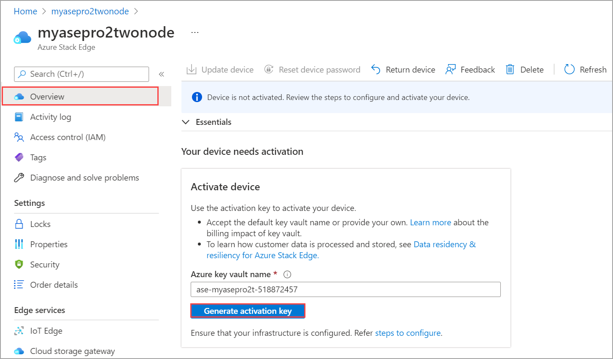

# Tutorial: Prepare to deploy Azure Stack Edge Pro 2 

This tutorial is the first in the series of deployment tutorials that are required to completely deploy Azure Stack Edge Pro 2. This tutorial describes how to prepare the Azure portal to deploy an Azure Stack Edge resource.

You need administrator privileges to complete the setup and configuration process. The portal preparation takes less than 20 minutes.

In this tutorial, you learn how to:

> [!div class="checklist"]
> * Create a new resource
> * Get the activation key

### Get started

For Azure Stack Edge Pro 2 deployment, you need to first prepare your environment. Once the environment is ready, follow the required steps and if needed, optional steps and procedures to fully deploy the device. The step-by-step deployment instructions indicate when you should perform each of these required and optional steps.

| Step | Description |
| --- | --- |
| **Preparation** |These steps must be completed in preparation for the upcoming deployment. |
| **[Deployment configuration checklist](#deployment-configuration-checklist)** |Use this checklist to gather and record information before and during the deployment. |
| **[Deployment prerequisites](#prerequisites)** |These prerequisites validate that the environment is ready for deployment. |
|  | |
|**Deployment tutorials** |These tutorials are required to deploy your Azure Stack Edge Pro 2 device in production. |
|**[1. Prepare the Azure portal for Azure Stack Edge Pro 2](azure-stack-edge-pro-2-deploy-prep.md)** |Create and configure your Azure Stack Edge resource before you install an Azure Stack Box Edge physical device. |
|**[2. Install Azure Stack Edge Pro 2](azure-stack-edge-pro-2-deploy-install.md)**|Unpack, rack, and cable the Azure Stack Edge Pro 2 physical device.  |
|**[3. Connect to Azure Stack Edge Pro 2](azure-stack-edge-pro-2-deploy-connect.md)** |Once the device is installed, connect to its local web UI.  |
|**[4. Configure network settings for Azure Stack Edge Pro 2](azure-stack-edge-pro-2-deploy-configure-network-compute-web-proxy.md)** |Configure network including the compute network and web proxy settings for your device.   |
|**[5. Configure device settings for Azure Stack Edge Pro 2](azure-stack-edge-pro-2-deploy-set-up-device-update-time.md)** |Assign a device name and DNS domain, configure update server and device time. |
|**[6. Configure security settings for Azure Stack Edge Pro 2](azure-stack-edge-pro-r-security.md)** |Configure certificates for your device. Use device-generated certificates or bring your own certificates.   |
|**[7. Activate Azure Stack Edge Pro 2](azure-stack-edge-pro-2-deploy-activate.md)** |Use the activation key from service to activate the device. The device is ready to set up SMB or NFS shares or connect via REST. |
|**[8. Configure compute](azure-stack-edge-pro-2-deploy-configure-compute.md)** |Configure the compute role on your device. A Kubernetes cluster is also created. |
|**[9A. Transfer data with Edge shares](./azure-stack-edge-gpu-deploy-add-shares.md)** |Add shares and connect to shares via SMB or NFS. |
|**[9B. Transfer data with Edge storage accounts](./azure-stack-edge-gpu-deploy-add-storage-accounts.md)** |Add storage accounts and connect to blob storage via REST APIs. |

You can now begin to gather information regarding the software configuration for your Azure Stack Edge Pro 2 device.

## Deployment configuration checklist

Before you deploy your device, you need to collect information to configure the software on your Azure Stack Edge Pro 2 device. Preparing some of this information ahead of time helps streamline the process of deploying the device in your environment. Use the [Azure Stack Edge Pro 2 deployment configuration checklist](azure-stack-edge-pro-2-deploy-checklist.md) to note down the configuration details as you deploy your device.

## Prerequisites

Following are the configuration prerequisites for your Azure Stack Edge resource, your Azure Stack Edge Pro 2 device, and the datacenter network.

### For the Azure Stack Edge resource

[!INCLUDE [Azure Stack Edge resource prerequisites](../../includes/azure-stack-edge-gateway-resource-prerequisites.md)]

### For the Azure Stack Edge Pro 2 device

Before you begin, make sure that:

- You've reviewed the safety information for this device at: [Safety guidelines for your Azure Stack Edge device](azure-stack-edge-pro-2-safety.md).
- You have a 2U slot available in a standard 19" rack in your datacenter if you plan to mount the device on a rack. 
- You have access to a flat, stable, and level work surface where the device can rest safely.
- The site where you intend to set up the device has standard AC power from an independent source or a rack power distribution unit (PDU) with an uninterruptible power supply (UPS).
- You have access to a physical device.

### For the datacenter network

Before you begin, make sure that:

- The network in your datacenter is configured per the networking requirements for your Azure Stack device. For more information, see [Azure Stack Edge Pro 2 System Requirements](azure-stack-edge-pro-2-system-requirements.md).

- For normal operating conditions of your Azure Stack Edge, you have:

    - A minimum of 10-Mbps download bandwidth to ensure the device stays updated.
    - A minimum of 20-Mbps dedicated upload and download bandwidth to transfer files.
    - A minimum of 100-Mbps is required for the internet connection on AP5GC networks.

## Create a new resource

If you have an existing Azure Stack Edge resource to manage your physical device, skip this step and go to [Get the activation key](#get-the-activation-key).

### Create an order 

You can use the Azure Edge Hardware Center to explore and order various hardware from the Azure hybrid portfolio including Azure Stack Edge Pro 2 devices.

When you place an order through the Azure Edge Hardware Center, you can order multiple devices, to be shipped to more than one address, and you can reuse ship to addresses from other orders.

Ordering through Azure Edge Hardware Center will create an Azure resource that will contain all your order-related information. One resource each will be created for each of the units ordered. You’ll have to create an Azure Stack Edge resource after you receive the device to activate and manage it.

[!INCLUDE [Create order in Azure Edge Hardware Center](../../includes/azure-edge-hardware-center-new-order.md)]

#### Create a management resource for each device

[!INCLUDE [Create management resource](../../includes/azure-edge-hardware-center-create-management-resource.md)]

## Get the activation key

After the Azure Stack Edge resource is up and running, you'll need to get the activation key. This key is used to activate and connect your Azure Stack Edge Pro 2 device with the resource. You can get this key now while you are in the Azure portal.

1. Select the resource you created, and select **Overview**.

2. In the right pane, enter a name for the Azure Key Vault or accept the default name. The key vault name can be between 3 and 24 characters.

   A key vault is created for each Azure Stack Edge resource that is activated with your device. The key vault lets you store and access secrets, for example, the Channel Integrity Key (CIK) for the service is stored in the key vault. 

   Once you've specified a key vault name, select **Generate key** to create an activation key. 

   

   Wait a few minutes while the key vault and activation key are created. Select the copy icon to copy the key and save it for later use.

> [!IMPORTANT]
> - The activation key expires three days after it is generated.
> - If the key has expired, generate a new key. The older key is not valid.

## Next steps

In this tutorial, you learned about Azure Stack Edge Pro 2 articles such as:

> [!div class="checklist"]
> * Create a new resource
> * Get the activation key

Advance to the next tutorial to learn how to install Azure Stack Edge Pro 2.

> [!div class="nextstepaction"]
> [Install Azure Stack Edge Pro 2](./azure-stack-edge-pro-2-deploy-install.md)
