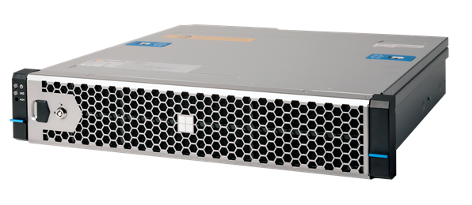

# What is Azure Stack Edge Pro 2?

Azure Stack Edge Pro 2 is a new generation of an AI-enabled edge computing device offered as a service from Microsoft. This article provides you an overview of the Azure Stack Edge Pro 2 solution. The overview also details the benefits, key capabilities, and the scenarios where you can deploy this device.

The Azure Stack Edge Pro 2 offers the following benefits over its precursor, the Azure Stack Edge Pro series:

- This series offers multiple models that closely align with your compute, storage, and memory needs. Depending on the model you choose, the compute acceleration could be via one or two Graphical Processing Units (GPU) on the device. 
- This series has flexible form factors with multiple mounting options. These devices can be rack mounted, mounted on a wall, or even placed on a shelf in your office. 
- These devices have low acoustic emissions and meet the requirements for noise levels in an office environment.

## Use cases

The Pro 2 series is designed for deployment in edge locations such as retail, telecommunications, manufacturing, or even healthcare. Here are the various scenarios where Azure Stack Edge Pro 2 can be used for rapid Machine Learning (ML) inferencing at the edge and preprocessing data before sending it to Azure.

[!INCLUDE [azure-stack-edge-gateway-use-cases](../../includes/azure-stack-edge-gateway-use-cases.md)] 

## Key capabilities

Azure Stack Edge Pro 2 has the following capabilities:

|Capability |Description  |
|---------|---------|
|Accelerated AI inferencing| Enabled by the compute acceleration card. Depending on your compute needs, you may choose a model that comes with one, two or no Graphical Processing Units (GPUs).   For more information, see [Technical specifications for Azure Stack Edge Pro 2](azure-stack-edge-pro-2-technical-specifications-compliance.md).|
|Edge computing      |Supports VM and containerized workloads to allow analysis, processing, and filtering of data.  For information on VM workloads, see [VM overview on Azure Stack Edge](azure-stack-edge-gpu-virtual-machine-overview.md). For containerized workloads, see [Kubernetes overview on Azure Stack Edge](azure-stack-edge-gpu-kubernetes-overview.md)</li></ul> |
|Data access     | Direct data access from Azure Storage Blobs and Azure Files using cloud APIs for additional data processing in the cloud. Local cache on the device is used for fast access of most recently used files.|
|Cloud-managed     |Device and service are managed via the Azure portal.|
|Offline upload     | Disconnected mode supports offline upload scenarios.|
|Supported file transfer protocols      | Support for standard Server Message Block (SMB), Network File System (NFS), and Representational state transfer (REST) protocols for data ingestion.   For more information on supported versions, see [Azure Stack Edge Pro 2 system requirements](azure-stack-edge-placeholder.md).|
|Data refresh     | Ability to refresh local files with the latest from cloud.   For more information, see [Refresh a share on your Azure Stack Edge](azure-stack-edge-gpu-manage-shares.md#refresh-shares).|
|Double encryption    | Use self-encrypting drives to provide a layer of encryption. BitLocker support to locally encrypt data and secure data transfer to cloud over *https*. For more information, see [Configure encryption-at-rest](azure-stack-edge-pro-2-deploy-configure-certificates.md#configure-encryption-at-rest)|
|Bandwidth throttling| Throttle to limit bandwidth usage during peak hours.   For more information, see [Manage bandwidth schedules on your Azure Stack Edge](azure-stack-edge-gpu-manage-bandwidth-schedules.md).|
|Easy ordering| Bulk ordering and tracking of the device via Azure Edge Hardware Center.   For more information, see [Order a device via Azure Edge Hardware Center](azure-stack-edge-pro-2-deploy-prep.md#create-a-new-resource).|
|Specialized network functions|Use the Marketplace experience from Azure Network Function Manager to rapidly deploy network functions. The functions deployed on Azure Stack Edge include mobile packet core, SD-WAN edge, and VPN services.  For more information, see [What is Azure Network Function Manager? (Preview)](../network-function-manager/overview.md).|
|Scale out file server|The device is available as a single node or a two-node cluster. For more information, see [What is clustering on Azure Stack Edge devices? (Preview)](azure-stack-edge-gpu-clustering-overview.md).|

<!--|ExpressRoute | Added security through ExpressRoute. Use peering configuration where traffic from local devices to the cloud storage endpoints travels over the ExpressRoute. For more information, see [ExpressRoute overview](../expressroute/expressroute-introduction.md).|-->

## Components

The Azure Stack Edge Pro 2 solution consists of Azure Stack Edge resource, Azure Stack Edge Pro 2 physical device, and a local web UI.

* **Azure Stack Edge Pro 2 physical device** - A compact 2U device supplied by Microsoft that can be configured to send data to Azure.

    

    [!INCLUDE [azure-stack-edge-gateway-edge-hardware-center-overview](../../includes/azure-stack-edge-gateway-edge-hardware-center-overview.md)]    

    For more information, go to [Create an order for your Azure Stack Edge Pro 2 device](azure-stack-edge-gpu-deploy-prep.md#create-a-new-resource).
    
* **Azure Stack Edge resource** - A resource in the Azure portal that lets you manage an Azure Stack Edge Pro 2 device from a web interface that you can access from different geographical locations. Use the Azure Stack Edge resource to create and manage resources, view, and manage devices and alerts, and manage shares.  
   

* **Azure Stack Edge Pro 2 local web UI** - A browser-based local user interface on your Azure Stack Edge Pro 2 device primarily intended for the initial configuration of the device. Use the local web UI also to run diagnostics, shut down and restart the device, or view copy logs. 

    [!INCLUDE [azure-stack-edge-gateway-local-web-ui-languages](../../includes/azure-stack-edge-gateway-local-web-ui-languages.md)]
    
    For information about using the web-based UI, go to [Use the web-based UI to administer your Azure Stack Edge](azure-stack-edge-manage-access-power-connectivity-mode.md).

## Region availability

The Azure Stack Edge Pro 2 physical device, Azure resource, and target storage account to which you transfer data don’t all have to be in the same region.

- **Resource availability** - For this release, the resource is available in East US, West EU, and South East Asia regions.

- **Device availability** - You should be able to see Azure Stack Edge Pro 2 as one of the available SKUs when placing the order. 

    For a list of all the countries/regions where the Azure Stack Edge Pro 2 device is available, go to **Availability** section in the **Azure Stack Edge Pro** tab for [Azure Stack Edge Pro 2 pricing](https://azure.microsoft.com/pricing/details/azure-stack/edge/#azureStackEdgePro).
    
- **Destination Storage accounts** - The storage accounts that store the data are available in all Azure regions. The regions where the storage accounts store Azure Stack Edge Pro 2 data should be located close to where the device is located for optimum performance. A storage account located far from the device results in long latencies and slower performance.

Azure Stack Edge service is a non-regional service. For more information, see [Regions and Availability Zones in Azure](../availability-zones/az-overview.md). Azure Stack Edge service doesn’t have dependency on a specific Azure region, making it resilient to zone-wide outages and region-wide outages.

To understand how to choose a region for the Azure Stack Edge service, device, and data storage, see [Choosing a region for Azure Stack Edge](azure-stack-edge-gpu-regions.md).

[!INCLUDE [azure-stack-edge-use-case-parameters](../../includes/azure-stack-edge-use-case-parameters.md)]

## Billing and pricing 

These devices can be ordered via the Azure Edge Hardware center. These devices are billed as a monthly service through the Azure portal. For more information, see [Azure Stack Edge Pro 2 pricing](https://azure.microsoft.com/pricing/details/azure-stack/edge/#azureStackEdgePro).

## Next steps

- Review the [Azure Stack Edge Pro 2 system requirements](azure-stack-edge-pro-2-system-requirements.md).

- Understand the [Azure Stack Edge Pro 2 limits](azure-stack-edge-pro-2-limits.md).

- Deploy [Azure Stack Edge Pro 2](azure-stack-edge-pro-2-deploy-prep.md) in Azure portal.
