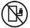
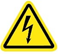
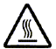
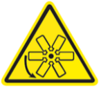
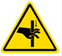
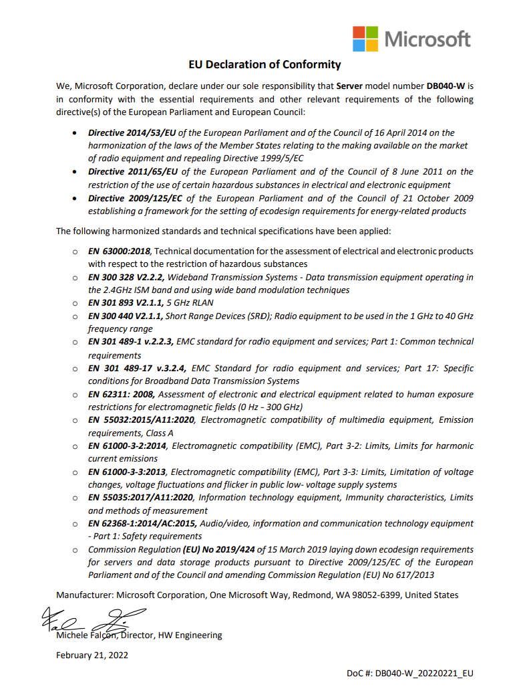
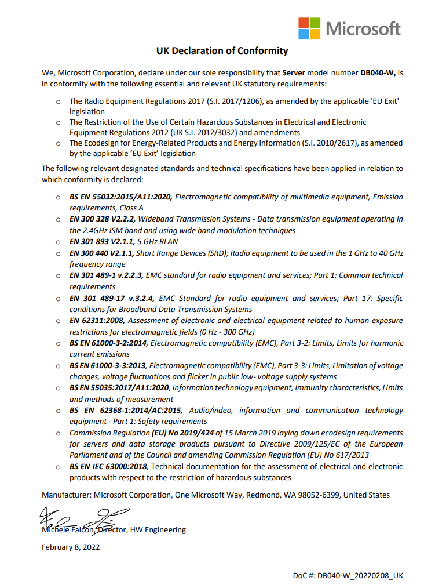

# Safety instructions for your Azure Stack Edge Pro 2

:::image type="icon" source="media/azure-stack-edge-pro-2-safety/icon-safety-warning.png" border="false"::: :::image type="icon" source="media/azure-stack-edge-pro-2-safety/icon-safety-read-all-instructions.png" border="false":::

To reduce the risk of bodily injury, electrical shock, fire, and equipment damage, read the following safety instructions and observe all warnings and precautions in this article before unpacking, installing, or maintaining this device.

[!INCLUDE [azure-stack-edge-gateway-safety-icon-conventions](../../includes/azure-stack-edge-gateway-safety-icon-conventions.md)]

### Installation and handling precautions

**DANGER:**
* Before you begin to unpack the equipment, to prevent hazardous situations resulting in death, serious injury and/or property damage, read, and follow all warnings and instructions.
* Inspect the as-received equipment for damages. If the equipment enclosure is damaged, [contact Microsoft Support](./index.yml) to obtain a replacement. Don’t attempt to operate the device.

**CAUTION:**
* If you suspect the device is malfunctioning, [contact Microsoft Support](./index.yml) to obtain a replacement. Don’t attempt to service the equipment. 
* Always wear the appropriate clothing to protect skin from sharp metal edges and avoid sliding any metal edges against skin. Always wear appropriate eye protection to avoid injury from objects that may become airborne.
* Laser peripherals or devices may be present. To avoid risk or radiation exposure and/or personal injury, don’t open the enclosure of any laser peripheral or device. Laser peripherals or devices aren’t serviceable. Only use certified and rated Laser Class I for optical transceiver products.

**WARNING:**
* When installing into an equipment rack, the rack must be anchored to an unmovable support to prevent it from tipping before the rack-mounted equipment is installed or extended from it. The equipment rack must be installed according to the rack manufacturer's instructions. 
* When using an equipment rack, the rack may tip over causing serious personal injury. Verify the equipment rack is anchored to the floor and/or bayed to its adjacent equipment racks before installing, extending, or removing equipment. Failure to do so could allow the rack system to tip over leading to death, injury, or damage. 
* When installed into an equipment rack, don’t extend more than one equipment (for example, storage or server) from the rack at one time to prevent the equipment rack from becoming dangerously unstable.

 **WARNING:**
* This equipment is not to be used as shelves or work spaces. Do not place objects on top of the equipment. Adding any type of load to a rack or wall mounted equipment can create a potential tip or crush hazard which could lead to injury, death, or product damage. 

**CAUTION:**
* Parts enclosed within panels containing this symbol  contain no user-serviceable parts. Hazardous voltage, current, and energy levels are present inside. Don’t open. Return to manufacturer for servicing.  Open a ticket with [Microsoft Support](./index.yml). 
* The equipment contains coin cell batteries. There’s a risk of explosion if the battery is replaced by an incorrect type. Dispose of used batteries according to the instructions.

**CAUTION:**
* If the equipment has been running, any installed component, processor(s), and heat sink(s) may be hot. Allow the equipment to cool before opening the cover to avoid the possibility of coming into contact with hot component(s). Ensure that you’re wearing proper personal protective equipment (PPE) with suitable thermal insulation when hot-swapping any components.

**CAUTION:**
* CAUTION: Avoid wearing loose clothing items, jewelry, or loose long hair when working near an actively spinning fan.

**WARNING:**
* The system is designed to operate in a controlled environment. Choose a site that is:
    * Indoors, not exposed to moisture or rain.
    * Well ventilated and away from sources of heat including direct sunlight and radiators.
    * Located in a space that minimizes vibration and physical shock. 
    * Isolated from strong electromagnetic fields produced by electrical devices.
    * Provided with properly grounded outlets.
    * Provided with sufficient space to access the power supply cord, because it serves as the product's main power disconnect.
* To reduce the risk of fire or electric shock, install the equipment/system in a temperature-controlled indoor area free of conductive contaminants. Don’t place the equipment near liquids or in an excessively humid environment.
* Don’t allow any liquid or any foreign object to enter the device. Don’t place beverages or any other liquid containers on or near the device.

**CAUTION:**
* Elevated operating ambient - If installed in a closed or multi-unit rack assembly, the operating ambient temperature of the rack environment may be greater than room ambient. Therefore, consideration should be given to installing the equipment in an environment compatible with the maximum ambient temperature (Tma is 45°C) specified by the manufacturer.
* Reduced air flow - Installation of the equipment in a rack should be such that the amount of air flow required for safe operation of the equipment isn’t compromised. Carefully route cables as directed to minimize airflow blockage and cooling problems.
* Don’t use equipment if rails require excessive force when sliding the inner drawer assembly.

**WARNING:**
* This equipment has only been certified for use with mounting accessories provided with the equipment. The use of any other mounting device that hasn’t been certified for use with this equipment may cause severe injuries.  
* When provided with the equipment, carefully follow all instructions provided with the Wall Mount Equipment Bracket or the Slide Rail Kits. Failure to install these accessories properly can cause severe injuries.
* The two and four post Slide Rail Kits are only compatible with the rack specifications in Electronic Industries Association (EIA) standard EIA-310-D. Choosing a rack that doesn’t comply with the EIA-310-D specifications can cause hazards that can lead to severe injuries.

**CAUTION:**
* Don’t place fingers on the bearing tracks during slide rails installation (read slide rails installation instructions). Sliding of rails over bearings can pose a risk of pinching.

### Electrical precautions
**WARNING:**
* Hazardous voltage, current, or energy levels are present inside this equipment and any component displaying this symbol: :::image type="content" source="media/azure-stack-edge-pro-2-safety/icon-safety-electric-shock-tiny.png" alt-text="Electric shock hazard description"::: 
Don’t service the equipment until all input power is removed, unless directed otherwise by the service instructions in an accompanying document for the component being serviced. To remove all input power, the equipment power cable must be disconnected from the AC electrical mains supply. Don’t remove cover or barrier on any component that contains this label: :::image type="content" source="media/azure-stack-edge-pro-2-safety/icon-safety-electric-shock-tiny.png" alt-text="Electric shock hazard description 2"::: 
Servicing should only be performed by qualified trained technicians.

**WARNING:**
* Don’t install equipment into a rack or on a wall while they’re energized with external cables.
* Ensure power cords aren’t crushed or damaged during installation.
* Provide a safe electrical earth connection to the power supply cord. The AC cord has a three-wire grounding plug (a plug that has a grounding contact). This plug fits only a grounded AC outlet. Don’t defeat the purpose of the grounding contact.
* Given that the plug on the power supply cord is the main disconnect device, ensure that the socket outlets are located near the equipment and are easily accessible.
* Unplug the power cord (by pulling the plug, not the cord) and disconnect all cables if any of the following conditions exist: 
    * The power cord or plug becomes frayed or otherwise damaged 
    * You spill something into the device casing
    * The device is exposed to rain, excess moisture, or other liquids. The device has been dropped and the device casing is damaged
    * You suspect the device needs service or repair
* Permanently unplug the unit before you move it or if you think it has become damaged in any way.
* Provide a suitable power source with electrical overload protection to meet the power specifications shown on the equipment rating label provided with the equipment.
* Don’t attempt to modify or use AC power cord(s) other than the ones provided with the equipment.

**WARNING:**
* To reduce the risk of electrical shock, injury from moving parts, damage, or loss of data, always make sure to disconnect the equipment from the AC electrical source when working inside the equipment. Powering down the system doesn’t ensure there’s no electrical activity inside the equipment.

### Electrostatic precautions

**NOTICE:**
* Electrostatic discharge (ESD) and ESD protection: ESD can damage drives, boards, and other parts. We recommend that you perform all procedures in this chapter only at an ESD work- station. If one isn’t available, provide some ESD protection by wearing an antistatic wrist strap attached to chassis ground any unpainted metal surface on the equipment when handling parts.
* ESD and handling boards: Always handle boards carefully. They can be extremely sensitive to electrostatic discharge (ESD). Hold boards only by their edges. After removing a board from its protective wrapper or from the equipment, place the board component side up on a grounded, static-free surface. Use a conductive foam pad if available but not the board wrapper. Don’t slide board over any surface.
* Wear a grounded wrist strap. If none are available, discharge any personal static electricity by touching the bare metal chassis of the server, or the bare metal body of any other grounded device.
* Humid environments tend to have less static electricity than dry environments. A grounding strap is warranted whenever danger of static electricity exists.

**NOTICE:**
* Leave all replacement components inside their static-proof packaging until you’re ready to use them.

## Regulatory information

Regulatory model numbers: DB040 and DB040-W

This equipment is designed for use with NRTL Listed (UL, CSA, ETL, etc.), and IEC/EN 60950-1 or IEC/EN 62368-1 compliant (CE marked) Information Technology equipment.

This equipment is designed to operate in the following environment:

* Temperature specifications
    * Storage: –40°C to 70°C (–40°F to 149°F)
    * Operating: 10°C to 45°C (50°F to 113°F)
* Relative humidity specifications
    * Storage: 5% to 95% relative humidity
    * Operating: 5% to 85% relative humidity
      * For models with GPU(s), derate allowable max operating temperature by 1°C/210m (2.6°F/1000ft) above 950m (3,117ft).
* Maximum altitude specifications
    * Operating: 3,050 meters (10,000 feet)
    * Storage: 9,150 meters (30,000 feet)

For electrical supply ratings, refer to the equipment rating label provided with the unit.

:::image type="icon" source="media/azure-stack-edge-pro-2-safety/icon-safety-notice.png" border="false":::NOTICE: Changes or modifications made to the equipment not expressly approved by Microsoft may void the user’s authority to operate the equipment.

### USA and Canada
Supplier’s Declaration of Conformity

Models: DB040, DB040-W

:::image type="icon" source="media/azure-stack-edge-pro-2-safety/icon-safety-notice.png" border="false":::NOTICE: This equipment has been tested and found to comply with the limits for a Class A digital device, pursuant to part 15 of the FCC Rules. These limits are designed to provide reasonable protection against harmful interference when the equipment is operated in a commercial environment. This equipment generates, uses, and can radiate radio frequency energy and, if not installed and used in accordance with the instruction manual, may cause harmful interference to radio communications. Operation of this equipment in a residential area is likely to cause harmful interference in which case the user will be required to correct the interference at their own expense.

This device complies with part 15 of the FCC Rules and Industry Canada license-exempt RSS standard(s). Operation is subject to the following two conditions: (1) this device may not cause harmful interference, and (2) this device must accept any interference received, including interference that may cause undesired operation of the device. 

Any changes or modifications not expressly approved by the party responsible for compliance could void the user's authority to operate this equipment. 

:::image type="content" source="media/azure-stack-edge-pro-2-safety/icon-french-instructions.png" alt-text="Canada instructions":::

CAN ICES-3(A)/NMB-3(A)

Microsoft Corporation, One Microsoft Way, Redmond, WA 98052, USA.

United States: (800) 426-9400

Canada: (800) 933-4750

**For model: DB040-W only**

Operation in the band 5150–5250 MHz is only for indoor use to reduce the potential for harmful interference to co-channel mobile satellite systems. Users are advised that high-power radars are allocated as primary users (priority users) of the bands 5250–5350 MHz and 5650–5850 MHz and these radars could cause interference and/or damage to LE-LAN devices.

:::image type="content" source="media/azure-stack-edge-pro-2-safety/icon-canada-instructions-2.png" alt-text="Canada instructions 2.":::

Exposure to Radio Frequency (RF) Energy

This equipment should be installed and operated with a minimum distance of 20 cm (8 inches) between the radiator and your body. This transmitter must not be colocated or operating with any other antenna or transmitter.

This equipment complies with FCC/ISED radiation exposure limits set forth for an uncontrolled environment. Additional information about radiofrequency safety can be found on the FCC website at https://www.fcc.gov/general/radio-frequency-safety-0 and the Industry Canada website at http://www.ic.gc.ca/eic/site/smt-gst.nsf/eng/sf01904.html

**Detachable antenna usage**
This radio transmitter [IC: 7542A-MT7921] has been approved by Innovation, Science and Economic Development Canada to operate with the antenna types listed below, with the maximum permissible gain indicated. Antenna types not included in this list that have a gain greater than the maximum gain indicated for any type listed are strictly prohibited for use with this device. 

:::image type="content" source="media/azure-stack-edge-pro-2-safety/icon-canada-instructions-3.png" alt-text="Canada antenna usage.":::

:::image type="content" source="media/azure-stack-edge-pro-2-safety/icon-antenna-usage.png" alt-text="Detachable antenna usage table.":::

### European Union

:::image type="icon" source="media/azure-stack-edge-pro-2-safety/icon-safety-warning.png" border="false":::**WARNING:** 
* This device is a class A product. In a domestic environment, this product may cause radio interference in which case the user may be required to take adequate measures. 

:::image type="content" source="media/azure-stack-edge-pro-2-safety/icon-ce-marking.png" alt-text="CE marking.":::

For Model: DB040-W only

Hereby, declares that this device is in compliance with EU Directive 2014/53/EU and UK Radio Equipment Regulations 2017 (S.I. 2017/1206). The full text of the EU and UK declaration of conformity are available on the [product webpage](https://azure.microsoft.com/products/azure-stack/edge/#overview).

This device may operate in all member states of the EU. Observe national/regional and local regulations where the device is used. This device is restricted to indoor use only when operating in the 5150 - 5350 MHz frequency range in the following countries:  

:::image type="content" source="media/azure-stack-edge-pro-2-safety/icon-eu-countries-indoor-use.png" alt-text="List of EU countries":::

In accordance with Article 10.8(a) and 10.8(b) of the Radio Equipment Directive (RED), the following table provides information on the frequency bands used and the maximum RF transmit power of the product for sale in the EU: 

|Frequency band (MHz) |Maximum EIRP (dBm)  |
|---------|---------|
|2400 - 2483.5     |19.74        |
|5150 - 5350   |22.56        |
|5470 - 5725   | 19.68      |
|5725 - 5875    |13.83       |

:::image type="icon" source="media/azure-stack-edge-pro-2-safety/icon-safety-notice.png" border="false":::Notice: This device is a receiver category 1 device under EN 300 440 

[!INCLUDE [azure-stack-edge-gateway-disposal-waste-batteries](../../includes/azure-stack-edge-gateway-disposal-waste-batteries.md)]

### Japan
:::image type="content" source="media/azure-stack-edge-pro-2-safety/icon-japan.png" alt-text="Japan.":::

## Declarations of conformity

A Declaration of Conformity (DoC) is a document stating that a product meets the legal standards to which it must adhere, such as safety regulations. Here is the declaration of conformity for EU:

Here is the declaration of conformity for UK:

## Next steps

* [Prepare to deploy Azure Stack Edge Pro 2 device](azure-stack-edge-pro-2-deploy-prep.md)