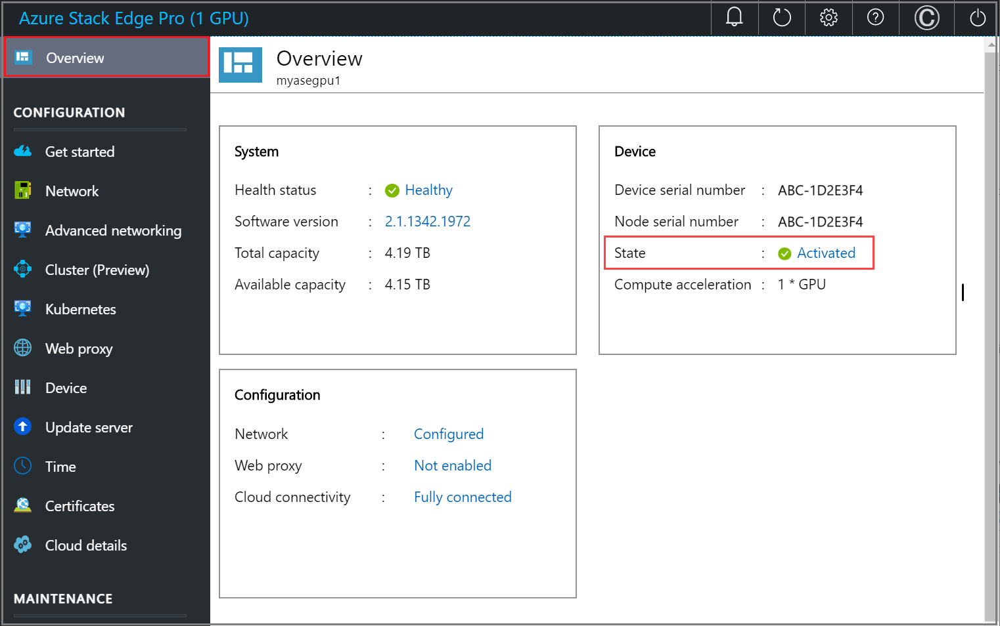

# Tutorial: Activate Azure Stack Edge Pro R device

This tutorial describes how you can activate your Azure Stack Edge Pro R device by using the local web UI.

The activation process can take around 5 minutes to complete.  

In this tutorial, you learned about:

> [!div class="checklist"]
> * Prerequisites
> * Activate the physical device

## Prerequisites

Before you configure and set up your Azure Stack Edge Pro R device, make sure that:

* For your physical device: 
    
    - You've installed the physical device as detailed in [Install Azure Stack Edge Pro R](azure-stack-edge-pro-r-deploy-install.md).
    - You've configured the network and compute network settings as detailed in [Configure network, compute network, web proxy](azure-stack-edge-pro-r-deploy-configure-network-compute-web-proxy.md)
    - You have uploaded your own or generated the device certificates on your device if you changed the device name or the DNS domain via the **Device** page. If you haven't done this step, you will see an error during the device activation and the activation will be blocked. For more information, go to [Configure certificates](azure-stack-edge-placeholder.md).
    
* You have the activation key from the Azure Stack Edge service that you created to manage the Azure Stack Edge Pro R device. For more information, go to [Prepare to deploy Azure Stack Edge Pro R](azure-stack-edge-pro-r-deploy-prep.md).


## Activate the device

1. In the local web UI of the device, go to **Get started** page.
2. On the **Activation** tile, select **Activate**. 

    
    
3. In the **Activate** pane:
    1. Enter the **Activation key** that you got in [Get the activation key for Azure Stack Edge Pro R](azure-stack-edge-pro-r-deploy-prep.md#get-the-activation-key).

    1. You can enable proactive log collection to let Microsoft collect logs based on the health status of the device. The logs collected this way are uploaded to an Azure Storage account.
    
    1. Select **Apply**.

    


5. First the device is activated. You are then prompted to download the key file.
    
    
    
    Select **Download and continue** and save the *device-serial-no.json* file in a safe location outside of the device. **This key file contains the recovery keys for the OS disk and data disks on your device**. These keys may be needed to facilitate a future system recovery.

    Here are the contents of the *json* file:

        
    ```json
    {
      "Id": "<Device ID>",
      "DataVolumeBitLockerExternalKeys": {
        "hcsinternal": "<BitLocker key for data disk>",
        "hcsdata": "<BitLocker key for data disk>"
      },
      "SystemVolumeBitLockerRecoveryKey": "<BitLocker key for system volume>",
      "ServiceEncryptionKey": "<Azure service encryption key>"
    }
    ```
        
 
    The following table explains the various keys:
    
    |Field  |Description  |
    |---------|---------|
    |`Id`    | This is the ID for the device.        |
    |`DataVolumeBitLockerExternalKeys`|These are the BitLockers keys for the data disks and are used to recover the local data on your device.|
    |`SystemVolumeBitLockerRecoveryKey`| This is the BitLocker key for the system volume. This key helps with the recovery of the system configuration and system data for your device. |
    |`ServiceEncryptionKey`| This key protects the data flowing through the Azure service. This key ensures that a compromise of the Azure service will not result in a compromise of stored information. |

6. Go to the **Overview** page. The device state should show as **Activated**.

    
 
The device activation is complete. You can now add shares on your device.

If you encounter any issues during activation, go to [Troubleshoot activation and Azure Key Vault errors](azure-stack-edge-gpu-troubleshoot-activation.md#activation-errors).

## Next steps

In this tutorial, you learned about:

> [!div class="checklist"]
> * Prerequisites
> * Activate the physical device

To learn how to transfer data with your Azure Stack Edge Pro R device, see:

> [!div class="nextstepaction"]
> [Transfer data with Azure Stack Edge Pro R](./azure-stack-edge-gpu-deploy-add-shares.md)