# Tutorial: Configure certificates for your Azure Stack Edge Pro R

This tutorial describes how you can configure certificates for your Azure Stack Edge Pro R device by using the local web UI.

The time taken for this step can vary depending on the specific option you choose and how the certificate flow is established in your environment.

In this tutorial, you learn about:

> [!div class="checklist"]
>
> * Prerequisites
> * Configure certificates for the physical device
> * Configure VPN
> * Configure encryption-at-rest

## Prerequisites

Before you configure and set up your Azure Stack Edge Pro R device, make sure that:

* You've installed the physical device as detailed in [Install Azure Stack Edge Pro R](azure-stack-edge-pro-r-deploy-install.md).
* If you plan to bring your own certificates:
    - You should have your certificates ready in the appropriate format including the signing chain certificate. For details on certificate, go to [Manage certificates](azure-stack-edge-gpu-manage-certificates.md)

## Configure certificates for device

1. In the **Certificates** page, you will configure your certificates. Depending on whether you changed the device name or the DNS domain in the **Device** page, you can choose one of the following options for your certificates.

    - If you have not changed the device name or the DNS domain in the earlier step, then you can skip this step and proceed to the next step. The device has automatically generated self-signed certificates to begin with. 

    - If you changed the device name or DNS domain, you will see that the status of certificates will show as **Not valid**. 

        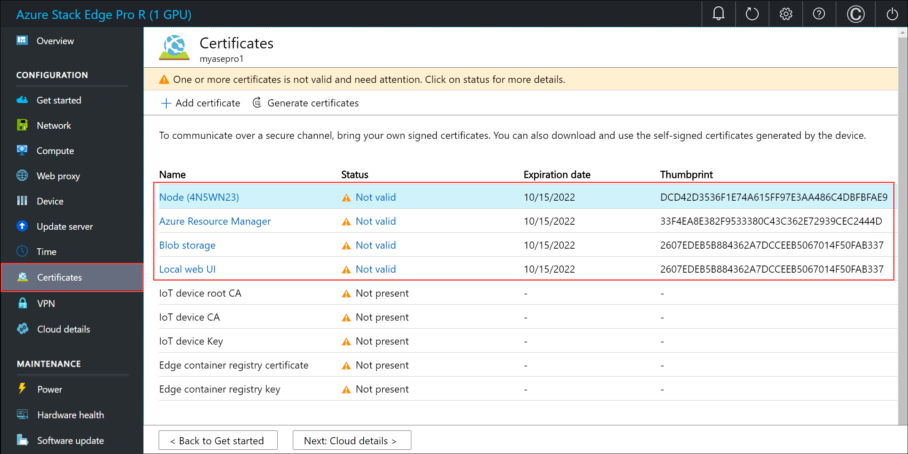    

        Select a certificate to view the details of the status.

        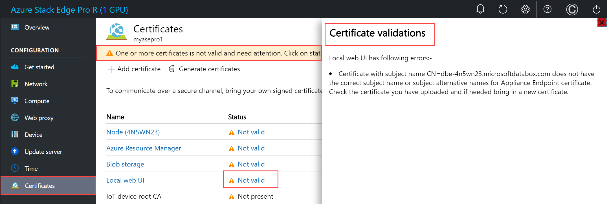  

        This is because the certificates do not reflect the updated device name and DNS domain (that are used in subject name and subject alternative). To successfully activate your device, you can bring your own signed endpoint certificates and the corresponding signing chains. You first add the signing chain and then upload the endpoint certificates. For more information, go to [Bring your own certificates on your Azure Stack Edge Pro R device](#bring-your-own-certificates).

    - If you changed the device name or DNS domain, and you do not bring your own certificates, then the **activation will be blocked**.

    
#### Bring your own certificates

Follow these steps to add your own certificates including the signing chain.

1. To upload certificate, on the **Certificate** page, select **+ Add certificate**.

    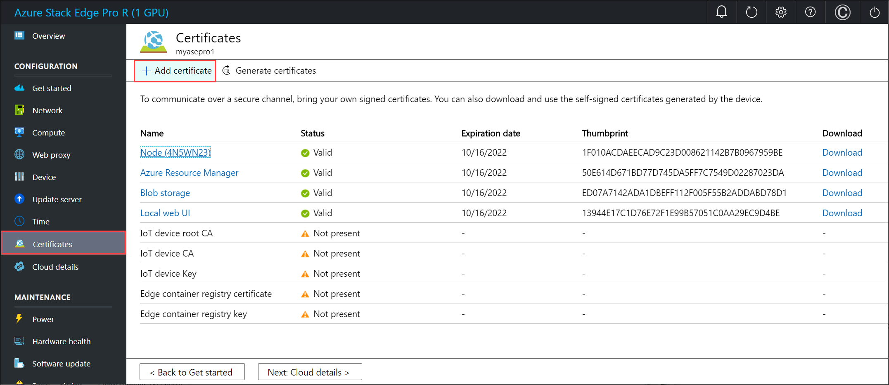

2. Upload the signing chain first and select **Validate & add**.

    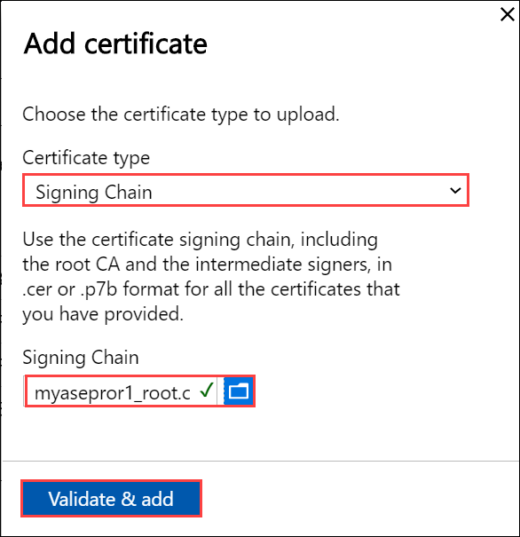

3. Now you can upload other certificates. For example, you can upload the Azure Resource Manager and Blob storage endpoint certificates.

    

    You can also upload the local web UI certificate. After you upload this certificate, you will be required to start your browser and clear the cache. You will then need to connect to the device local web UI.  

    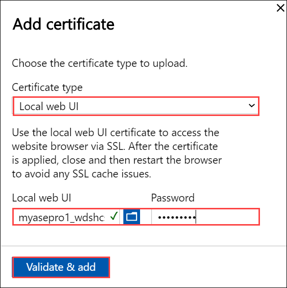

    You can also upload the node certificate.

    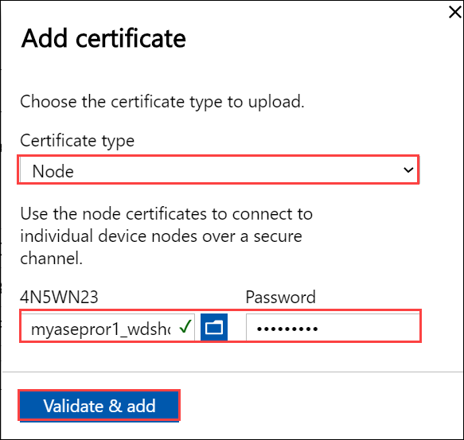

    Finally you can upload the VPN certificate.

    

    At any time, you can select a certificate and view the details to ensure that these match with the certificate that you uploaded.

    The certificate page should update to reflect the newly added certificates.

    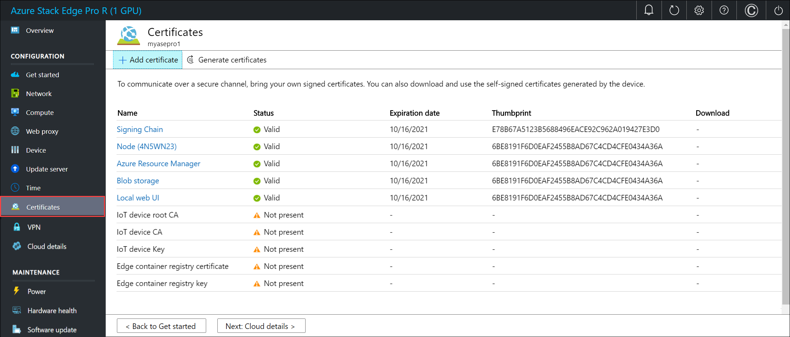  

    > [!NOTE]
    > Except for Azure public cloud, signing chain certificates are needed to be brought in before activation for all cloud configurations (Azure Government or Azure Stack).

1. Select **< Back to Get started**.

## Configure VPN

1. On the **Security** tile, select **Configure** for VPN.

    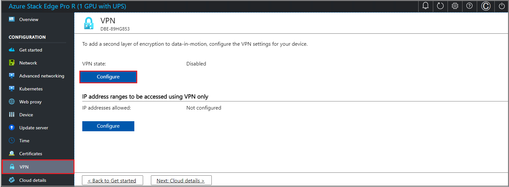  

    To configure VPN, you'll first need to ensure that you have all the necessary configuration done in Azure. For details, see [Configure prerequisites](azure-stack-edge-placeholder.md) and [Configure Azure resources for VPN](azure-stack-edge-placeholder.md). Once this is complete, you can do the configuration in the local UI.
    
    1. On the VPN page, select **Configure**.
    2. In the **Configure VPN** blade:

    - Enable **VPN settings**.
    - Provide the **VPN shared secret**. This is the shared key you provided while creating the Azure VPN connection object.
    - Provide the **VPN gateway IP** address. This is the Azure local network gateway IP address.
    - For **PFS group**, select **None**. 
    - For **DH group**, select **Group2**.
    - For **IPsec integrity method**, select **SHA256**.
    - For **IPseccipher transform constants**, select **GCMAES256**.
    - For **IPsec authentication transform constants**, select **GCMAES256**.
    - For **IKE encryption method**, select **AES256**.
    - Select **Apply**.

        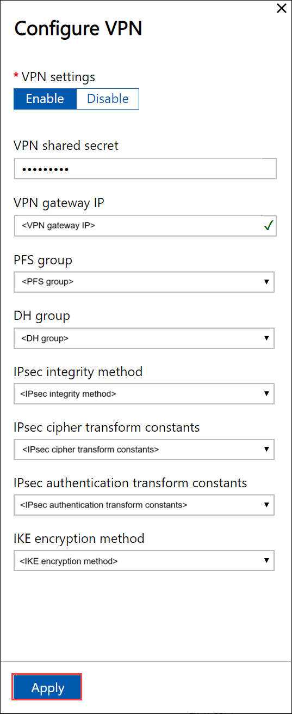

    3. To upload the VPN route configuration file, select **Upload**. 
    
        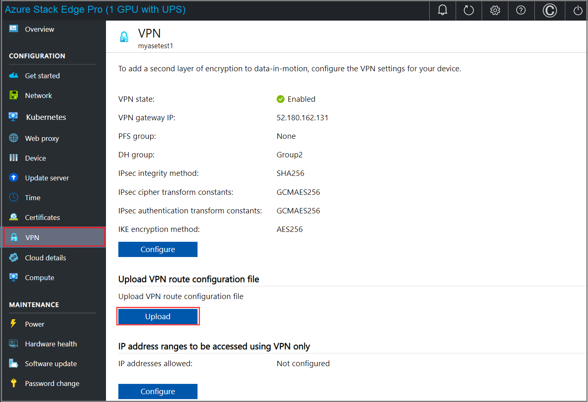
    
        - Browse to the VPN configuration *json* file that you downloaded on your local system in the previous step.
        - Select the region as the Azure region associated with the device, virtual network, and gateways.
        - Select **Apply**.
    
            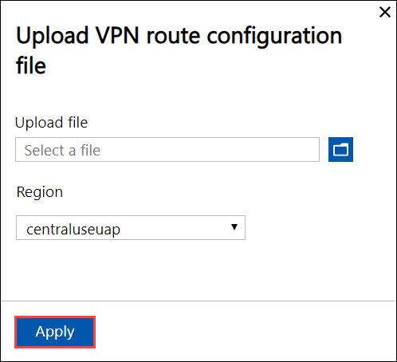
    
    4. To add client-specific routes, configure IP address ranges to be accessed using VPN only. 
    
        - Under **IP address ranges to be accessed using VPN only**, select **Configure**.
        - Provide a valid IPv4 range and select **Add**. Repeat the steps to add other ranges.
        - Select **Apply**.
    
            

1. Select **< Back to Get started**.

## Configure encryption-at-rest

1. On the **Security** tile, select **Configure** for encryption-at-rest. This is a required setting and until this is successfully configured, you can't activate the device. 

    At the factory, once the devices are imaged, the volume level BitLocker encryption is enabled. After you receive the device, you need to configure the encryption-at-rest. The storage pool and volumes are recreated and you can provide BitLocker keys to enable encryption-at-rest and thus create a second layer of encryption for your data-at-rest.

1. In the **Encryption-at-rest** pane, provide a 32 character long Base-64 encoded key. This is a one-time configuration and this key is used to protect the actual encryption key. You can choose to automatically generate this key or enter one.

    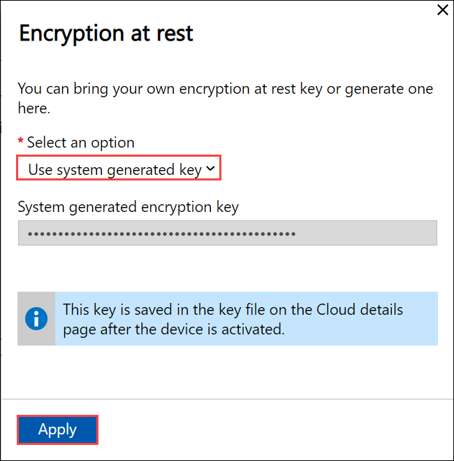

    The key is saved in a key file on the **Cloud details** page after the device is activated.

1. Select **Apply**. This operation takes several minutes and the status of operation is displayed on the **Security** tile.

    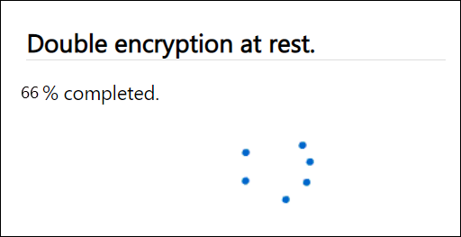

1. After the status shows as **Completed**, select **< Back to Get started**.

Your device is now ready to be activated. 

## Next steps

In this tutorial, you learn about:

> [!div class="checklist"]
>
> * Prerequisites
> * Configure certificates for the physical device
> * Configure VPN
> * Configure encryption-at-rest

To learn how to activate your Azure Stack Edge Pro R device, see:

> [!div class="nextstepaction"]
> [Activate Azure Stack Edge Pro R device](./azure-stack-edge-pro-r-deploy-activate.md)
