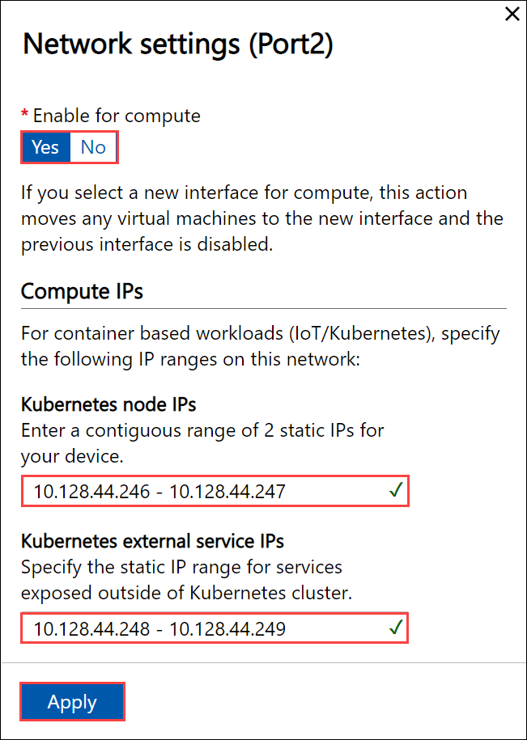
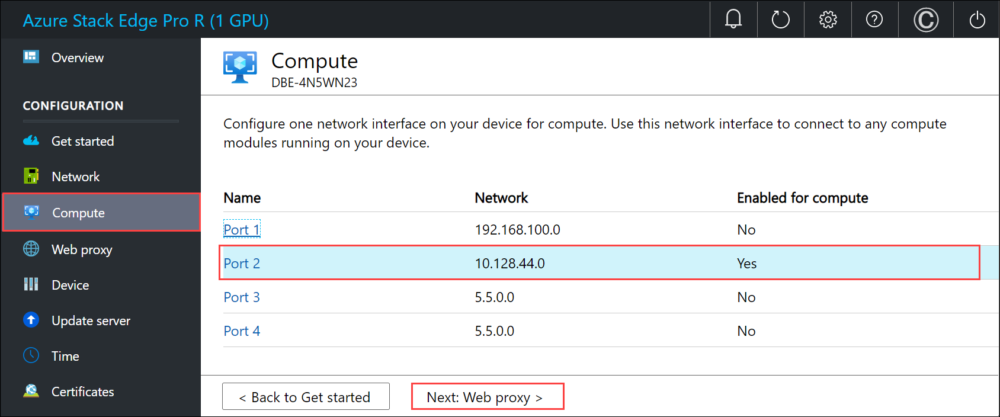

# Tutorial: Configure network for Azure Stack Edge Pro R

This tutorial describes how to configure network for your Azure Stack Edge Pro R device by using the local web UI.

The connection process can take around 20 minutes to complete.

In this tutorial, you learn about:

> [!div class="checklist"]
>
> * Prerequisites
> * Configure network
> * Enable compute network
> * Configure web proxy

## Prerequisites

Before you configure and set up your Azure Stack Edge Pro R device, make sure that:

* You've installed the physical device as detailed in [Install Azure Stack Edge Pro R](azure-stack-edge-gpu-deploy-install.md).
* You've connected to the local web UI of the device as detailed in [Connect to Azure Stack Edge Pro R](azure-stack-edge-gpu-deploy-connect.md)

## Configure network

Your **Get started** page displays the various settings that are required to configure and register the physical device with the Azure Stack Edge service. 

Follow these steps to configure the network for your device.

1. In the local web UI of your device, go to the **Get started** page. 

2. On the **Network** tile, select **Configure** to go to the **Network** page. 
    
    <!---->

    On your physical device, there are four network interfaces. PORT 1 and PORT 2 are 1-Gbps network interfaces. PORT 3 and PORT 4 are all 10/25-Gbps network interfaces. PORT 1 is automatically configured as a management-only port, and PORT 2 to PORT 4 are all data ports. The **Network** page is as shown below.
    
    

   
3. To change the network settings, select a port and in the right pane that appears, modify the IP address, subnet, gateway, primary DNS, and secondary DNS. 

    - If you select Port 1, you can see that it is preconfigured as static. 

        

    - If you select Port 2, Port 3, or Port 4, all of these ports are configured as DHCP by default.

        

    As you configure the network settings, keep in mind:

   * If DHCP is enabled in your environment, network interfaces are automatically configured. An IP address, subnet, gateway, and DNS are automatically assigned.
   * If DHCP isn't enabled, you can assign static IPs if needed.
   * You can configure your network interface as IPv4.
   * Serial number for any port corresponds to the node serial number.
    <!--* On the 25-Gbps interfaces, you can set the RDMA (Remote Direct Access Memory) mode to iWarp or RoCE (RDMA over Converged Ethernet). Where low latencies are the primary requirement and scalability is not a concern, use RoCE. When latency is a key requirement, but ease-of-use and scalability are also high priorities, iWARP is the best candidate.-->
    Once the device network is configured, the page updates as shown below.

    <!--change-->

     >[!NOTE]
     >
     > * We recommend that you do not switch the local IP address of the network interface from static to DCHP, unless you have another IP address to connect to the device. If using one network interface and you switch to DHCP, there would be no way to determine the DHCP address. If you want to change to a DHCP address, wait until after the device has activated with the service, and then change. You can then view the IPs of all the adapters in the **Device properties** in the Azure portal for your service.

    After you have configured and applied the network settings, select **Next: Compute** to configure compute network.

## Enable compute network

Follow these steps to enable compute and configure compute network. 

1. In the **Compute** page, select a network interface that you want to enable for compute. 

    

1. In the **Network settings** dialog, select **Enable**. When you enable compute, a virtual switch is created on your device on that network interface. The virtual switch is used for the compute infrastructure on the device. 
    
1. Assign **Kubernetes node IPs**. These static IP addresses are for the compute VM.  

    For an *n*-node device, a contiguous range of a minimum of *n+1* IPv4 addresses (or more) are provided for the compute VM using the start and end IP addresses. Given Azure Stack Edge is a 1-node device, a minimum of 2 contiguous IPv4 addresses are provided. These IP addresses must be in the same network where you enabled compute and the virtual switch was created.

    > [!IMPORTANT]
    > Kubernetes on Azure Stack Edge uses 172.27.0.0/16 subnet for pod and 172.28.0.0/16 subnet for service. Make sure that these are not in use in your network. If these subnets are already in use in your network, you can change these subnets by running the `Set-HcsKubeClusterNetworkInfo` cmdlet from the PowerShell interface of the device. For more information, see [Change Kubernetes pod and service subnets](azure-stack-edge-gpu-connect-powershell-interface.md#change-kubernetes-pod-and-service-subnets).

1. Assign **Kubernetes external service IPs**. These are also the load balancing IP addresses. These contiguous IP addresses are for services that you want to expose outside of the Kubernetes cluster and you specify the static IP range depending on the number of services exposed. 
    
    > [!IMPORTANT]
    > We strongly recommend that you specify a minimum of 1 IP address for Azure Stack Edge Pro R Hub service to access compute modules. You can then optionally specify additional IP addresses for other services/IoT Edge modules (1 per service/module) that need to be accessed from outside the cluster. The service IP addresses can be updated later. 
    
1. Select **Apply**.

    

1. The configuration is takes a couple minutes to apply and you may need to refresh the browser. You can see that the specified port is enabled for compute. 
 
    

    Select **Next: Web proxy** to configure web proxy.  

  
## Configure web proxy

This is an optional configuration.

> [!IMPORTANT]
> * If you enable compute and use IoT Edge module on your Azure Stack Edge Pro R device, we recommend you set web proxy authentication as **None**. NTLM is not supported.
>* Proxy-auto config (PAC) files are not supported. A PAC file defines how web browsers and other user agents can automatically choose the appropriate proxy server (access method) for fetching a given URL. Proxies that try to intercept and read all the traffic (then re-sign everything with their own certification) aren't compatible since the proxy's certificate is not trusted. Typically transparent proxies work well with Azure Stack Edge Pro R. Non-transparent web proxies are not supported.

1. On the **Web proxy settings** page, take the following steps:

    1. In the **Web proxy URL** box, enter the URL in this format: `http://host-IP address or FQDN:Port number`. HTTPS URLs are not supported.

    2. Under **Authentication**, select **None** or **NTLM**. If you enable compute and use IoT Edge module on your Azure Stack Edge Pro R device, we recommend you set web proxy authentication to **None**. **NTLM** is not supported.

    3. If you're using authentication, enter a username and password.

    4. To validate and apply the configured web proxy settings, select **Apply**.
    
   

2. After the settings are applied, select **Next: Device**.

## Next steps

In this tutorial, you learned about:

> [!div class="checklist"]
> * Prerequisites
> * Configure network
> * Enable compute network
> * Configure web proxy

To learn how to set up your Azure Stack Edge Pro R device, see:

> [!div class="nextstepaction"]
> [Configure device settings](./azure-stack-edge-pro-r-deploy-set-up-device-update-time.md)
