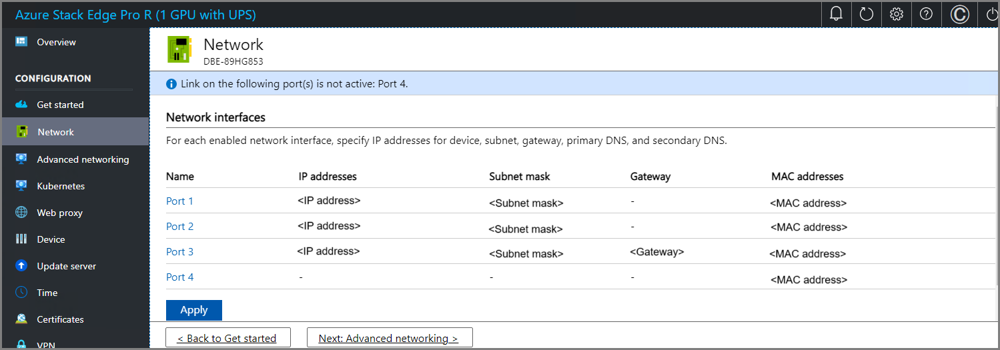
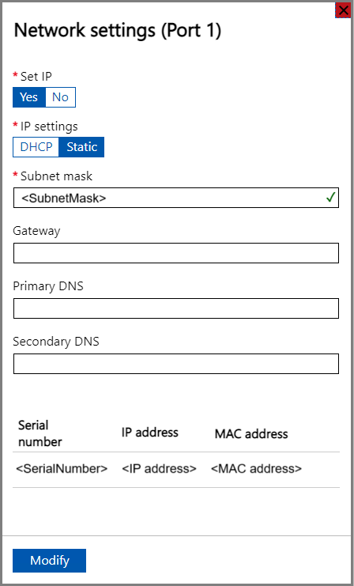
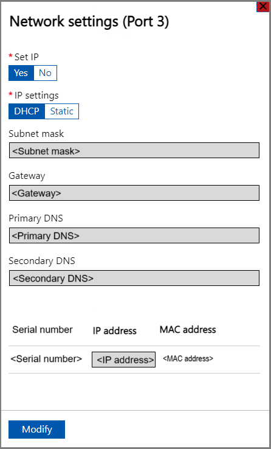
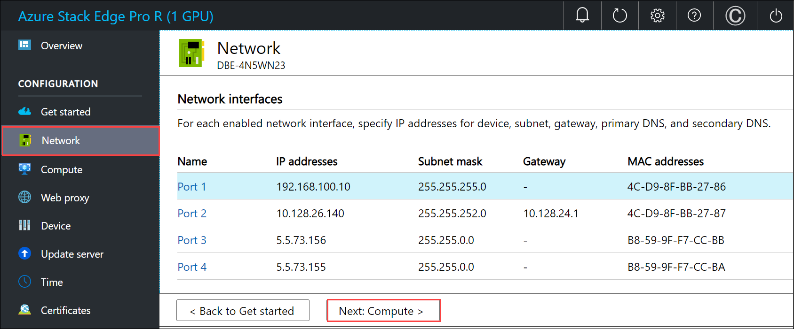
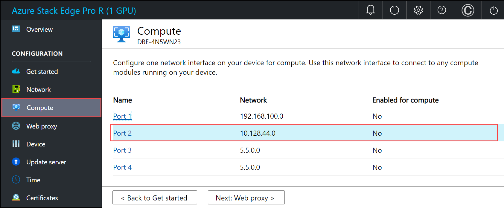
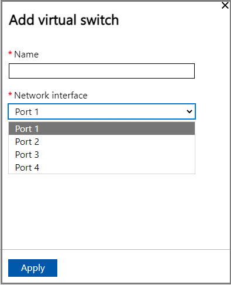
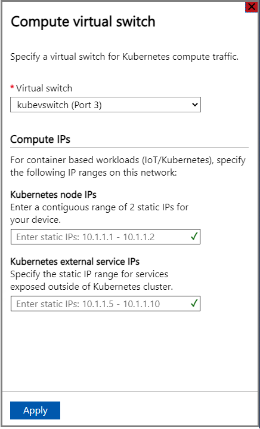
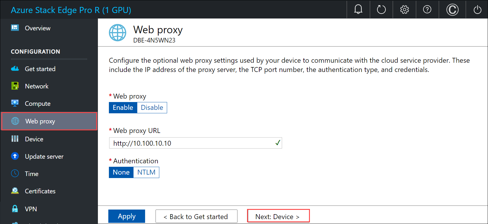

# Tutorial: Configure network for Azure Stack Edge Pro R

This tutorial describes how to configure network for your Azure Stack Edge Pro R device by using the local web UI.

The connection process can take around 20 minutes to complete.

In this tutorial, you learn about:

> [!div class="checklist"]
>
> * Prerequisites
> * Configure network
> * Configure advanced networking
> * Configure web proxy
> * Validate network settings


## Prerequisites

Before you configure and set up your Azure Stack Edge Pro R device, make sure that:

* You've installed the physical device as detailed in [Install Azure Stack Edge Pro R](azure-stack-edge-gpu-deploy-install.md).
* You've connected to the local web UI of the device as detailed in [Connect to Azure Stack Edge Pro R](azure-stack-edge-gpu-deploy-connect.md)


## Configure network

Your **Get started** page displays the various settings that are required to configure and register the physical device with the Azure Stack Edge service. 

Follow these steps to configure the network for your device.

1. In the local web UI of your device, go to the **Get started** page. 

2. On the **Network** tile, select **Configure** to go to the **Network** page. 
    
    <!---->

    On your physical device, there are four network interfaces. PORT 1 and PORT 2 are 1-Gbps network interfaces. PORT 3 and PORT 4 are all 10/25-Gbps network interfaces. PORT 1 is automatically configured as a management-only port, and PORT 2 to PORT 4 are all data ports. The **Network** page is as shown below.
    
    

   
3. To change the network settings, select a port and in the right pane that appears, modify the IP address, subnet, gateway, primary DNS, and secondary DNS. 

    - If you select Port 1, you can see that it is preconfigured as static. 

        

    - If you select Port 2, Port 3, or Port 4, all of these ports are configured as DHCP by default.

        

    As you configure the network settings, keep in mind:

   * If DHCP is enabled in your environment, network interfaces are automatically configured. An IP address, subnet, gateway, and DNS are automatically assigned.
   * If DHCP isn't enabled, you can assign static IPs if needed.
   * You can configure your network interface as IPv4.
   * Network Interface Card (NIC) Teaming or link aggregation is not supported with Azure Stack Edge.
   * Serial number for any port corresponds to the node serial number.
    <!--* On the 25-Gbps interfaces, you can set the RDMA (Remote Direct Access Memory) mode to iWarp or RoCE (RDMA over Converged Ethernet). Where low latencies are the primary requirement and scalability is not a concern, use RoCE. When latency is a key requirement, but ease-of-use and scalability are also high priorities, iWARP is the best candidate.-->

    > [!NOTE]
    > If you need to connect to your device from an outside network, see [Enable device access from outside network](azure-stack-edge-gpu-manage-access-power-connectivity-mode.md#enable-device-access-from-outside-network) for additional network settings.

    Once the device network is configured, the page updates as shown below.

    


     >[!NOTE]
     > We recommend that you do not switch the local IP address of the network interface from static to DCHP, unless you have another IP address to connect to the device. If using one network interface and you switch to DHCP, there would be no way to determine the DHCP address. If you want to change to a DHCP address, wait until after the device has activated with the service, and then change. You can then view the IPs of all the adapters in the **Device properties** in the Azure portal for your service.

    After you have configured and applied the network settings, select **Next: Advanced networking** to configure compute network.

## Enable compute network

Follow these steps to enable compute and configure compute network. 

1. In the **Advanced networking** page, select a network interface that you want to enable for compute. 

    

## Configure virtual switches

Follow these steps to add or delete virtual switches and virtual networks.

1. In the local UI, go to **Advanced networking** page.

1. In the **Virtual switch** section, you'll add or delete virtual switches. Select **Add virtual switch** to create a new switch.

    

1. In the **Network settings** blade, if using a new switch, provide the following:

   1. Provide a name for your virtual switch.
   1. Choose the network interface on which the virtual switch should be created.
   1. If deploying 5G workloads, set **Supports accelerated networking** to **Yes**.
   1. Select **Apply**. You can see that the specified virtual switch is created.

     

1. You can create more than one switch by following the steps described earlier.

1. To delete a virtual switch, under the **Virtual switch** section, select **Delete virtual switch**. When a virtual switch is deleted, the associated virtual networks will also be deleted.

You can now create virtual networks and associate with the virtual switches you created.

## Configure virtual networks

You can add or delete virtual networks associated with your virtual switches. To add a virtual switch, follow these steps:

1. In the local UI on the **Advanced networking** page, under the **Virtual network** section, select **Add virtual network**.

1. In the **Add virtual network** blade, input the following information:

   1. Select a virtual switch for which you want to create a virtual network.
   1. Provide a **Name** for your virtual network.
   1. Enter a **VLAN ID** as a unique number in 1-4094 range. The VLAN ID that you provide should be in your trunk configuration. For more information on trunk configuration for your switch, refer to the instructions from your physical switch manufacturer.
   1. Specify the **Subnet mask** and **Gateway** for your virtual LAN network as per the physical network configuration.
   1. Select **Apply**. A virtual network is created on the specified virtual switch.

     <!--![Screenshot of how to add virtual network in **Advanced networking** page in local UI for one node.()-->

1. To delete a virtual network, under the **Virtual network** section, select **Delete virtual network** and select the virtual network you want to delete.

1. Select **Next: Kubernetes >** to next configure your compute IPs for Kubernetes.

## Configure compute IPs

Follow these steps to configure compute IPs for your Kubernetes workloads.

1. In the local UI, go to the **Kubernetes** page.

1. From the dropdown select a virtual switch that you will use for Kubernetes compute traffic. <!--By default, all switches are configured for management. You can't configure storage intent as storage traffic was already configured based on the network topology that you selected earlier.-->

1. Assign **Kubernetes node IPs**. These static IP addresses are for the Kubernetes VMs.

   For an *n*-node device, a contiguous range of a minimum of *n+1* IPv4 addresses (or more) are provided for the compute VM using the start and end IP addresses. For a 1-node device, provide a minimum of two, free, contiguous IPv4 addresses.

   > [!IMPORTANT]
   > * Kubernetes on Azure Stack Edge uses 172.27.0.0/16 subnet for pod and 172.28.0.0/16 subnet for service. Make sure that these are not in use in your network. If these subnets are already in use in your network, you can change these subnets by running the ```Set-HcsKubeClusterNetworkInfo``` cmdlet from the PowerShell interface of the device. For more information, see Change Kubernetes pod and service subnets. <!--Target URL not available.-->
   > * DHCP mode is not supported for Kubernetes node IPs. If you plan to deploy IoT Edge/Kubernetes, you must assign static Kubernetes IPs and then enable IoT role. This will ensure that static IPs are assigned to Kubernetes node VMs.
   > * If your datacenter firewall is restricting or filtering traffic based on source IPs or MAC addresses, make sure that the compute IPs (Kubernetes node IPs) and MAC addresses are on the allowed list. The MAC addresses can be specified by running the ```Set-HcsMacAddressPool``` cmdlet on the PowerShell interface of the device.

1. Assign **Kubernetes external service IPs**. These are also the load-balancing IP addresses. These contiguous IP addresses are for services that you want to expose outside of the Kubernetes cluster and you specify the static IP range depending on the number of services exposed.

   > [!IMPORTANT]
   > We strongly recommend that you specify a minimum of one IP address for Azure Stack Edge Hub service to access compute modules. You can then optionally specify additional IP addresses for other services/IoT Edge modules (1 per service/module) that need to be accessed from outside the cluster. The service IP addresses can be updated later.

1. Select **Apply**.

     

1. The configuration takes a couple minutes to apply and you may need to refresh the browser.

1. Select **Next: Web proxy** to configure web proxy.

## Configure web proxy

This is an optional configuration.

> [!IMPORTANT]
> Proxy-auto config (PAC) files are not supported. A PAC file defines how web browsers and other user agents can automatically choose the appropriate proxy server (access method) for fetching a given URL. Proxies that try to intercept and read all the traffic (then re-sign everything with their own certification) aren't compatible since the proxy's certificate is not trusted. Typically, transparent proxies work well with Azure Stack Edge Pro R. Non-transparent web proxies are not supported.

1. On the **Web proxy settings** page, take the following steps:

   1. In the **Web proxy URL** box, enter the URL in this format: `http://host-IP address or FQDN:Port number`. HTTPS URLs are not supported.

   2. To validate and apply the configured web proxy settings, select **Apply**.
    
   <!--UI text update for instruction text is needed.-->

2. After the settings are applied, select **Next: Device**.


## Next steps

In this tutorial, you learned about:

> [!div class="checklist"]
> * Prerequisites
> * Configure network
> * Configure advanced networking
> * Configure web proxy
> * Validate network settings


To learn how to set up your Azure Stack Edge Pro R device, see:

> [!div class="nextstepaction"]
> [Configure device settings](./azure-stack-edge-pro-r-deploy-set-up-device-update-time.md)
