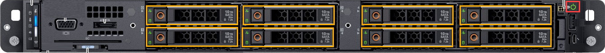

# Tutorial: Install Azure Stack Edge Pro R

This tutorial describes how to install an Azure Stack Edge Pro R physical device. The installation procedure involves cabling the device.

The installation can take around 30 minutes to complete.

In this tutorial, you learn how to:

> [!div class="checklist"]
> * Inspect the device
> * Cable the device

## Prerequisites

The prerequisites for installing a physical device as follows:

### For the Azure Stack Edge resource

Before you begin, make sure that:

* You've completed all the steps in [Prepare to deploy Azure Stack Edge Pro R](azure-stack-edge-pro-r-deploy-prep.md).
    * You've created an Azure Stack Edge resource to deploy your device.
    * You've generated the activation key to activate your device with the Azure Stack Edge resource.

 
### For the Azure Stack Edge Pro R physical device

Before you deploy a device:

- Make sure that the device rests safely on a flat, stable, and level work surface.
- Verify that the site where you intend to set up has:
    - Standard AC power from an independent source

        -OR-
    - A rack power distribution unit (PDU). The device is shipped with an uninterruptible power supply (UPS)
    

### For the network in the datacenter

Before you begin:

- Review the networking requirements for deploying Azure Stack Edge Pro R, and configure the datacenter network per the requirements. For more information, see [Azure Stack Edge Pro R networking requirements](azure-stack-edge-pro-r-system-requirements.md#networking-port-requirements).

- Make sure that the minimum Internet bandwidth is 20 Mbps for optimal functioning of the device.

## Inspect the device

This device is shipped as a single unit. Complete the following steps to unpack your device.

1. Place the box on a flat, level surface.
2. Inspect the device case for any damage. Open the case and inspect the device. If the case or the device appears to be damaged, contact Microsoft Support to help you assess whether the device is in good working order.
3. After the case is opened, make sure that you have:
    - One single enclosure Azure Stack Edge Pro R device
    - One uninterruptible power supply (UPS)
    - 2 short power cables to connect device to the UPS
    - 1 power cable to connect UPS to power source

If you didn't receive all of the items listed here, contact Azure Stack Edge Pro R support. The next step is to cable your device.

## Cable the device

The following procedures explain how to cable your Azure Stack Edge Pro R device for power and network.

Before you start cabling your device, you need the following:

- Your Azure Stack Edge Pro R physical device on the installation site.
- One power cable.
- At least one 1-GbE RJ-45 network cable to connect to the management interface. There are two 1-GbE network interfaces, one management and one data, on the device.
- One 10/25-GbE SFP+ copper cable for each data network interface to be configured. At least one data network interface from among PORT 3 or PORT 4 needs to be connected to the Internet (with connectivity to Azure).  
- Access to one power distribution unit (recommended).

> [!NOTE]
> - If you are connecting only one data network interface, we recommend that you use a 25/10-GbE network interface such as PORT 3 or PORT 4 to send data to Azure. 
> - For best performance and to handle large volumes of data, consider connecting all the data ports.
> - The Azure Stack Edge Pro R device should be connected to the datacenter network so that it can ingest data from data source servers.

On your Azure Stack Edge Pro R device:

- The front panel has disk drives and a power button.

    - There are 8 disk slots in the front of your device.
    - The device also has 2 X M.2 SATA disks inside that serve as operating system disks. 

- The back plane includes redundant power supply units (PSUs).
- The back plane has four network interfaces:

    - Two 1-Gbps interfaces.
    - Two 25-Gbps interfaces that can also serve as 10-Gbps interfaces.
    - A baseboard management controller (BMC).

<!--- The back plane has two network cards corresponding to the 4 ports:

    - QLogic FastLinQ 41264
    - QLogic FastLinQ 41262

For a full list of supported cables, switches, and transceivers for these network cards, go to [Cavium FastlinQ 41000 Series Interoperability Matrix](https://www.marvell.com/documents/xalflardzafh32cfvi0z/).-->
 
Take the following steps to cable your device for power and network.

1. Identify the various ports on the back plane of your device.

    

2. Locate the disk slots and the power button on the front of the device.

    

3. Connect one end of the power cord to the UPS. Attach the other end of the power cord to the rack power distribution unit (PDUs). 
5. Press the power button to turn on the device.
6. Connect the 1-GbE network interface PORT 1 to the computer that's used to configure the physical device. PORT 1 is the dedicated management interface.
7. Connect one or more of PORT 2, PORT 3, or PORT 4 to the datacenter network/Internet.

    - If connecting PORT 2, use the RJ-45 network cable.
    - For the 10/25-GbE network interfaces, use the SFP+ copper cables.

    > [!NOTE]
    > Using USB ports to connect any external device, including keyboards and monitors, is not supported for Azure Stack Edge devices.

## Next steps

In this tutorial, you learned about Azure Stack Edge Pro R topics such as how to:

> [!div class="checklist"]
> * Unpack the device
> * Cable the device

Advance to the next tutorial to learn how to connect to your device.

> [!div class="nextstepaction"]
> [Connect to Azure Stack Edge Pro R](./azure-stack-edge-pro-r-deploy-connect.md)
