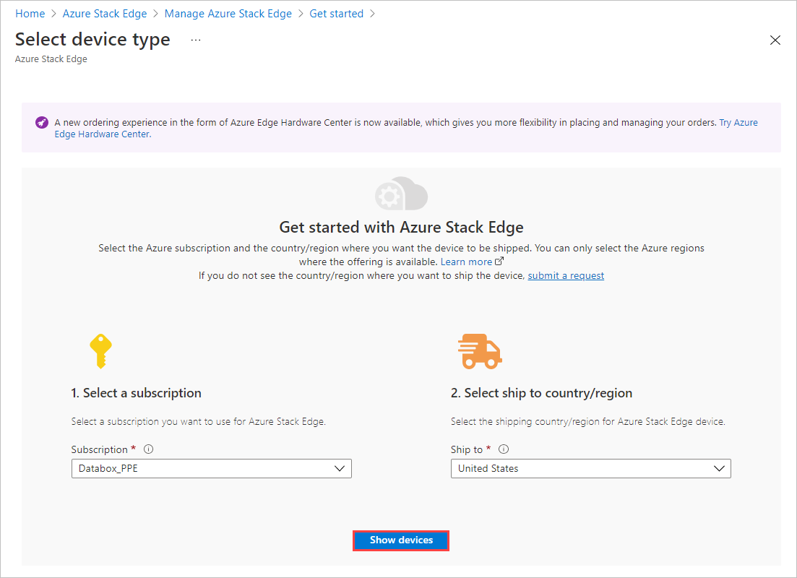
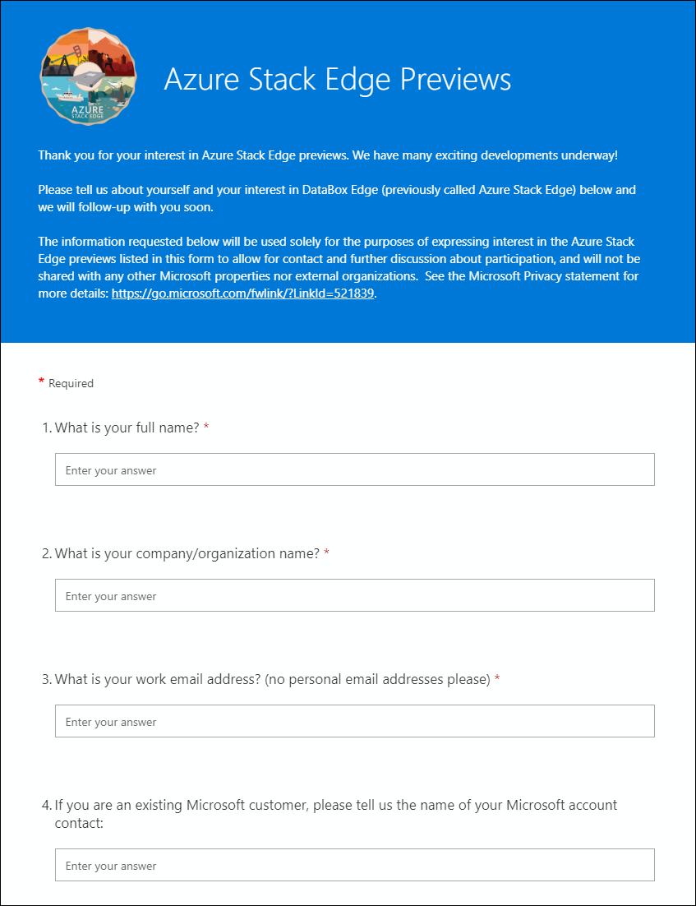
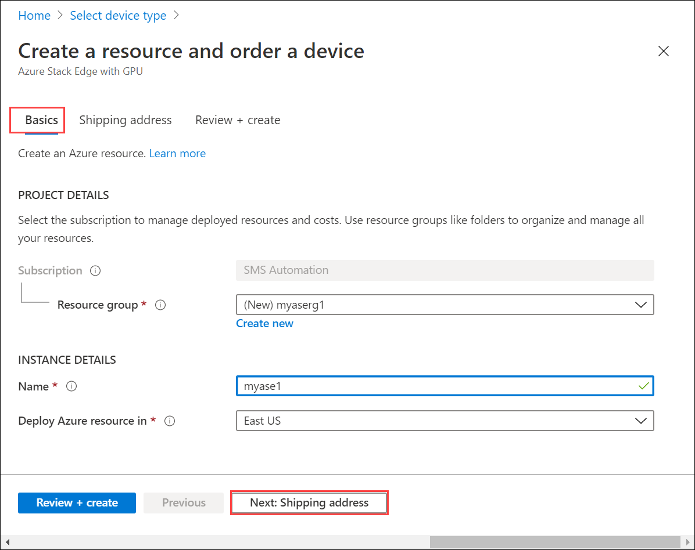
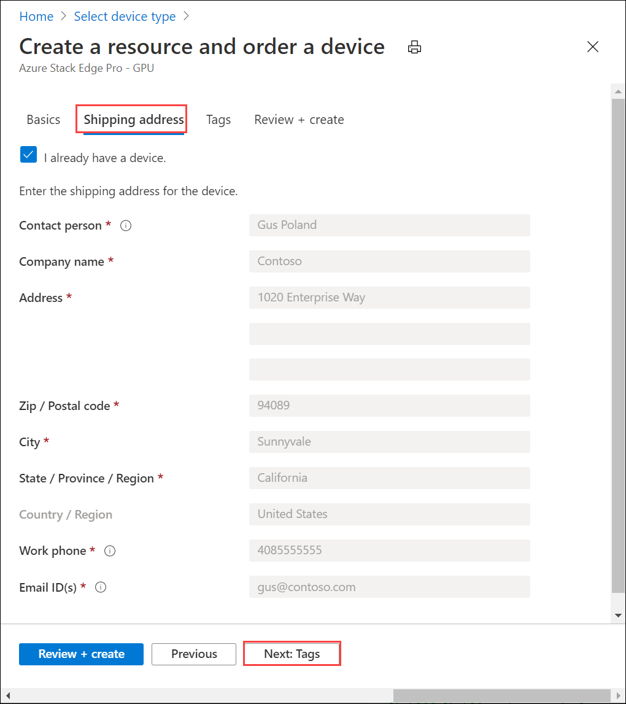
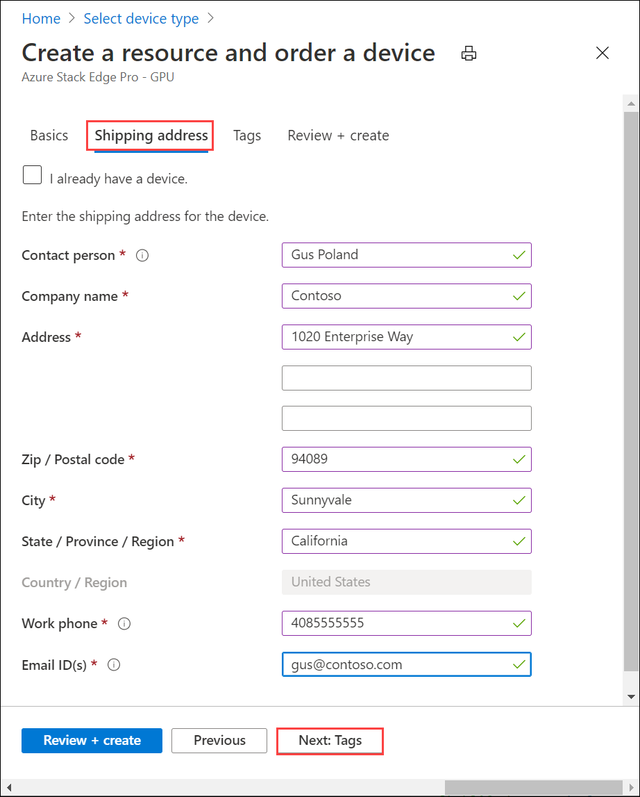
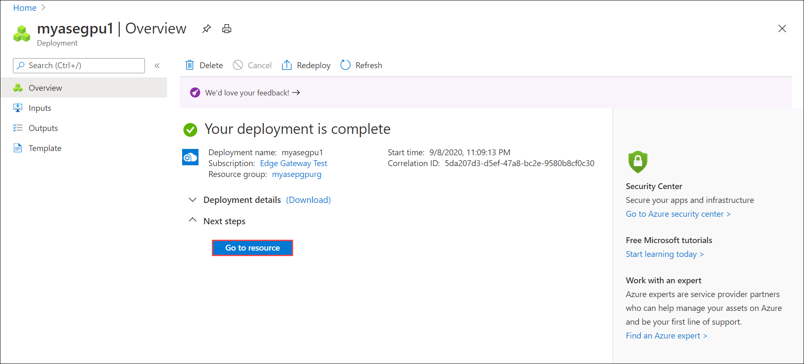

# Tutorial: Prepare to deploy Azure Stack Edge Pro R

This is the first tutorial in the series of deployment tutorials that are required to completely deploy Azure Stack Edge Pro R. This tutorial describes how to prepare the Azure portal to deploy an Azure Stack Edge resource. The tutorial uses a 1-node Azure Stack Edge Pro R device shipped with an Uninterruptible Power Supply (UPS).

You need administrator privileges to complete the setup and configuration process. The portal preparation takes less than 10 minutes.

In this tutorial, you learn how to:

> [!div class="checklist"]
>
> * Create a new resource
> * Get the activation key

### Get started

To deploy Azure Stack Edge Pro R, refer to the following tutorials in the prescribed sequence.

| To do this step | Use these documents |
| --- | --- |
| **Preparation** |These steps must be completed in preparation for the upcoming deployment. |
| **[Deployment configuration checklist](#deployment-configuration-checklist)** |Use this checklist to gather and record information before and during the deployment. |
| **[Deployment prerequisites](#prerequisites)** |These validate the environment is ready for deployment. |
|  | |
|**Deployment tutorials** |These tutorials are required to deploy your Azure Stack Edge Pro R device in production. |
|**[1. Prepare the Azure portal for device](azure-stack-edge-pro-r-deploy-prep.md)** |Create and configure your Azure Stack Edge resource before you install an Azure Stack Box Edge physical device. |
|**[2. Install the device](azure-stack-edge-mini-r-deploy-install.md)**|Unpack, rack, and cable your physical device.  |
|**[3. Connect to the device](azure-stack-edge-pro-r-deploy-connect.md)** |Once the device is installed, connect to device local web UI.  |
|**[4. Configure network settings](azure-stack-edge-pro-r-deploy-configure-network-compute-web-proxy.md)** |Configure network including the compute network and web proxy settings for your device.   |
|**[5. Configure device settings](azure-stack-edge-pro-r-deploy-set-up-device-update-time.md)** |Assign a device name and DNS domain, configure update server and device time. |
|**[6. Configure security settings](azure-stack-edge-pro-r-deploy-configure-certificates.md)** |Configure certificates, VPN, encryption-at-rest for your device. Use device generated certificates or bring your own certificates.   |
|**[7. Activate the device](azure-stack-edge-pro-r-deploy-activate.md)** |Use the activation key from service to activate the device. The device is ready to set up SMB or NFS shares or connect via REST. |
|**[8. Configure compute](azure-stack-edge-gpu-deploy-configure-compute.md)** |Configure the compute role on your device. This will also create a Kubernetes cluster. |

You can now begin to set up the Azure portal.

## Prerequisites

Following are the configuration prerequisites for your Azure Stack Edge resource, your Azure Stack Edge device, and the datacenter network.

### For the Azure Stack Edge resource

[!INCLUDE [Azure Stack Edge resource prerequisites](../../includes/azure-stack-edge-gateway-resource-prerequisites.md)]

### For the Azure Stack Edge device

Before you deploy a physical device, make sure that:

- You've reviewed the safety information for this device at: [Safety guidelines for your Azure Stack Edge device](azure-stack-edge-j-series-safety.md).
[!INCLUDE [Azure Stack Edge device prerequisites](../../includes/azure-stack-edge-gateway-device-prerequisites.md)] 

### For the datacenter network

Before you begin, make sure that:

- The network in your datacenter is configured per the networking requirements for your Azure Stack Edge device. For more information, see [Azure Stack Edge Pro R System Requirements](azure-stack-edge-pro-r-system-requirements.md).

- For normal operating conditions of your device, you have:

    - A minimum of 10-Mbps download bandwidth to ensure the device stays updated.
    - A minimum of 20-Mbps dedicated upload and download bandwidth to transfer files.

## Create a new resource

If you have an existing Azure Stack Edge resource to manage your physical device, skip this step and go to [Get the activation key](#get-the-activation-key).

To create an Azure Stack Edge resource, take the following steps in the Azure portal.

1. Use your Microsoft Azure credentials to sign in to the Azure portal at this URL: [https://portal.azure.com](https://portal.azure.com).

2. In the left-pane, select **+ Create a resource**. Search for and select **Azure Stack Edge / Data Box Gateway**. Select **Create**. 

3. Pick the subscription that you want to use for the Azure Stack Edge Pro device. Select the country to where you want to ship this physical device. Select **Show devices**.

    

4. Select device type. Under **Azure Stack Edge Pro**, choose **Azure Stack Edge Pro with GPU** and then choose **Select**. If you see any issues or are unable to select the device type, go to [Troubleshoot order issues](azure-stack-edge-troubleshoot-ordering.md).

    

5. Based on your business need, you can select Azure Stack Edge Pro with 1 or 2 Graphical Processing Units (GPUs) from Nvidia. 

    

6. On the **Basics** tab, enter or select the following **Project details**.
    
    |Setting  |Value  |
    |---------|---------|
    |Subscription    |This is automatically populated based on the earlier selection. Subscription is linked to your billing account. |
    |Resource group  |Select an existing group or create a new group. Learn more about [Azure Resource Groups](../azure-resource-manager/resource-group-overview.md).     |

7. Enter or select the following **Instance details**.

    |Setting  |Value  |
    |---------|---------|
    |Name   | A friendly name to identify the resource. The name has between 2 and 50 characters containing letter, numbers, and hyphens.  Name starts and ends with a letter or a number.        |
    |Region     |For a list of all the regions where the Azure Stack Edge resource is available, see [Azure products available by region](https://azure.microsoft.com/global-infrastructure/services/?products=databox&regions=all). If using Azure Government, all the government regions are available as shown in the [Azure regions](https://azure.microsoft.com/global-infrastructure/regions/).  Choose a location closest to the geographical region where you want to deploy your device.|

    

8. Select **Next: Shipping address**.

    - If you already have a device, select the combo box for **I have a Azure Stack Edge Pro device**.

        

    - If this is the new device that you are ordering, enter the contact name, company, address to ship the device, and contact information.

        

9. Select **Next: Tags**. Optionally provide tags to categorize resources and consolidate billing. Select **Next: Review + create**.

10. On the **Review + create** tab, review the **Pricing details**, **Terms of use**, and the details for your resource. Select the combo box for **I have reviewed the privacy terms**.

     

    You are also notified that during the resource creation, a Managed Service Identity (MSI) is enabled that lets you authenticate to cloud services. This identity exists for as long as the resource exists.

11. Select **Create**.

The resource creation takes a few minutes. An MSI is also created that lets the the Azure Stack Edge device communicate with the resource provider in Azure.

After the resource is successfully created and deployed, you're notified. Select **Go to resource**.

After the order is placed, Microsoft reviews the order and reaches out to you (via email) with shipping details.

<!---->

If you run into any issues during the order process, see [Troubleshoot order issues](azure-stack-edge-troubleshoot-ordering.md).

## Get the activation key

After the Azure Stack Edge resource is up and running, you'll need to get the activation key. This key is used to activate and connect your Azure Stack Edge Pro device with the resource. You can get this key now while you are in the Azure portal.

1. Select the resource that you created. Select **Overview** and then select **Device setup**.

    

2. On the **Activate** tile, provide a name for the Azure Key Vault or accept the default name. The key vault name can be between 3 and 24 characters. 

    A key vault is created for each Azure Stack Edge resource that is activated with your device. The key vault lets you store and access secrets, for example, the Channel Integrity Key (CIK) for the service is stored in the key vault. 

    Once you have specified a key vault name, select **Generate key** to create an activation key. 

    

    Wait a few minutes as the key vault and activation key are created. Select the copy icon to copy the key and save it for later use.

> [!IMPORTANT]
> - The activation key expires three days after it is generated.
> - If the key has expired, generate a new key. The older key is not valid.

## Next steps

In this tutorial, you learned about Azure Stack Edge topics such as:

> [!div class="checklist"]
> * Create a new resource
> * Get the activation key

Advance to the next tutorial to learn how to install Azure Stack Edge.

> [!div class="nextstepaction"]
> [Install Azure Stack Edge](./azure-stack-edge-j-series-deploy-install.md)

