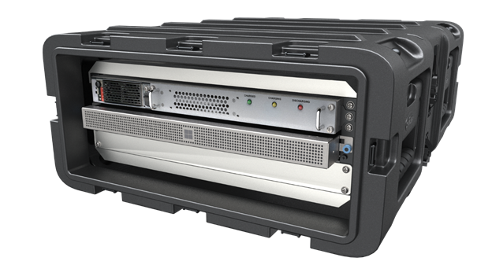

# What is the Azure Stack Edge Pro R?

Azure Stack Edge Pro R is rugged, edge computing device designed for use in harsh environments. Azure Stack Edge Pro R is delivered as a hardware-as-a-service solution. Microsoft ships you a cloud-managed device that acts as network storage gateway and has a built-in Graphical Processing Unit (GPU) that enables accelerated AI-inferencing.

This article provides you an overview of the Azure Stack Edge Pro R solution, key capabilities, and the scenarios where you can deploy this device.

## Key capabilities

Azure Stack Edge Pro R has the following capabilities:

|Capability |Description  |
|---------|---------|
|Rugged hardware| Rugged server class hardware designed for harsh environments. Device contained in a portable transit case. |
|Cloud-managed     |Device and service are managed via the Azure portal.|
|Edge compute workloads   |Allows analysis, processing, filtering of data. Supports VMs and containerized workloads. <ul><li>For information on VM workloads, see [VM overview on Azure Stack Edge](azure-stack-edge-gpu-virtual-machine-overview.md).</li> <li>For containerized workloads, see [Kubernetes overview on Azure Stack Edge](azure-stack-edge-gpu-kubernetes-overview.md)</li></ul> |
|Accelerated AI inferencing| Enabled by an Nvidia T4 GPU.   For more information, see [GPU sharing on your Azure Stack Edge device](azure-stack-edge-gpu-sharing.md).|
|Data access     | Direct data access from Azure Storage Blobs and Azure Files using cloud APIs for additional data processing in the cloud. Local cache on the device is used for fast access of most recently used files.|
|Disconnected mode| Deploy, run, manage applications in offline mode.   Disconnected mode supports offline upload scenarios. For more information, see Use [Azure Stack Edge in disconnected mode](azure-stack-edge-gpu-disconnected-scenario.md)|
|Supported file transfer protocols     |Support for standard SMB, NFS, and REST protocols for data ingestion.   For more information on supported versions, go to [Azure Stack Edge Pro R system requirements](azure-stack-edge-gpu-system-requirements.md).|
|Data refresh     | Ability to refresh local files with the latest from cloud.   For more information, see [Refresh a share on your Azure Stack Edge](azure-stack-edge-gpu-manage-shares.md#refresh-shares).|
|Double encryption    | Use of self-encrypting drives provides the first layer of encryption. VPN provides the second layer of encryption. BitLocker support to locally encrypt data and secure data transfer to cloud over *https*.   For more information, see [Configure VPN on your Azure Stack Edge Pro R device](azure-stack-edge-mini-r-configure-vpn-powershell.md).|
|Bandwidth throttling| Throttle to limit bandwidth usage during peak hours.   For more information, see [Manage bandwidth schedules on your Azure Stack Edge](azure-stack-edge-gpu-manage-bandwidth-schedules.md).|
|Easy ordering| Bulk ordering and tracking of the device via Azure Edge Hardware Center (Preview).   For more information, see [Order a device via Azure Edge Hardware Center](azure-stack-edge-gpu-deploy-prep.md#create-a-new-resource). |

<!--|Scale out file server| Available as 1-node and 4-node cluster configurations|-->

## Use cases

Here are the various scenarios where Azure Stack Edge Pro R can be used for rapid Machine Learning (ML) inferencing at the edge and preprocessing data before sending it to Azure.

- **Inference with Azure Machine Learning** - With Azure Stack Edge Pro R, you can run ML models to get quick results that can be acted on before the data is sent to the cloud. The full data set can optionally be transferred to continue to retrain and improve your ML models. For more information on how to use the Azure Machine Learning hardware accelerated models on the Azure Stack Edge Pro R device, see 
[Deploy Azure Machine Learning hardware accelerated models on Azure Stack Edge Pro R](../machine-learning/how-to-deploy-fpga-web-service.md#deploy-to-a-local-edge-server).

- **Preprocess data** - Transform data before sending it to Azure to create a more actionable dataset. Preprocessing can be used to:

    - Aggregate data.
    - Modify data, for example to remove personal data.
    - Subset data to optimize storage and bandwidth, or for further analysis.
    - Analyze and react to IoT Events.

- **Transfer data over network to Azure** - Use Azure Stack Edge Pro R to easily and quickly transfer data to Azure to enable further compute and analytics or for archival purposes.

## Components

The Azure Stack Edge Pro R solution comprises an Azure Stack Edge resource, Azure Stack Edge Pro R rugged, physical device, and a local web UI.

- **Azure Stack Edge Pro R physical device** - A 1-node compute and storage device contained in a rugged transit case. An optional Uninterruptible Power Supply (UPS) is also available.

    

    [!INCLUDE [azure-stack-edge-gateway-edge-hardware-center-overview](../../includes/azure-stack-edge-gateway-edge-hardware-center-overview.md)]    

    For more information, go to [Create an order for your Azure Stack Edge Pro R device](azure-stack-edge-pro-r-deploy-prep.md#create-a-new-resource).

- **Azure Stack Edge resource** – A resource in the Azure portal that lets you manage a rugged, Azure Stack Edge Pro R device from a web interface that you can access from different geographical locations. Use the Azure Stack Edge resource to create and manage resources, view, and manage devices and alerts, and manage shares.  

- **Azure Stack Edge Pro R local web UI** - A browser-based local user interface on your Azure Stack Edge Pro R device primarily intended for the initial configuration of the device. Use the local web UI also to run diagnostics, shut down and restart the Azure Stack Edge Pro device, view copy logs, and contact Microsoft Support to file a service request.

    [!INCLUDE [azure-stack-edge-gateway-local-web-ui-languages](../../includes/azure-stack-edge-gateway-local-web-ui-languages.md)]

## Region availability

Azure Stack Edge Pro R physical device, Azure resource, and target storage account to which you transfer data do not all have to be in the same region.

- **Resource availability** - For a list of all the regions where the Azure Stack Edge resource is available, go to [Azure products available by region](https://azure.microsoft.com/global-infrastructure/services/?products=databox&regions=all). 

- **Device availability** - For a list of all the countries/regions where the Azure Stack Edge Pro R device is available, go to **Availability** section in the **Azure Stack Edge Pro R** tab for [Azure Stack Edge Pro R pricing](https://azure.microsoft.com/pricing/details/azure-stack/edge/#azureStackEdgeProR).

- **Destination Storage accounts** - The storage accounts that store the data are available in all Azure regions. The regions where the storage accounts store Azure Stack Edge Pro R data should be located close to where the device is located for optimum performance. A storage account located far from the device results in long latencies and slower performance.

Azure Stack Edge service is a non-regional service. For more information, see [Regions and Availability Zones in Azure](../availability-zones/az-overview.md). Azure Stack Edge service does not have dependency on a specific Azure region, making it resilient to zone-wide outages and region-wide outages.

For a discussion of considerations for choosing a region for the Azure Stack Edge service, device, and data storage, see [Choosing a region for Azure Stack Edge](azure-stack-edge-gpu-regions.md).

[!INCLUDE [azure-stack-edge-use-case-parameters](../../includes/azure-stack-edge-use-case-parameters.md)]

## Next steps

- Review the [Azure Stack Edge Pro R system requirements](azure-stack-edge-gpu-system-requirements.md).
<!--- Understand the [Azure Stack Edge Pro R limits](azure-stack-edge-limits.md).-->
