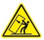
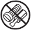
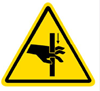
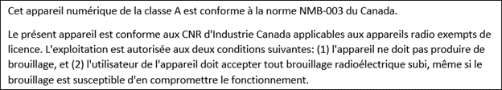

# Azure Stack Edge Pro R safety instructions

**READ SAFETY AND HEALTH INFORMATION**

Read all the safety information in this article before you use your Azure Stack Edge Pro R device. Failure to follow instructions could result in fire, electric shock, injuries, or damage to your properties. Read all safety information below before using Azure Stack Edge Pro R.

## Safety icon conventions

The following signal words for hazard alerting signs are:

| Icon | Description |
|:--- |:--- |
| | **DANGER:** Indicates a hazardous situation that, if not avoided, will result in death or serious injury.   **WARNING:** Indicates a hazardous situation that, if not avoided, could result in death or serious injury.   **CAUTION:** Indicates a hazardous situation that, if not avoided, could result in minor or moderate injury.|
|

The following hazard icons are to be observed when setting up and running your Azure Stack Edge Pro R Edge device:

| Icon | Description |
|:--- |:--- |
|  | Read All Instructions First |
|  **NOTICE:** | Indicates information considered important, but not hazard-related. |
|  | Hazard Symbol |
|   | Tip Hazard|
|   | Heavy Weight Hazard|
|  | Electric Shock Hazard |
|  | No User Serviceable Parts. Do not access unless properly trained. |
|   | Multiple power sources. Disconnect all power cords to remove all power from the equipment. |
|   | Pinching points are present. |
|   | Indicates hot components or surfaces. |

## Handling precautions and site selection

 **WARNING:**

* Proper equipment (for instance, pallet jack) and personal protective equipment (PPE), for instance, gloves must be used when moving and handling the as-shipped device.

 **WARNING:**

* Place the equipment on a flat, hard, and stable surface to avoid a potential tip or crushing hazard.
* Do not stack more than 2 devices on each other.
* Ensure system is secure prior to stacking.
* Do not relocate or move stacked devices.
* Do not stack devices that are energized with external cables.
* Ensure power cords are not crushed or damaged during stacking operations.
* Devices are not to be used as tables or workspaces.

 **CAUTION:**

* Inspect the *as-received* device for damages. If the device enclosure is damaged, [contact Microsoft Support](azure-stack-edge-contact-microsoft-support.md) to obtain a replacement. Do not attempt to operate the device.
* If you suspect the device is malfunctioning, [contact Microsoft Support](azure-stack-edge-contact-microsoft-support.md) to obtain a replacement. Do not attempt to service the device.
* The device contains no user-serviceable parts. Hazardous voltage, current, and energy levels are present inside. Do not open. Return the device to Microsoft for servicing.

  **WARNING:**

* Removing the power supply module of the UPS exposes energized parts within the UPS. Do not insert foreign objects inside the power supply module compartment.
* Do not try to lift an Azure Stack Edge Pro R Edge device by yourself. An enclosure can weigh up between 52 kg and 93 kg (115 lbs and 205 lbs); use mechanical assistance or other suitable assistance when moving and lifting equipment. Conform to local occupational health and safety requirements when moving and lifting equipment.
* Do not attempt lifting the equipment without proper mechanical aid. Be aware that attempting to lift this weight can cause severe injuries.

  **WARNING:**

* The system is designed to operate in a controlled environment. Choose a site that is:
  * Well-ventilated and away from sources of heat including direct sunlight and radiators.
  * Not exposed to moisture or rain.
  * Located in a space that minimizes vibration and physical shock.  The system is designed for shock and vibration according to MIL-STD-810G.
  * Isolated from strong electromagnetic fields produced by electrical devices.
  * Provided with properly grounded outlets.
  * Provided with adequate space to access the power supply cord(s), because they serve as the product's main power disconnect.
* Ethernet cables are not provided with the product. To reduce electromagnetic interference, it is recommended that Cat 6 Shielded Twisted-pair (STP) cabling be used.
* Set up the equipment in a work area allowing for adequate air circulation around the equipment; ensure that the front and back covers are fully removed while the device is running.
* Ethernet cables are not provided with the product. To reduce electromagnetic interference, it is recommended that Cat 6 Shielded (STP) cabling be used.
* Install the equipment in temperature-controlled area free of conductive contaminants and allow for adequate air circulation around the equipment.
* Keep the equipment away from sources of liquid and excessively humid environments.
* Do not allow any liquid or any foreign object to enter the system. Do not place beverages or any other liquid containers on or near the system.

## Heater precautions

  **WARNING:** 

* Automatic heater operation while the system is powered on may create a touch hazard due to high surface temperatures on the heater assembly cover. Do not touch this surface while the system is powered on. Allow a 10-minute cool down period after the system is powered off.

  **WARNING:** 

* When the system is powered on, automatic actuation of the rear plenum door may create a pinch-point hazard. Keep hands clear of this area when the system is powered on.

## Electrical precautions

  **WARNING:**

* Provide a safe electrical earth connection to the power supply cord. The alternating current (AC) cord has a three-wire grounding plug (a plug that has a grounding pin). This plug fits only a grounded AC outlet. Do not defeat the purpose of the grounding pin.
* Given that the plug on the power supply cord is the main disconnect device, ensure that the socket outlets are located near the device and are easily accessible.
* Unplug the power cord(s) (by pulling the plug, not the cord) and disconnect all cables if any of the following conditions exist:

  * The power cord or plug becomes frayed or otherwise damaged.
  * You spill something into the device casing.
  * The device is exposed to rain or excess moisture.
  * The device was dropped and the device casing is damaged.
  * You suspect the device needs service or repair.
* Permanently unplug the unit before you move it or if you think it has become damaged in any way.
* To prevent high leakage current, when a single transit case has more than one uninterrupted power supply (UPS), it is recommended that each UPS is connected to an independent branch circuit. However, in the event that a power distribution unit (PDU) or other device is used where the safety ground of each UPS relies on a single feeder grounding conductor of the PDU, the grounding terminal on the exterior of each UPS must also be used with a supplemental building ground conductor.

  > [!NOTE]
  > If a PDU is used which already has a supplemental grounding conductor, using the additional grounding terminal on the UPS is not required.

* Provide a suitable power source with electrical overload protection to meet the following power specifications:

  * Voltage: 100 to 240 Volts AC
  * Current: 20 A, maximum per power cord. Power cord(s) are provided.
  * Frequency: 50 to 60 Hz

 **WARNING:**

* For systems without an uninterrupted power supply (UPS), unplug all AC power cord(s) to completely remove AC power from the equipment.
* For systems with UPS, unplug all AC power cord(s) and use the UPS power switch to de-energize the System. UPS contains hazardous AC and DC voltages.
* If a system includes a UPS, the UPS was provided with a shielded input power cable. You must use the shielded input power cable, do not replace or modify the cord.

 **WARNING:**

* For systems equipped with UPS, AC and/or DC voltage will always involve a potential risk of AC voltage at UPS output generated from either batteries or utility. To avoid equipment damage or personal injury, always assume that there may be voltage at the UPS output, even when disconnected from the primary power source.
* For systems equipped with UPS, all UPS energized external connections are female. Do not remove the case or insert anything into these or any connectors on the UPS.

 **WARNING:**

* Do not attempt to modify or use AC power cord(s) other than the ones provided with the equipment.

 **CAUTION:**

* This equipment contains lithium coin cell and/or lithium iron phosphate batteries. Do not attempt servicing the equipment. Batteries in this equipment are not user serviceable. Risk of explosion if battery is replaced by an incorrect type.
* Removing the battery module of the UPS exposes energized parts within the UPS. Do not insert foreign objects inside the battery module compartment.

## Regulatory information

This section contains regulatory information for Azure Stack Edge Pro R device, regulatory model number: Azure Stack Edge Pro R .

The Azure Stack Edge Pro R Edge device is designed for use with NRTL Listed (UL, CSA, ETL, etc.), and IEC/EN 60950-1 or IEC/EN 62368-1 compliant (CE marked) Information Technology equipment.

The device is designed to operate in the following environments:

| Environment | Specifications |
|:--- |:--- |
|Temperature specifications | <ul><li>Storage temperature: –33&deg;C–63&deg;C (–28&deg;F-145&deg;F) </li><li>Continuous operation: 5&deg;C–43&deg;C (41&deg;F–110&deg;F)</li><li>Maximum temperature gradient (operating and storage): 20&deg;C/h (68&deg;F/h)</li></ul> |
|Relative humidity specifications | <ul><li>Storage: 5% to 95% RH with 33&deg;C (91&deg;F) maximum dew point. Atmosphere must be non-condensing at all times.</li><li>Operating: 5% to 85% relative humidity with 29&deg;C (84.2&deg;F) maximum dew point</li></ul> |
| Maximum altitude specifications | <ul><li>Operating (Without UPS): 15,000 ft (4,572 meters)</li><li>Operating (With UPS): 10,000 ft (3,048 meters)</li><li>Storage: 40,000 ft (12,192 meters)</li></ul> |

<!--|Standard operating temperature specifications | <ul>Continuous operation (for altitude less than 950 m or 3117 ft): +5&deg;C–45&deg;C (41&deg;F–113&deg;F) with no direct sunlight on the equipment</ui>
|Expanded operating temperature specifications | <ul><li>Continuous operation: 5&deg;C to 45&deg;C at 5% to 85% RH with 29&deg;C dew point.</li><li></= 1% of annual operating hours: –5&deg;C to 55&deg;C at 5% to 90% RH with 29&deg;C dew point. |
| Expanded operating temperature restrictions | <ul><li>Do not perform cold start below -15&deg;C according to IEC 60945.</li><li>The operating temperature specified is for a maximum altitude of 950 meters.</li></ul> |
| Gaseous contamination specifications | <ul><li>Copper coupon corrosion rate: < 300 &Aring;/month per Class G1 as defined by ANSI/ISA71.04-1985.</li><li>Silver coupon corrosion rate: < 200 &Aring;/month as defined by AHSRAE TC9.9.</li></ul>|

> [!NOTE]
> Outside the standard operating temperature (10&deg;C to 35&deg;C):
> - The system can operate continuously in temperatures as low as 5&deg;C and as high as 45&deg;C. For temperatures between 35&deg;C and 45&deg;C, de-rate maximum allowable temperature by 1&deg;C per 175 m above 950 m (1&deg;F per 319 ft).
> - The system can operate down to –5&deg;C or up to 55&deg;C for a maximum of 1% of its annual operating hours. For temperatures between 45&deg;C and 55&deg;C, de-rate maximum allowable temperature by 1&deg;C per 125 m above 950 m (1&deg;F per 228 ft).
>
> When operating in the expanded temperature range:
> - System performance may be impacted.
> - Ambient temperature warnings may be reported in the System Event Log.     
>
> Maximum corrosive contaminant levels measured at &lt;/= 50% relative humidity. 

A device that has a UPS installed is designed to operate in the following environments:

| Environment | Specifications |
|:---  |:--- |
|Temperature specifications | <ul><li>Storage temperature: –40&deg;C–70&deg;C (–40&deg;F-158&deg;F) per Mil-Std 810G Method 501.5, Proc 1</li><li>Continuous operation (for altitude less than 950 m or 3117 ft): 5&deg;C–45&deg;C (41&deg;F–113&deg;F), with no direct sunlight on the equipment</li><li>Excursion temperature: 50&deg;C per Mil-Std 810G</li><li>Maximum temperature gradient (operating and storage): 20&deg;C/h (68&deg;F/h)</li></ul> |
|Relative humidity specifications | <ul><li>Storage: 5% to 95% RH with 33&deg;C (91&deg;F) maximum dew point. Atmosphere must be non-condensing at all times.</li><li>Operating: 5% to 85% relative humidity with 29&deg;C (84.2&deg;F) maximum dew point</li></ul>|
|Maximum altitude specifications | <ul><li>Storage: Mil-Std 810G method 500.5, Proc. I, 40,000 ft for 1 hour after stabilization </li><li>Operating: Mil-Std 810G method 500.5, Proc. II, air carriage, 15,000 ft for 1 hour after stabilization</li></ul>|
|Standard operating temperature specifications |<ul><li>Continuous operation (for altitude less than 950 m or 3117 ft)</li><li>+5&deg;C–45&deg;C (41&deg;F–113&deg;F) with no direct sunlight on the equipment</li></ul>|
|Expanded operating temperature specifications | <ul><li>Continuous operation: 5&deg;C to 45&deg;C at 5% to 85% RH with 29&deg;C dew point.</li><li>&lt;/= 1% of annual operating hours: 0&deg;C to 50&deg;C at 5% to 90% RH with 29&deg;C dew point.</li></ul>|
|Expanded operating temperature restrictions | <ul><li>Do not perform cold start below -15C Per IEC 60945</li><li>The operating temperature specified is for a maximum altitude of 950 meters</li></ul> |
|Gaseous contamination specifications | <ul><li>Copper coupon corrosion rate: < 300 &Aring;/month per Class G1 as defined by ANSI/ISA71.04-1985.</li><li>Silver coupon corrosion rate: < 200 &Aring;/month as defined by AHSRAE TC9.9.|-->

<!--
> [!NOTE]
> Outside the standard operating temperature (10&deg;C to 35&deg;C):
> - The system can operate continuously in temperatures as low as 5&deg;C and as high as 45&deg;C. For temperatures between 35&deg;C and 45&deg;C, de-rate maximum allowable temperature by 1&deg;C per 175 m above 950 m (1&deg;F per 319 ft).
> - The system can operate down to 0&deg;C or up to 50&deg;C for a maximum of 1% of its annual operating hours. For temperatures between 45&deg;C and 55&deg;C, de-rate maximum allowable temperature by 1&deg;C per 125 m above 950 m (1&deg;F per 228 ft).
> 
> When operating in the expanded temperature range:
> - System performance may be impacted.
> - Ambient temperature warnings may be reported in the System Event Log.
>
> Maximum corrosive contaminant levels measured at &lt;/= 50% relative humidity. --> 

>  **NOTICE:** &nbsp;Changes or modifications made to the equipment not expressly approved by Microsoft may void the user's authority to operate the equipment.

#### CANADA and USA:

>  **NOTICE:** &nbsp;This equipment  has been tested and found to comply with the limits for a Class A digital device, pursuant to part 15 of the FCC Rules. These limits are designed to provide reasonable protection against harmful interference when the equipment is operated in a commercial environment. This equipment generates, uses, and can radiate radio frequency energy and, if not installed and used in accordance with the instruction manual, may cause harmful interference to radio communications. Operation of this equipment in a residential area is likely to cause harmful interference in which case the user will be required to correct the interference at their own expense.

This device complies with part 15 of the FCC Rules and Industry Canada license-exempt RSS standard(s). Operation is subject to the following two conditions: (1) this device may not cause harmful interference, and (2) this device must accept any interference received, including interference that may cause undesired operation of the device.

CAN ICES-3(A)/NMB-3(A)
Microsoft Corporation, One Microsoft Way, Redmond, WA 98052, USA
United States: (800) 426-9400
Canada: (800) 933-4750

#### EUROPEAN UNION:

Request a copy of the EU Declaration of Conformity. Send email to [CSI_Compliance@microsoft.com](mailto:CSI_Compliance@microsoft.com).

 **WARNING!**

This is a class A product. In a domestic environment, this product may cause radio interference in which case the user may be required to take adequate measures.

Disposal of waste batteries and electrical and electronic equipment:

This symbol on the product or its batteries or its packaging means that this product and any batteries it contains must not be disposed of with your household waste. Instead, it is your responsibility to hand this over to an applicable collection point for the recycling of batteries and electrical and electronic equipment. This separate collection and recycling will help to conserve natural resources and prevent potential negative consequences for human health and the environment due to the possible presence of hazardous substances in batteries and electrical and electronic equipment, which could be caused by inappropriate disposal. For more information about where to drop off your batteries and electrical and electronic waste, please contact your local city/municipality office, your household waste disposal service, or the shop where you purchased this product. Contact erecycle@microsoft.com for additional information on WEEE.

This product contains coin cell battery(ies).

Microsoft Ireland Sandyford Ind Est Dublin D18 KX32 IRL
Telephone number: +353 1 295 3826
Fax number: +353 1 706 4110

## Next steps

- [Prepare to deploy Azure Stack Edge Pro R Edge](azure-stack-edge-pro-r-deploy-prep.md)
