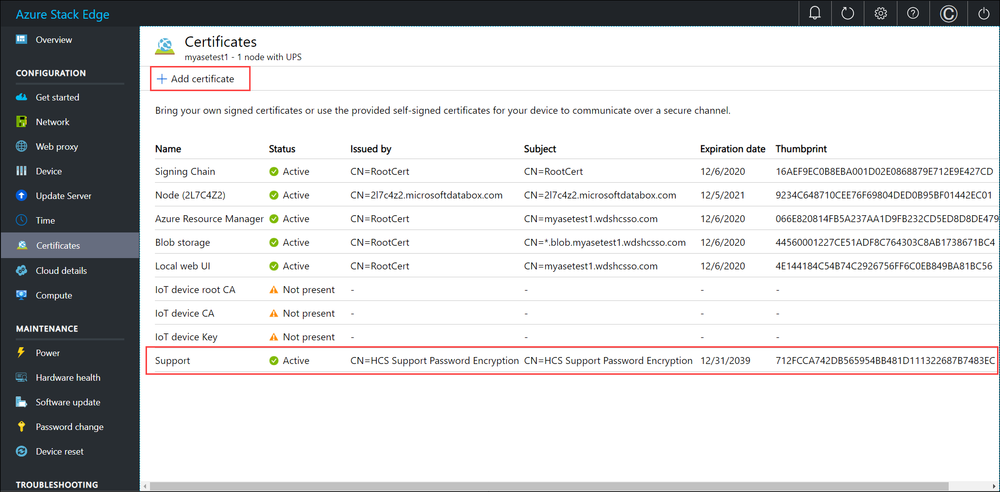
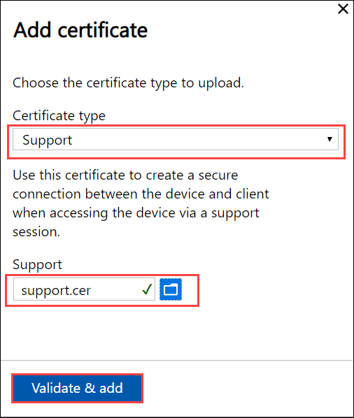
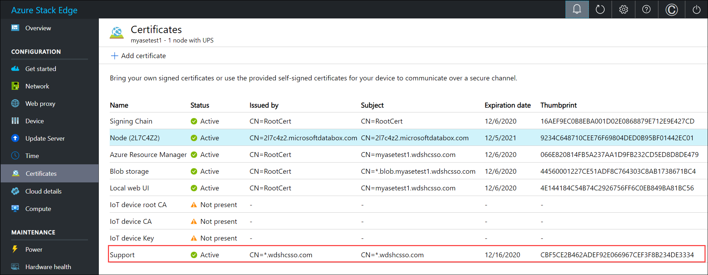

# Connect to a Support session on an Azure Stack Edge device via Windows PowerShell

The Azure Stack Edge device provides the capability to log a new support request within the Azure portal. If you encounter any issues with your Azure Stack Edge solution, you will need to engage with the Microsoft Support team. In an online session with your support engineer, you may also need to start a support session on your Azure Stack Edge device. 

This article walks you through how to start a support session in the Windows PowerShell interface of your Azure Stack Edge device. To start a Support session, you need to:

- Generate and install a Support session certificate.
- Get an encryption password for Support session.
- Install the Support password decrypter tool.
- Decrypt the password using the Support password decrypter.
- Start the Support session.
- Exit Support session after the issues are resolved.

The following sections describe in details each of the following steps.

## Prerequisites

Before you begin, make sure that:

- Your Windows client that will be used to connect to your Azure Stack Edge device is running Windows PowerShell 5.0 or later.
- Your Azure Stack Edge device is activated. For security reasons, the Support session certificate can only be uploaded after the device is activated. When the device is not activated, you won't see the Support certificate session. 

## Create and install Support session certificate

A self-signed certificate for Support session is generated when the device is activated. You can replace this with your own Support session certificate.

When you bring your own certificate, you must:

- Upload the certificate to your Azure Stack Edge device in appropriate format.
- Import the Support session certificate into your client where the decrypt tool is installed. 

For more information on certificates, go to [Manage certificates on your Azure Stack Edge device](azure-stack-edge-r-series-manage-certificates.md).

**For test and development purposes only**, do the following steps to generate a self-signed support session certificate:

1. Generate a self-signed certificate. Run PowerShell as administrator. Type:

    `New-SelfSignedCertificate -DnsName "<DNS domain>" -CertStoreLocation "cert:\LocalMachine\My"`

    This creates a new self-signed certificate in the Personal certificate store of your local system. Copy the thumbprint corresponding to this certificate. Here is the sample output:


    ```powershell
    PS C:\windows\system32> New-SelfSignedCertificate -DnsName "*.wdshcsso.com" -CertStoreLocation "cert:\LocalMachine\My"
    
    PSParentPath: Microsoft.PowerShell.Security\Certificate::LocalMachine\My
    
    Thumbprint                                Subject
    ----------                                -------
    CBF5CE2B462ADEF92E066967CEF3F8B234DE3334  CN=*.wdshcsso.com
    ```

2. Export the certificate to generate a DER format file with a *.cer* extension. 
    
    ```powershell
    $cert = (Get-ChildItem -Path cert:\LocalMachine\My\<Certificate thumbprint>)
        Export-Certificate –Cert $cert -FilePath <Path to .cer file>
    ``` 

    Here is a sample output:

    ```powershell
    PS C:\windows\system32> $cert = (Get-ChildItem -Path cert:\LocalMachine\My\CBF5CE2B462ADEF92E066967CEF3F8B234DE3334)
    PS C:\windows\system32> Export-Certificate -Cert $cert -FilePath C:\Certificates\support.cer

    Directory: C:\Certificates

    Mode                LastWriteTime         Length Name
    ----                -------------         ------ ----
    -a----       12/16/2019   9:30 AM            811 support.cer
    ```

3. To upload the exported certificate to your Azure Stack Edge device, in the local web UI, go to the**Certificates** page. Select **+ Add certificate**. 

    

4. In the **Add certificate** blade, choose certificate type as **Support** and then browse to the location on your system where you stored the *.cer* file.

    

5. After the certificate is successfully applied, you can verify that the certificate you created is the one that was uploaded by comparing the thumbprint.

    

    For more information on certificates, go to [Manage certificates on your Azure Stack Edge device](azure-stack-edge-r-series-manage-certificates.md).


## Connect to device from a remote client

[!INCLUDE [Connect to admin runspace](../../includes/azure-stack-edge-gateway-connect-minishell.md)]

## Get encryption password
 
1. After you are connected to the constrained runspace (minishell), type: 

    `Enable-HcsSupportAccess`

    This cmdlet generates a 456 characters long encrypted password for the Support session. Here is a sample output.

    ```powershell
    [10.126.70.62]: PS>Enable-HcsSupportAccess
        UAAAAEMAQgBGADUAQwBFADIAQgA0ADYAMgBBAEQARQBGADkAMgBFADAANgA2ADkANgA3AEMARQBGADMARgA4AEIAMgAzADQARABFADMAMwAzADQAKesIJVfckNe3d9OvWQNru3ZiPQUPzY++ZapnY7MklkT6Vhz7Bb78pkYOgA46WqvMHJDGoAp3emj3pxZITFAITEtnPBIRa+B5+Ta46QiuwuoUNEamm9+pKOBbI75h1sX/xkm0nkeO9lp32xWilFXLhZsdGgWsJ+efwADnwkm5a/b+5FQXKFZCO5XPFN1whpLF8n5CsUQsjo0wTtiDhl6jNmdN8tvrm2iL5XaD1t1/lmDrBZa7X0M3kSScq6rnRsG4I7iWIO3ldrOY4xiQigaIRkoeoTH9dRyPSDDMvXRNwj8lvQVc//+9MljwsvWgCBzmOq54UPsJlVE3HBBfNBBDWQ==
        [10.126.70.62]: PS>
    ```

2. Copy the encrypted password. You will need to decrypt this password and provide it to enter a Support session. 
   
3. After you've copied the encrypted password, you can close the PowerShell window to exit the session.


## Install Support password decrypter tool

Do the following steps on the client.

> [!IMPORTANT]
> These steps must be performed on the same client where you've installed the Support session certificate.

1. Create a folder*SupportSessionDecrypter* on your system.

2. Go to [https://aka.ms/support-password-decrypter](https://aka.ms/support-password-decrypter) to get the Support password decrypter tool. 

3. Copy the tool to the folder you've created. 

    Here is the sample output:

    ```powershell
    PS C:\windows\system32> cd C:\SupportSessionDecrypter
    PS C:\SupportSessionDecrypter> dir
    
        Directory: C:\SupportSessionDecrypter
    
    Mode                LastWriteTime         Length Name
    ----                -------------         ------ ----
    -a----        7/17/2017   2:46 PM          36864 Microsoft.Management.Infrastructure.dll
    -a----        12/9/2019   4:03 PM           9728 SupportPasswordDecrypter.dll
    -a----        7/17/2017   2:46 PM         360448 System.Management.Automation.dll
    ```
 
## Get the decrypted password

> [!IMPORTANT]
> These steps must be performed on the same client where you've installed the Support password decrypter tool.

1. Run PowerShell as administrator. 

2. Run the command:

    `Import-Module .\SupportPasswordDecrypter.dll`

3. To get the decrypted password to enter the Support session, run the following command:

    `Get-HcsSupportPassword -EncryptedPassword “<Encrypted password that was copied>”`

    This command generates a 15 character password. Copy the password and use this password to log in to the support session. Here is a sample output:

    ```powershell
        PS C:\SupportSessionDecrypter> Get-HcsSupportPassword -EncryptedPassword "UAAAAEMAQgBGADUAQwBFADIAQgA0ADYAMgBBAEQARQBGADkAMgBFADAANgA2ADkANgA3AEMARQBGADMARgA4AEIAMgAzADQARABFADMAMwAzADQAKesIJVfckNe3d9OvWQNru3ZiPQUPzY++ZapnY7MklkT6Vhz7Bb78pkYOgA46WqvMHJDGoAp3emj3pxZITFAITEtnPBIRa+B5+Ta46QiuwuoUNEamm9+pKOBbI75h1sX/xkm0nkeO9lp32xWilFXLhZsdGgWsJ+efwADnwkm5a/b+5FQXKFZCO5XPFN1whpLF8n5CsUQsjo0wTtiDhl6jNmdN8tvrm2iL5XaD1t1/lmDrBZa7X0M3kSScq6rnRsG4I7iWIO3ldrOY4xiQigaIRkoeoTH9dRyPSDDMvXRNwj8lvQVc//+9MljwsvWgCBzmOq54UPsJlVE3HBBfNBBDWQ=="
        yH2PzmkMfVWrzIx
        PS C:\SupportSessionDecrypter>
    ```

## Start the Support session

### Use http

1. Use the same PowerShell windows where the support password was generated or run PowerShell as administrator to open a new PowerShell Window.

2. Log in to the device support session. Type the following commands:

    ```powershell
        $ip = “Device IpAddress”
        Enter-PSSession -ComputerName $ip -Credential ~\EdgeSupport -ConfigurationName SupportSession
    ```
3. In the Windows PowerShell credential request dialog, enter the 15 character decrypted password you got in the earlier step.

    Here is the sample output:

    ```powershell
        PS C:\windows\system32> $ip = "10.126.70.62"
        PS C:\windows\system32> Enter-PSSession -ComputerName $ip -Credential ~\EdgeSupport -ConfigurationName SupportSession
        [10.126.70.62]: PS C:\Users\EdgeSupport\Documents>
    ```

After the authentication is successful, you are connected to a Support session on your Azure Stack Edge device over *http*.

### Use https

1. Use the same PowerShell windows where the support password was generated or run PowerShell as administrator to open a new PowerShell Window.

2. Log in to the device support session. Type the following commands:

    ```powershell
        $ip = “FQDN of node”
        $soptions = New-PSSessionOption -SkipCACheck -SkipRevocationCheck                
        Enter-PSSession -ComputerName $ip -Credential ~\EdgeSupport -ConfigurationName SupportSession -Port 5986 -SessionOption $soptions -UseSSL
    ```
3. In the Windows PowerShell credential request dialog, enter the 15 character decrypted password you got in the earlier step.

After the authentication is successful, you are connected to a Support session on your Azure Stack Edge device over *https*.

### Verify the connection

To confirm that you have entered the Support session, type the following command:

    `whoami`

The output should be `<Device serial no.>\edgesupport`. Here is a sample output: 

```powershell
[10.126.70.62]: PS C:\Users\EdgeSupport\Documents> whoami
2l7c4z2\edgesupport
[10.126.70.62]: PS C:\Users\EdgeSupport\Documents>
```

## Exit Support session

To exit Support session, do the following steps:

1. To disable support access, run `Disable-HcsSupportAccess`.
2. Close the PowerShell window.

The Azure Stack Edge device will also attempt to disable support access 5 hours after the session was initiated. 

> [!TIP]
> It is a best practice to change your Azure Stack Edge device credentials after initiating a support session.

## Next steps

- Troubleshoot [Azure Stack Edge](azure-stack-edge-r-series-troubleshoot.md) in Azure portal.
