# Tutorial: Prepare to deploy Azure Stack Edge  

This is the first tutorial in the series of deployment tutorials that are required to completely deploy Azure Stack Edge. This tutorial describes how to prepare the Azure portal to deploy a Azure Stack Edge resource. The tutorial uses a 1-node Azure Stack Edge device shipped with an Uninterruptible Power Supply (UPS).

You need administrator privileges to complete the setup and configuration process. The portal preparation takes less than 10 minutes.

In this tutorial, you learn how to:

> [!div class="checklist"]
> * Create a new resource
> * Get the activation key

If you don't have an Azure subscription, create a [free account](https://azure.microsoft.com/free/?WT.mc_id=A261C142F) before you begin.

### Get started

To deploy Azure Stack Edge, refer to the following tutorials in the prescribed sequence.

| **#** | **In this step** | **Use these documents** |
| --- | --- | --- | 
| 1. |**[Prepare the Azure portal for Azure Stack Edge](azure-stack-edge-r-series-deploy-prep.md)** |Create and configure your Azure Stack Edge resource before you install an Azure Stack Edge physical device. |
| 2. |**[Install Azure Stack Edge](azure-stack-edge-r-series-deploy-install.md)**|Unpack and cable the Azure Stack Edge physical device.  |
| 3. |**[Connect, set up, and activate Azure Stack Edge](azure-stack-edge-r-series-placeholder.md)** |Connect to the local web UI, complete the device setup, and activate the device. The device is ready to set up SMB, NFS, or REST shares.  |
| 4A. |**[Transfer data with Azure Stack Edge](azure-stack-edge-r-series-placeholder.md)** |Add shares and connect to shares via SMB or NFS. |
| 4B. |**[Transfer data with Azure Stack Edge](azure-stack-edge-r-series-placeholder.md)** |Add storage accounts and connect to blob storage via REST APIs. |
| 5. |**[Transform data with Azure Stack Edge](azure-stack-edge-r-series-placeholder.md)** |Configure compute modules on the device to transform the data before it moves to Azure. |

You can now begin to set up the Azure portal.

## Prerequisites

Following are the configuration prerequisites for your Azure Stack Edge resource, your Azure Stack Edge device, and the datacenter network.

### For the Azure Stack Edge resource

Before you begin, make sure that:

- Your Microsoft Azure subscription is enabled for an Azure Stack Edge resource. Pay-as-you-go subscriptions are not supported.
- You have owner or contributor access at resource group level for the Azure Stack Edge/Azure Storage Gateway, IoT Hub, and Azure Storage resources.

    - To create any Azure Stack Edge resource, you should have permissions as a contributor (or higher) scoped at resource group level. You also need to make sure that the `Microsoft.DataBoxEdge` provider is registered. For information on how to register, go to [Register resource provider](data-box-edge-manage-access-power-connectivity-mode.md#register-resource-providers).
    - To create any IoT Hub resource, make sure that Microsoft.Devices provider is registered. For information on how to register, go to [Register resource provider](data-box-edge-manage-access-power-connectivity-mode.md#register-resource-providers).
    - To create a Storage account resource, again you need contributor or higher access scoped at the resource group level. Azure Storage is by default a registered resource provider.
- You have admin or user access to Azure Active Directory Graph API. For more information, see [Azure Active Directory Graph API](https://docs.microsoft.com/previous-versions/azure/ad/graph/howto/azure-ad-graph-api-permission-scopes#default-access-for-administrators-users-and-guest-users-).
- You have your Microsoft Azure storage account with access credentials.

### For the Azure Stack Edge device

Before you deploy a physical device, make sure that:

- You've reviewed the safety information for this device at [Safety guidelines for your Azure Stack Edge device](azure-stack-edge-r-series-placeholder.md).
- You have access to a flat, stable, and level work surface where the device can rest safely.
- The site where you intend to set up the device has standard AC power from an independent source or a rack power distribution unit (PDU). The device is shipped with an uninterruptible power supply (UPS) and a heater.
- You have received the physical device.

### For the datacenter network

Before you begin, make sure that:

- The network in your datacenter is configured per the networking requirements for your Azure Stack Edge device. For more information, see [Azure Stack Edge System Requirements](azure-stack-edge-r-series-system-requirements.md).

- For normal operating conditions of your Azure Stack Edge, you have:

    - A minimum of 10-Mbps download bandwidth to ensure the device stays updated.
    - A minimum of 20-Mbps dedicated upload and download bandwidth to transfer files.

## Create a new resource

If you have an existing Azure Stack Edge resource to manage your physical device, skip this step and go to [Get the activation key](#get-the-activation-key).

To create a Azure Stack Edge resource, take the following steps in the Azure portal.

1. Use your Microsoft Azure credentials to sign in to 
    
    - The Azure portal at this URL: [https://portal.azure.com](https://portal.azure.com).
    - Or, the Azure Government portal at this URL: [https://portal.azure.us](https://portal.azure.us). For more details, go to [Connect to Azure Government using the portal](https://docs.microsoft.com/azure/azure-government/documentation-government-get-started-connect-with-portal).

2. In the left-pane, select **+ Create a resource**. 

    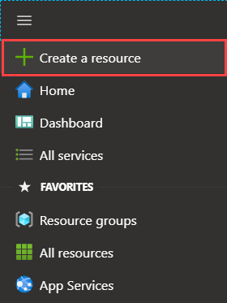

3. Search for **Azure Stack Edge / Data Box Gateway**. Select **Azure Stack Edge / Data Box Gateway**. 

    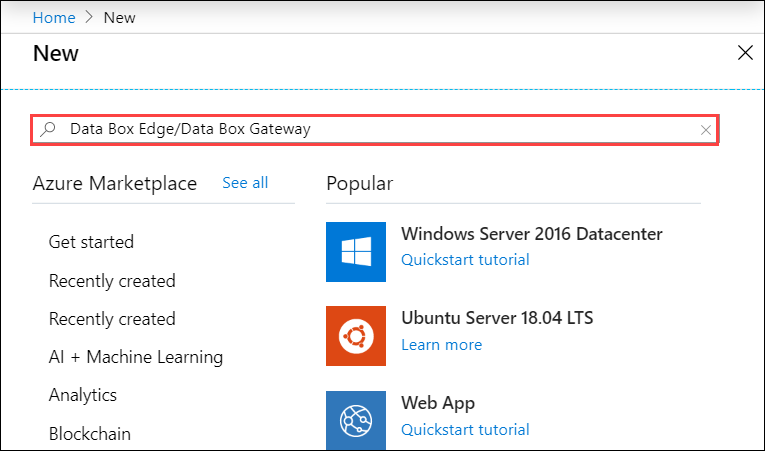

4. Select **Create**.

    <!--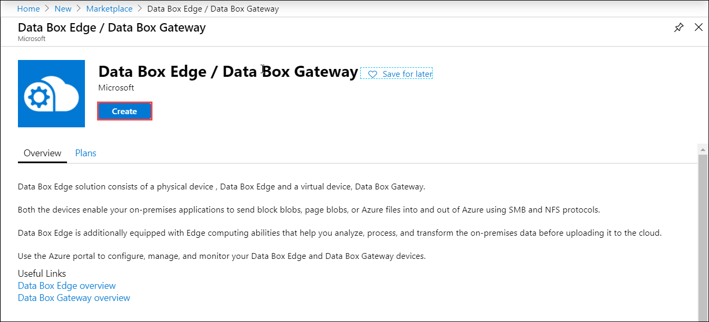-->

5. Pick the subscription that you want to use for the Azure Stack Edge device. Select the region where you want to deploy the Azure Stack Edge resource. For this release, East US, South East Asia, and West Europe are available. 

    Choose a location closest to the geographical region where you want to deploy your device. The region stores only the metadata for device management. The actual data can be stored in any storage account. 
    
    Select **Apply**.

    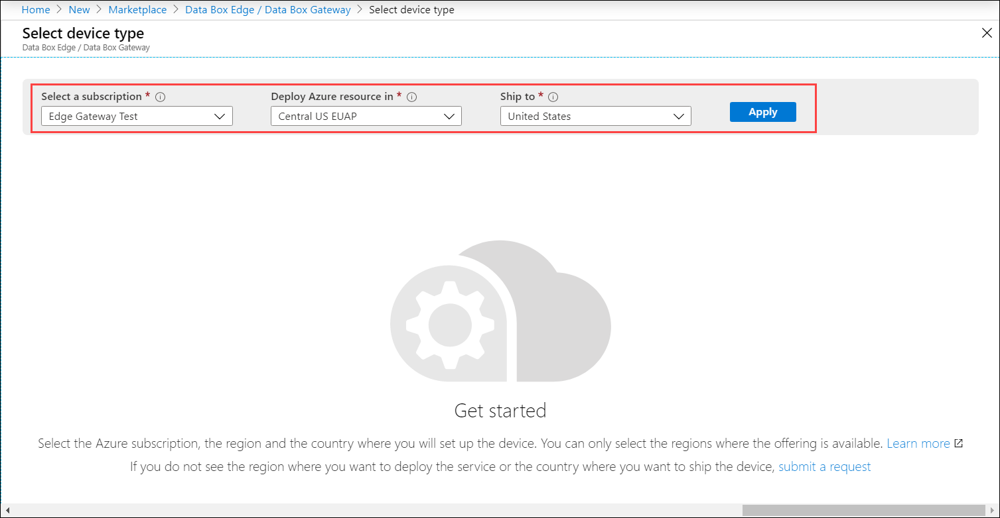

5. Select your Azure Stack Edge device. In this example, **Azure Stack Edge Rugged J-series** was selected.

    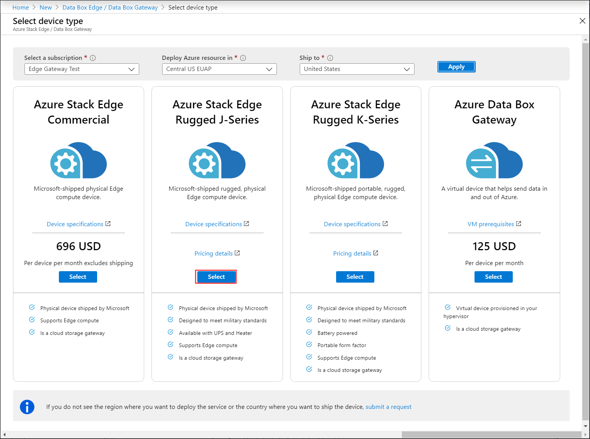

3. On the **Basics** tab, enter or select the following **Project details**.
    
    |Setting  |Value  |
    |---------|---------|
    |Subscription    |This is automatically populated based on the earlier selection. Subscription is linked to your billing account. |
    |Resource group  |Select an existing group or create a new group. Learn more about [Azure Resource Groups](../azure-resource-manager/resource-group-overview.md).     |

4. Enter or select the following **Instance details**.

    |Setting  |Value  |
    |---------|---------|
    |Name   | A friendly name to identify the resource. The name has between 2 and 50 characters containing letter, numbers, and hyphens.  Name starts and ends with a letter or a number.        |
    |Region     |For this release, East US, South East Asia, and West Europe are available to deploy your resource. If using Azure Government, all the government regions are available as shown in the [Azure regions](https://azure.microsoft.com/global-infrastructure/regions/).  Choose a location closest to the geographical region where you want to deploy your device.|
    |Configuration   | Choose the appropriate configuration for your device. The following configurations are available: <ul><li>1-node device</li><li> 1-node device with UPS.</li><li>1-node device with UPS and heater</li><li>4-node device</li><li>4-node device with UPS</li><li>4-node device with UPS and heater</li></ul>       |

    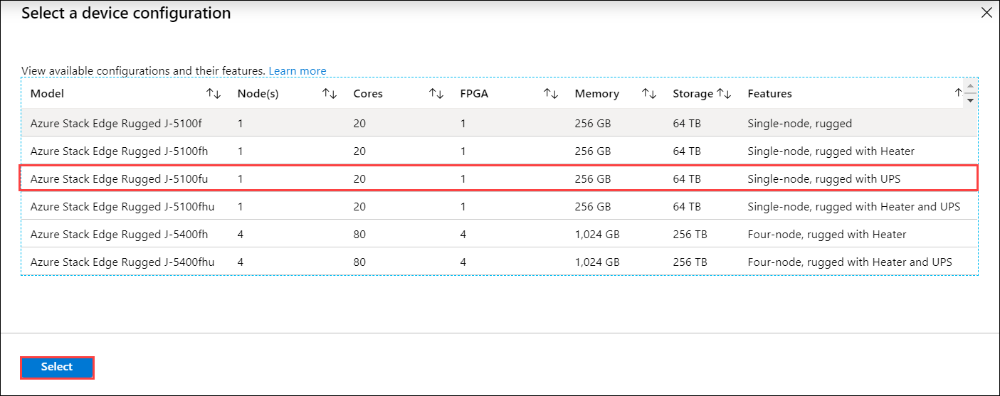

    The **Basics** tab should look like the following screenshot: 

    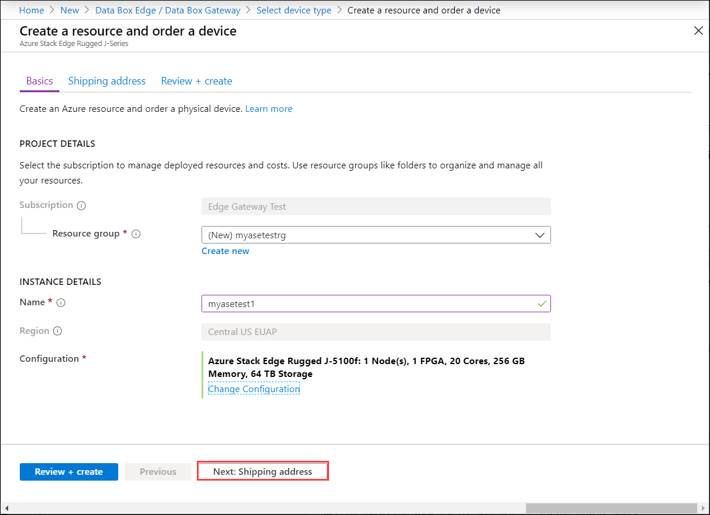
 

5. Select **Next: Shipping address**.

    - If you already have a device, select the combo box for **I have an Azure Stack Edge device**.

        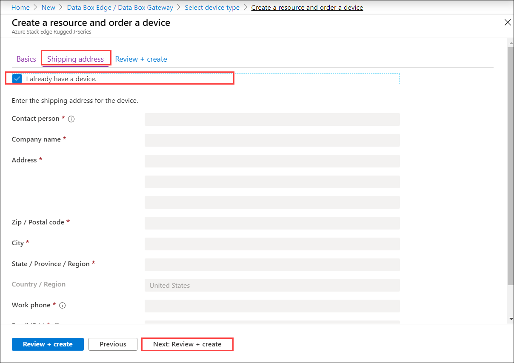

    - If this is the new device that you are ordering, enter the contact name, company, address to ship the device, and contact information.

        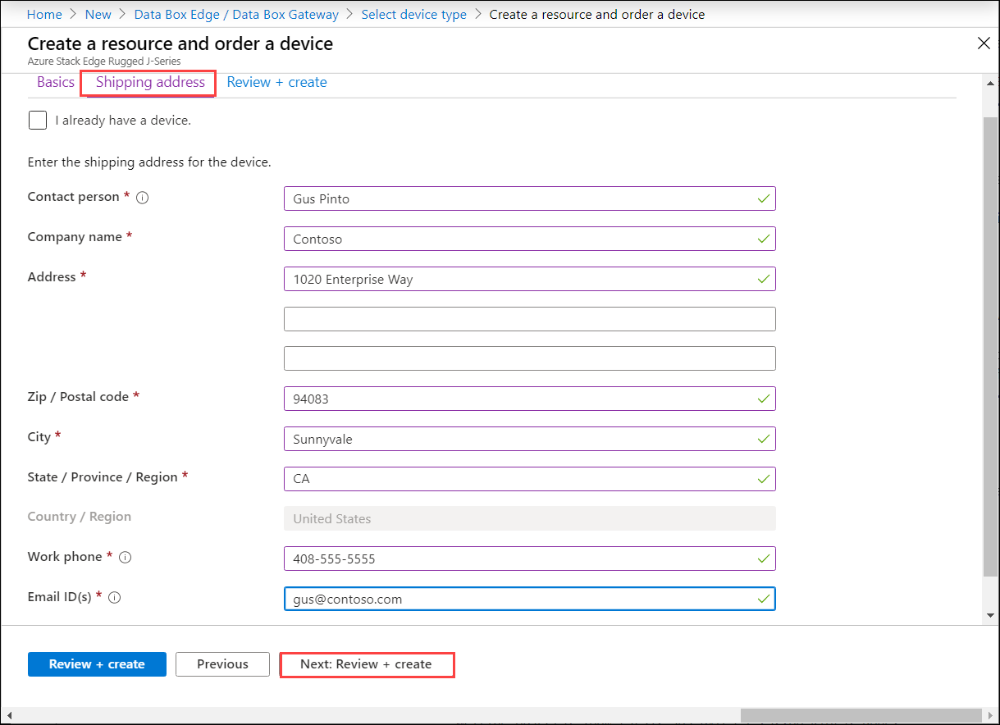

6. Select **Next: Review + create**.

7. On the **Review + create** tab, review the **Pricing details**, **Terms of use**, and the details for your resource. Select the combo box for **I have reviewed the privacy terms**.

    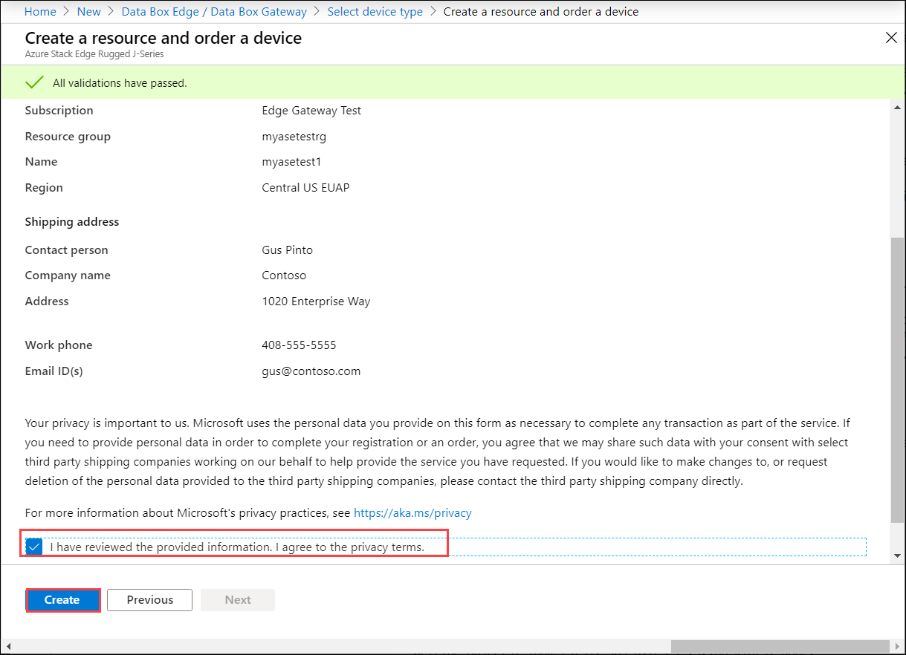

8. Select **Create**.

The resource creation takes a few minutes. After the resource is successfully created and deployed, you're notified. Select **Go to resource**.

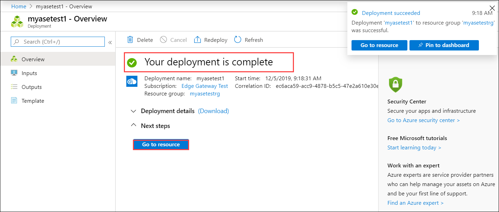

You device is now ready for setup and activation.

## Get the activation key

After the Azure Stack Edge resource is up and running, you'll need to get the activation key. This key is used to activate and connect your Azure Stack Edge device with the resource. You can get this key now while you are in the Azure portal.

1. Select the resource that you created. Select **Overview** and then select **Device setup**.

    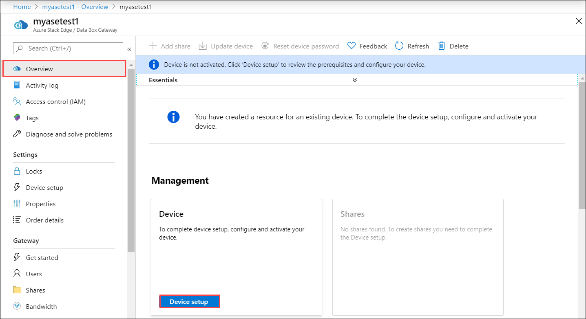

2. On the **Activate** tile, select **Generate key** to create an activation key. Select the copy icon to copy the key and save it for later use.

    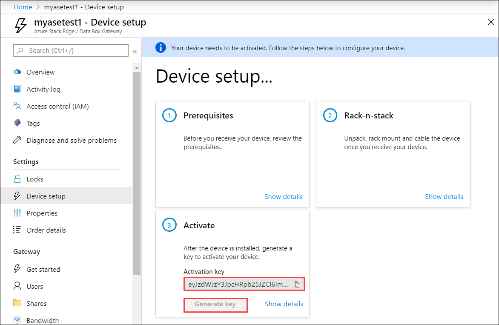

> [!IMPORTANT]
> - The activation key expires three days after it is generated.
> - If the key has expired, generate a new key. The older key is not valid.

## Next steps

In this tutorial, you learned about Azure Stack Edge topics such as:

> [!div class="checklist"]
> * Create a new resource
> * Get the activation key

Advance to the next tutorial to learn how to install Azure Stack Edge.

> [!div class="nextstepaction"]
> [Install Azure Stack Edge](./azure-stack-edge-r-series-deploy-install.md)

