# Update your Azure Stack Edge Rugged Series device 

## Overview

This article describes the steps required to install update on your Azure Stack Edge via the local web UI and via the Azure portal. You apply the software updates or hotfixes to keep your Azure Stack Edge up-to-date. 

> [!IMPORTANT]
> - Update 1912 corresponds to **2.0.XXXX.XXXX** software version on your device. For information on what is new in this update, go to [Release notes for Update 1912](azure-stack-edge-r-series-placeholder.md).
>
> - Keep in mind that installing an update or hotfix restarts your device. Given that the Azure Stack Edge is a single node device, any I/O in progress is disrupted and your device experiences a downtime of up to 30 minutes.

## Use the Azure portal

We recommend that you install updates through the Azure portal. The device automatically scans for updates once a day. Once the updates are available, you see a notification in the portal. You can then download and install the updates. 

> [!NOTE]
> Make sure that the device is healthy and status shows as **Online** before you proceed to install the updates.

1. When the updates are available for your device, you see a notification. Select the notification or from the top command bar, **Update device**.

    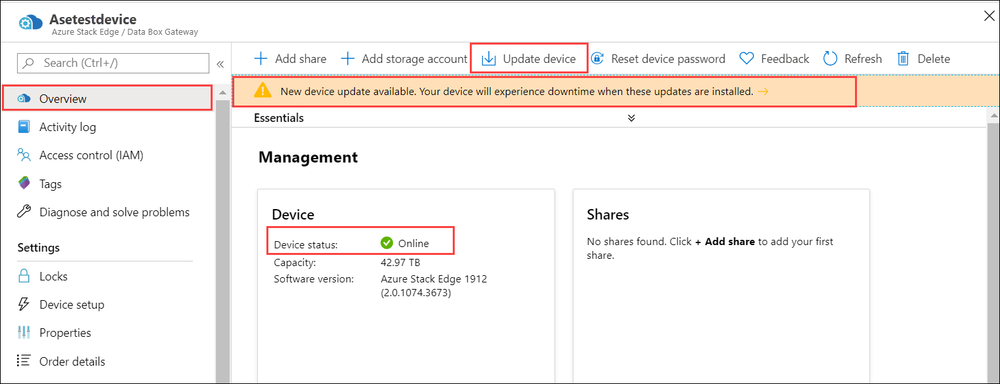

2. In the Device updates blade, check that you have reviewed the license terms associated with new features in the release notes.

    You can choose to Download and install the updates or just download the updates. You can then choose to install these updates later.

    If you want to just download the updates, check the option that updates install automatically after the download completes.

    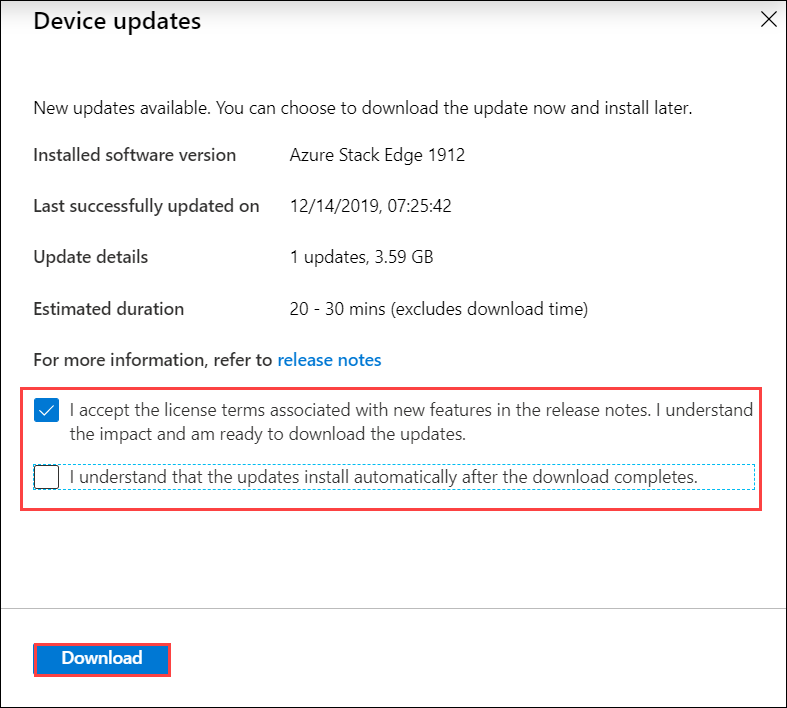

    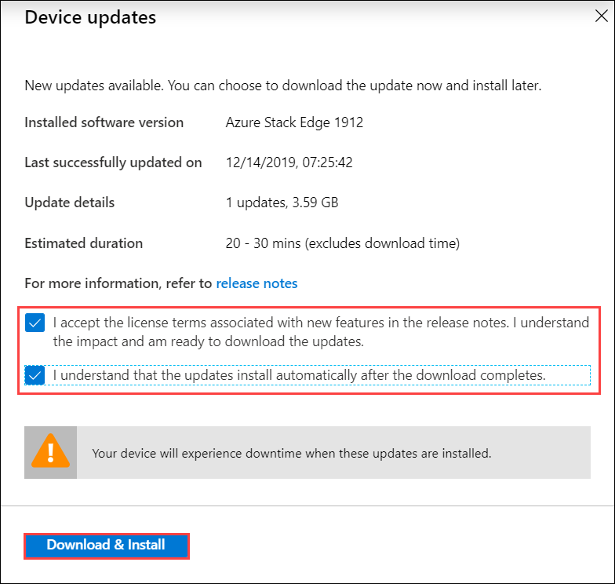

3. The download of updates starts. You see a notification that the download is in progress.

    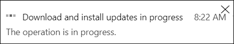

    A notification banner is also displayed in the Azure portal. This indicates the download progress. You can select this notification or select Update device to see the detailed status of the update.    

    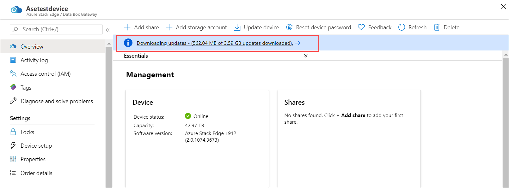

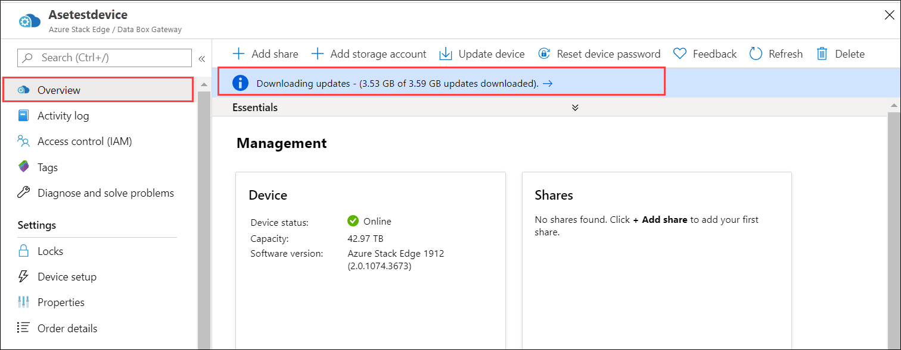

4. After the download is complete, the notification banner updates to indicate the completion.

    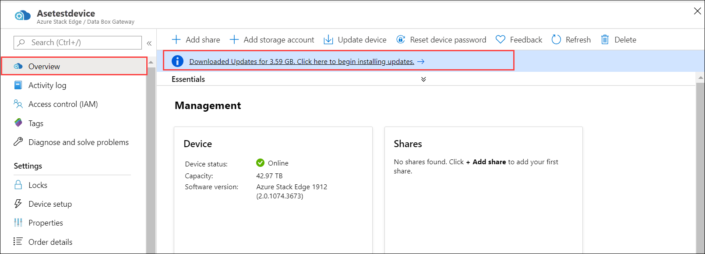

    Select the notification to open the **Device updates** blade. Select **Install**.                 
    
    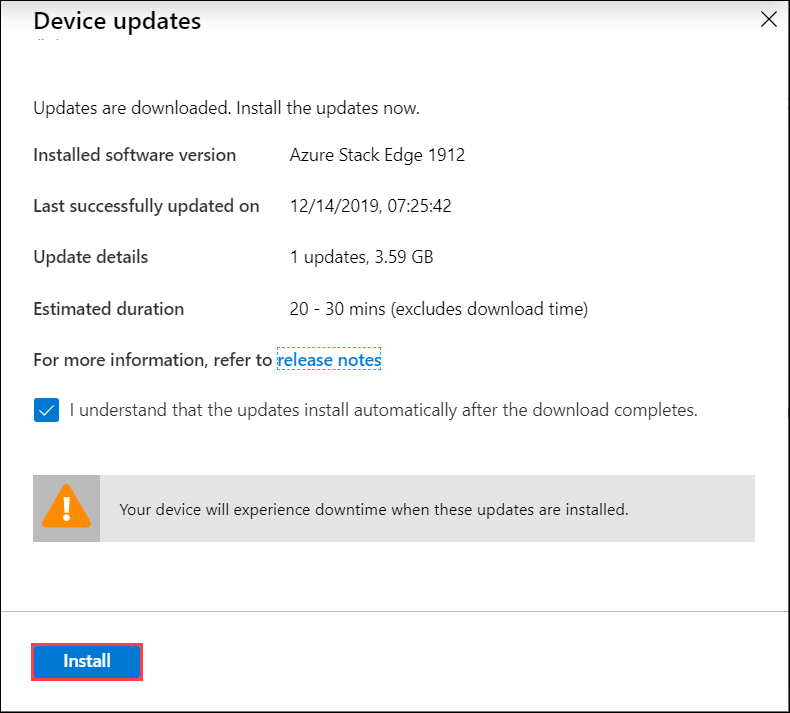

5. You see a notification that the install is in progress.

    

    The portal also displays an informational alert to indicate that the install is in progress.
    
    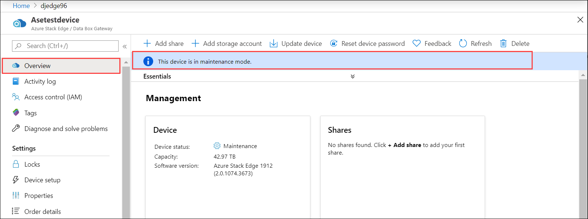

6. As this is a 1-node device, the device will restart after the updates are installed. The critical alert during the restart will indicate that the device heartbeat is lost.

    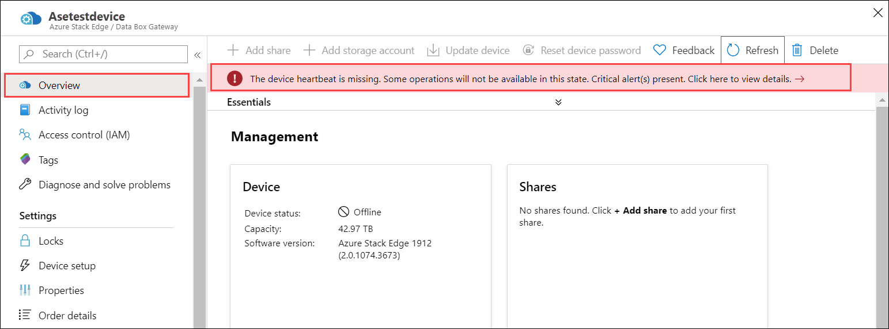

    Select the alert to see the corresponding device event. 
    
    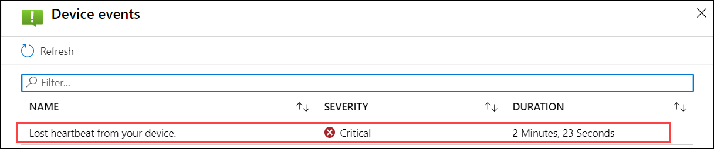

7. After the restart, the device is again put in the maintenance mode and an informational alert is displayed to indicate that.

    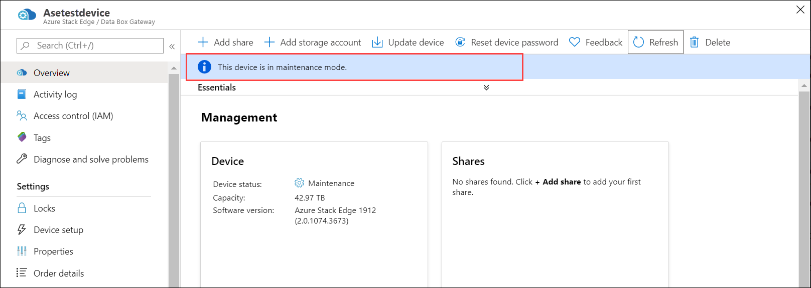

    If you select the **Update device** from the top command bar, you can see the progress of the updates.
    
    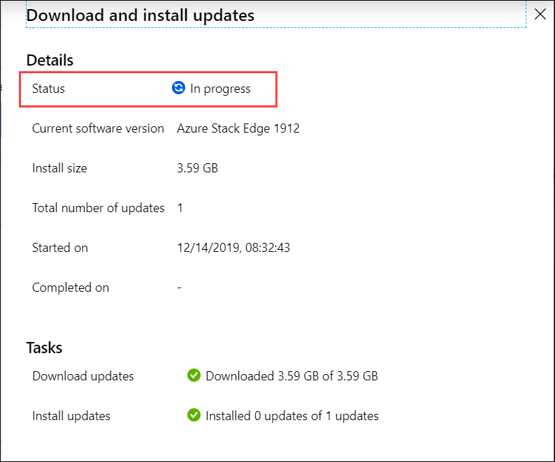

8. The device status updates to **Online** after the updates are installed. 

    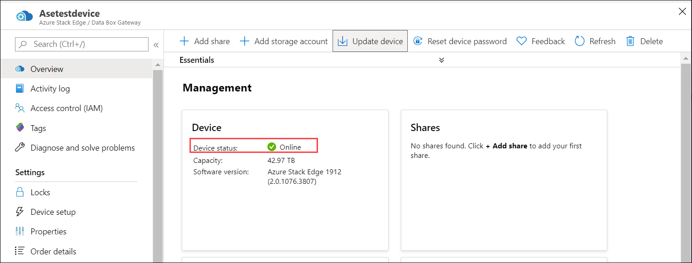

    From the top command bar, select Device updates. Verify that update has successfully installed and the device software version reflects that.

    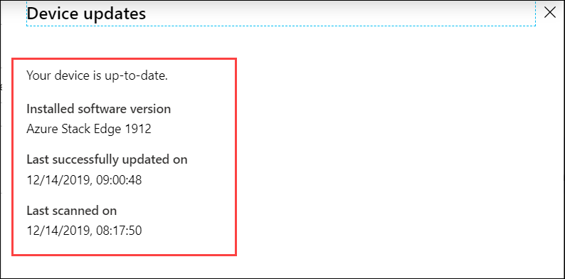

## Use the local web UI

There are two steps when using the local web UI:

* Download the update or the hotfix
* Install the update or the hotfix

Each of these steps is described in detail in the following sections.
                                                                                                                                                                                                                                                                                                                                                                                                                                                                                                                                                                                                                                                                                                                                                                                                                                                                                                                                                                                                                                                                                                                                                                                                                                                                                                                                                                                                                                                                                                                                                                                                                                                                                                                                                                                                                                                                                                                                                                                                                                                         
### Download the update or the hotfix

Perform the following steps to download Update 1.1 from the Microsoft Update Catalog.

#### To download the update or the hotfix

1. Start Internet Explorer and navigate to [https://catalog.update.microsoft.com](https://catalog.update.microsoft.com).

2. If you are using the Microsoft Update Catalog for the first time on this computer, click **Install** when prompted to install the Microsoft Update Catalog add-on.

3. In the search box of the Microsoft Update Catalog, enter the Knowledge Base (KB) number of the hotfix you want to download. Enter **4337628** for Update 1.1, and then click **Search**.
   
    The hotfix listing appears, for example, **Azure Stack Edge Update 1.1**.
   
    <!--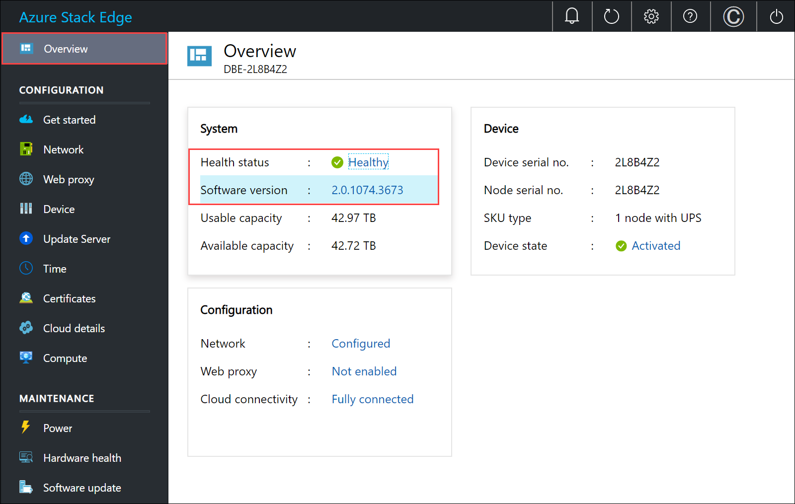-->

4. Click **Download**.

5. Download the two files to a folder. You can also copy the folder to a network share that is reachable from the device.

6. Open the folder where the files are located.

    <!---->

    You see two files:
    -  A Microsoft Update Standalone Package file `WindowsTH-KB3011067-x64`. This file is used to update the device software.
    - A file that contains cumulative updates for June `Windows8.1-KB4284815-x64`. For more information on what is included in this rollup, go to [June monthly security rollup](https://support.microsoft.com/help/4284815/windows-81-update-kb4284815).

### Install the update or the hotfix

Prior to the update or hotfix installation, make sure that:

 - You have the update or the hotfix downloaded either locally on your host or accessible via a network share.
 - Your device is running Update 1 (10.0.10296.0). If you are running Update 0.6, [Install Update 1](storsimple-virtual-array-install-update-1.md) first and then install Update 1.1.

This procedure takes around 4 minutes to complete. Perform the following steps to install the update or hotfix.

#### To install the update or the hotfix

1. In the local web UI, go to **Configuration** > **Update server**. Make a note of the software version that you are running. **Proceed with this update only if you are running Update 1 (10.0.10296.0).**
   
   <!-- -->

2. In **Select update server type**, from the dropdown list, choose from Microsoft Update server (default) or Windows Server Update Services.  
   
    <!---->

3. If updating from Microsoft Update server, enter the file name for the update. You can also browse to the update installation file if placed on a network share. Click **Apply**. 

    If updating from the Windows Server Update Services, specify the server URI. The server at that URI will deploy the updates on all the devices connected to this server. 
    
    The WSUS server is used to manage and distribute updates through a management console. A WSUS server can also be the update source for other WSUS servers within the organization. The WSUS server that acts as an update source is called an upstream server. In a WSUS implementation, at least one WSUS server on your network must be able to connect to Microsoft Update to get available update information. As an administrator, you can determine - based on network security and configuration - how many other WSUS servers connect directly to Microsoft Update.
    
    For more information, go to [Windows Server Update Services (WSUS)](https://docs.microsoft.com/windows-server/administration/windows-server-update-services/get-started/windows-server-update-services-wsus)

4. A warning is displayed. Given the device is a single node device, after the update is applied, the device restarts and there is downtime. Click the check icon.
   
   <!---->

4. The update starts. After the device is successfully updated, it restarts. The local UI is not accessible in this duration.
   
    <!---->

5. After the restart is complete, you are taken to the **Sign in** page. To verify that the device software has updated, in the local web UI, go to **Configuration** > **Update server**. The displayed software version should be **XXXX** for the GA release.
   
   > [!NOTE]
   > We report the software versions in a slightly different way in the local web UI and the Azure portal. For example, the local web UI reports **XXXX** and the Azure portal reports **XXXX** for the same version.
   
    <!---->

6. Repeat steps 2-4 to install the Windows security fix using file `Windows8.1-KB4284815-x64`. The device restarts after the install and you need to sign into the local web UI.

## Next steps

Learn more about [administering your Azure Stack Edge](azure-stack-edge-r-series-placeholder.md).
