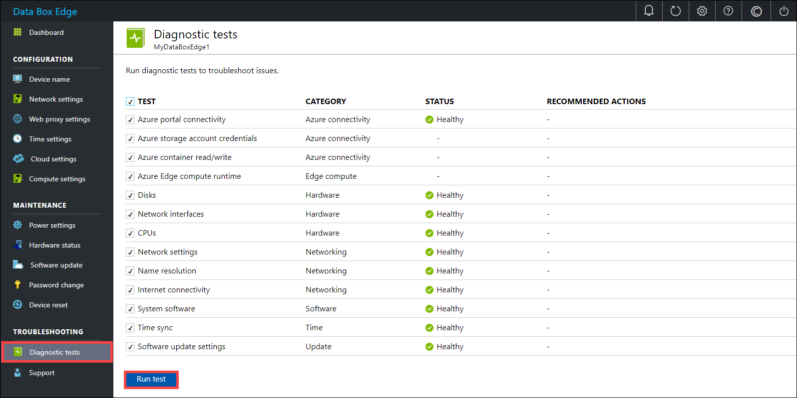
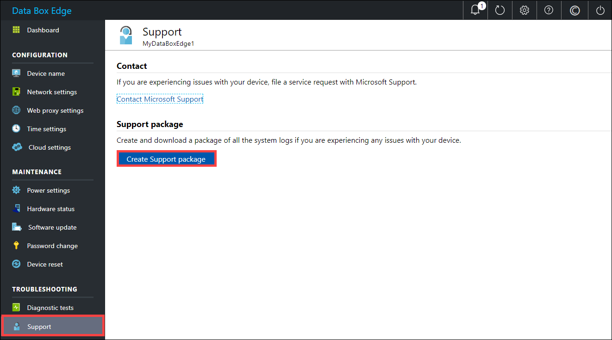
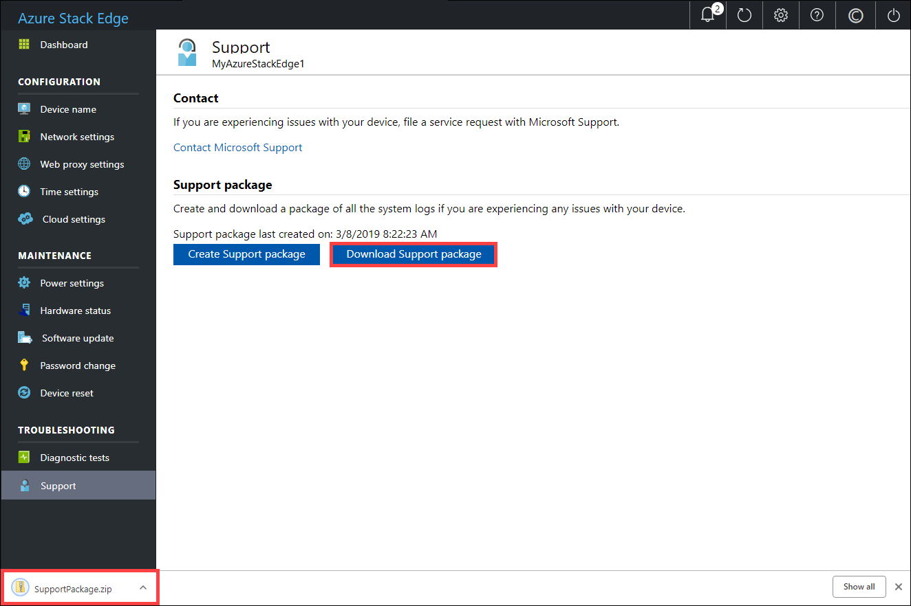
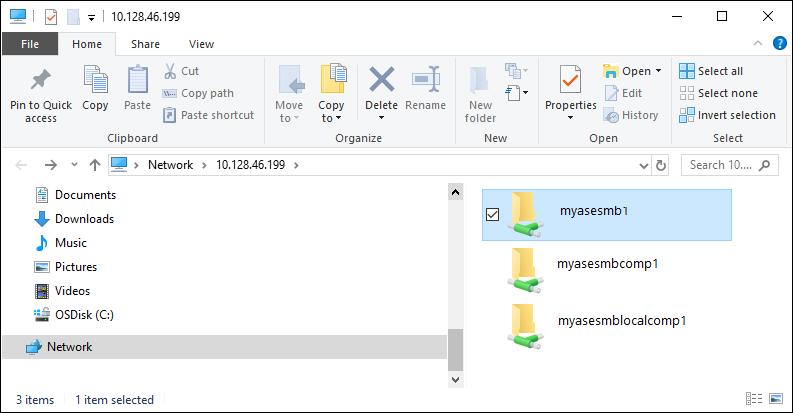

# Troubleshoot your Azure Data Box Edge issues 

This article describes how to troubleshoot issues on your Azure Data Box Edge. 

In this article, you learn how to:

> [!div class="checklist"]
> * Run diagnostics
> * Collect Support package
> * Use logs to troubleshoot


## Run diagnostics

To diagnose and troubleshoot any device errors, you can run the diagnostics tests. Do the following steps in the local web UI of your device to run diagnostic tests.

1. In the local web UI, go to **Troubleshooting > Diagnostic tests**. Select the test you want to run and click **Run test**. This runs the tests to diagnose any possible issues with your network, device, web proxy, time, or cloud settings. You are notified that the device is running tests.

    
 
2. After the tests have completed, the results are displayed. 

    

    If a test fails, then a URL for recommended action is presented. You can click the URL to view the recommended action.
 
    


## Collect Support package

A log package is composed of all the relevant logs that can help Microsoft Support troubleshoot any device issues. You can generate a log package via the local web UI.

Do the following steps to collect a Support package. 

1. In the local web UI, go to **Troubleshooting > Support**. Click **Create support package**. The system starts collecting support package. The package collection may take several minutes.

    
 
2. After the Support package is created, click **Download Support package**. A zipped package is downloaded on the path you chose. You can unzip the package and the view the system log files.

    

## Gather advanced security logs

The advanced security logs can be software or hardware intrusion logs for your Azure Stack Edge device.

### Software intrusion logs

The software intrusion or the default firewall logs are collected for inbound and outbound traffic. 

- When the device is imaged at the factory, the default firewall logging is enabled. These logs are bundled in the support package by default when you create a support package via the local UI or via the Windows PowerShell interface of the device.

- If only the firewall logs are needed in the support package to review any software (NW) intrusion in the device, use `-Include FirewallLog` option when creating the support package. 

- If no specific include option is provided, firewall log is included as a default in the support package.

- In the support package, firewall log  is the `pfirewall.log` and sits in the root folder. Here is an example of the software intrusion log for the Azure Stack Edge device. 

    ```
    #Version: 1.5
    #Software: Microsoft Windows Firewall
    #Time Format: Local
    #Fields: date time action protocol src-ip dst-ip src-port dst-port size tcpflags tcpsyn tcpack tcpwin icmptype icmpcode info path
    
    2019-11-06 12:35:19 DROP UDP 5.5.3.197 224.0.0.251 5353 5353 59 - - - - - - - RECEIVE
    2019-11-06 12:35:19 DROP UDP fe80::3680:dff:fe01:9e88 ff02::fb 5353 5353 89 - - - - - - - RECEIVE
    2019-11-06 12:35:19 DROP UDP fe80::3680:dff:fe01:9e88 ff02::fb 5353 5353 89 - - - - - - - RECEIVE
    2019-11-06 12:35:19 DROP UDP fe80::3680:dff:fe01:9e88 ff02::fb 5353 5353 89 - - - - - - 
    2019-11-06 12:35:19 DROP UDP fe80::3680:dff:fe01:9d87 ff02::fb 5353 5353 79 - - - - - - - RECEIVE
    2019-11-06 12:35:19 DROP UDP 5.5.3.193 224.0.0.251 5353 5353 59 - - - - - - - RECEIVE
    2019-11-06 12:35:19 DROP UDP fe80::3680:dff:fe08:20d5 ff02::fb 5353 5353 89 - - - - - - - RECEIVE
    2019-11-06 12:35:19 DROP UDP fe80::3680:dff:fe08:20d5 ff02::fb 5353 5353 89 - - - - - - - RECEIVE
    2019-11-06 12:35:19 DROP UDP fe80::3680:dff:fe01:9e8b ff02::fb 5353 5353 89 - - - - - - - RECEIVE
    2019-11-06 12:35:19 DROP UDP fe80::3680:dff:fe01:9e8b ff02::fb 5353 5353 89 - - - - - - - RECEIVE
    2019-11-06 12:35:19 DROP UDP 5.5.3.33 224.0.0.251 5353 5353 59 - - - - - - - RECEIVE
    2019-11-06 12:35:19 DROP UDP fe80::3680:dff:fe01:9e8b ff02::fb 5353 5353 89 - - - - - - - RECEIVE
    2019-11-06 12:35:19 DROP UDP fe80::3680:dff:fe01:9e8a ff02::fb 5353 5353 89 - - - - - - - RECEIVE
    2019-11-06 12:35:19 DROP UDP fe80::3680:dff:fe01:9e8b ff02::fb 5353 5353 89 - - - - - - - RECEIVE
    ```

### Hardware intrusion logs

To detect any hardware intrusion into the device, currently all the chassis events such as opening or close of chassis, are logged. 

- The system event log from the device is read using the `racadm` cmdlet. These events are then filtered for chassis-related event in to a `HWIntrusion.txt` file.

- To get only the hardware intrusion log in the support package, use `-Include HWSelLog` option when creating the support package. 

- If no specific include option is provided, the hardware intrusion log is included as a default in the support package.

- In the support package, the hardware intrusion log is the `HWIntrusion.txt` and sits in the root folder. Here is an example of the hardware intrusion log for the Azure Stack Edge device. 

    ```
    09/04/2019 15:51:23 system Critical The chassis is open while the power is off.
    09/04/2019 15:51:30 system Ok The chassis is closed while the power is off.
    ```

## Use logs to troubleshoot

Any errors experienced during the upload and refresh processes are included in the respective error files.

1. To view the error files, go to your share and click the share to view the contents. 

      

2. Click the _Microsoft Data Box Edge folder_. This folder has two subfolders:

    - Upload folder that has log files for upload errors.
    - Refresh folder for errors during refresh.

    Here is a sample log file for refresh.

    ```
    <root container="test1" machine="VM15BS020663" timestamp="03/18/2019 00:11:10" />
    <file item="test.txt" local="False" remote="True" error="16001" />
    <summary runtime="00:00:00.0945320" errors="1" creates="2" deletes="0" insync="3" replaces="0" pending="9" />
    ``` 

3. When you see an error in this file (highlighted in the sample), note down the error code, in this case it is 16001. Look up the description of this error code against the following error reference.

    [!INCLUDE [data-box-edge-edge-upload-error-reference](../../includes/data-box-edge-gateway-upload-error-reference.md)]


## Next steps

- Learn more about the [known issues in this release](data-box-gateway-release-notes.md).
