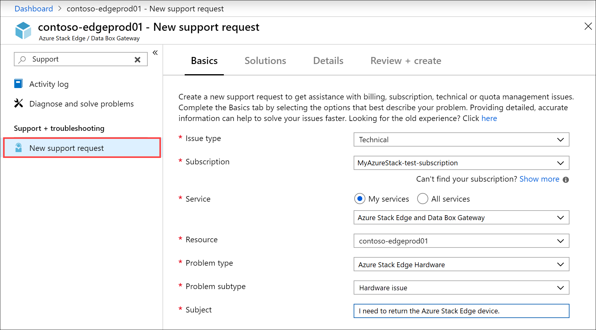

# Replace your Azure Stack Edge device

[!INCLUDE [applies-to-GPU-and-pro-r-and-mini-r-skus](../../includes/azure-stack-edge-applies-to-gpu-pro-r-mini-r-sku.md)]

This article describes how to replace your Azure Stack Edge device. A replacement device is needed when the existing device has a hardware failure or needs an upgrade. 

In this article, you learn how to:

> [!div class="checklist"]
>
> * Open a Support ticket for hardware issue
> * Create a new order for a replacement device in the Azure portal
> * Install, activate the replacement device
> * Return the original device

## Open a Support ticket

If your existing device has a hardware failure, open a Support ticket by following these steps:

1. Open a Support ticket with Microsoft Support indicating that you wish to return the device. Select the **Azure Stack Edge Hardware** problem type, and choose the **Hardware issues** subtype.  

      

2. A Microsoft Support engineer will get in touch with you to determine if a Field Replacement Unit (FRU) can fix the problem and is available for this instance. If a FRU is not available or the device needs a hardware upgrade, Support will guide you to place a new order and return your old device.

## Create a new order

Create a new resource for the activation of your replacement device by following the steps in [Create a new resource](azure-stack-edge-gpu-deploy-prep.md#create-a-new-resource).

> [!NOTE]
> Activation of a replacement device against an existing resource is not supported. The new resource is considered a new order. You will start getting billed 14 days after the device is shipped to you.

## Install and activate the replacement device

Follow these steps to install and activate the replacement device:

1. [Install your device](azure-stack-edge-deploy-install.md).
2. [Activate your device](azure-stack-edge-deploy-connect-setup-activate.md) against the new resource that you created earlier.

## Return your existing device

Follow all the steps to return the original device:

1. [Erase the data on the device](azure-stack-edge-return-device.md#erase-data-from-the-device).
2. [Initiate device return](azure-stack-edge-return-device.md#initiate-device-return) for the original device.
3. [Schedule a pickup](azure-stack-edge-return-device.md#schedule-a-pickup).
4. Once the device is received at Microsoft, you can [Delete the resource](azure-stack-edge-return-device.md#complete-return) associated with the returned device.

## Next steps

- Learn how to [Return an Azure Stack Edge device](azure-stack-edge-return-device.md).
