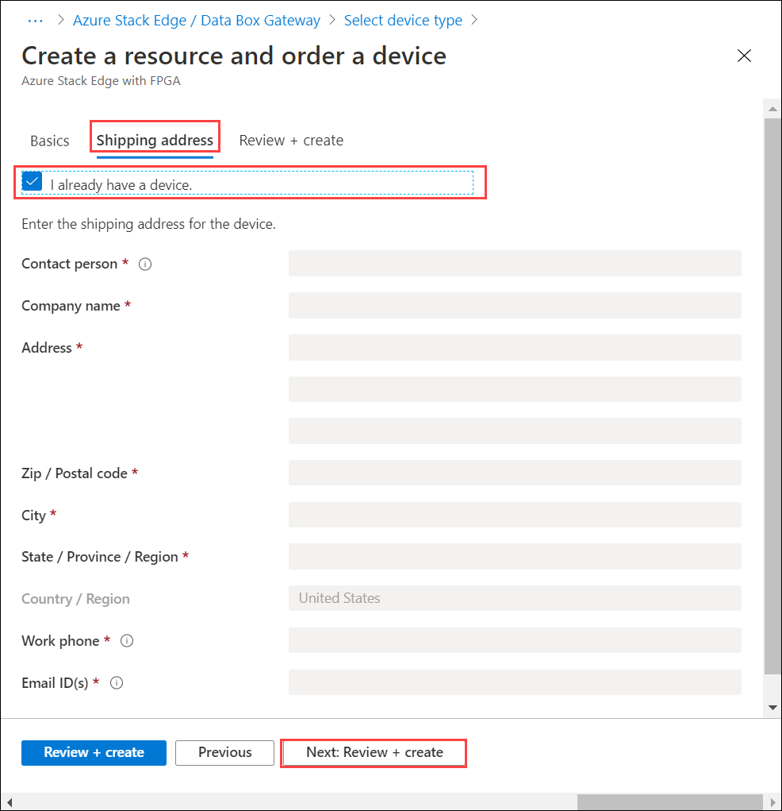

# Replace your Azure Stack Edge Pro device

This article describes how to get a replacement Azure Stack Edge Pro device. A replacement device is needed when the existing device has a hardware failure or needs an upgrade. 

In this article, you learn how to:

> [!div class="checklist"]
>
> * Open a Support ticket for hardware issue
> * Create a new resource for replacement device in Azure portal
> * Install, activate the replacement device
> * Return the original device

## Open a Support ticket

If your existing device has a hardware failure, open a Support ticket. Microsoft Support will determine that a Field Replacement Unit (FRU) is not available for this instance or the device needs a hardware upgrade. In either case, Support will order a replacement device.

1. Open a Support ticket with Microsoft Support indicating that you wish to return the device. Select the problem type as **Azure Stack Edge Pro Hardware**.

      

2. A Microsoft Support engineer will contact you. Provide the shipping details.
<!--3. If you need a return shipping box, you can request it. Answer **Yes** to the question **Need an empty box to return**.-->

## Create a resource for replacement device

Follow these steps to create a resource.

1. Follow the steps in [Create a new resource](azure-stack-edge-deploy-prep.md#create-a-new-resource) to create a resource for the replacement device. 

2. Make sure to select the check box against **I have an Azure Stack Edge Pro device**. 

      

## Install and activate the replacement device

Follow these steps to install and activate the replacement device:

1. [Install your device](azure-stack-edge-deploy-install.md).

2. [Activate your device](azure-stack-edge-deploy-connect-setup-activate.md) against the new resource that you created earlier.

## Return your existing device

Follow all the steps to return the original device:

1. [Erase the data on the device](azure-stack-edge-return-device.md#erase-data-from-the-device).
2. [Initiate device return](azure-stack-edge-return-device.md#initiate-device-return) for the original device.
3. [Schedule a pickup](azure-stack-edge-return-device.md#schedule-a-pickup).
4. [Delete the resource](azure-stack-edge-return-device.md#delete-the-resource) associated with the returned device.

## Next steps

- Learn how to [Return an Azure Stack Edge Pro device](azure-stack-edge-return-device.md).
