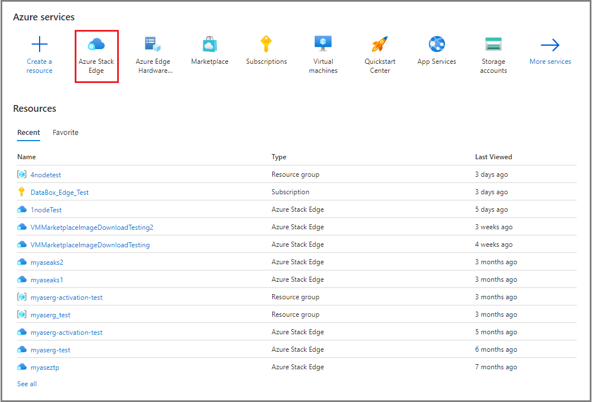
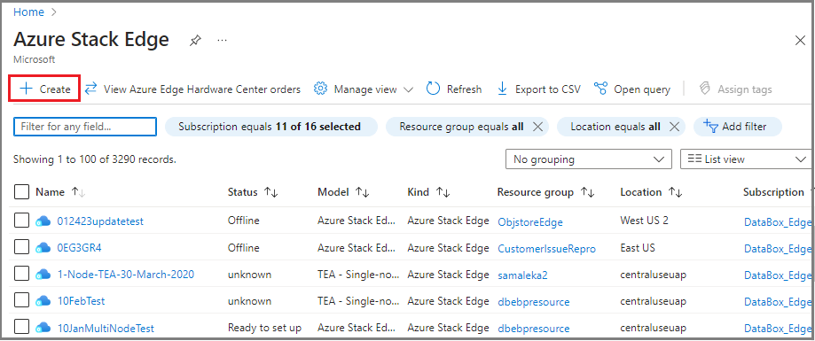
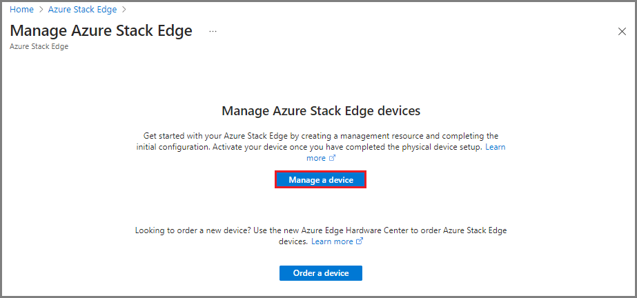
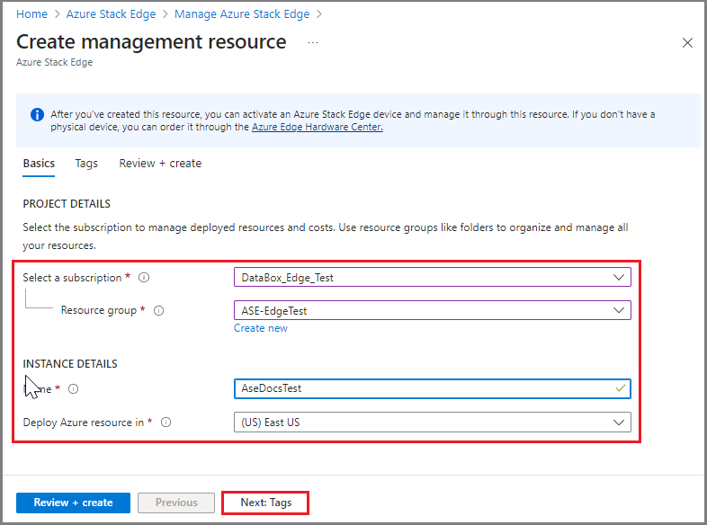
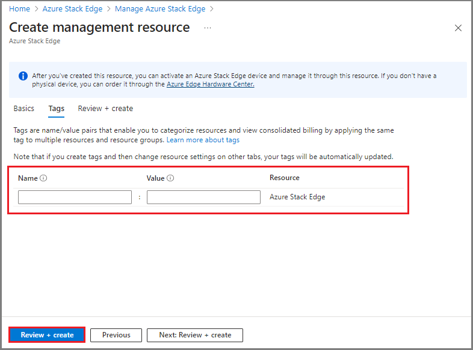
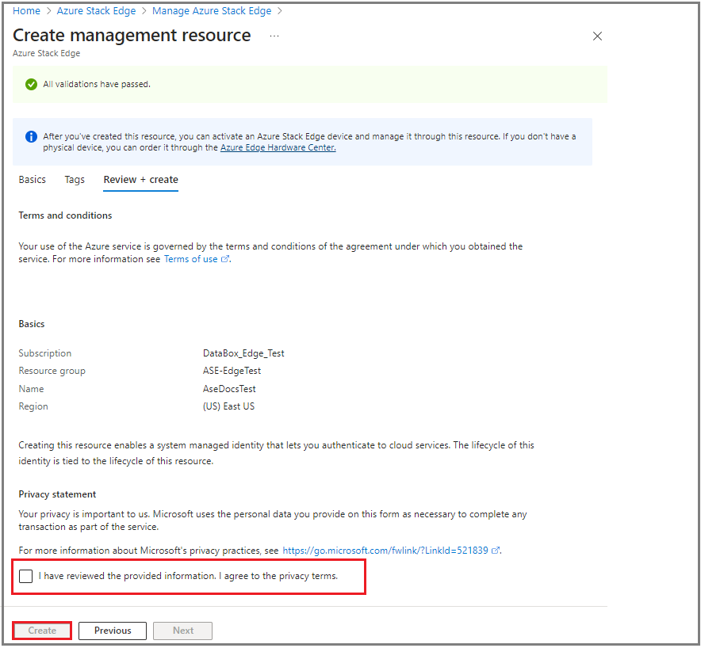

# Reset and reactivate your Azure Stack Edge device

[!INCLUDE [applies-to-GPU-and-pro-r-and-mini-r-skus](../../includes/azure-stack-edge-applies-to-gpu-pro-r-mini-r-sku.md)]

This article describes how to reset, reconfigure, and reactivate an Azure Stack Edge device if you're having issues with the device or need to start fresh for some other reason.

After you reset the device to remove the data, you'll need to reactivate the device as a new resource. Resetting a device removes the device configuration, so you'll need to reconfigure the device via the local web UI.

For example, you might need to move an existing Azure Stack Edge resource to a new subscription. To do so, you would:

1. Reset data on the device by following the steps in [Reset device](#reset-device).
2. Create a new resource that uses the new subscription with your existing device, and then activate the device. Follow the steps in [Reactivate device](#reactivate-device).

## Reset device

To wipe the data off the data disks of your device, you need to reset your device.

Before you reset, create a copy of the local data on the device if needed. You can copy the data from the device to an Azure Storage container.

>[!IMPORTANT]
> Resetting your device will erase all local data and workloads from your device, and that can't be reversed. Reset your device only if you want to start afresh with the device.

You can reset your device in the local web UI or in PowerShell. For PowerShell instructions, see [Reset your device](./azure-stack-edge-connect-powershell-interface.md#reset-your-device).

[!INCLUDE [Reset data from the device](../../includes/azure-stack-edge-device-reset.md)]

## Reactivate device

After you reset the device, you must reactivate the device as a new management resource. After placing a new order, you must reconfigure and then reactivate the new resource.

Use the following steps to create a new management resource for your existing device:

1. On the **Azure services** page of Azure portal, select **Azure Stack Edge**.
 
   

1. On the **Azure Stack Edge** page, select **+ Create**.

   

1. On the **Manage Azure Stack Edge** page, select **Manage a device**.

   

1. On the **Basics** tab, specify project details for your resource, and then select **Next: Tags**. 

   

1. On the **Tags** tab, specify **Name** and **Value** tags for your management resource, and then select **Review + create**.   

   

1. On the **Review + create** tab, review **Terms and conditions** and **Basics** for your management resource, and then review and accept the **Privacy terms**. To complete the operation, select **Create**.

   

After you create the management resource for your device, use the following steps to complete device configuration.

1. [Get the activation key](azure-stack-edge-gpu-deploy-prep.md?tabs=azure-portal#get-the-activation-key).

1. [Connect to the device](azure-stack-edge-gpu-deploy-connect.md).

1. [Configure the network for the device](azure-stack-edge-gpu-deploy-configure-network-compute-web-proxy.md).

1. [Configure device settings](azure-stack-edge-gpu-deploy-set-up-device-update-time.md).

1. [Configure certificates](azure-stack-edge-gpu-deploy-configure-certificates.md).

1. [Activate the device](azure-stack-edge-gpu-deploy-activate.md).

## Next steps

- Learn how to [Connect to an Azure Stack Edge device](azure-stack-edge-gpu-deploy-connect.md).
