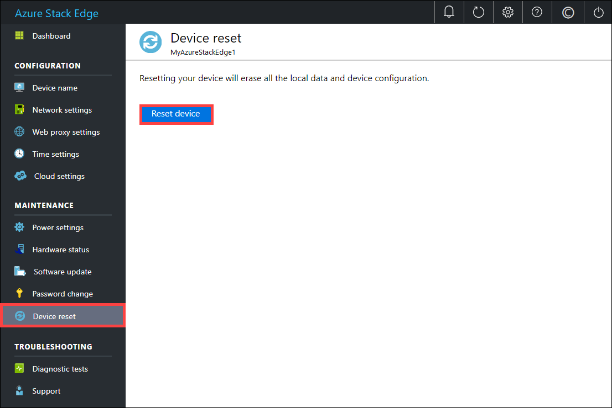
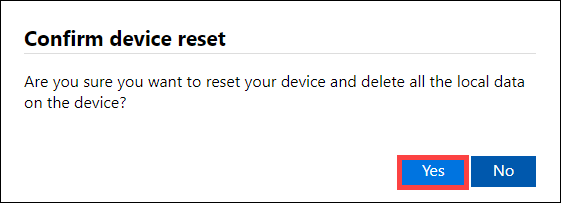
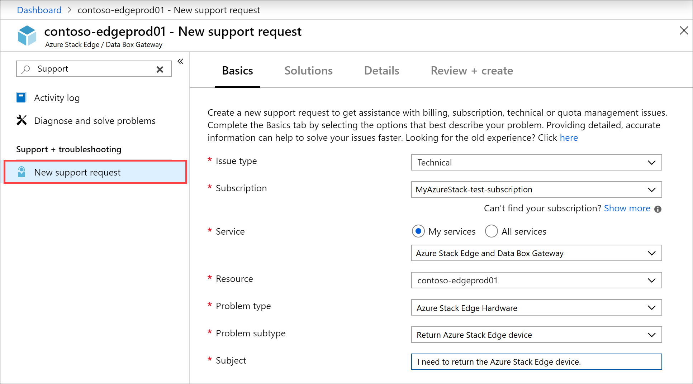

# Return or replace your Azure Stack Edge device

This article describes how to wipe the data and then return your Azure Stack Edge device. After you've returned the device, you can also delete the resource associated with the device or order a replacement device.

In this article, you learn how to:

> [!div class="checklist"]
>
> * Wipe the data off the data disks on the device
> * Open a Support ticket to return your device
> * Pack up the device and schedule a pickup
> * Delete the resource in Azure portal
> * Get a replacement device

## Erase data from the device

To wipe the data off the data disks of your device, you need to reset your device. You can reset your device using the local web UI or the PowerShell interface.

Before you reset, create a copy of the local data on the device if needed. You can copy the data from the device to an Azure Storage container.

To reset your device using the local web UI, take the following steps.

1. In the local web UI, go to **Maintenance > Device reset**.
2. Select **Reset device**.

    

3. When prompted for confirmation, review the warning and select **Yes** to continue.

      

The reset erases the data off the device data disks. Depending on the amount of data on your device, this process takes about 30-40 minutes.

Alternatively, connect to the PowerShell interface of the device and use the `Reset-HcsAppliance` cmdlet to erase the data from the data disks. For more information, see [Reset your device](azure-stack-edge-connect-powershell-interface.md#reset-your-device).

> [!NOTE]
> - If you're exchanging or upgrading to a new device, we recommend that you reset your device only after you've received the new device.
> - The device reset only deletes all the local data off the device. The data that is in the cloud isn't deleted and collects [charges](https://azure.microsoft.com/pricing/details/storage/). This data needs to be deleted separately using a cloud storage management tool like [Azure Storage Explorer](https://azure.microsoft.com/features/storage-explorer/).

## Open a Support ticket

To begin the return process, take the following steps.

1. Open a Support ticket with Microsoft Support indicating that you wish to return the device. Select the problem type as **Azure Stack Edge Hardware**.

      

2. A Microsoft Support engineer will contact you. Provide the shipping details.
3. If you need a return shipping box, you can request it. Answer **Yes** to the question **Need an empty box to return**.

## Schedule a pickup

1. Shut down the device. In the local web UI, go to **Maintenance > Power settings**.
2. Select **Shut down**. When prompted for confirmation, click **Yes** to continue. For more information, see [Manage power](data-box-gateway-manage-access-power-connectivity-mode.md#manage-power).
3. Unplug the power cables and remove all the network cables from the device.
4. Prepare the shipment package by using your own box or the empty box you received from Azure. Place the device and the power cords that were shipped with the device in the box.
5. Affix the shipping label that you received from Azure on the package.
6. Schedule a pickup with your regional carrier. If returning the device in US, your carrier could be UPS or FedEx. To schedule a pickup with UPS:

    1. Call the local UPS (country/region-specific toll free number).
    2. In your call, quote the reverse shipment tracking number as shown on your printed label.
    3. If the tracking number isn't quoted, UPS will require you to pay an additional charge during pickup.

    Instead of scheduling the pickup, you can also drop off the Azure Stack Edge at the nearest drop-off location.

## Delete the resource

After the device is received at the Azure datacenter, the device is inspected for damage or any signs of tampering.

- If the device arrives intact and in good shape, the billing meter stops for that resource. Microsoft Support will contact you to confirm that the device was returned. You can then delete the resource associated with the device in the Azure portal.
- If the device arrives significantly damaged, fines may apply. For details, see the [FAQ on lost or damaged device](https://azure.microsoft.com/pricing/details/databox/edge/) and [Product Terms of Service](https://www.microsoft.com/licensing/product-licensing/products).  

You can delete the device in the Azure portal:
-    After you have placed the order and before the device is prepared by Microsoft.
-    After you've returned the device to Microsoft, it passes the physical inspection at the Azure datacenter, and Microsoft Support calls to confirm that the device was returned.

If you've activated the device against another subscription or location, Microsoft will move your order to the new subscription or location within one business day. After the order is moved, you can delete this resource.

Take the following steps to delete the device and the resource in Azure portal.

1. In the Azure portal, go to your resource and then to **Overview**. From the command bar, select **Delete**.

    

2. In the **Delete device** blade, type the name of the device you want to delete and select **Delete**.

    

You're notified after the device and the associated resource is successfully deleted.

## Get a replacement device

A replacement device is needed when the existing device has a hardware failure or needs an upgrade. Take the following steps when your device has a hardware issue:

1. [Open a Support ticket for hardware issue](#open-a-support-ticket). Microsoft Support will determine that a Field Replacement Unit (FRU) is not available for this instance or the device needs a hardware upgrade. In either case, Support will order a replacement device.
2. [Create a new resource](azure-stack-edge-deploy-prep.md#create-a-new-resource) for the replacement device. Make sure to select the check box against **I have an Azure Stack Edge device**. 
3. After you receive a replacement device, [install](azure-stack-edge-deploy-install.md) and [activate](azure-stack-edge-deploy-connect-setup-activate.md) the replacement device against the new resource.
4. Follow all the steps to return the original device:
    1. Open another ticket to return the original device.
    2. [Erase the data on the device](#erase-data-from-the-device).
    3. [Schedule a pickup](#schedule-a-pickup).
    5. [Delete the resource](#delete-the-resource) associated with the returned device.

## Next steps

- Learn how to [Manage bandwidth](azure-stack-edge-manage-bandwidth-schedules.md).
