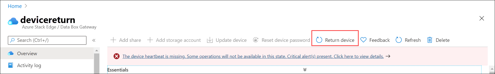
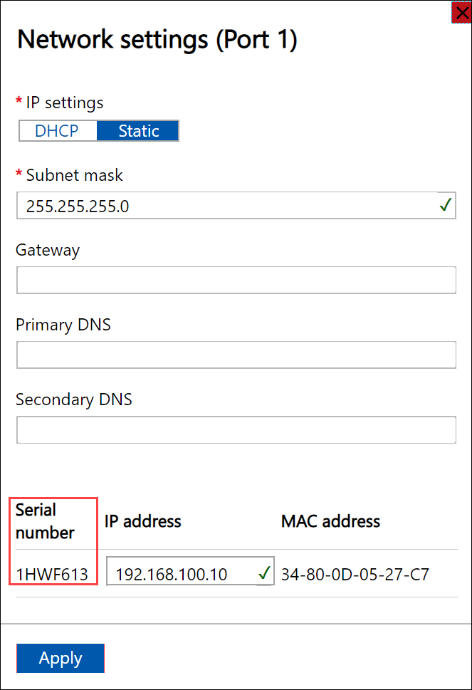
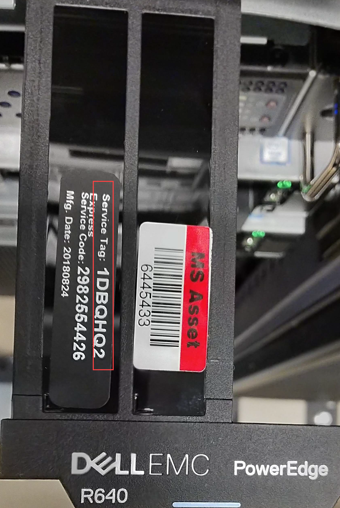
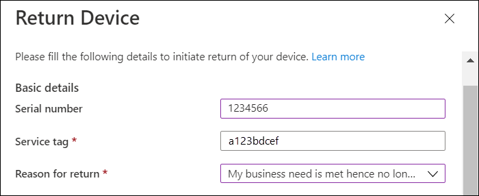
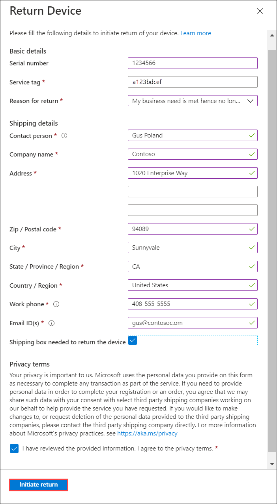
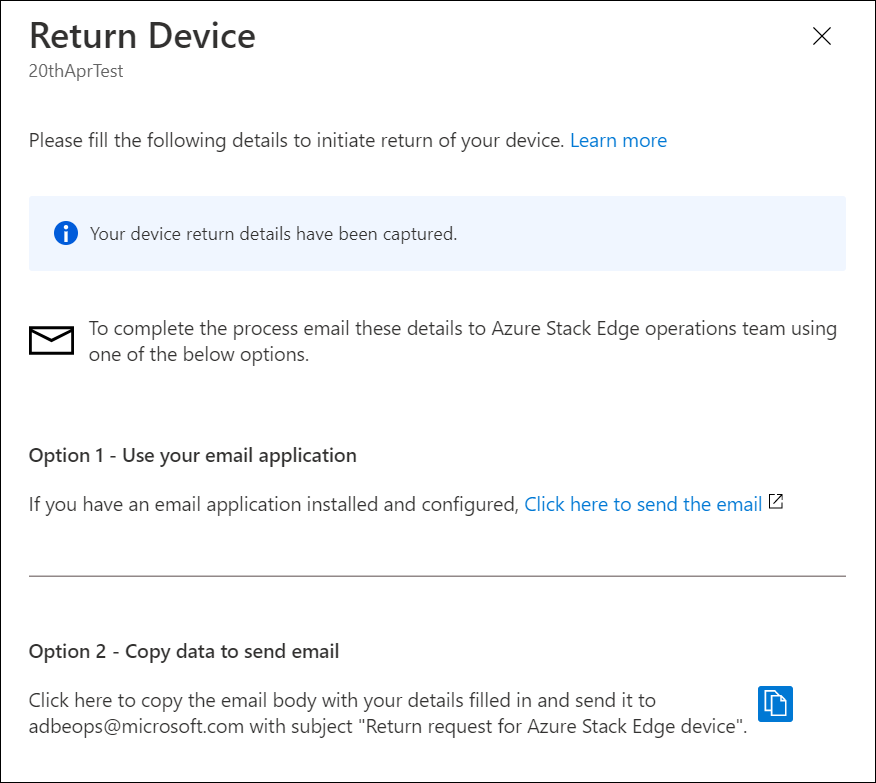
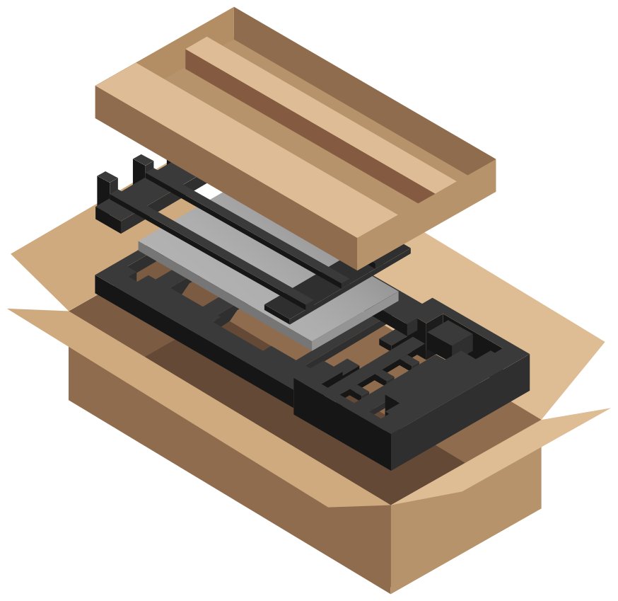
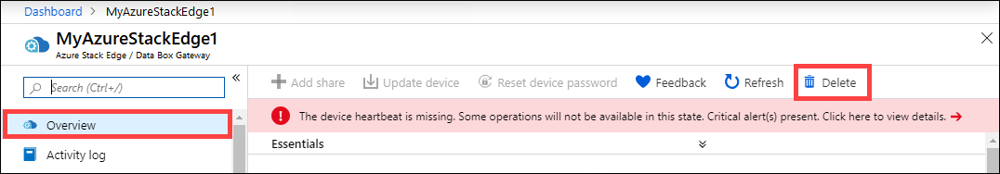
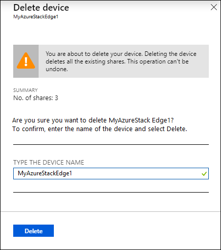

# Return your Azure Stack Edge device

[!INCLUDE [applies-to-pro-fpga](../../includes/azure-stack-edge-applies-to-gpu-pro-r-mini-r-fpga-sku.md)]

This article describes how to wipe the data and then return your Azure Stack Edge device. After you've returned the device, you can also delete the resource associated with the device.

In this article, you learn how to:

> [!div class="checklist"]
>
> * Wipe the data off the data disks on the device
> * Initiate device return in Azure portal
> * Pack up the device and schedule a pickup
> * Delete the resource in Azure portal

## Erase data from the device

To wipe the data off the data disks of your device, you need to reset your device.

Before you reset, create a copy of the local data on the device if needed. You can copy the data from the device to an Azure Storage container. 

You can initiate the device return even before the device is reset.

You can reset your device in the local web UI or in PowerShell. For PowerShell instructions, see [Reset your device](./azure-stack-edge-connect-powershell-interface.md#reset-your-device).

[!INCLUDE [Reset data from the device](../../includes/azure-stack-edge-device-reset.md)]

> [!NOTE]
> - If you're exchanging or upgrading to a new device, we recommend that you reset your device only after you've received the new device.
> - The device reset only deletes all the local data off the device. The data that is in the cloud isn't deleted and collects [charges](https://azure.microsoft.com/pricing/details/storage/). This data needs to be deleted separately using a cloud storage management tool like [Azure Storage Explorer](https://azure.microsoft.com/features/storage-explorer/).

## Initiate device return

To begin the return process, take the following steps.

---

### [Azure Edge Hardware Center (Preview)](#tab/azure-edge-hardware-center) 

If you used the Azure Edge Hardware Center to order your device, follow these steps to return the device:

[!INCLUDE [Initiate device return from Edge Hardware Center order resource](../../includes/azure-stack-edge-initiate-device-return.md)]

The next step is to package the device.

### [Portal (Classic)](#tab/azure-portal)

If you used the classic portal to order your device, follow these steps to return the device:

1. Go to your Azure Stack Edge resource in Azure portal. In the **Overview**, go to the command bar in the right pane and select **Return device**. 

      

2. In the **Return device** blade, under **Basic details**:

    1. Provide the serial number of the device. To get the device serial number, go the local web UI of the device and then go to **Overview**.  
    
        

    2. Enter the service tag number. The service tag number is an identifier with five or more characters, which is unique to your device. The service tag is located on the bottom-right corner of the device (as you face the device). Pull out the information tag (it is a slide-out label panel). This panel contains system information such as service tag, NIC, MAC address, and so on. 
    
       

    3. From the dropdown list, choose a reason for the return.

        

3. Under **Shipping details**:

    1. Provide your name, company name, and full company address. Enter a work phone including the area code and an email ID for notification.
    2. If you need a return shipping box, you can request it. Answer **Yes** to the question **Need an empty box to return**.

    

4. Review the **Privacy terms**, and select the checkbox by the note that you have reviewed and agree to the privacy terms.

5. Select **Initiate return**.

     

6. Once your device return details are captured, you can notify the Azure Stack Edge operations team via an email. You can use your email application assuming the email application is installed and configured. You can also copy the data to create and send an email.

     

7. Once the Azure Stack Edge operations team receives the email, they will send you a reverse shipment label. When you receive this label, you can schedule the device pickup with the carrier. 

---

## Pack the device

To pack the device, take the following steps.

1. Shut down the device. In the local web UI, go to **Maintenance > Power settings**.
2. Select **Shut down**. When prompted for confirmation, click **Yes** to continue. For more information, see [Manage power](../databox-online/azure-stack-edge-manage-access-power-connectivity-mode.md#manage-power).
3. Unplug the power cables and remove all the network cables from the device.
4. Carefully prepare the shipment package as per the following instructions and as shown in the following diagram:

     

    1. Use the shipping box you requested from Azure or the original shipping box with its foam packaging. 
    1. Place the bottom foam piece in the box.
    1. Lay the device on top of the foam taking care that it sits snugly in the foam.
    1. Place the top foam piece in the package.
    1. Place the power cords in the accessory tray and the rails on the top foam piece.
    1. Seal the box and affix the shipping label that you received from Azure on the package.
   
    > [!IMPORTANT]
    > If proper guidelines to prepare the return shipment aren't observed, the device could be damaged and damaged device fee may apply. Review the [Product Terms of service](https://www.microsoft.com/licensing/product-licensing/products) and the [FAQ on lost or damaged device](https://azure.microsoft.com/pricing/details/databox/edge/).
 

## Schedule a pickup

To schedule a pickup, take the following steps.

1. Schedule a pickup with your regional carrier. If returning the device in US, your carrier could be UPS or FedEx. To schedule a pickup with UPS:

    1. Call the local UPS (country/region-specific toll free number).
    2. In your call, quote the reverse shipment tracking number as shown on your printed label.
    3. If the tracking number isn't quoted, UPS will require you to pay an extra charge during pickup.

    Instead of scheduling the pickup, you can also drop off the Azure Stack Edge at the nearest drop-off location.

## Complete return

In this section, you can verify when the return is complete and then choose to delete the order. 

---

### [Azure Edge Hardware Center (Preview)](#tab/azure-edge-hardware-center)

When you initiate the return, the billing is paused. After the device is received at the Azure datacenter, the device is inspected for damage or any signs of tampering.

- If the device arrives intact and is in good shape, Azure Stack Edge operations team will contact you to confirm that the device was returned. You can choose to delete the resource associated with the device in the Azure portal.
- If the device arrives significantly damaged, charges may apply. For details, see the [FAQ on lost or damaged device](https://azure.microsoft.com/pricing/details/databox/edge/) and [Product Terms of Service](https://www.microsoft.com/licensing/product-licensing/products). 

### [Portal (Classic)](#tab/azure-portal) 

When you initiate the return, the billing is paused. After the device is received at the Azure datacenter, the device is inspected for damage or any signs of tampering.

- If the device arrives intact and is in good shape, Azure Stack Edge operations team will contact you to confirm that the device was returned. You can choose to delete the resource associated with the device in the Azure portal.
- If the device arrives significantly damaged, charges may apply. For details, see the [FAQ on lost or damaged device](https://azure.microsoft.com/pricing/details/databox/edge/) and [Product Terms of Service](https://www.microsoft.com/licensing/product-licensing/products).  

You can delete the device in the Azure portal:

- After you place an order, and before the device is prepared by Microsoft.
- After you return a device to Microsoft, and the Azure Stack Edge operations team has called to confirm that the device was returned. The operations team doesn't call until the returned device passes the physical inspection at the Azure datacenter.

If you've activated the device against another subscription or location, Microsoft will move your order to the new subscription or location within one business day. After the order is moved, you can delete this resource.

Take the following steps to delete the device and the resource in Azure portal.

1. In the Azure portal, go to your resource and then to **Overview**. From the command bar, select **Delete**.

    

2. In the **Delete device** blade, type the name of the device you want to delete and select **Delete**.

    

You're notified after the device and the associated resource is successfully deleted.

---

## Next steps

- Learn how to [Get a replacement Azure Stack Edge device](azure-stack-edge-replace-device.md).
