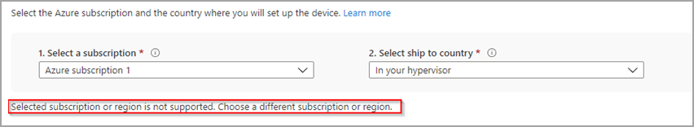
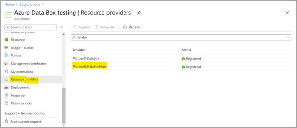

# Troubleshoot your Azure Stack Edge ordering issues

[!INCLUDE [applies-to-GPU-and-pro-r-and-mini-r-skus](../../includes/azure-stack-edge-applies-to-gpu-pro-r-mini-r-sku.md)]

This article describes how to troubleshoot Azure Stack Edge ordering issues.

## Unsupported subscription or region

**Error Description:** In Azure portal, if you get the error:

*Selected subscription or region is not supported. Choose a different subscription or region.*

**Suggested solution:**  Make sure that you used a supported subscription such as [Microsoft Enterprise Agreement (EA)](https://azure.microsoft.com/overview/sales-number/), [Cloud Solution Provider (CSP)](/partner-center/azure-plan-lp), or [Microsoft Azure Sponsorship](https://azure.microsoft.com/offers/ms-azr-0036p/). Pay-as-you-go subscriptions aren't supported. For more information, see [Azure Stack Edge resource prerequisites](azure-stack-edge-deploy-prep.md#prerequisites).

There's the possibility that Microsoft may allow a subscription type upgrade on a case-by-case basis. Contact [Microsoft support](https://azure.microsoft.com/support/options/) so that they can understand your needs and adjust these limits appropriately.

## Selected subscription type not supported

**Error:** You have an EA, CSP, or sponsored subscription and you get the following error:

*The selected subscription type is not supported. Make sure that you use a supported subscription. [Learn more](azure-stack-edge-deploy-prep.md#prerequisites). If using a supported subscription type, make sure:
 
- That the  `Microsoft.DataBoxEdge` provider is registered, when placing orders via the classic portal.
- That the `Microsoft.EdgeOrder`provider is registered, when placing orders via the Azure Edge Hardware Center (Preview).
 
For information on how to register, see [Register resource provider](azure-stack-edge-manage-access-power-connectivity-mode.md#register-resource-providers)*.

**Suggested solution:** Follow these steps to register your Azure Stack Edge resource provider:

1. In Azure portal, go to **Home** > **Subscriptions**.

2. Select the subscription that you'll use to order your device.

3. Select **Resource providers** and then search for **Microsoft.DataBoxEdge**.

    

If you don't have owner or contributor access to register the resource provider, you see the following error: *The subscription &lt;subscription name&gt; doesn't have permissions to register the resource provider(s): Microsoft.DataBoxEdge.*

For more information, see [Register resource providers](azure-stack-edge-manage-access-power-connectivity-mode.md#register-resource-providers).

## Resource provider not registered for subscription

**Error:** In Azure portal, you select a subscription to use for Azure Stack Edge or Data Box Gateway and get one of the following error:

*Resource provider(s): Microsoft.DataBoxEdge are not registered for subscription &lt;subscription name&gt; and you don't have permissions to register a resource provider for subscription &lt;subscription name&gt;*.

*Resource provider(s): Microsoft.EdgeOrder are not registered for subscription &lt;subscription name&gt; and you don't have permissions to register a resource provider for subscription &lt;subscription name&gt;*.

**Suggested solution:** Elevate your subscription access or find someone with owner or contributor access to register the resource provider.

## Resource disallowed by policy

**Error:** In Azure portal, you attempt to register a resource provider and get the following error:

*Resource &lt;resource name&gt; was disallowed by policy. (Code: RequestDisallowedByPolicy). Initiative: Deny generally unwanted Resource Types. Policy: Not allowed resource types.*

**Suggested solution:** This error occurs due to an existing Azure Policy assignment that blocks the resource creation. Azure Policy definitions and assignments are set by an organization's system administrator to ensure compliance while using or creating Azure resources. If any such policy assignment is blocking Azure Stack Edge resource creation, contact your system administrator to edit your Azure Policy definition.

## Next steps

* Learn more about how to [Troubleshoot your Azure Stack Edge issues](azure-stack-edge-gpu-troubleshoot.md).
