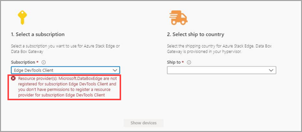
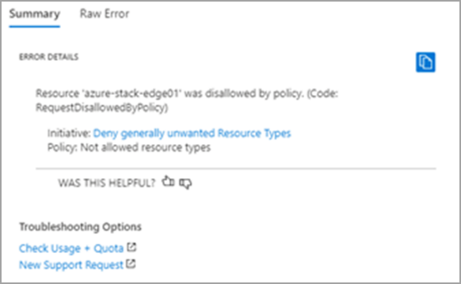

# Troubleshoot your Azure Stack Edge ordering issues

This article describes how to troubleshoot Azure Stack Edge ordering issues.

In this article, you learn how to:

 [!div class="checklist"]
>
> * Troubleshoot ordering issues

## Customer is not able to place an order because of unsupported subscription or region

**Error:** In Azure portal, if you get the error *Selected subscription or region is not supported. Choose a different subscription or region.*.

**Solution:** Make sure that you check your subscription type. Only Microsoft Enterprise Agreement (EA) and Cloud Solution Provider (CSP) subscription types can place an order. Pay-as-you-go (PAYG) subscriptions are not supported. For more information, see [Azure Stack Edge resource prerequisites](azure-stack-edge-deploy-prep.md#prerequisites). There is the possibility that Microsoft may allow a subscription type upgrade on a case-by-case basis. Contact [customer service](https://azure.microsoft.com/support/options/) at any time so that we can understand your needs and adjust these limits appropriately.

##	I have an EA/CSP/sponsored subscription, but I'm not seeing any SKUs and instead get an error

**Error:** You have an EA, CSP, or sponsored subscription and you get the following error:

*The selected subscription type is not supported. Make sure that you use a supported subscription. [Learn more](azure-stack-edge-deploy-prep.md#prerequisites). If using a supported subscription type, make sure that the `Microsoft.DataBoxEdge` provider is registered. For information on how to register, refer [Register resource provider](azure-stack-edge-manage-access-power-connectivity-mode.md#register-resource-providers)*

**Solution:** You need to register your Azure Stack Edge resource provider following these steps:

1. In Azure portal, click **Home**->**Subscriptions**.

2. Select the subscription to be used for ordering.

3. Click **Resource providers**.

4. Then search for **Microsoft.DataBoxEdge**.

    

**Solution:** You need to have owner or contributor access to register the resource provider, otherwise you will get the following error: *The subscription &lt;subscription name&gt; doesn't have permissions to register the resource provider(s): Microsoft.DataBoxEdge.*

For more information about registering resource providers, see [Register resource providers](azure-stack-edge-manage-access-power-connectivity-mode.md#register-resource-providers).

## Subscription is the correct type and is enabled for the SKUs, but *show devices* is disabled and displays an error

**Error:** In Azure portal, you select a subscription to use for Azure Stack Edge or Data Box Gateway and get the following error:

*Resource provider(s): Microsoft.DataBoxEdge are not registered for subscription &lt;subscription name&gt; and you don't have permissions to register a resource provider for subscription lt;subscription name&gt;*.

**Solution:** You need to find someone that has owner or contributor access to register the resource provider or elevated your subscription access.

## I get a **Deny generally unwanted resource types** error while creating an order

**Error:** In Azure portal, you attempt to register a resource provider and get the following error:

*Resource &lt;resource name&gt; was disallowed by policy. (Code: RequestDisallowedByPolicy). Initiative: Deny generally unwanted Resource Types. Policy: Not allowed resource types.*

**Solution:** This error occurs due to an existing Azure policy that blocks the resource creation. Azure policies are set by an organization's system administrator to ensure compliance while using or creating Azure resources. If any such policy is blocking Azure Stack Edge creation, you need to contact your system administrator to elevate your the Azure policy.

## Next steps

* Learn more about the [known issues in this release](data-box-gateway-release-notes.md).
