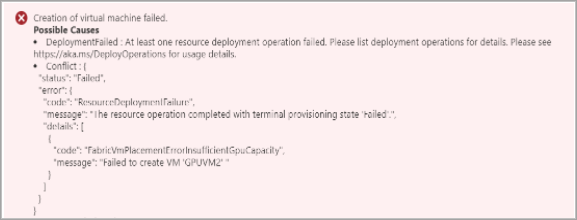

# Troubleshoot virtual machine provisioning in Azure Stack Edge Pro GPU

[!INCLUDE [applies-to-GPU-and-pro-r-and-mini-r-skus](../../includes/azure-stack-edge-applies-to-gpu-pro-r-mini-r-sku.md)]

This article describes how to troubleshoot issues that occur when provisioning a new virtual machine (VM) on an Azure Stack Edge Pro GPU device.

## VM Console Connect

You can access the console and troubleshoot any issues experienced when deploying a virtual machine on your device. You can connect to the virtual machine console even if your VM has failed to provision. For more information, see [Connect to the virtual machine console on Azure Stack Edge Pro GPU device](azure-stack-edge-gpu-connect-virtual-machine-console.md).


## Collect guest VM logs for a failed VM from Minishell

<!--This section is a prerequisite to the error descriptions.-->
VM Provisioning failure can be diagnosed further by collecting provisioning logs from within a virtual machine. The following command will:

* Collect the in guest logs for the failed VMs and 
* Include them in the support package.

To collect provisioning logs from within a virtual machine, do these steps:

1. [Connect to the minishell of the appliance](azure-stack-edge-gpu-connect-powershell-interface.md).<!--Link to a specific section.-->

2. Run the following commands from the minishell:

   ```powershell
   Get-VMInGuestLogs -FailedVM
   Get-HcsNodeSupportPackage -Path “\\<network path>” -Include InGuestVMLogFiles -Credential “domain_name\user”
   ```

3. Once you have the support package, you can check for the Guest logs under hcslogs\VmGuestLogs.

   Details about VM provisioning can be found in following logs

   **Linux:**
   /var/log/cloud-init-output.log
   /var/log/cloud-init.log
   /var/log/waagent.log

   **Windows:**
   C:\Windows\Azure\Panther\WaSetup.xml

In this document we will look at the common causes for:<!--Move this to the lead?-->
* VM Provisioning timeout<!--Add section links.-->
* Network Interface creation failure
* Image creation issues

## VM Provisioning Timeout

<!--Source provides a graphic of "Creation of virtual machine failed" error at this point.-->

* IP assigned to the VM is already in use (in case of static IP allocation)
* Image not prepared correctly
* Other VM provisioning issues

### IP assigned to the VM is already in use

**Error description:**  XXX 

1. Stop the VM from the portal (if it is running), and run the following commands:

   ```powershell
   ping <ip>
   tnc <ip>
   tnc <ip> -CommonTCPPort “RDP”
   ```

   There should be no response for the above commands.

**Suggested solution:**

Use a static IP address that is not in use, or use a dynamic IP address from the DHCP server.

### Image not prepared correctly

**Error description:** The workflow requires you to create a virtual machine in Azure, customize the VM, generalize the VM, and then download the VHD corresponding to that VM.

**Suggested solution:** For more information, refer to the following documents: 

* [Create custom VM images for your Azure Stack Edge Pro GPU device](azure-stack-edge-gpu-create-virtual-machine-image.md) (Workflow for creating a VM image)
* [Prepare generalized image from Windows VHD to deploy VMs on Azure Stack Edge Pro GPU](azure-stack-edge-gpu-prepare-windows-vhd-generalized-image.md)
* [Prepare generalized image from ISO to deploy VMs on Azure Stack Edge Pro GPU](azure-stack-edge-gpu-prepare-windows-generalized-image-iso.md)
* [Use a specialized image to deploy VMs](azure-stack-edge-gpu-deploy-virtual-machine-portal.md)<!--Article not yet available?-->

### Other provisioning issues

These include issues such as:

* The `cloud init` command did not run, or there were issues while `cloud init` was running. (Linux images only)
* The Gateway and DNS server couldn't be reached from a guest VM.
* Provisioning flags were set incorrectly `/etc/waagent.conf` (Linux images only)

To troubleshoot these issues, review the in-guest logs for the VM:

1. For issues while running `cloud init`:

   You can console connect<!--"console connect? Will reword later.--> to the VM, and review the logs under the following files to check for errors in `cloud init` execution.

    /var/log/cloud-init-output.log
    /var/log/cloud-init.log
    /var/log/waagent/log

1. Console connect to the VM, and validate that:

   1.	The default gateway can be pinged from the VM.
   1.	The DNS server can be reached from within the VM.

3. For Linux images only, make sure the Provisioning flags in the file `/etc/waagent.conf` are set to:<!--Make a table.-->

   # Enable instance creation
   `Provisioning.Enabled=n`

   # Rely on cloud-init to provision
   `Provisioning.UseCloudInit=y`

### Contact Support for the following logs

If you see the following logs, [contact Microsoft Support](azure-stack-edge-contact-microsoft-support.md).

#### For Windows VMs
 
File: C:\Windows\Azure\Panther\WaSetup.xml

```output
<Event time="2021-03-26T20:08:54.648Z" category="INFO" source="WireServer"><HttpRequest verb="GET" url="http://168.63.129.16/?comp=Versions"/></Event>
<Event time="2021-03-26T20:08:54.898Z" category="WARN" source="WireServer"><SendRequest>Received retriable HTTP client error: 8000000A for GET to http://168.63.129.16/?comp=Versions - attempt(1)</SendRequest></Event>
<Event time="2021-03-26T20:08:54.929Z" category="ERROR" source="WireServer"><UnhandledError><Message>GetGoalState: RefreshGoalState failed with ErrNo -2147221503</Message><Number>-2147221503</Number><Description>Not initialized</Description><Source>WireServer.wsf</Source></UnhandledError></Event>
```

#### For Linux VMs:

Files: 
* /var/log/cloud-init-output.log
* /var/log/cloud-init.log
* /var/log/waagent.log

```output
2021/04/02 20:55:00.899068 INFO Daemon Detect protocol endpoints
2021/04/02 20:55:01.043511 INFO Daemon Clean protocol
2021/04/02 20:55:01.094107 INFO Daemon WireServer endpoint is not found. Rerun dhcp handler
2021/04/02 20:55:01.188869 INFO Daemon Test for route to 168.63.129.16
2021/04/02 20:55:01.258709 INFO Daemon Route to 168.63.129.16 exists
2021/04/02 20:55:01.345640 INFO Daemon Wire server endpoint:168.63.129.16
2021/04/02 20:56:32.570904 INFO Daemon WireServer is not responding. Reset endpoint
2021/04/02 20:56:32.606973 INFO Daemon Protocol endpoint not found: WireProtocol, [ProtocolError] [Wireserver Exception] [HttpError] [HTTP Failed] GET http://168.63.129.16/?comp=versions -- IOError timed out -- 6 attempts made
```

##	Network Interface Troubleshooting

### NIC creation timeout

Go to the **Deployments** tab on the left pane, and navigate to the VM deployment. Check if the network interface was created successfully.<!--Is this in the local web UI?-->
If a network interface was not created successfully, you'll see an error similar to the following one:


**Suggested resolution:** Create the VM again, and assign it a static IP address. The failure might have been caused by DHCP server issues on your environment.

##	Image creation issues

Currently, we only support creation of Generation 1 virtual machines on Azure Stack Edge. Along with this, the VHDs should be of “fixed” type with the “VHD” extension, and should be uploaded to your Azure Storage account as a page blob.

For guidance on image creation issues, see [Troubleshoot virtual machine image uploads in Azure Stack Edge Pro GPU](azure-stack-edge-troubleshoot-virtual-machine-image-upload).

## Common VM creation issues

### Not enough memory to create the VM

When VM creation fails because of insufficient memory, you'll see the following error.
 
<!--Screenshot probably won't stay.-->

**Possible causes:**
1.	Not enough memory left to create the VM.
2.	Check the available memory on the device, and choose the VM size accordingly. For more information, see [Supported virtual machine sizes on Azure Stack Edge](azure-stack-edge-gpu-virtual-machine-sizes.md).<!--Is this a different issue or an expansion of issue 1?-->

Explanation:
An Azure Stack Edge Pro GPU device has a total memory of 128 Gbs. 

	Total memory = 128 Gbs
	Memory available for compute = 85% of 128 = 108.8 Gbs

If you have a Tactical Mobile Appliance SKU<!--Don't recognize this SKU.-->, you have a total memory of 48 Gbs. 

	Total memory = 48 Gbs
	Memory available for compute = 75% of 48 = 36 Gbs

Compute memory includes Kubernetes + VMs. If you have enabled Kubernetes, Kubernetes requires 25 percent of the memory for the master VM plus 4 Gb of memory for each worker VM - which is also expandable.<!--What is expandable, the memory on each worker VM, total memory required by Kubernetes? VM sizes doc should provide an answer?-->

	Memory available for VMs = Memory available for compute – Memory used by K8s
 <!--What are"K8s"-->

Additionally, Hyper-V comes with some overhead memory for each VM. So you may see new VM creations fail with the above error if there is not enough memory to create that VM.

**Possible solutions:**

1. Configure the VM for a smaller memory size.
2. Stop the VM which is not in use from the portal.<!--Translated: Stop any VMs that are not in use while they are deploying the new VM?-->
3. Delete unused VMs. 


### Insufficient number of GPUs to create GPU VM

Error displayed:

<!--Screenshot probably won't stay.-->

**Possible causes:**
If Kubernetes is enabled before the VM is created, Kubernetes will grab all the available GPUs and you won’t be able to create any GPU-sized VMs. You can create as many GPU-sized VMs as the number of GPUs (1 or 2 GPU SKU). 

**Possible solution:** For more information, see [Overview and deployment of GPU VMs on your Azure Stack Edge Pro device](azure-stack-edge-gpu-deploy-gpu-virtual-machine.md).


## DHCP server issues
<!--Can be a separate document.-->

ASE runs DHCP proxy for cloud VMs and VNFs in a tenant L2 network. This requires physical switch/router ports. Also, the DHCP server must allow the source MAC address to be different from the MAC address of the DHCP client. 

We observed that some environments (for example, Netgear cable modem wireless router, lab environment) drop DHCP packets if the source MAC address is different from the client MAC address. This causes the provisioning of VM and VNFs running on Azure Stack Edge to fail because of no DHCP offer.

This article describes DHCP flow in the working environment, and known failure cases. For failure cases, we recommend that you change the physical switch/router setting and mark connected ports in Azure Stack Edge as trusted ports<!--Specifically, which ports? Find the procedure where this is set up.-->.

<!--Problem Description:-->
We will illustrate DHCP flow in a working environment and in a non-working environment.<!--I'll add section links if this remains part of the VM provisioning troubleshooting article.-->

#### DHCP flow in ASE working environment

1. ASE DHCP client sent discover packet:
   * Src MAC 00:15:5d:aa:28:02 belongs to DHCP host vNIC on ASE. 
   * Client MAC address in DHCP header 00:1d:d8:b7:af:71 belongs to VM vNIC. 
 
<!--Screenshot of command output in source. I haven't examined it.--> 
 
2. DHCP server replied to the DHCP offer by assigning IP 10.126.76.42, and the client MAC address belongs to VM vNIC: 00:1d:d8:b7:af:71.
 
<!--Screenshot of command output in source. I haven't examined it.--> 

3. ASE DHCP client sent DHCP request for IP 10.126.76.42, client MAC address = VM vNIC's mac address (00:1d:d8:b7:af:71)

<!--Screenshot of command output in source. I haven't examined it.-->  
 
4. DHCP server replied DHCP ACK with VM vNIC's MAC as client MAC address: 00:1d:d8:b7:af:71
 

#### DHCP flow in non-working environment

**Failure case #1**

When the DHCP server replied DHCP offer packet (the 2nd packet in the working workflow), client MAC address in DHCP header is ASE's DHCP host vNIC's MAC address. In other words, the DHCP server assumed the two MAC addresses are the same and did not use the client MAC address in the DHCP discover packet. When ASE receives this DHCP offer packet, ASE will drop it with error, as the DHCP offer packet used an unexpected MAC address.

**Failure case #2**

DHCP server silently dropped DHCP request packet and did not reply with a DHCP ACK packet. The 4th packet in the working workflow is missing.

**Possible resolution:** DHCP physical environment requirement:

For a home wireless router (for example, NETGEAR Nighthawk AC1900 WiFi DOCSIS 3.0 Cable Modem Router (C7000)), the DHCP server by default assumed clients are _untrusted_, and thus blocked DHCP spoofing packets. If a home wireless router does not support DHCP proxy, Azure Stack Edge will not work for DHCP IP assignment. As a work-around, you can configure static IP addresses on VM network interfaces. 
 
<!--STOPPED HERE, 05/17-->Physical switch or router has the DHCP snooping feature. The ports that Azure Stack Edge connected shall be configured as _trusted_ ports, thus packets from ASE DHCP proxy won't be dropped. Configuration of DHCP snooping and trusted ports on physical switch/router shall refer to respective user manual. Reference has example of Cisco router configuration.   

Debug with Wireshark Packet Capture:
User shall enter support session by running Enable-HcsSupportAccess in minishell. Then in powershell window, connect to Azure Resource Manager (Connect to Azure Resource Manager on your Azure Stack Edge Pro GPU device | Microsoft Docs).  Run ARM commands to create/remove NIC. Creating a NIC without specifying IPAddress will trigger DHCP request sent from ASE. Before NIC creation, user shall start packet capture session on switch side: 
 
On ASE create NIC to trigger DHCP:
Create NIC:
$ipcfgName = "ipconfig1"
 $nicName = "<nicName>"
 $rgname = "<resource group>"
 $subNetId = (Get-AzureRmVirtualNetwork).Subnets[0].Id
 $ipConfig = New-AzureRmNetworkInterfaceIpConfig -Name $ipcfgName -SubnetId $subNetId
 $Nic = New-AzureRmNetworkInterface -Name $nicName -ResourceGroupName $rgname -Location "dbelocal" -IpConfiguration $ipConfig
 
 
Check existing NIC:
$nics = Get-azurermnetworkinterface
 
 
Delete NIC:
$nics[0] | remove-azurermnetworkinterface   (example: delete1st NIC in $nics array, make sure $nics[0] is not used)


On switch side run packet capture
From Physical Switch UX:
Using Packet Capture to Troubleshoot Client-side DHCP Issues - Cisco Meraki
Using Wireshark for Packet Captures - Cisco Meraki
 
From Physical Switch Command-Line:
https://www.cisco.com/c/en/us/td/docs/switches/lan/catalyst9300/software/release/16-9/configuration_guide/nmgmt/b_169_nmgmt_9300_cg/configuring_packet_capture.html
   
Reference:
https://en.wikipedia.org/wiki/Dynamic_Host_Configuration_Protocol
How to Prevent DHCP Spoofing (slideshare.net), page 9
Security - Configuring DHCP Snooping  [Support] - Cisco Systems


Gpu Extension failed to be deployed
Debugging steps:
VM size is not Gpu vm size:
Right now, we only support Standard_NC4as_T4_v3 and Standard_NC8as_T4_v3 VM sizes to create Gpu vms. If any other vm size is used, attempting to attach gpu extension will fail. 

Image OS is not supported:
We only support Windows2019, Windows2016, Ubuntu18, and RHEL7.4 right now. Overview and deployment of GPU VMs on your Azure Stack Edge Pro device | Microsoft Docs

Extension parameter is incorrect:
Make sure the customer used the correct extension settings when deploying gpu extension. Overview and deployment of GPU VMs on your Azure Stack Edge Pro device | Microsoft Docs

VM extension installation failed in downloading package:
Extension provisioning could fail in extension installation or enable state. We need to check in guest log for the actual error:
1.	For linux:
a.	Check for errors in /var/log/waagent.log or /var/log/azure/nvidia-vmext-status
2.	For Windows:
a.	Check for the error status in C:\Packages\Plugins\Microsoft.HpcCompute.NvidiaGpuDriverWindows\1.3.0.0\Status
b.	Also look in C:\WindowsAzure\Logs\WaAppAgent.txt for the complete execution log.
3.	If the install process failed in downloading the package. Then it means the vm is not able to reach to public network to download the driver. 
Resolution:
1.	Move the compute port to public network (Port 2)
2.	Deallocate the existing failed VM. 
3.	Try to create another VM.
VM Extension failed with error dpkg is used/yum lock is used
This only happens on Linux builds. Check \var\log\azure\nvidia-vmext-status and look for the error. If the error is like “dpkg is used by another process”/”Another app is holding yum lock”. The customer needs to wait for whatever process that is using the lock to finish or kill the process, before retrying the extension deployment again.
Resolution:
1.	Find out what process is using the lock, wait for them to finish. Or kill them
2.	Retry setting the extension.
3.	If extension retry failed. Try creating another VM and make sure the lock is not used before deploying the extension.


## Next steps

* Learn how to XXX
* Learn how to XXX
