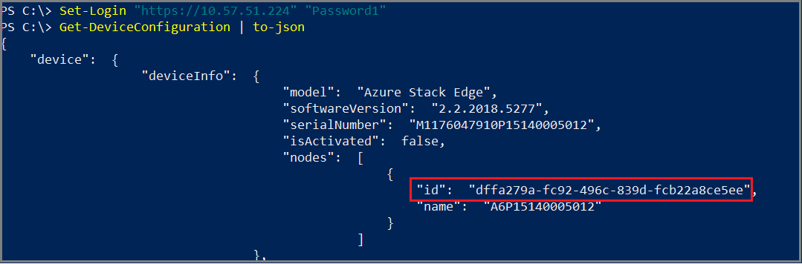

# Configure Azure Stack Edge devices using the Zero Touch Provisioning module

[!INCLUDE [applies-to-GPU-and-pro-r-and-mini-r-skus](../../includes/azure-stack-edge-applies-to-gpu-pro-r-mini-r-sku.md)]

This article describes how to automate initial device configuration and activation of Azure Stack Edge devices using PowerShell. Zero Touch Provisioning enables automated, standardized device configuration of one or more devices before they are activated.

Use Zero Touch Provisioning as an alternative to the local web user interface setup sequence. You can run as many rounds of configuration changes and updates as necessary, until the device is activated. After device activation, use the Azure portal UI or the local web UI to modify device configuration.

Usage considerations:

- You can apply updates to a device until it is activated. To update devices after activation or to manage devices using the local web user interface, see [Connect to Azure Stack Edge Pro with GPU](azure-stack-edge-gpu-deploy-connect.md?pivots=single-node).
- You cannot update device authentication using Zero Touch Provisioning. To update device authentication settings, see [Change device password](azure-stack-edge-gpu-manage-access-power-connectivity-mode.md#change-device-password).
- You can only provision single-node devices using Zero Touch Provisioning. Two-node cluster configuration is not supported.
- You can apply configuration updates to a device using individual PowerShell cmdlets, or you can apply bulk configuration updates using a JSON file.

## About device setup and configuration

Device setup and configuration includes a root-level “Device” element and declarations that define the configuration for that device. Declarations supported for Azure Stack Edge devices include:
- Device endpoint
- Password
- Certificates
- Encryption at rest
- Web proxy
- Network
- Time
- Update
- Activation

A device update operation does not have to include every declaration; you can include only the declarations that create a desired configuration.

The following cmdlets are supported to configure Azure Stack Edge devices:

|Cmdlet|Description|
|---------|---------|
|Set-login|First-time login, set or update login credentials to access the device.|
|Get-DeviceConfiguration|Fetch the current device configuration.|
|Set-DeviceConfiguration|Update the device configuration.|
|New-Package|Prepare a device setup configuration package to apply to one or more devices.|
|Get-DeviceConfigurationStatus|Fetch the status of in-flight configuration changes being applied to the device to determine whether the update succeeded or failed or is still in progress.|
|Get-DeviceDiagnostic|Get diagnostic status of the device.|
|Start-DeviceDiagnostic|Start a new diagnostic run to verify updated status after a device setup configuration package is applied.|
|To-json|Fetch the entire device configuration.|

## Prerequisites

Before you begin, make sure that you:

1. Have a client running Windows 10 or Windows Server 2016 or later.
1. Are running PowerShell version 5.1 or later.
1. Are connected to the local web UI of an Azure Stack Edge device. For more information, see [Connect to Azure Stack Edge Pro with GPU](azure-stack-edge-gpu-deploy-connect.md?pivots=single-node).
1. Download the [PowerShell module](https://aka.ms/aseztp-ps).

## Import the module and sign into the device

Use the following steps to import the PowerShell module, sign into the device, and update the device password.

1. Launch PowerShell as an administrator.
1. Import the PowerShell module.

   ```azurepowershell
   Import-Module Drive:\<Local path>\ZtpRestHelpers.ps1
   ```

1. Sign into the device using the Set-Login cmdlet. First time signin to the device requires password reset.

   ```azurepowershell
   Set-Login "https://<IP address>" "<Password1>" “<NewPassword>”
   OR
   Set-Login “https://hwjf1t77.local” “<Password1>” “<NewPassword>”
   ```

## Sign into a device, change the password, and fetch the device configuration

Use the following steps to sign into a device, change the password, and fetch the device configuration:

1. Sign into the device and update the device password.

   ```azurepowershell
   Set-Login “https://hwjf1t772.local” “<Password1>”
   ```
   For any subsequent sign-in, use:

   ```azurepowershell
   Set-Login “https://<SerialNumber>.local” “<Password>”
   ```

1. Fetch the device configuration.

   ```azurepowershell
   Get-DeviceConfiguration | to-json
   ```

   Example output:


## Apply a partial configuration to a device

Use the following steps to prepare a JSON package with the configuration to apply to devices. This sequence of cmdlets signs into the device, sets the time zone, updates the ServerType property, creates a JSON package for those properties, and then applies the package to the device.

After applying the JSON package to the device, the sequence continues by running a status command to verify successful device update. Then it fetches the device configuration and saves the JSON configuration file to the local drive for reuse on one or more additional devices.

Use a config.json file with properties that meets the needs of your organization. A [sample config.json file is available here](Need URL to file in repo).

Run the following cmdlets in PowerShell:

1. Sign into the device.

    ```azurepowershell
    Set-Login "https://<IP address>" "<Password>"
    ```

1. Set the time zone property.

   ```azurepowershell
   $time = New-Object PSObject -Property @{ timezone = "Hawaiian Standard Time" }
   ```

1. Set the ServerType property.

   ```azurepowershell
   $update = New-Object PSObject -Property @{ ServerType = "MicrosoftUpdate" }
   ```

1. Create a package with the updated device settings.

   ```azurepowershell
   $pkg = New-Package -time $time -update $update
   ```

1. Run the package.

   ```azurepowershell
   $newCfg = Set-DeviceConfiguration -desiredDeviceConfig $pkg
   ```

1. Verify that the operation is complete.

   ```azurepowershell
   Get-DeviceConfigurationStatus | to-json
   ```

1. After the operation is complete, fetch the updated device configuration.

   ```azurepowershell
   Get-DeviceConfiguration | to-json
   ```

1. Save the JSON configuration file to the local system.

   ```azurepowershell
   Get-DeviceConfiguration | to-json | Out-File "C:\<Local path>\testconfig2.json"
   ```

Example output:


## Apply a full configuration to a device, without device activation

Once a config.json file has been created, as in the previous example, with the desired configuration, use the JSON file to update configuration settings on one or more devices.

This sequence of PowerShell cmdlets signs into the device, applies the device setup configuration package with device configuration settings from a JSON file, verifies completion of the device update, and then fetches the updated device configuration.

Run the following cmdlets in PowerShell:

1. Sign into the device.

   ```azurepowershell
   Set-Login "https://<IP address>" "<Password>"
   ```

1. Before you update the device with a new configuration, update the JSON file with the device node.id of the device to be updated. Each device has a unique node.id.

   Fetch the node.id from the device with the following commands from PowerShell:

   ```azurepowershell
   Get-DeviceConfiguration | to-json
   ```

   Here is an example of output showing node.id:

   

1. Create an update package that uses a local JSON file for device configuration settings.

   ```azurepowershell
   $p = Get-Content -Path "Drive:\Temp\<ConfigFileName.json>" | ConvertFrom-json
   ```

1. Run the package.

   ```azurepowershell
   $newCfg = Set-DeviceConfiguration -desiredDeviceConfig $p
   ```

1. Monitor update status as the operation runs. It may take 10 minutes for the operation to complete.

   ```azurepowershell
   Get-DeviceConfigurationStatus | to-json
   ```

1. After the operation is complete, fetch the updated device configuration.

   ```azurepowershell
   Get-DeviceConfiguration | to-json
   ```

## Activate a device

TBD

1.	Retrieve activation key
2.	Create package
3.	Run package
4.	Monitor operation status

Use the following steps to activate an Azure Stack Edge device.

Note that a device activation key cannot be undone, reused, or applied to a different device.

1. Retrieve the activation key for your device. For detailed steps, see <>. 

1. Sign into the device.

   ```azurepowershell
   Set-Login "https://<IP address>" "Password"
   ```

1. Create an activation object and set the activation property.

   ```azurepowershell
   $activation = New-Object PsObject -Property @{activationKey=$activationKey; cik=""}
   ```

1. Create a package with the activation object and activation key.

   ```azurepowershell
   		$p. = New-Package -activation $activation
   ```

1. Run the package.

   ```azurepowershell
   $newCfg = Set-DeviceConfiguration -desiredDeviceConfig $p
   ```

1. Monitor update status as the operation runs. It may take 10 minutes or more for the operation to complete.

   ```azurepowershell
   Get-DeviceConfigurationStatus | to-json
   ```

1. After the operation is complete, fetch the updated device configuration.

   ```azurepowershell
   Get-DeviceConfiguration | to-json
   ```

## Quickly fetch or modify device configuration settings

Use the following steps to sign into the device, fetch the status of the webProxy property, set the webProxy property to “isEnabled = true,” and then fetch the status of the updated webProxy property.

1. Sign into the device.

   ```azurepowershell
   Set-Login "https://<IP address>" "Password"
   ```

1. Fetch the status of the webProxy property.

   ```azurepowershell
   $p.device.webproxy
   ```

1. Set the webProxy property to “isEnabled = true.”

   ```azurepowershell
   $p.device.webproxy.isEnabled = $true
   ```

1. Fetch the status of the webProxy property.

   ```azurepowershell
   $p.device.webproxy
   ```

   Example output:

## Troubleshooting

- [Run diagnostics or collect logs to troubleshoot Azure Stack Edge device issues](azure-stack-edge-gpu-troubleshoot.md).

## Next steps

- [Troubleshoot device activation issues](azure-stack-edge-gpu-troubleshoot-activation.md).
- [Troubleshoot Azure Resource Manager issues](azure-stack-edge-gpu-troubleshoot-azure-resource-manager.md).
- [Troubleshoot Blob storage issues](azure-stack-edge-gpu-troubleshoot-blob-storage.md).
