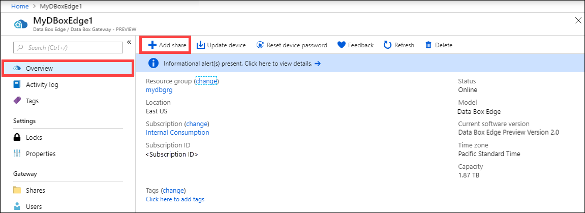
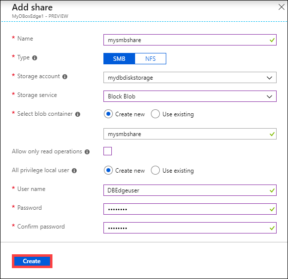
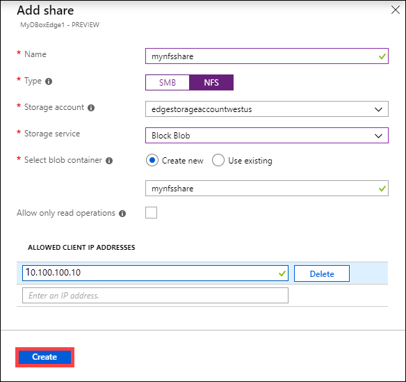
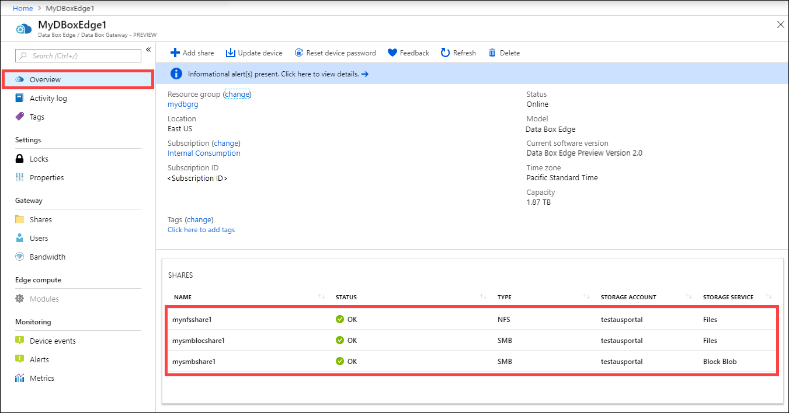

# Tutorial: Transfer data with Azure Data Box Edge (Preview)

This tutorial describes how to add and connect to shares on the Data Box Edge. Once the shares are added, Data Box Edge device can transfer data to Azure.

This procedure can take around 10 minutes to complete. 

In this tutorial, you learn how to:

> [!div class="checklist"]
> * Add a share
> * Connect to share

> [!IMPORTANT]
> Data Box Edge is in preview. Review the [Azure terms of service for preview](https://azure.microsoft.com/support/legal/preview-supplemental-terms/) before you order and deploy this solution. 
 
## Prerequisites

Before you add shares to your Data Box Edge, make sure that:

* You've installed your physical device as detailed in the [Install a Data Box Edge](data-box-edge-deploy-install.md). 

    The physical device is activated as described in [Connect and activate your Azure Data Box Edge](data-box-edge-deploy-connect-setup-activate.md). The device is ready for you to create shares and transfer data.


## Add a share

Do the following steps in the [Azure portal](https://portal.azure.com/) to create a share.

1. Return to the Azure portal. Go to **All resources**, and search for your Data Box Edge resource.
    
2. In the filtered list of resources, select your Data Box Edge resource and go to **Overview**. Click **+ Add share** on the device command bar.
   
   

3. In **Add Share**, specify the share settings. Provide a unique name for your share. 

   Share names can only have numbers, lowercase letters, and hyphens. The share name must be between 3 and 63 characters long and begin with a letter or a number. Each hyphen must be preceded and followed by a non-hyphen character.
    
    1. Select a **Type** for the share. The type can be SMB or NFS, with SMB being the default. SMB is the standard for Windows clients, and NFS is used for Linux clients. 

    2. Depending upon whether you choose SMB or NFS shares, options presented are slightly different. 

    3. You must provide a storage account where the share will reside. A container is created in the storage account with the share name if the container already doesn't exist. If the container already exists, then the existing container is used. 
    
    4. Choose the **Storage service** from block blob, page blob, or files. The type of the service chosen depends on which format you want the data to reside in Azure. For example, in this example, we want the data to live as blob blocks in Azure, hence we select Block Blob. If you choose Page Blob, make sure that your data is 512 bytes aligned. For example, a VHDX is always 512 bytes aligned.
   
    5. This step depends on whether you are creating an SMB or an NFS share. 
     
        - **If creating an SMB share** - In the All privilege local user field, choose from **Create new** or **Use existing**. If creating a new local user, provide the **username**, **password**, and then **confirm password**. This assigns the permissions to the local user. After you have assigned the permissions here, you can then use File Explorer to modify these permissions.

            If you check **allow only read operations** for this share data, then you will have the option to specify read-only users.

            
   
        - **If creating an NFS share** - You need to supply the IP addresses of the allowed clients that can access the share.

            
   
4. Click **Create** to create the share. 
    
    You are notified that the share creation is in progress. After the share is created with the specified settings, the **Shares** blade updates to reflect the new share. 
    
     

## Connect to the share

You can now connect to one or more shares that you created in the previous step. Depending upon whether you have an SMB or an NFS share, the steps can be different. 

### Connect to an SMB share

Do these steps on your Windows Server client connected to your Data Box Edge to connect to shares.


1. Open a command window. At the command prompt, type:

    `net use \\<IP address of the device>\<share name>  /u:<user name for the share>`

    Enter the password for the share when prompted. The sample output of this command is presented here.

    ```powershell
    Microsoft Windows [Version 10.0.16299.192) 
    (c) 2017 microsoft Corporation. All rights reserved . 
    
    C: \Users\DataBoxEdgeUser>net use \\10.10.10.60\newtestuser /u:Tota11yNewUser 
    Enter the password for 'TotallyNewUser' to connect to '10.10.10.60': 
    The command completed successfully. 
    
    C: \Users\DataBoxEdgeUser>
    ```   


2. Press  Windows + R. In the **Run** window, specify the `\\<device IP address>`. Click **OK**. This opens File Explorer. You should now be able to see the shares that you created as folders. Select and double-click a share (folder) to view the content.
 
    

    The data is written to these shares as it is generated and the device pushes the data to cloud.

### Connect to an NFS share

Do these steps on your Linux client connected to your Data Box Edge.

1. Ensure that the client has NFSv4 client installed. To install NFS client, use the following command:

   `sudo apt-get install nfs-common`

    For more information, go to [Install NFSv4 client](https://help.ubuntu.com/community/SettingUpNFSHowTo#NFSv4_client).

2. After the NFS client is installed, use the following command to mount the NFS share you created on your Data Box Edge device:

   `sudo mount <device IP>:/<NFS share on device> /home/username/<Folder on local Linux computer>`

    Before you mount the shares, make sure the directories that will act as mountpoints on your local computer, are already created. These directories should not contain any files or sub-folders.

    The following example shows how to connect via NFS to a share on your Data Box Edge device. The device IP is `10.10.10.60`. The share `mylinuxshare2` is mounted on the ubuntuVM. The share mount point is `/home/databoxubuntuhost/edge`.

    `sudo mount -t nfs 10.10.10.60:/mylinuxshare2 /home/databoxubuntuhost/Edge`

> [!NOTE] 
> The following caveats are applicable to the preview release:
> - After a file is created in the shares, renaming of the file isn’t supported. 
> - Deletion of a file from a share does not delete the entry in the storage account.

## Next steps

In this tutorial, you learned about  Data Box Edge topics such as:

> [!div class="checklist"]
> * Add a share
> * Connect to share


Advance to the next tutorial to learn how to transform your data with Data Box Edge.

> [!div class="nextstepaction"]
> [Transform data with Data Box Edge](./data-box-edge-deploy-configure-compute.md)


