# Tutorial: Transform data with Azure Data Box Edge for advanced deployment flow

This tutorial describes how to configure a compute role for an advanced deployment flow on your Azure Data Box Edge device. After you configure the compute role, Data Box Edge can transform data before sending it to Azure.

Compute can be configured for simple or advanced deployment flow on your device.

|                  | Simple deployment                                | Advanced deployment                   |
|------------------|--------------------------------------------------|---------------------------------------|
| Intended for     | IT administrators                                | Developers                            |
| Type             | Use Data Box Edge service to deploy modules      | Use IoT Hub service to deploy modules |
| Modules deployed | Single                                           | Chained or multiple modules           |


This procedure can take around 20 to 30 minutes to complete.

In this tutorial, you learn how to:

> [!div class="checklist"]
> * Configure compute
> * Add shares
> * Add a trigger
> * Add a compute module
> * Verify data transform and transfer

 
## Prerequisites

Before you set up a compute role on your Data Box Edge device, make sure that:

- You've activated your Data Box Edge device as described in [Connect, set up, and activate Azure Data Box Edge](data-box-edge-deploy-connect-setup-activate.md).


## Configure compute

To configure compute on your Data Box Edge, you'll create an IoT Hub resource.

1. In the Azure portal of your Data Box Edge resource, go to **Overview**. In the right-pane, on the **Compute** tile, select **Get started**.

    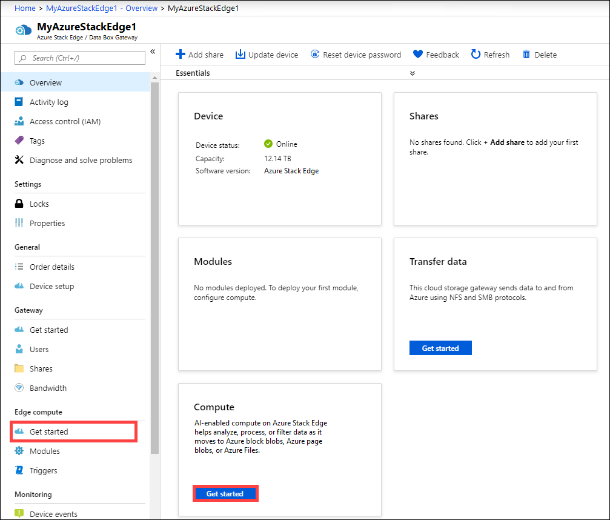

2. On the **Configure Edge compute** tile, select **Configure compute**.

    

3. On the **Configure Edge compute** blade, input the following:

   
    |Field  |Value  |
    |---------|---------|
    |IoT Hub     | Choose from **New** or **Existing**. <br> By default, a Standard tier (S1) is used to create an IoT resource. To use a free tier IoT resource, create one and then select the existing resource. <br> In each case, the IoT Hub resource uses the same subscription and resource group that is used by the Data Box Edge resource.     |
    |Name     |Enter a name for your IoT Hub resource.         |

    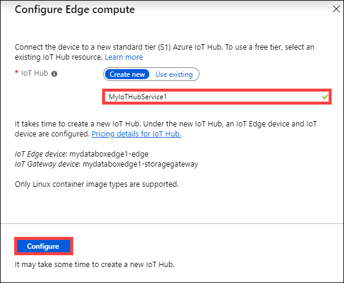

4. Select **Create**. The IoT Hub resource creation takes a couple minutes. After the IoT Hub resource is created, the **Configure Edge compute** tile updates to show the compute configuration. To confirm that the Edge compute role has been configured, select **View config** on the **Configure compute** tile.
    
    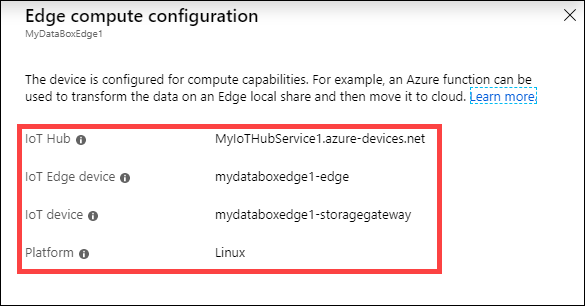

    When the Edge compute role is set up on the Edge device, it creates two devices: an IoT device and an IoT Edge device. Both devices can be viewed in the IoT Hub resource. An IoT Edge Runtime is also running on this IoT Edge device.

    At this point, only the Linux platform is available for your IoT Edge device.


## Add shares

For the advanced deployment in this tutorial, you'll need two shares: one Edge share and another Edge local share.

1. Add an Edge share on the device by doing the following steps:

    1. In your Data Box Edge resource, go to **Edge compute > Get started**.
    2. On the **Add share(s)** tile, select **Add**.
    3. On the **Add share** blade, provide the share name and select the share type.
    4. To mount the Edge share, select the check box for **Use the share with Edge compute**.
    5. Select the **Storage account**, **Storage service**, an existing user, and then select **Create**.

        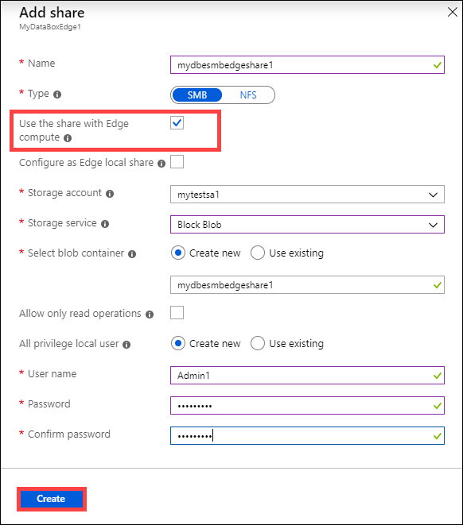

    <!--If you created a local NFS share, use the following remote sync (rsync) command option to copy files onto the share:

    `rsync <source file path> < destination file path>`

    For more information about the rsync command, go to [Rsync documentation](https://www.computerhope.com/unix/rsync.htm).-->

    After the Edge share is created, you'll receive a successful creation notification. The share list is updated to reflect the new share.

2. Add an Edge local share on the Edge device by repeating all the steps in the preceding step and selecting the check box for **Configure as Edge local share**. The data in the local share stays on the device.

    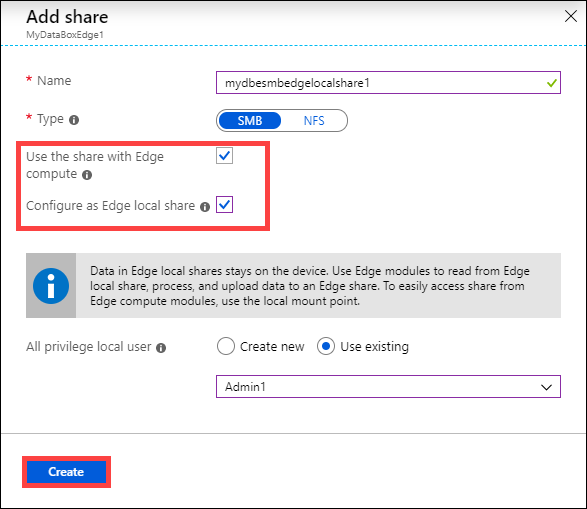

3. On the **Shares** blade, you see the updated list of shares.

    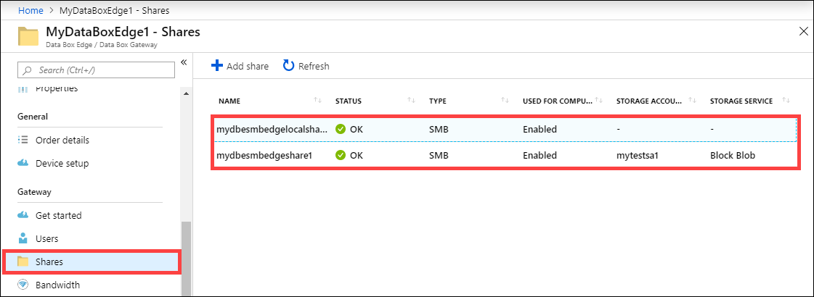

4. To view the properties of the newly created local share, select the share from the list. In the **Local mount point for Edge compute modules** box, copy the value corresponding to this share.

    You'll use this local mount point when you deploy the module.

    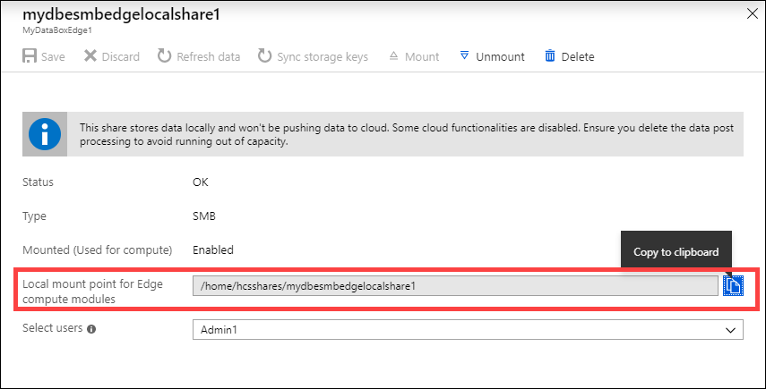
 
5. To view the properties of the Edge share that you created, select the share from the list. In the **Local mount point for Edge compute modules** box, copy the value corresponding to this share.

    You'll use this local mount point when you deploy the module.

    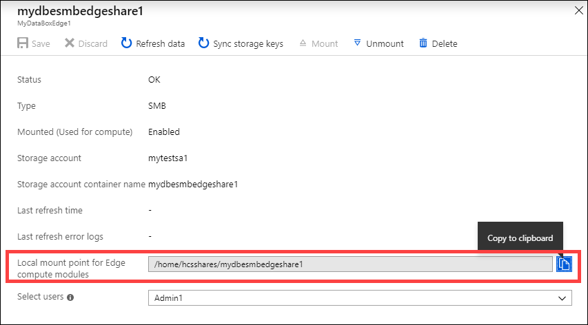


## Add a trigger

1. Go to **Edge compute > Triggers**. Select **+ Add trigger**.

    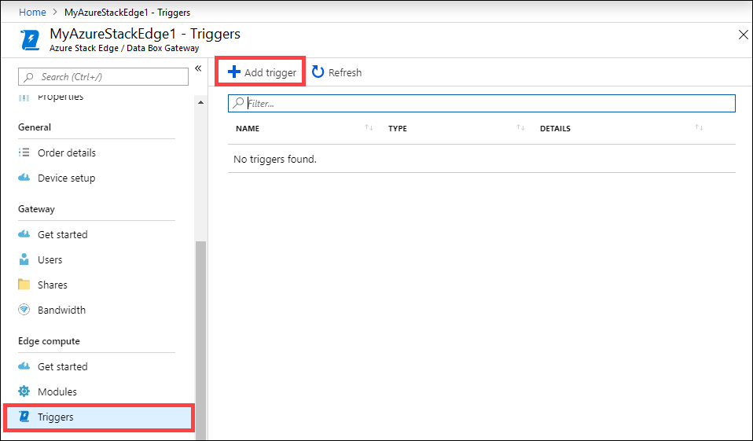

2. In the **Add trigger** blade, input the following values.

    |Field  |Value  |
    |---------|---------|
    |Trigger name     | A unique name for your trigger.         |
    |Trigger type     | Select **File** trigger. A file trigger fires whenever a file event occurs such as a file is written to the input share. A scheduled trigger on the other hand, fires up based on a schedule defined by you. For this example, we need a file trigger.    |
    |Input share     | Select an input share. The Edge local share is the input share in this case. The module used here moves files from the Edge local share to an Edge share where they are uploaded into the cloud.        |

    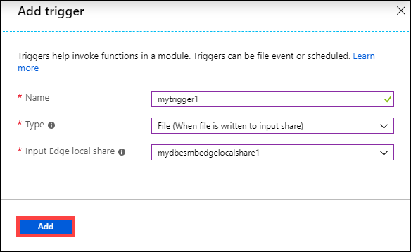

3. You are notified after the trigger is created. The list of triggers is updated to display the newly created trigger. Select the trigger you just created.

    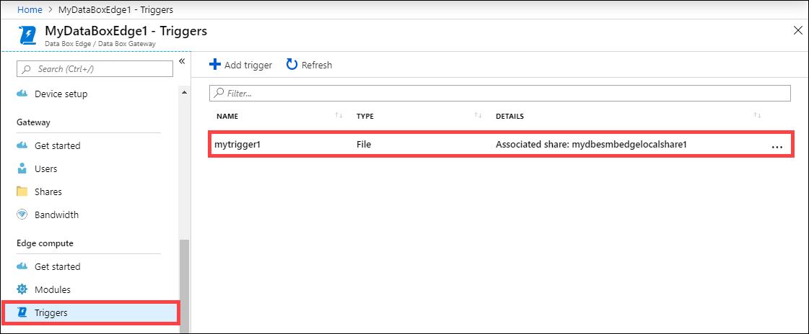

4. Copy and save the sample route. You will modify this sample route and use it later in the IoT Hub.

    `"sampleroute": "FROM /* WHERE topic = 'mydbesmbedgelocalshare1' INTO BrokeredEndpoint(\"/modules/modulename/inputs/input1\")"`

    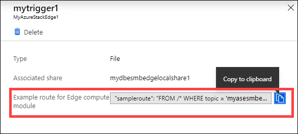

## Add a module

There are no custom modules on this Edge device. You could add a custom or a pre-built module. To learn how to create a custom module, go to [Develop a C# module for your Data Box Edge device](data-box-edge-create-iot-edge-module.md).

In this section, you add a custom module to the IoT Edge device that you created in [Develop a C# module for your Data Box Edge](data-box-edge-create-iot-edge-module.md). This custom module takes files from an Edge local share on the Edge device and moves them to an Edge (cloud) share on the device. The cloud share then pushes the files to the Azure storage account that's associated with the cloud share.

1. Go to **Edge compute > Get started**. On the **Add modules** tile, select the scenario type as **advanced**. Select **Go to IoT Hub**.

    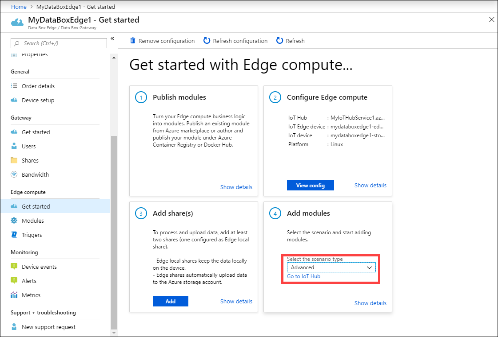

<!--2. In the **Configure and add module** blade, input the following values:  

    |Input share     | Select an input share. The Edge local share is the input share in this case. The module used here moves files from the Edge local share to an Edge share where they are uploaded into the cloud.        |
    |Output share     | Select an output share. The Edge share is the output share in this case.        |
-->

2. In your IoT Hub resource, go to **IoT Edge device** and then select your IoT Edge device.

    

3. On **Device details**, select **Set Modules**.

    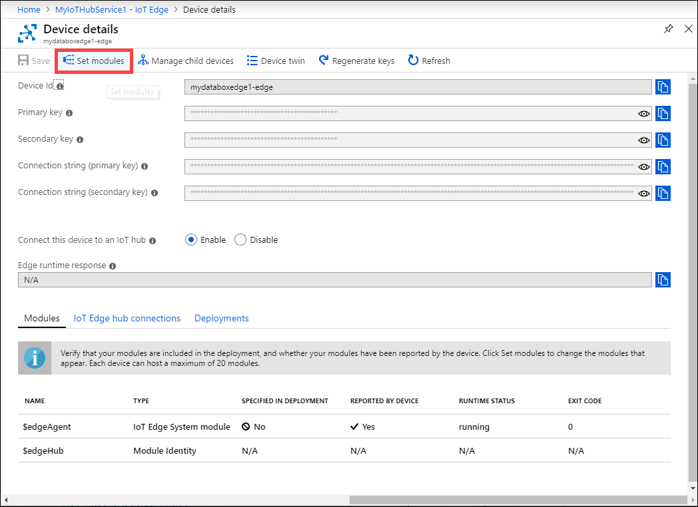

4. Under **Add Modules**, do the following:

    1. Enter the name, address, user name, and password for the container registry settings for the custom module.
    The name, address, and listed credentials are used to retrieve modules with a matching URL. To deploy this module, under **Deployment modules**, select **IoT Edge module**. This IoT Edge module is a docker container that you can deploy to the IoT Edge device that's associated with your Data Box Edge device.

         
 
    2. Specify the settings for the IoT Edge custom module. Input the following values.
     
        |Field  |Value  |
        |---------|---------|
        |Name     | A unique name for the module. This module is a docker container that you can deploy to the IoT Edge device associated with your Data Box Edge.        |
        |Image URI     | The image URI for the corresponding container image for the module.        |
        |Credentials required     | If checked, username and password are used to retrieve modules with a matching URL.        |
    
        In the **Container Create Options** box, enter the local mount points for the Edge modules that you copied in the preceding steps for the Edge share and Edge local share.

        > [!IMPORTANT]
        > The paths used here are mounted into your container, so they must match what the functionality in your container expects. If you're following [Create a custom module](data-box-edge-create-iot-edge-module.md#update-the-module-with-custom-code), the code specified in that module expects the copied paths. Do not modify these paths.
    
        In the **Container Create Options** box, you can paste the following sample:
    
        ```
        {
          "HostConfig": 
          {
           "Binds": 
            [
             "/home/hcsshares/mydbesmbedgelocalshare1:/home/input",
             "/home/hcsshares/mydbesmbedgeshare1:/home/output"
            ]
           }
        }
        ```

        Provide any environmental variables used for your module. Environmental variables provide optional information that help define the environment in which your module runs.

        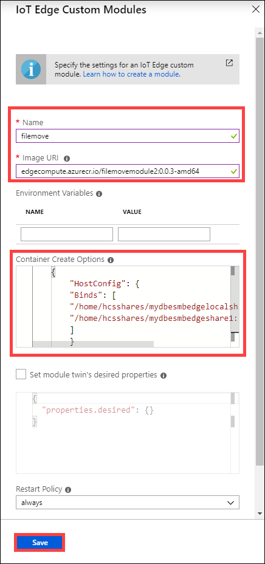 
 
    4. If necessary, configure the advanced Edge runtime settings, and then click **Next**.

        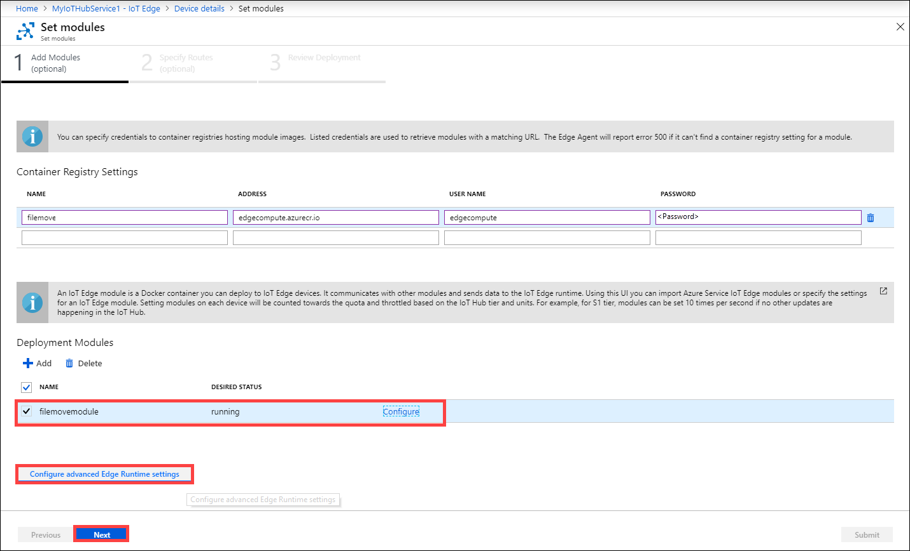
 
5.	Under **Specify Routes**, set routes between modules.  
    
    

    You can replace *route* with the following route string that you copied earlier. In this example, enter the name of the local share that will push data to the cloud share. Replace the `modulename` with the name of the module. Select **Next**.
        
    ```
    "route": "FROM /* WHERE topic = 'mydbesmbedgelocalshare1' INTO BrokeredEndpoint(\"/modules/filemove/inputs/input1\")"
    ```

    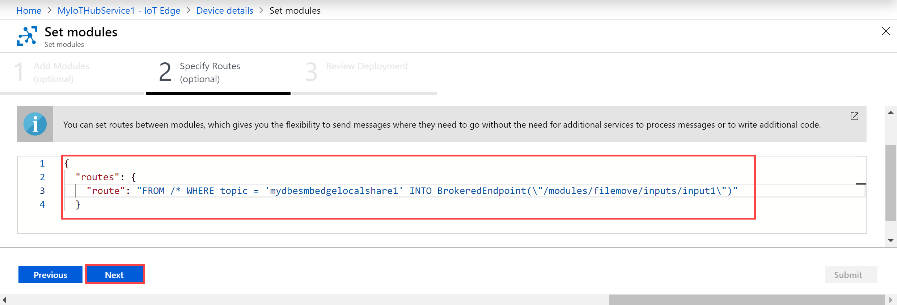

6.	Under **Review deployment**, review all the settings, and then select **Submit** to submit the module for deployment.

    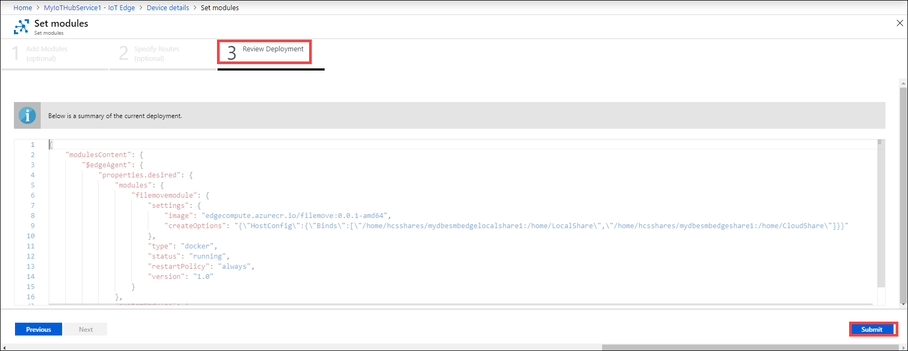
 
    This action starts the module deployment. After the deployment is complete, the **Runtime status** of module is **running**.

    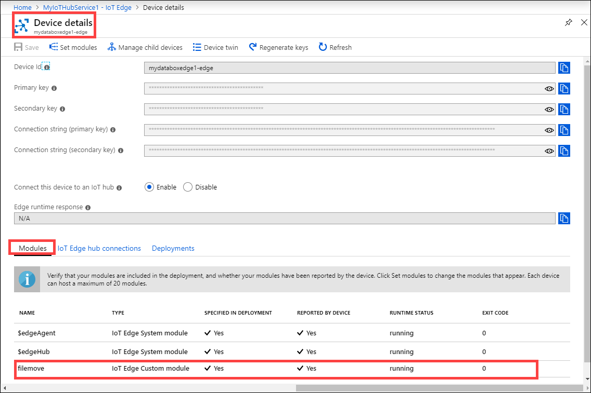

## Verify data transform, transfer

The final step is to ensure that the module is connected and running as expected. The run-time status of the module should be running for your IoT Edge device in the IoT Hub resource.

Take the following steps to verify data transform and transfer to Azure.
 
1.	In File Explorer, connect to both the Edge local and Edge shares you created previously.

    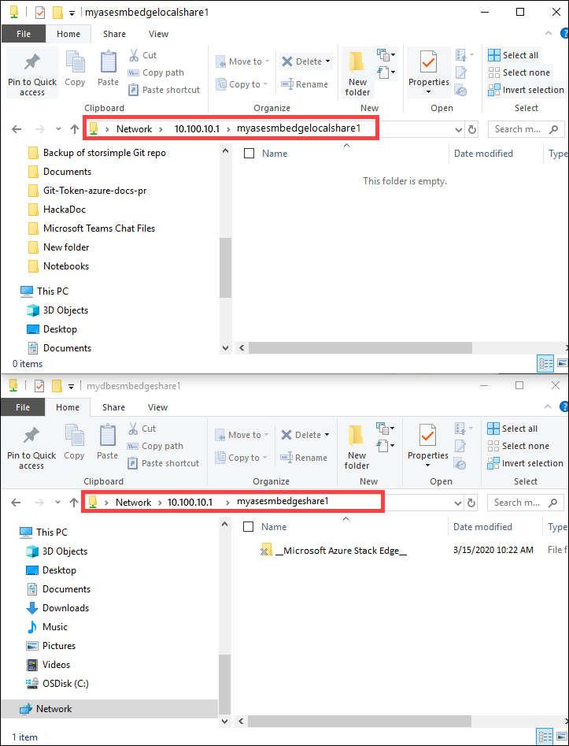
 
1.	Add data to the local share.

    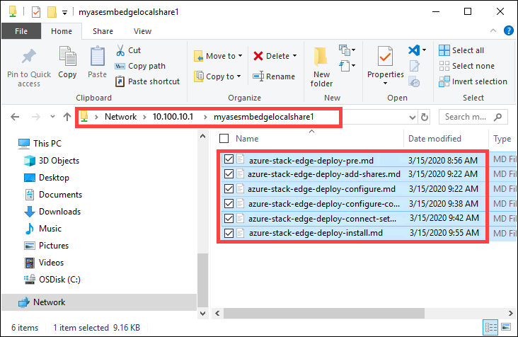
 
    The data gets moved to the cloud share.

    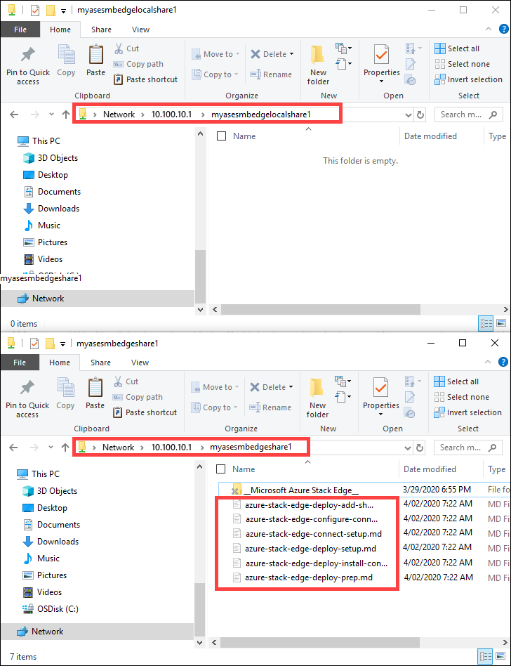  

    The data is then pushed from the cloud share to the storage account. To view the data, go to your storage account and then select **Storage Explorer**. You can view the uploaded data in your storage account.

    
 
You have completed the validation process.

## Next steps

In this tutorial, you learned how to:

> [!div class="checklist"]
> * Configure compute
> * Add shares
> * Add a trigger
> * Add a compute module
> * Verify data transform and transfer

To learn how to administer your Data Box Edge device, see:

> [!div class="nextstepaction"]
> [Use local web UI to administer a Data Box Edge](data-box-edge-manage-access-power-connectivity-mode.md)
