# Tutorial: Transform data with Azure Data Box Edge

This tutorial describes how to configure a compute role on your Azure Data Box Edge device. After you configure the compute role, Data Box Edge can transform data before sending it to Azure.

This procedure can take around 10 to 15 minutes to complete.

In this tutorial, you learn how to:

> [!div class="checklist"]
> * Configure compute
> * Add shares
> * Add a compute module
> * Verify data transform and transfer

 
## Prerequisites

Before you set up a compute role on your Data Box Edge device, make sure that:

- You've activated your Data Box Edge device as described in [Connect, set up, and activate Azure Data Box Edge](data-box-edge-deploy-connect-setup-activate.md).

## Configure compute

To configure compute on your Data Box Edge, you'll create an IoT Hub resource.

1. In the Azure portal of your Data Box Edge resource, go to Overview. In the right-pane, on the **Compute** tile, select **Get started**.

    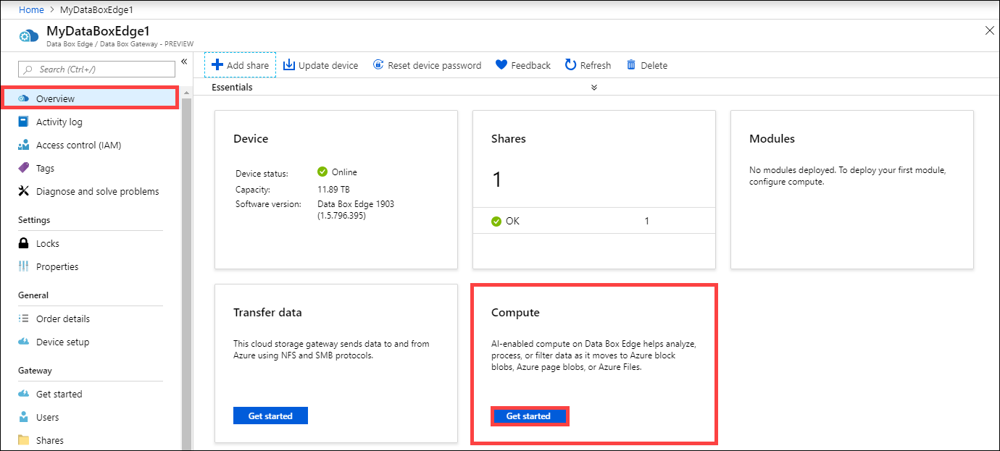

2. On the **Configure Edge compute** tile, select **Configure compute**.
3. On the **Configure Edge compute** blade, input the following:

   
    |Field  |Value  |
    |---------|---------|
    |IoT Hub     | Choose from **New** or **Existing**.   By default, a Standard tier (S1) is used to create an IoT resource. To use a free tier IoT resource, create one and then select the existing resource.   In each case, the IoT Hub resource uses the same subscription and resource group that is used by the Data Box Edge resource.     |
    |Name     |Enter a name for your IoT Hub resource.         |

    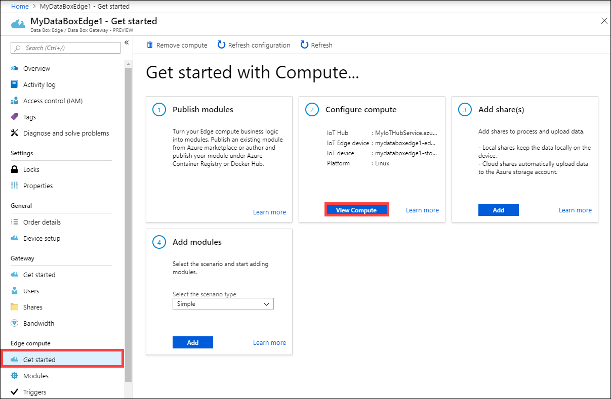

4. Select **Create**. The IoT Hub resource creation takes a couple minutes. After the IoT Hub resource is created, the **Configure compute** tile updates to show the compute configuration. To confirm that the Edge compute role has been configured, select **View Compute** on the **Configure compute** tile.
    
    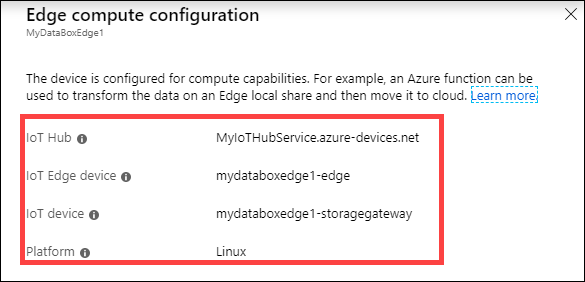

    When the Edge compute role is set up on the Edge device, it creates two devices: an IoT device and an IoT Edge device. Both devices can be viewed in the IoT Hub resource. An IoT Edge Runtime is also running on this IoT Edge device. At this point, only the Linux platform is available for your IoT Edge device.

## Add shares

For the simple deployment in this tutorial, you'll need two shares: one Edge share and another Edge local share.

1. Add an Edge share on the device by doing the following steps:

    1. In your Data Box Edge resource, go to **Edge compute > Get started**.
    2. On the **Add share(s)** tile, select **Add**.
    3. On the **Add share** blade, provide the share name and select the share type.
    4. To mount the Edge share, select the check box for **Use the share with Edge compute**.
    5. Select the **Storage account**, **Storage service**, an existing user, and then select **Create**.

        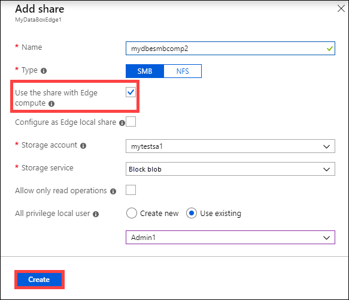 

    If you created a local NFS share, use the following remote sync (rsync) command option to copy files onto the share:

    `rsync <source file path> < destination file path>`

    For more information about the rsync command, go to [Rsync documentation](https://www.computerhope.com/unix/rsync.htm).

    The Edge share is created, and you'll receive a successful creation notification. The share list might be updated, but you must wait for the share creation to be completed.

2. Add an Edge local share on the Edge device by repeating all the steps in the preceding step and selecting the check box for **Configure as Edge local share**. The data in the local share stays on the device.

    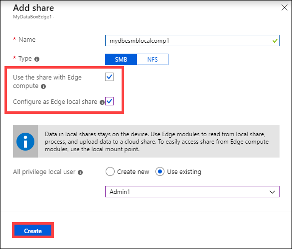

  
3. Select **Add share(s)** to see the updated list of shares.

    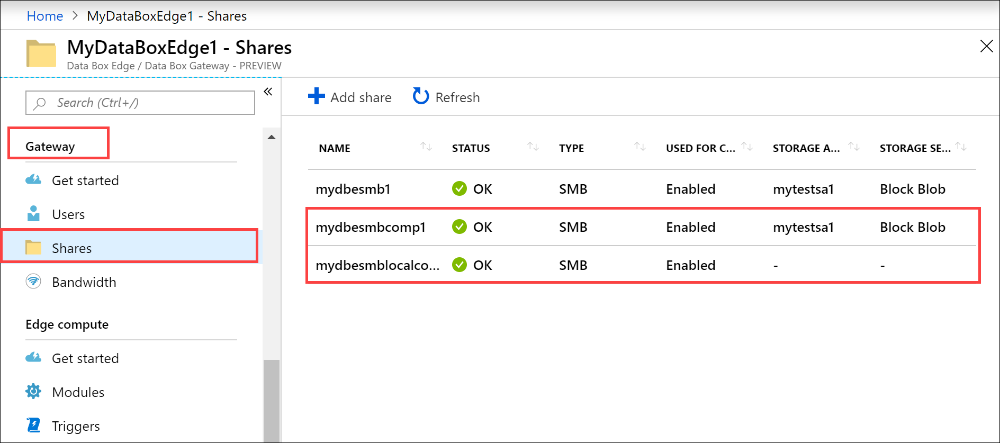 
 

## Add a module

You could add a custom or a pre-built module. There are no custom modules on this Edge device. To learn how to create a custom module, go to [Develop a C# module for your Data Box Edge device](data-box-edge-create-iot-edge-module.md).

In this section, you add a custom module to the IoT Edge device that you created in [Develop a C# module for your Data Box Edge](data-box-edge-create-iot-edge-module.md). This custom module takes files from an Edge local share on the Edge device and moves them to an Edge (cloud) share on the device. The cloud share then pushes the files to the Azure storage account that's associated with the cloud share.

1. Go to **Edge compute > Get started**. On the **Add modules** tile, select the scenario type as **simple**. Select **Add**.
2. In the **Configure and add module** blade, input the following values:

    
    |Field  |Value  |
    |---------|---------|
    |Name     | A unique name for the module. This module is a docker container that you can deploy to the IoT Edge device that's associated with your Data Box Edge.        |
    |Image URI     | The image URI for the corresponding container image for the module.        |
    |Credentials required     | If checked, username and password are used to retrieve modules with a matching URL.        |
    |Input share     | Select an input share. The Edge local share is the input share in this case. The module used here moves files from the Edge local share to an Edge share where they are uploaded into the cloud.        |
    |Output share     | Select an output share. The Edge share is the output share in this case.        |
    |Trigger type     | Select from **File** or **Schedule**. A file trigger fires whenever a file event occurs such as a file is written to the input share. A scheduled trigger fires up based on a schedule defined by you.         |
    |Trigger name     | A unique name for your trigger.         |
    |Environment variables| Optional information that will help define the environment in which your module will run.   |

    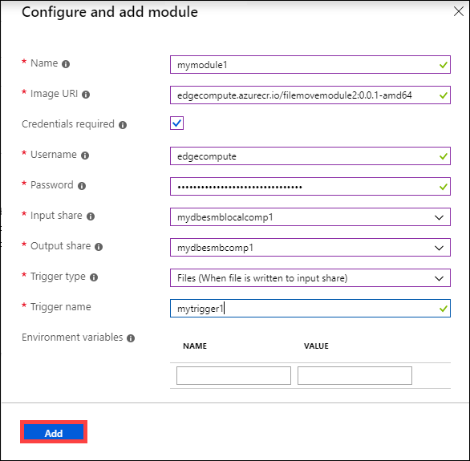

3. Select **Add**. The module gets added. The **Add module** tile updates to indicate that the module is deployed. 

    

### Verify data transform and transfer

The final step is to ensure that the module is connected and running as expected. The run-time status of the module should be running for your IoT Edge device in the IoT Hub resource.

To verify that the module is running, do the following:

1. Select the **Add module** tile. This takes you to the **Modules** blade. In the list of modules, identify the module you deployed. The runtime status of the module you added should be *running*.

    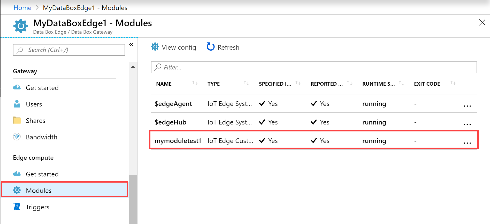
 
1.	In File Explorer, connect to both the Edge local and Edge shares you created previously.

    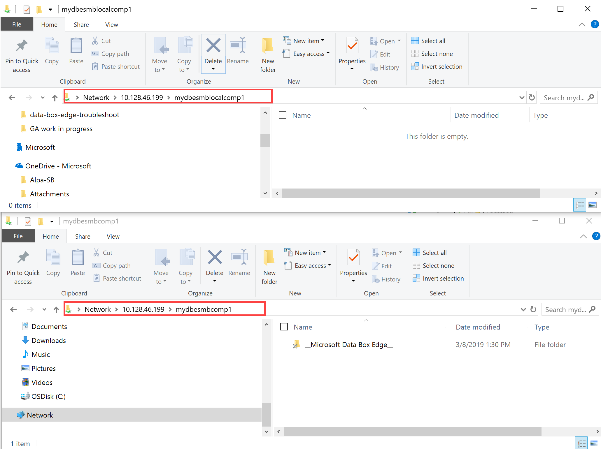 
 
1.	Add data to the local share.

    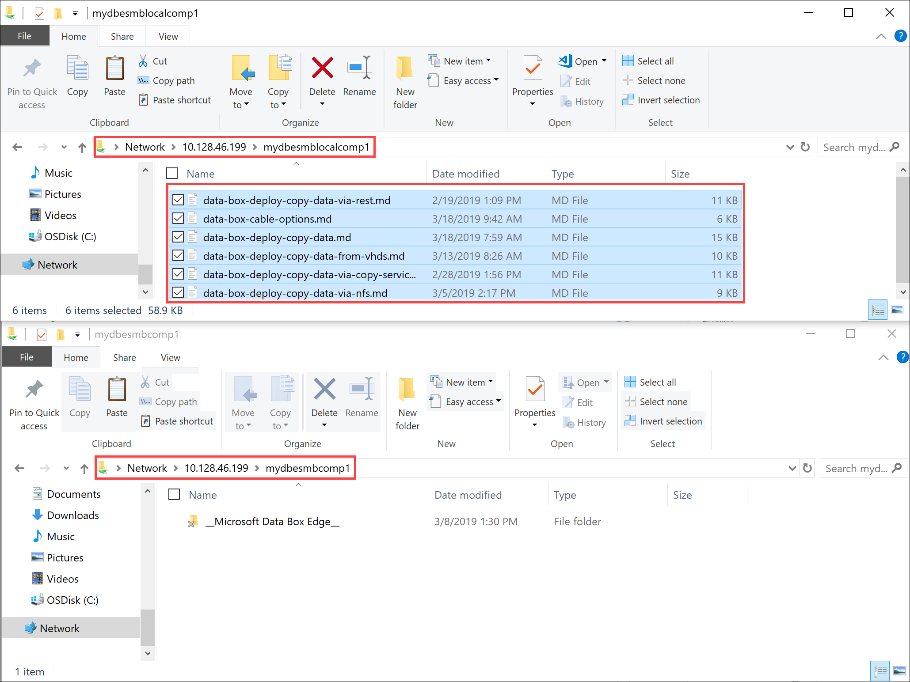 
 
    The data gets moved to the cloud share.

    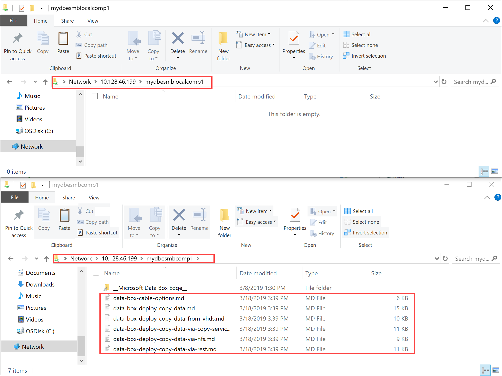  

    The data is then pushed from the cloud share to the storage account. To view the data, go to the Storage Explorer.

     
 
You have completed the validation process.

## Next steps

In this tutorial, you learned how to:

> [!div class="checklist"]
> * Configure compute
> * Add shares
> * Add a compute module
> * Verify data transform and transfer

To learn how to administer your Data Box Edge device, see:

> [!div class="nextstepaction"]
> [Use local web UI to administer a Data Box Edge](data-box-edge-manage-access-power-connectivity-mode.md)
