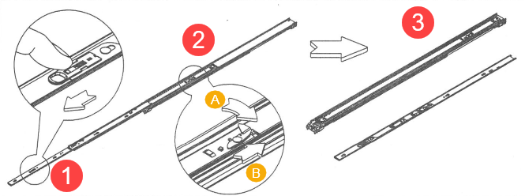
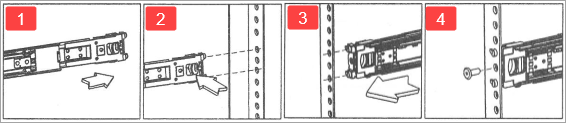
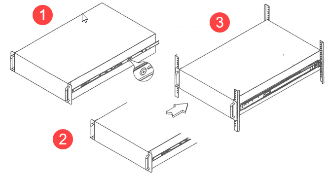
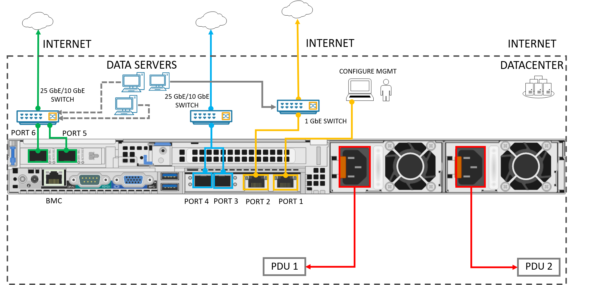

# Tutorial: Install Azure Data Box Edge (Preview)

This tutorial describes how to install a Data Box Edge physical device. The install procedure involves unpacking, rack mounting, and cabling the device. 

The install can take around 2 hours to complete.

In this tutorial, you learn how to:

> [!div class="checklist"]
> * Unpack device
> * Rack mount device
> * Cable device

> [!IMPORTANT]
> Data Box Edge is in preview. Review the [Azure terms of service for preview](https://azure.microsoft.com/support/legal/preview-supplemental-terms/) before you order and deploy this solution.

## Prerequisites

The prerequisites to install a physical device are as follows.

### For the Data Box Edge resource

Before you begin, make sure that:

* You've completed all the steps in [Prepare the portal for Data Box Edge](data-box-edge-deploy-prep.md).
    * You've created Data Box Edge resource to deploy your device.
    * You've generated the activation key to activate your device with the Data Box Edge resource.

 
### For the Data Box Edge physical device

Before you deploy a device:

- Make sure that the device rests safely on a flat, stable, and level work surface (or similar).
- Verify that the site where you intend to set up has:
    - Standard AC power from an independent source, or
    - A rack power distribution unit (PDU) with an uninterruptible power supply (UPS).
- Make sure that a 1U slot is available on the rack in which you intend to mount the device.

### For the network in the datacenter

Before you begin:

- Review the networking requirements to deploy a Data Box Edge and configure the datacenter network as per the requirements. For more information, see [Data Box Edge networking requirements](data-box-gateway-system-requirements.md#networking-requirements).
- Make sure that the minimum Internet bandwidth is 20 Mbps to allow for optimal working of the device.

## Unpack the device

This device is shipped in a single box. Complete the following steps to unpack your device. 

1. Place the box on a flat, level surface.
2. Inspect the box and the packaging foam for crushes, cuts, water damage, or any other obvious damage. If the box or packaging is severely damaged, do not open the box. Contact Microsoft Support to help you assess whether the device is in good working order.
3. Unpack the box. After unpacking the box, make sure that you have:
    - One single enclosure Edge device
    - Two power cords
    - One tool-less slide rackmount kit (two side rails and mounting hardware included)
4. If you didn't receive any of the items listed above, contact Data Box Edge Support. The next step is to rack-mount your device.

## Rack the device

The device must be installed in a standard 19-inch rack. Use the following procedure to rackmount your device in a standard 19-inch rack with front and rear posts.

> [!IMPORTANT]
> Data Box Edge devices must be rack-mounted for proper operation.

1. Pull on the front-release to unlock the inner rail from the slide assembly. Release the detent lock and push the middle rail inwards to retract the rail. The inner and outer rails should now be separate.

    

2. Now install the outer rails on the rack cabinet vertical members. To help with orientation, the rail slides are marked Front and that end is affixed towards the front of the enclosure. 
    
    1. Locate the rail pins at the front and rear of the rail assembly. Extend the rail to fit between the rack posts. Attach the outer rail at the rear of the rack first. Adjust the rear mounting bracket to position it inside of the rear rack mounting holes.   
    2. Push and hold the trigger on the back bracket to expose the metal hooks. Align and insert into the mounting holes and then release the trigger.
    3. Align the front bracket with the mounting hole.
    4. The front bracket should be now fixed onto the rack. Optionally M5 X 10L screws can be used to secure the rails with posts if needed. 

    

3. To attach the inner rail on the chassis, ensure that keyhole openings on the inner rail are aligned with the locating pins on the side of the chassis. Make sure that the heads of the chassis locating pins protrude through the keyhole openings in the inner rail. Pull the rail toward the front of the chassis until the rail locks into place with an audible click. Repeat with the other inner rail. Push the chassis with the inner rail into the slide to complete the rack installation.

    

## Cable the device

The following procedures explain how to cable your Edge device for power and network.

## Prerequisites

Before you begin the cabling of your device, you will need:

- Your Edge physical device, unpacked, and rack mounted.
- Two power cables. 
- Two 1-GbE RJ-45 network cable, and four 25-GbE SFP+ copper cables.
- Access to two Power Distribution Units (recommended).

Your Edge device has 8 NVMe SSDs. The front panel also has status LEDs and power buttons. The device includes redundant Power Supply Units (PSUs) at the back. Your device has six network interfaces: two 1-Gbps interfaces and four 25-Gbps interfaces. Your device has a baseboard management controller (BMC). Identify the various ports on the backplane of your device.
 
  
 
Do the following steps to cable your device for power and network.

1. Connect the power cords to each of the PSUs in the enclosure. To ensure high availability, install and connect both PSUs to different power sources.
2. Attach the power cords to the rack power distribution units (PDUs). Make sure that the two PSUs use separate power sources.
3. Connect the 1-GbE network interface PORT 1 to the computer used to configure the physical device. PORT 1 is the dedicated management interface.
4. Connect 1-GbE network interface PORT 2 via the RJ-45 network cables to the datacenter network /Internet. 
5. Connect the four 25-GbE network interfaces PORT 3, PORT 4, PORT 5, and PORT 6 using SFP+ copper cables to the datacenter network/Internet. 

> [!NOTE]
> - At least one data network interface – PORT 2, PORT 3, PORT 4, PORT 5, or PORT 6 needs to be connected to the Internet (connectivity to Azure). 
> - We recommend that you use a 25-GbE network interface such as PORT 3, PORT 4, PORT 5, or PORT 6 to send data to Azure. 
> - The Edge device should be connected to the datacenter network so that it can ingest data from data source servers.  

## Next steps

In this tutorial, you learned about Data Box Edge topics such as:

> [!div class="checklist"]
> * Unpack the device
> * Rack the device
> * Cable the device

Advance to the next tutorial to learn how to connect, set up, and activate your device.

> [!div class="nextstepaction"]
> [Connect and set up your Data Box Edge](./data-box-edge-deploy-connect-setup-activate.md)

