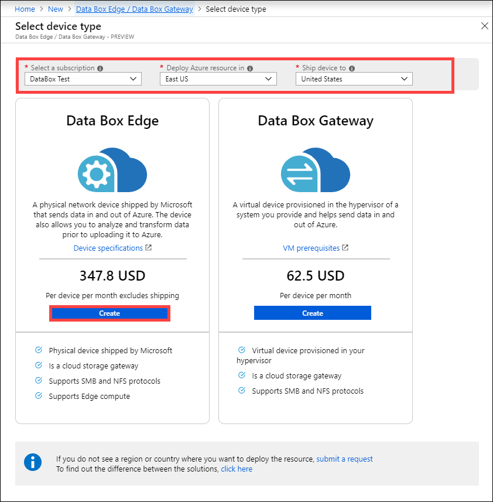
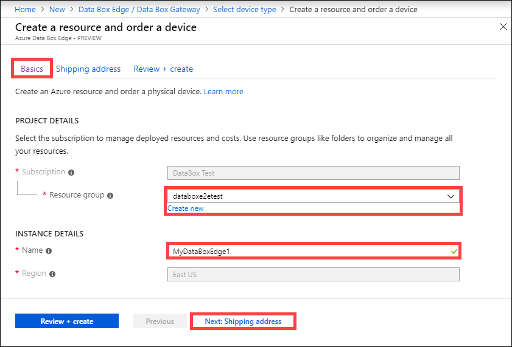
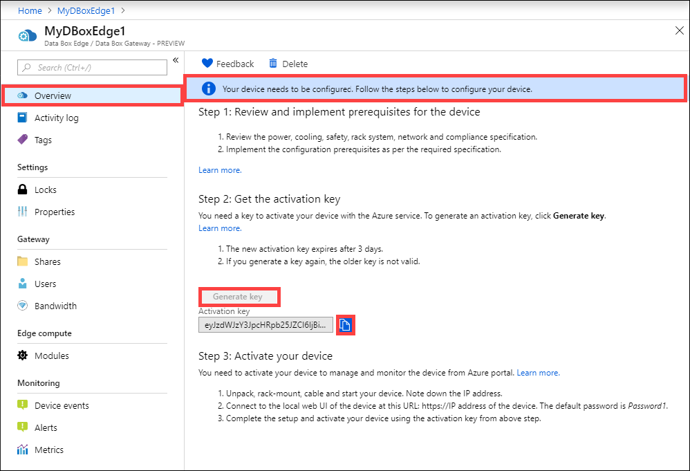

# Tutorial: Prepare to deploy Azure Data Box Edge (Preview)

This is the first tutorial in the series of deployment tutorials required to completely deploy your Azure Data Box Edge. This tutorial describes how to prepare the Azure portal to deploy Data Box Edge resource. 

You need administrator privileges to complete the setup and configuration process. The portal preparation takes less than 10 minutes.

In this tutorial, you learn how to:

> [!div class="checklist"]
> * Create a new resource
> * Get the activation key

If you don't have an Azure subscription, create a [free account](https://azure.microsoft.com/free/?WT.mc_id=A261C142F) before you begin.

> [!IMPORTANT]
> Data Box Edge is in preview. Review the [Azure terms of service for preview](https://azure.microsoft.com/support/legal/preview-supplemental-terms/) before you order and deploy this solution. 

### Get started

To deploy your Data Box Edge, refer to the following tutorials in the prescribed sequence.

| **#** | **In this step** | **Use these documents** |
| --- | --- | --- | 
| 1. |**[Prepare the Azure portal for Data Box Edge](data-box-edge-deploy-prep.md)** |Create and configure your Data Box Edge resource before you install a Data Box Edge physical device. |
| 2. |**[Install Data Box Edge](data-box-edge-deploy-install.md)**|Unpack, rack, and cable the Data Box Edge physical device.  |
| 3. |**[Connect, set up, activate the Data Box Edge](data-box-edge-deploy-connect-setup-activate.md)** |Connect to the local web UI, complete the device setup, and activate the device. The device is ready to set up SMB or NFS shares.  |
| 4. |**[Transfer data with Data Box Edge](data-box-edge-deploy-add-shares.md)** |Add shares and connect to shares via SMB or NFS. |
| 5. |**[Transform data with Data Box Edge](data-box-edge-deploy-configure-compute.md)** |Configure Edge modules on the device to transform the data as it moves to Azure. |

You can now begin to set up the Azure portal.

## Prerequisites

Here you find the configuration prerequisites for your Data Box Edge resource, your Data Box Edge device, and the datacenter network.

### For the Data Box Edge resource

Before you begin, make sure that:

* Your Microsoft Azure subscription should be enabled for Data Box Edge resource.
* You have your Microsoft Azure storage account with access credentials.

### For the Data Box Edge device

Before you deploy a physical device, make sure that:

- You have a 1 U slot available in a standard 19” rack in your datacenter to rackmount the device. 
- Make sure that you have access to a flat, stable, and level work surface where the device can rest safely.
- Verify that the site where you intend to set up the device has standard AC power from an independent source or a rack power distribution unit (PDU) with an uninterruptible power supply (UPS).
- You have access to a physical device.

### For the datacenter network

Before you begin, make sure that:

* The network in your datacenter is configured as per the networking requirements for your Data Box Edge device. For more information, see the [Data Box Edge System Requirements](data-box-gateway-system-requirements.md).

* Your Data Box Edge has a dedicated 20-Mbps Internet bandwidth (or more) available at all times. This bandwidth should not be shared with any other applications. If using network throttling, then for throttling to work, we recommend that you use 32-Mbps Internet bandwidth or more.

## Create a new resource

Perform the following steps to create a new Data Box Edge resource. 

If you have an existing Data Box Edge resource to manage your physical device, skip this step and go to [Get the activation key](#get-the-activation-key).

Perform the following steps in the Azure portal to create a Data Box resource.

1. Use your Microsoft Azure credentials to log into Azure preview portal at this URL: [https://aka.ms/databox-edge](https://aka.ms/databox-edge). 

2. Pick the subscription that you want to use for Data Box Edge preview. Select the region where you want to deploy the Data Box Edge resource. In the **Data Box Edge** option, click **Create**.

    

3. For the new resource, enter or select the following information.
    
    |Setting  |Value  |
    |---------|---------|
    |Resource name   | A friendly name to identify the resource. The resource name has between 2 and 50 characters containing letter, numbers, and hyphens.  Name starts and ends with a letter or a number.        |
    |Subscription    |Subscription is linked to your billing account. |
    |Resource group  |Select an existing group or create a new group. Learn more about [Azure Resource Groups](../azure-resource-manager/resource-group-overview.md).     |
    |Location     |For this release, East US, West US 2, South East Asia, and West Europe are available.   Choose a location closest to the geographical region where you want to deploy your device.|
    
    
    
4. Click **OK**.
 
The resource creation takes a few minutes. After the resource is successfully created, you are notified appropriately.

## Get the activation key

After the Data Box Edge resource is up and running, you will need to get the activation key. This key is used to activate and connect your Data Box Edge device with the resource. You can get this key now while you are in the Azure portal.

1. Click the resource that you created and then click **Overview**.

2. Click **Generate key** to create an activation key. Click copy icon to copy the key and save it for later use.

    

> [!IMPORTANT]
> - The activation key expires 3 days after it is generated. 
> - If the key has epxired, generate a new key. The older key is not valid.

## Next steps

In this tutorial, you learned about Data Box Edge topics such as:

> [!div class="checklist"]
> * Create a new resource
> * Get the activation key

Advance to the next tutorial to learn how to install your Data Box Edge. 

> [!div class="nextstepaction"]
> [Install a Data Box Edge](./data-box-edge-deploy-install.md)

