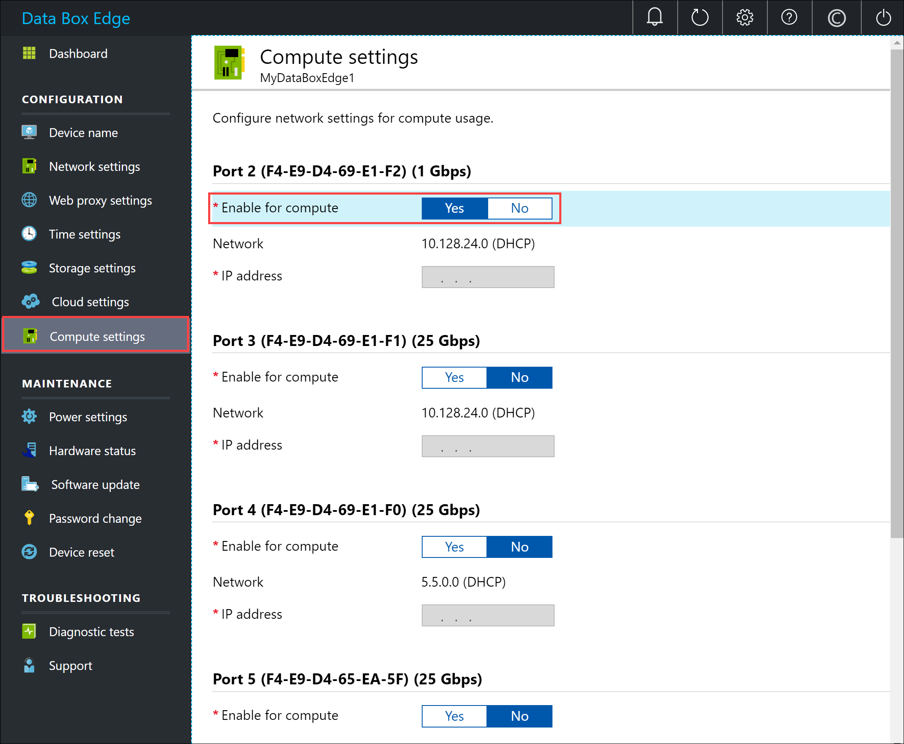
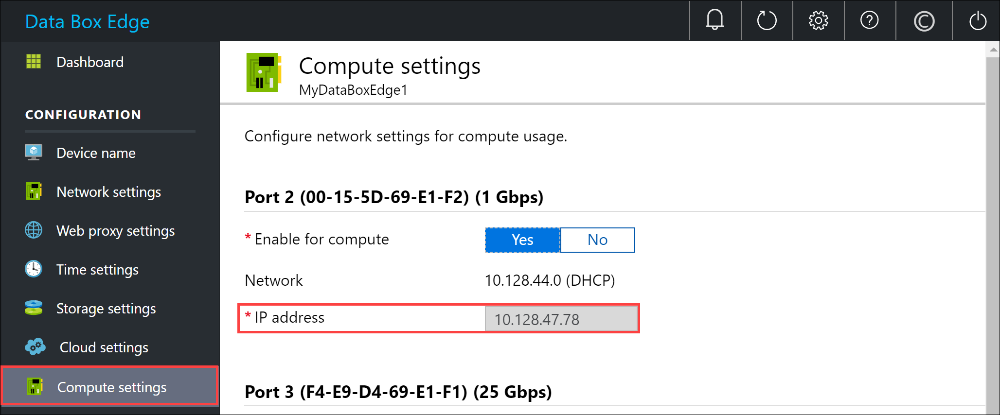
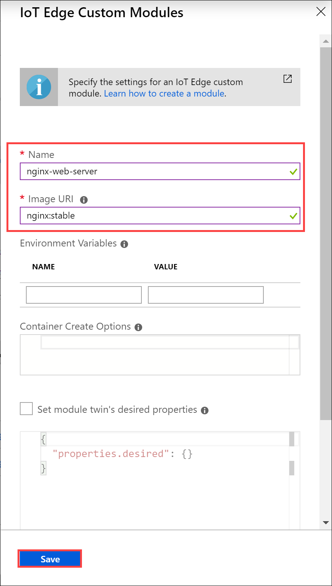
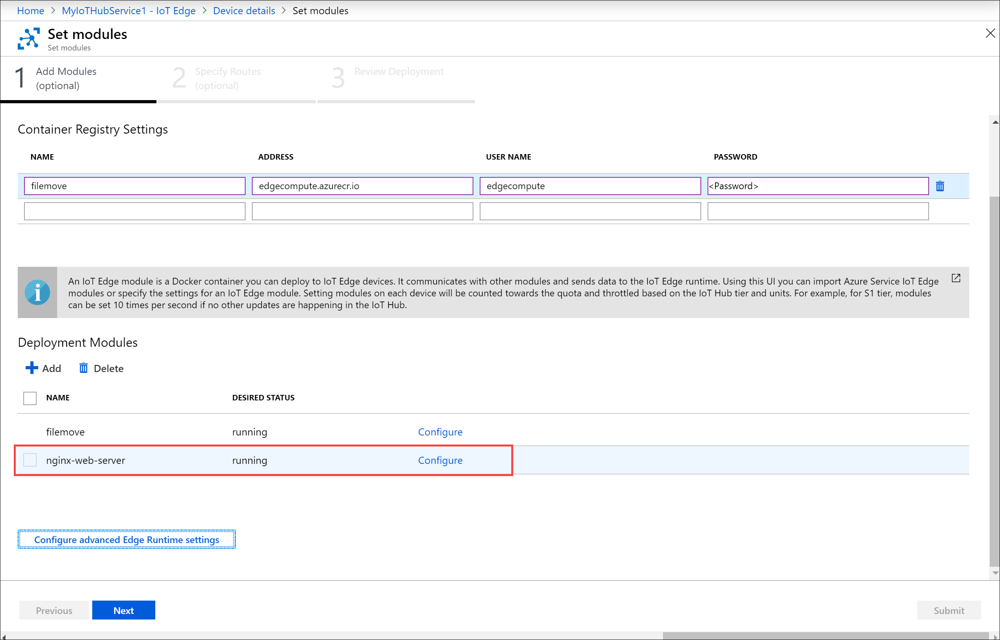
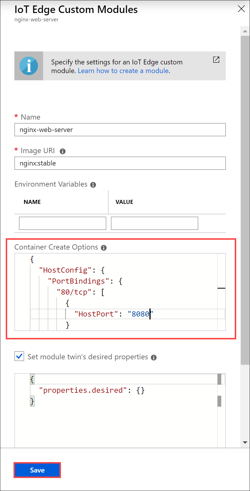
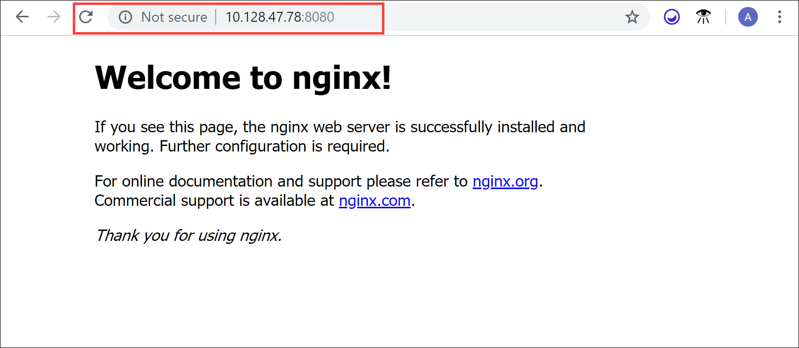

# Configure network on your Azure Data Box Edge to access modules

This article describes how to configure the network on your Azure Data Box Edge to access the compute modules running on the device.

To configure the network, you'll take the following steps:

- Enable a network interface on your Data Box Edge device for compute
- Get and run a webserver app module on your Data Box Edge
- Configure the module to access the enabled network interface

## Prerequisites

Before you begin, you'll need:

- A Data Box Edge device with device setup completed.
- You've completed **Configure compute** step as per the [Tutorial: Transform data with Azure Data Box Edge](data-box-edge-deploy-configure-compute-advanced.md#configure-compute) on your device. Your device should have an associated IoT Hub resource, an IoT device, and an IoT Edge device.

## Enable network interface for compute

To access the modules running on your device via an external network, you'll need to assign an IP address to a network interface on your device. You can manage these compute settings from your local web UI.

Take the following steps on your local web UI to configure compute settings.

1. In the local web UI, go to **Configuration > Compute settings**.  

2. **Enable** the network interface that you want to use to connect to a compute module that you'll run on the device.

    - If using static IP addresses, enter an IP address for the network interface.
    - If using DHCP, the IP addresses are automatically assigned. This example uses DHCP.

    

3. Select **Apply** to apply the settings. Make a note of the IP address assigned to the network interface if using DHCP.

    

## Deploy webserver app module

Take the following steps to run a webserver app module on your Data Box Edge device.

1. Go to the IoT Hub resource associated with your Data Box Edge device and then select **IoT Edge device**.
2. Select your Data Box Edge device. On the **Device details**, select **Set modules**. On **Add modules**, select **+ Add** and then select **IoT Edge Module**.
3. In the **IoT Edge custom modules** blade:

    1. Specify a **Name** for your webserver app module that you want to deploy.
    2. Provide an **Image URI** for your module image. A module matching the provided name and tags is retrieved. In this case, `nginx:stable` will look for an `nginx` image that is tagged as stable on [Docker website](https://hub.docker.com/_/nginx/).
    3. **Save** the module.

    

## Configure webserver app module

Take the following steps to configure the module you saved in the previous section. You'll specify the port to be used to connect to the webserver app module.

1. On the **Set modules**, select the module you saved and then select **Configure**. In this example, *nginx-web-server* is the module you saved.

    

2. In the **Container Create Options**, paste the following sample code:  

    ```
    {
                "HostConfig": {
                "PortBindings": {
                    "80/tcp": [
                    {
                        "HostPort": "8080"
                    }
                    ]
                }
                }
            }
    ```

    This configuration lets you access the module using the compute network IP over *http* on TCP port 8080 (with the default webserver port being 80).

    

3. Select **Save**.

## Verify module access

1. Verify the module is successfully deployed and is running. On the **Device Details** page, on the **Modules** tab, the runtime status of the module should be **running**.  
2. Connect to the web server app module. Open a browser window and type:

    `http://<compute-network-IP-address>:8080`

    You should see that the webserver app is running.

    

## Next steps

- Learn how to [Manage users via Azure portal](data-box-edge-manage-users.md).
