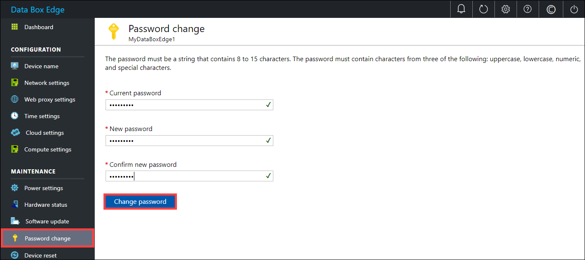
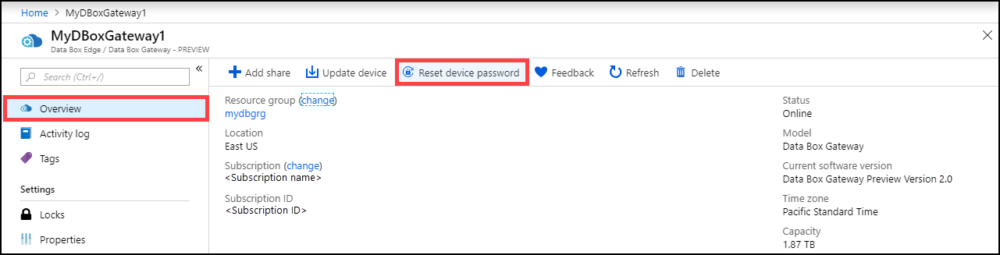
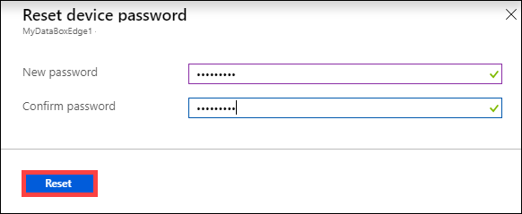
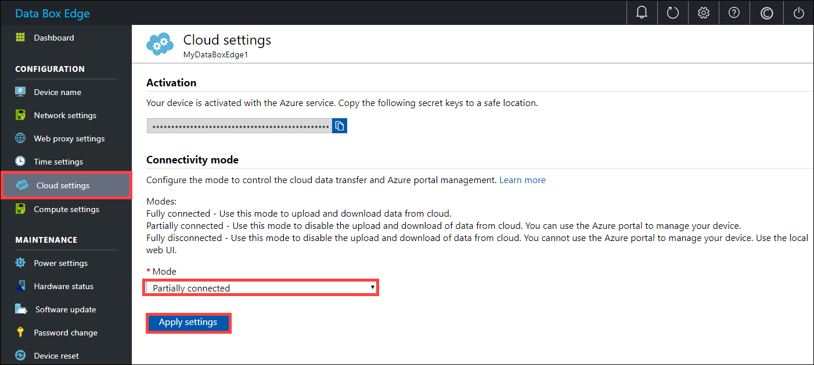
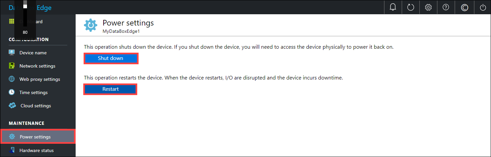

# Manage access, power, and connectivity mode for your Azure Data Box Edge

This article describes how to manage the access, power, and connectivity mode for your Azure Data Box Edge. These operations are performed via the local web UI or the Azure portal.

In this article, you learn how to:

> [!div class="checklist"]
> * Manage device access
> * Manage connectivity mode
> * Manage power

## Manage device access

The access to your Data Box Edge device is controlled by the use of a device password. You can change the password via the local web UI. You can also reset the device password in the Azure portal.

### Change device password

Follow these steps in the local UI to change the device password.

1. In the local web UI, go to **Maintenance > Password change**.
2. Enter the current password and then the new password. The supplied password must be between 8 and 16 characters. The password must have 3 of the following characters: uppercase, lowercase, numeric, and special characters. Confirm the new password.

    

3. Select **Change password**.
 
### Reset device password

The reset workflow does not require the user to recall the old password and is useful when the password is lost. This workflow is performed in the Azure portal.

1. In the Azure portal, go to **Overview > Reset admin password**.

    

2. Enter the new password and then confirm it. The supplied password must be between 8 and 16 characters. The password must have 3 of the following characters: uppercase, lowercase, numeric, and special characters. Select **Reset**.

    

## Manage connectivity mode

Apart from the default fully connected mode, your device can also run in partially connected, or fully disconnected mode. Each of these modes is described as below:

- **Fully connected** - This is the normal default mode in which the device operates. Both the cloud upload and download of data is enabled in this mode. You can use the Azure portal or the local web UI to manage the device.

- **Partially disconnected** – In this mode, the device cannot upload or download any share data however can be managed via the Azure portal.

    This mode is typically used when on a metered satellite network and the goal is to minimize network bandwidth consumption. Minimal network consumption may still occur for device monitoring operations.

- **Disconnected** – In this mode, the device is fully disconnected from the cloud and both the cloud uploads and downloads are disabled. The device can only be managed via the local web UI.

    This mode is typically used when you want to take your device offline.

To change device mode, follow these steps:

1. In the local web UI of your device, go to **Configuration > Cloud settings**.
2. From the dropdown list, select the mode that you want to operate the device in. You can select from **Fully connected**, **Partially connected**, and **Fully disconnected**. To run the device in partially disconnected mode, enable **Azure portal management**.

    
 
## Manage power

You can shut down or restart your physical device using the local web UI. We recommend that before you restart, take the shares offline on the data server and then the device. This action minimizes any possibility of data corruption.

1. In the local web UI, go to **Maintenance > Power settings**.
2. Select **Shutdown** or **Restart** depending on what you intend to do.

    

3. When prompted for confirmation, select **Yes** to proceed.

> [!NOTE]
> If you shut down the physical device, you will need to push the power button on the device to turn it on.

## Next steps

- Learn how to [Manage shares](data-box-edge-manage-shares.md).