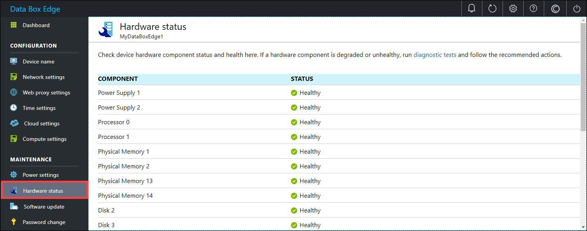

# Monitor your Azure Data Box Edge

This article describes how to monitor your Azure Data Box Edge. To monitor your device, you can use Azure portal or the local web UI. Use the Azure portal to view device events, configure and manage alerts, and view metrics. Use the local web UI on your physical device to view the hardware status of the various device components.

In this article, you learn how to:

> [!div class="checklist"]
> * View device events and the corresponding alerts
> * View hardware status of device components
> * View capacity and transaction metrics for your device
> * Configure and manage alerts

## View device events

[!INCLUDE [Supported OS for clients connected to device](../../includes/data-box-edge-gateway-view-device-events.md)]

## View hardware status

Take the following steps in the local web UI to view the hardware status of your device components.

1. Connect to the local web UI of your device.
2. Go to **Maintenance > Hardware status**. You can view the health of the various device components.

    

## View metrics

[!INCLUDE [Supported OS for clients connected to device](../../includes/data-box-edge-gateway-view-metrics.md)]

## Manage alerts

[!INCLUDE [Supported OS for clients connected to device](../../includes/data-box-edge-gateway-manage-alerts.md)]

## Next steps 

Learn how to [Manage bandwidth](data-box-edge-manage-bandwidth-schedules.md).