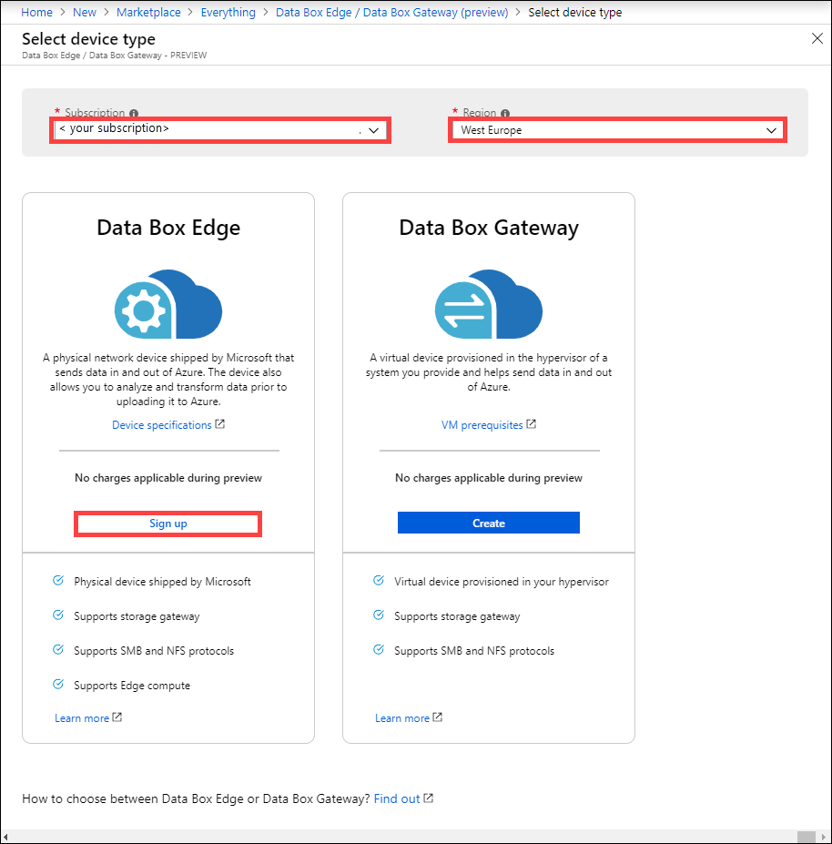
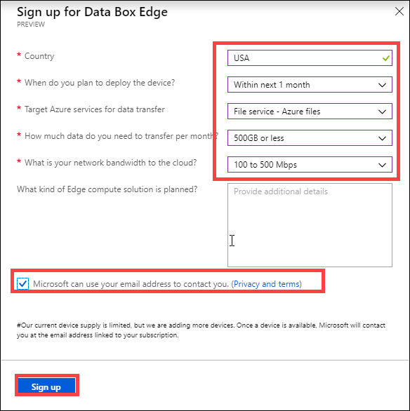

# What is Azure Data Box Edge (Preview)? 

Azure Data Box Edge is a storage solution that allows you to process data and send it over network to Azure. This article provides you an overview of the Data Box Edge solution, benefits, key capabilities, and the scenarios where you can deploy this device. 

Data Box Edge uses a physical device supplied by Microsoft to accelerate the secure data transfer. The physical device resides in your premises and you write data to it using the NFS and SMB protocols. 

Data Box Edge has all the gateway capabilities of Data Box Gateway. Data Box is additionally equipped with AI-enabled edge computing capabilities that help analyze, process, or filter data as it moves to Azure block blob, page blob, or Azure Files.  

> [!IMPORTANT]
> - Data Box Edge is in Preview. [Sign up](#sign-up) for this service!
> - Review the [terms of use for the preview](https://azure.microsoft.com/support/legal/preview-supplemental-terms/) before you deploy this solution.

## Use cases

Azure Data Box Edge is an AI-enabled edge computing device with network data transfer capabilities. Here are the various scenarios where Data Box Edge can be used for data transfer.

- **Preprocess data** - Analyze data from on-premises or IoT devices to quickly get to result while staying close to where data is generated. Data Box Edge transfers the full data set to the cloud to perform more advanced processing or deeper analytics.  Preprocessing can be used to: 

    - Aggregate data.
    - Modify data, for example to remove Personally Identifiable Information (PII).
    - Subset and transfer the data needed for deeper analytics in the cloud.
    - Analyze and react to IoT Events. 

- **Inference Azure Machine Learning** - With Data Box Edge, you can run Machine Learning (ML) models to get quick results that can be acted on before the data is sent to the cloud. The full data set is transferred to continue to retrain and improve your ML models.

- **Transfer data over network to Azure** - Use Data Box Edge to easily and quickly transfer data to Azure to enable further compute and analytics or for archival purposes. 

## Benefits

Data Box Edge has the following benefits:

- **Easy data transfer**- Makes moving data in and out of Azure storage as easy as working with a local network share.  
- **High performance** - Enables high-performance transfers to and from Azure. 
- **Fast access** - Caches most recent files for fast access of on-premises files.  
- **Limited bandwidth usage** - Data can be written to Azure even when the network is throttled to limit usage during peak business hours.  
- **Transform data** - Enables analysis, processing, or filtering of data as it moves to Azure.

## Key capabilities

Data Box Edge has the following capabilities:

|Capability |Description  |
|---------|---------|
|High performance     | Fully automated and highly optimized data transfer and bandwidth.|
|Supported protocols     | Support for standard SMB and NFS protocols for data ingestion.   For more information on supported versions, go to [Data Box Edge system requirements](http://aka.ms/dbe-docs).|
|Computing       |Allows analysis, processing, filtering of data.|
|Data access     | Direct data access from Azure Storage Blobs and Azure Files using cloud APIs for additional data processing in the cloud.|
|Fast access     | Local cache on the device for fast access of most recently used files.|
|Offline upload     | Disconnected mode supports offline upload scenarios.|
|Data refresh     | Ability to refresh local files with the latest from cloud.|
|Encryption    | BitLocker support to locally encrypt data and secure data transfer to cloud over *https*.       |
|Resiliency     | Built-in network resiliency.        |

## Features and specifications

The Data Box Edge physical device has the following features:

| Features/specifications                                          | Description              |
|---------------------------------------------------------|--------------------------|
| Dimensions   | Width: 17.25” Depth: 27.25” Height: 1.75” (excludes ears and PSU handles)  |            
| Rack space|1U when placed in the rack|
| Cables| 2 X Power cable 2 X 1 Gbps RJ45 cables 2 X 10 Gbps SFP+ copper cables|
| Components|2 built-in Power Supply Units (PSUs)|
| CPU|2 Intel Xeon processors with 10 cores each  |
| Memory| 64 GB RAM|
| Disks| 8 NVMe SSDs, each disk is 1.6 TB   The system fails if one NVMe SSD fails. |
| Local storage capacity| 12.8 TB total capacity|
| Network interfaces| 2 X 1 GbE interfaces – 1 management, not user configurable, used for initial setup. The other data interface is user configurable and is DHCP by default.  2 X 25 GbE interfaces – These can also operate as 10 GbE interfaces. These data interfaces can be configured by user as DHCP (default) or static.   2 X 25 GbE interfaces - These data interfaces can be configured by user as DHCP (default) or static.|

## Components

The Data Box Edge solution comprises of Data Box Edge resource, Data Box Edge physical device, and a local web UI.

* **Data Box Edge physical device** - A 1U rack-mounted server supplied by Microsoft that can be configured to send data to Azure. 
    
* **Data Box Edge resource** – a resource in the Azure portal that lets you manage a Data Box Edge device from a web interface that you can access from different geographical locations. Use the Data Box Edge resource to create and manage resources, view, and manage devices and alerts, and manage shares.  

    <!---->

    For more information, go to [Use the Data Box Edge service to administer your Data Box Edge device](http://aka.ms/dbe-docs).

* **Data Box local web UI** - Use the local web UI to run diagnostics, shut down and restart the Data Box Edge device, view copy logs, and contact Microsoft Support to file a service request.

    <!---->

    For information about using the web-based UI, go to [Use the web-based UI to administer your Data Box](http://aka.ms/dbe-docs).

## Region availability

Data Box Edge physical device, Azure resource, and target storage account to which you transfer data do not all have to be in the same region.

- **Resource availability** - For this release, the Data Box Edge resource is available in the following regions:
    - **United States** - West US2 and East US
    - **European Union** - West Europe
    - **Asia Pacific** - SE Asia

- **Destination Storage accounts** - The storage accounts that store the data are available in all Azure regions. 

    The regions where the storage accounts store Data Box data should be located close to where the device is located for optimum performance. A storage account located far from the device results in long latencies and slower performance. 

## Sign up

Data Box Edge is in preview and you need to sign up. Perform the following steps to sign up for Data Box Gateway:

1. Sign into the Azure portal at: [https://aka.ms/databox-edge](https://aka.ms/databox-edge).

2. Pick the subscription that you want to use for Data Box Edge preview. Select the region where you want to deploy the Data Box Edge resource. In the Data Box Edge option, click **Sign up**.

    

3.  Answer the questions regarding data residence country, time-frame, target Azure service for data transfer, network bandwidth, and data transfer frequency. Review **Privacy and terms** and select the checkbox against **Microsoft can use your email address to contact you**.

    

4. Once you are signed up and enabled for preview, you can order a Data Box Edge.

## Next steps

- Review the [Data Box Edge system requirements](http://aka.ms/dbe-docs).
- Understand the [Data Box Edge limits](http://aka.ms/dbe-docs).
- Deploy [Azure Data Box Edge](http://aka.ms/dbe-docs) in Azure portal.

