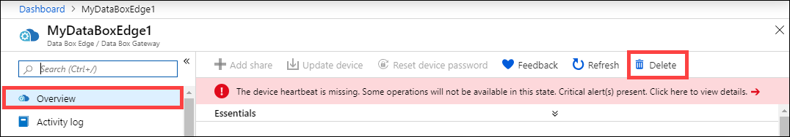
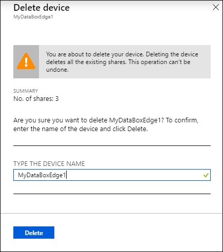

# Return your Azure Data Box Edge device

This article describes how to wipe the data and then return your Azure Data Box Edge device. After you've returned the device, you can also delete the resource or the order associated with the device.

In this article, you learn how to:

> [!div class="checklist"]
> * Open a Support case to return your device
> * Wipe the data off the data disks on the device
> * Pack up the device and schedule a pickup
> * Delete the resource in Azure portal
> * Reset device at the factory and reimaged for future use

## Open a Support ticket

To begin the return process, take the following steps.

1. Open a Support ticket with customer indicating that you wish to return the device. Select the problem type as **Data Box Edge Hardware**. For more information, see [Log a Support ticket]().
2. A Microsoft Support engineer will contact you. Provide the shipping details.
3. If you need a return shipping box, you can request it. Answer **Yes** to the question **Need an empty box to return**.

## Securely wipe the device

To securely wipe the data off the data disks of your device, you need to reset your device. You can reset your device using the local web UI or the PowerShell interface.

Before you reset, make sure to back up the local data on the device if needed.

To reset your device using the local web UI, take the following steps.

1. In the local web UI, go to **Maintenance > Device reset**.
2. Select **Reset device**.

    

3. When prompted for confirmation, review the warning and select **Yes** to continue.

      

The reset will securely erase the data off the device data disks. The process takes about 30-40 minutes depending on the amount of data on your device.

Alternatively, you can connect to the PowerShell interface of the device and use the `Reset-HcsAppliance` cmdlet to erase the data from the data disks. For more information, see [Reset your device](data-box-edge-connect-powershell-interface.md#reset-your-device).

> ![NOTE]
> - If you're exchanging or upgrading to a new device, we recommend that you reset your device only after you've received the new device.
> - The device reset only deletes all the local data off the device. The data that is in the cloud isn't deleted and collects charges. This data needs to be deleted separately using a cloud storage management tool like [Azure Storage Explorer](https://azure.microsoft.com/features/storage-explorer/).
 
## Schedule a pickup

1. Shut down the device. In the local web UI, go to **Maintenance > Power settings**.
2. Select **Shut down**. When prompted for confirmation, click **Yes** to continue. For more information, see [Manage power](data-box-gateway-manage-access-power-connectivity-mode.md#manage-power).
3. Unplug the power cables and remove all the network cables from the device.
4. Prepare the shipment package by using your own box or the empty box you received from Azure. Place the device and the power cords that were shipped with the device in the box.
5. Affix the shipping label that you received from Azure on the package.
6. Schedule a pickup with UPS. To schedule a pickup:

    1. Call the local UPS (country-specific toll free number).
    2. In your call, quote the reverse shipment tracking number as shown on your printed label.
    3. If the tracking number isn't quoted, UPS will require you to pay an additional charge during pickup.

    Instead of scheduling the pickup, you can also drop off the Data Box at the nearest drop-off location.

## Delete the resource

After the device is received at the Azure datacenter, the device is inspected for damage or any signs of tampering.

- If the device arrives intact and in good shape, the billing meter stops for that resource. The resource associated with the device can now be deleted from the Azure portal.
- If the device arrives significantly damaged, fines may apply. For details, see the [FAQ on lost or damaged device](https://azure.microsoft.com/pricing/details/databox/edge/) and [Product Terms of Service](https://www.microsoft.com/licensing/product-licensing/products).  

Take the following steps to delete the resource in Azure portal.

1. In the Azure portal, go to your resource and then to **Overview**. From the command bar, select **Delete**.

    

2. In the **Delete device** blade, type the name of the device you want to delete and select **Delete**.

    

You're notified after the resource is successfully deleted.

## Reimage the device

After the device reaches Azure datacenter, the device is reimaged for future use. The process of reimaging will remove all the data off the data disks and the operating system disks.

## Next steps

- Learn how to [Manage bandwidth](data-box-edge-manage-bandwidth-schedules.md).
