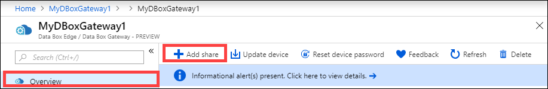
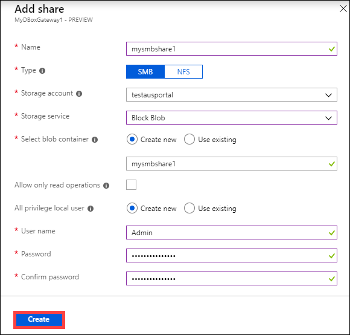
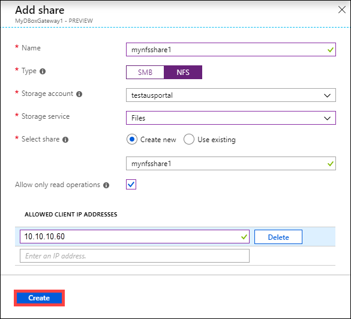
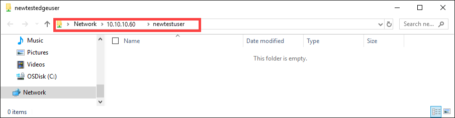

# Tutorial: Transfer data with Azure Data Box Gateway


## Introduction

This article describes how to add and connect to shares on your Data Box Gateway. After you've added the shares, Data Box Gateway device can transfer data to Azure.

This procedure can take around 10 minutes to complete.

In this tutorial, you learn how to:

> [!div class="checklist"]
> * Add a share
> * Connect to share


## Prerequisites

Before you add shares to your Data Box Gateway, make sure that:

- You've provisioned a virtual device and connected to it as detailed in the [Provision a Data Box Gateway in Hyper-V](data-box-gateway-deploy-provision-hyperv.md) or [Provision a Data Box Gateway in VMware](data-box-gateway-deploy-provision-vmware.md).

- You've activated the virtual device described in [Connect and activate your Azure Data Box Gateway](data-box-gateway-deploy-connect-setup-activate.md).

- The device is ready for you to create shares and transfer data.

## Add a share

To create a share do the following procedure:

1. In the [Azure portal](https://portal.azure.com/), select your Data Box Gateway resource and then go to **Overview**. Your device should be online. Select **+ Add share** on the device command bar.
   
   

4. In **Add Share**, do the following procedure:

    1. Provide a unique name for your share. The share names can only have lowercase letters, numbers, and hyphens. The share name must have between 3 and 63 characters long and begin with a letter or a number. Each hyphen must be preceded and followed by a non-hyphen character.
    
    2. Select a **Type** for the share. The type can be SMB or NFS, with SMB being the default. SMB is the standard for Windows clients, and NFS is used for Linux clients. Depending upon whether you choose SMB or NFS shares, options presented are slightly different.

    3. Provide a storage account where the share will reside. If a container doesn't already exist, it's created in the storage account with the newly created share name. If the container already exists, that container is used.
    
    4. Choose the **Storage service** from block blob, page blob, or files. The type of the service chosen depends on which format you want the data to reside in Azure. For example, in this instance, we want the data to reside as blob blocks in Azure, hence we select Block Blob. If choosing Page Blob, you must ensure that your data is 512 bytes aligned. For example, a VHDX is always 512 bytes aligned.
   
    5. This step depends on whether you are creating an SMB or an NFS share.
     
    - **SMB share** - Under **All privilege local user**, select **Create new** or **Use existing**. If you create a new local user, enter a **username** and **password**, and then **confirm password**. This action assigns the permissions to the local user. After you've assigned the permissions here, you can use File Explorer to modify these permissions.
    
        
        
        If you select **Allow only read operations** check box for this share data, you can specify read-only users.
        
    - **NFS share** - Enter the IP addresses of the allowed clients that can access the share.

        
   
9. Select **Create** to create the share.
    
    You're notified that the share creation is in progress. After the share is created with the specified settings, the **Shares** tile updates to reflect the new share.
    
     

## Connect to the share

You can now connect to one or more of the shares that you created in the last step. Depending upon whether you have an SMB or an NFS share, the steps can vary.

### Connect to an SMB share

On your Windows Server client connected to your Data Box Gateway, connect to an SMB share by entering the commands:


1. In a command window, type:

    `net use \\<IP address of the device>\<share name>  /u:<user name for the share>`

    Enter the password for the share when prompted. The sample output of this command is presented here.

    ```powershell
    Microsoft Windows [Version 18.8.16299.192) 
    (c) 2017 microsoft Corporation. All rights reserved . 
    
    C: \Users\GatewayUser>net use \\10.10.10.60\newtestuser /u:Tota11yNewUser 
    Enter the password for 'TotallyNewUser' to connect to '10.10.10.60'  
    The command completed successfully. 
    
    C: \Users\GatewayUser>
    ```   


2. On your keyboard, select  Windows + R. 
3. In the **Run** window, specify the `\\<device IP address>` and then select **OK**. File Explorer opens. You should now be able to view the shares that you created as folders. In File Explorer, double-click a share (folder) to view the content.
 
    -->

    The data is written to these shares as it is generated and the device pushes the data to cloud.

### Connect to an NFS share

On your Linux client connected to your Data Box Edge device, do the following procedure:

1. Make sure that the client has NFSv4 client installed. To install NFS client, use the following command:

   `sudo apt-get install nfs-common`

    For more information, go to [Install NFSv4 client](https://help.ubuntu.com/community/SettingUpNFSHowTo#NFSv4_client).

2. After the NFS client is installed, use the following command to mount the NFS share you created on your Data Box Gateway device:

   `sudo mount -t nfs -o sec=sys,resvport <device IP>:/<NFS shares on device> /home/username/<Folder on local Linux computer>`

    Prior to setting up the mounts, make sure the directories that will act as mountpoints on your local computer are already created and also do not contain any files or sub-folders.

    The following example shows how to connect via NFS to a share on Gateway device. The virtual device IP is `10.10.10.60`, the share `mylinuxshare2` is mounted on the ubuntuVM, mount point being `/home/databoxubuntuhost/gateway`.

    `sudo mount -t nfs -o sec=sys,resvport 10.10.10.60:/mylinuxshare2 /home/databoxubuntuhost/gateway`

> [!NOTE] 
> The following caveats are applicable to this release:
> - After a file is created in the shares, renaming of the file isn’t supported.
> - Deletion of a file from a share does not delete the entry in the storage account.
> - If using `rsync` to copy data, then `rsync -a` option is not supported.

## Next steps

In this tutorial, you learned about  Data Box Gateway topics such as:

> [!div class="checklist"]
> * Add a share
> * Connect to share


Advance to the next tutorial to learn how to administer your Data Box Gateway.

> [!div class="nextstepaction"]
> [Use local web UI to administer a Data Box Gateway](https://aka.ms/dbg-docs)


